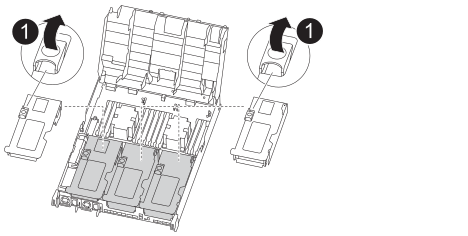

= 第 1 步：卸下控制器模块
:allow-uri-read: 

要更换控制器模块硬件，您必须卸下受损的控制器，将 FRU 组件移至更换用的控制器模块，在机箱中安装更换用的控制器模块，然后将系统启动至维护模式。

== 第 1 步：卸下控制器模块

要访问控制器模块内部的组件，必须从机箱中卸下控制器模块。

您可以使用以下，插图或写入的步骤从机箱中卸下控制器模块。

.动画-删除控制器模块
video::ca74d345-e213-4390-a599-aae10019ec82[panopto]
. 如果您尚未接地，请正确接地。
. 释放电源线固定器，然后从电源中拔下缆线。
. 松开将缆线绑在缆线管理设备上的钩环带，然后从控制器模块上拔下系统缆线和 SFP （如果需要），并跟踪缆线的连接位置。
+
将缆线留在缆线管理设备中，以便在重新安装缆线管理设备时，缆线排列有序。

. 将缆线管理设备从控制器模块中取出并放在一旁。
. 向下按两个锁定闩锁，然后同时向下旋转两个闩锁。
+
此控制器模块会从机箱中略微移出。

+
image:../media/drw_A400_Remove_controller.png[""]

. 将控制器模块滑出机箱。
+
将控制器模块滑出机箱时，请确保您支持控制器模块的底部。

. 将控制器模块放在平稳的表面上。
. 在更换用的控制器模块上，使用动画，插图或写入的步骤打开通风管并从控制器模块中卸下空的提升板：
+
.动画-从更换用的控制器模块中删除空的提升板
video::49053752-e813-4c15-a917-ab190147fa6e[panopto]

. 将通风管两侧的锁定片朝控制器模块中间按压。
. 将通风管滑向控制器模块的背面，然后将其向上旋转到完全打开的位置。
. 将提升板 1 左侧的提升板锁定闩锁向上旋转并朝通风管方向转动，提起提升板，然后将其放在一旁。
. 对其余提升板重复上述步骤。

== 第 2 步：移动电源

更换控制器模块时，必须将受损控制器模块中的电源移至更换控制器模块。

您可以使用以下动画，插图或写入的步骤将电源移至更换用的控制器模块。

.动画-移动电源
video::92060115-1967-475b-b517-aad9012f130c[panopto]
. 卸下电源：
+
image::../media/drw_c400_psu_IEOPS-1237.svg[DRW C400 PSU IEOPS 1237]

+
.. 旋转凸轮把手，以便可以使用它将电源从机箱中拉出。
.. 按下蓝色锁定卡舌以从机箱中释放电源。
.. 用双手将电源从机箱中拉出，然后放在一旁。

. 将电源移至新控制器模块，然后安装它。
. 用双手支撑电源边缘并将其与控制器模块的开口对齐，然后将电源轻轻推入控制器模块，直到锁定卡舌卡入到位。
+
电源只能与内部连接器正确接合并单向锁定到位。

+

NOTE: 为避免损坏内部连接器，请勿在将电源滑入系统时用力过大。

. 对其余所有电源重复上述步骤。

== 第 3 步：移动 NVDIMM 电池

要将 NVDIMM 电池从受损控制器模块移至更换控制器模块，您必须执行一系列特定步骤。

您可以使用以下动画，插图或写入步骤将 NVDIMM 电池从受损控制器模块移至更换用的控制器模块。

.动画-移动NVDIMM电池
video::94d115b2-b02a-4234-805c-aad9012f204c[panopto]
image::../media/drw_A400_nvdimm-batt_IEOPS-1004.svg[DRW A400 NVDIMM电池IEOPS 1004]

. 打开通风管：
+
.. 将通风管两侧的锁定片朝控制器模块中间按压。
.. 将通风管滑向控制器模块的背面，然后将其向上旋转到完全打开的位置。

. 在控制器模块中找到 NVDIMM 电池。
. 找到电池插头，然后挤压电池插头正面的夹子，将插头从插槽中释放，然后从插槽中拔下电池缆线。
. 抓住电池并按下标记为推送的蓝色锁定卡舌，然后将电池从电池架和控制器模块中提出。
. 将电池移至更换用的控制器模块。
. 将电池模块与电池的开口对齐，然后将电池轻轻推入插槽，直至其锁定到位。
+

NOTE: 除非系统指示，否则请勿将电池缆线重新插入主板。

== 第 4 步：移动启动介质

您必须找到启动介质，然后按照说明将其从受损的控制器模块中取出并将其插入替代控制器模块。

您可以使用以下动画，插图或写入步骤将启动介质从受损控制器模块移至更换控制器模块。

.动画—移动启动介质
video::2a14099c-85de-4a84-867c-aad9012efac8[panopto]
image::../media/drw_A400_Replace-boot_media_IEOPS-1007.svg[DRW A400更换启动介质IEOPS 1007]

. 从控制器模块中找到并取出启动介质：
+
.. 按启动介质末端的蓝色按钮，直到启动介质上的边缘清除蓝色按钮。
.. 将启动介质向上旋转，然后将启动介质从插槽中轻轻拉出。

. 将启动介质移至新控制器模块，将启动介质的边缘与插槽外壳对齐，然后将其轻轻推入插槽。
. 检查启动介质，确保其完全固定在插槽中。
+
如有必要，请取出启动介质并将其重新插入插槽。

. 将启动介质锁定到位：
+
.. 将启动介质向下旋转到主板。
.. 按下蓝色锁定按钮，使其处于打开位置。
.. 用蓝色按钮将手指放在启动介质的末端，用力向下推启动介质的一端以啮合蓝色锁定按钮。

== 第 5 步：移动 PCIe 提升板和夹层卡

在控制器更换过程中，您必须将 PCIe 提升板和夹层卡从受损控制器模块移至更换控制器模块。

您可以使用以下动画，插图或写入步骤将 PCIe 提升板和夹层卡从受损控制器模块移至更换用的控制器模块。

移动 PCIe 提升板 1 和 2 （左侧和中间提升板）：

.动画—移动PCI提升板1和2
video::f4ee1d4d-6029-4fe6-a063-aad9012f170b[panopto]
移动夹层卡和提升板 3 （右侧提升板）：

.动画-移动夹层卡和提升板3
video::b0c3b575-3434-4e00-a421-aad9012f2e9e[panopto]
image::../media/drw_c400_replace_PCIe_cards_IEOPS-1235 (1).svg[DRW C400更换PCIe卡IEOPS 1235 (1)]

. 将受损控制器模块中的一个和两个 PCIe 提升板移至替代控制器模块：
+
.. 卸下 PCIe 卡中可能存在的所有 SFP 或 QSFP 模块。
.. 将提升板左侧的提升板锁定闩锁向上旋转并朝通风管方向转动。
+
此竖板会从控制器模块中略微升高。

.. 提起此提升板，然后将其移至更换用的控制器模块。
.. 将提升板与提升板插槽侧面的插脚对齐，将提升板向下放在插脚上，将提升板垂直推入主板上的插槽中，然后向下旋转闩锁，使其与提升板上的金属板保持一致。
.. 对提升板 2 重复此步骤。

. 卸下提升板 3 ，卸下夹层卡，然后将这两个安装到更换用的控制器模块中：
+
.. 卸下 PCIe 卡中可能存在的所有 SFP 或 QSFP 模块。
.. 将提升板左侧的提升板锁定闩锁向上旋转并朝通风管方向转动。
+
此竖板会从控制器模块中略微升高。

.. 抬起竖板，然后将其放在平稳的平面上。
.. 松开夹层卡上的翼形螺钉，然后将卡直接从插槽中轻轻提起，然后将其移至更换用的控制器模块。
.. 将夹层安装到更换用的控制器中，并使用翼形螺钉将其固定。
.. 在更换用的控制器模块中安装第三个提升板。

== 第 6 步：移动 DIMM

您需要找到 DIMM ，然后将其从受损的控制器模块移至替代控制器模块。

您必须准备好新的控制器模块，以便可以将 DIMM 直接从受损的控制器模块移至更换用的控制器模块中的相应插槽。

您可以使用以下动画，插图或写入的步骤将 DIMM 从受损的控制器模块移至更换用的控制器模块。

.动画-移动DIMM
video::717b52fa-f236-4f3d-b07d-aad9012f51a3[panopto]
image::../media/drw_A400_Replace-NVDIMM-DIMM_IEOPS-1009.svg[DRW A400更换NVDIMM DIMM IEOPS 1009]

. 找到控制器模块上的 DIMM 。
. 记下插槽中 DIMM 的方向，以便可以按正确的方向将 DIMM 插入更换用的控制器模块中。
. 验证 NVDIMM 电池是否未插入新控制器模块。
. 将受损控制器模块中的 DIMM 移至替代控制器模块：
+

NOTE: 确保将每个 DIMM 安装到受损控制器模块中其占用的同一插槽中。

+
.. 缓慢推动 DIMM 两侧的 DIMM 弹出卡舌，将 DIMM 从插槽中弹出，然后将 DIMM 滑出插槽。
+

NOTE: 小心握住 DIMM 的边缘，以避免对 DIMM 电路板上的组件施加压力。

.. 在更换用的控制器模块上找到相应的 DIMM 插槽。
.. 确保 DIMM 插槽上的 DIMM 弹出卡舌处于打开位置，然后将 DIMM 垂直插入插槽。
+
DIMM 紧紧固定在插槽中，但应易于插入。如果没有，请将 DIMM 与插槽重新对齐并重新插入。

.. 目视检查 DIMM ，确认其均匀对齐并完全插入插槽。
.. 对其余 DIMM 重复这些子步骤。

. 将 NVDIMM 电池插入主板。
+
确保插头锁定在控制器模块上。

== 第 7 步：安装控制器模块

将所有组件从受损控制器模块移至更换控制器模块后，您必须将更换控制器模块安装到机箱中，然后将其启动至维护模式。

您可以使用以下动画，插图或写入的步骤在机箱中安装替代控制器模块。

.动画-安装控制器模块
video::0310fe80-b129-4685-8fef-ab19010e720a[panopto]
image::../media/drw_A400_Install_controller_source.png[DRW A400 安装控制器源]

. 如果尚未关闭此通风管，请关闭此通风管。
. 将控制器模块的末端与机箱中的开口对齐，然后将控制器模块轻轻推入系统的一半。
+

NOTE: 请勿将控制器模块完全插入机箱中，除非系统指示您这样做。

. 仅为管理和控制台端口布线，以便您可以访问系统以执行以下各节中的任务。
+

NOTE: 您将在此操作步骤中稍后将其余缆线连接到控制器模块。

. 完成控制器模块的安装：
+
.. 将电源线插入电源，重新安装电源线锁定环，然后将电源连接到电源。
.. 使用锁定闩锁将控制器模块牢牢推入机箱，直到锁定闩锁开始上升。
+

NOTE: 将控制器模块滑入机箱时，请勿用力过大，以免损坏连接器。

.. 将锁定闩锁向上旋转，使其倾斜以清除锁定销，将控制器模块完全推入机箱中，然后将锁定闩锁降至锁定位置。
+
控制器模块一旦完全固定在机箱中，就会开始启动。准备中断启动过程。

.. 如果尚未重新安装缆线管理设备，请重新安装该设备。
.. 按 `Ctrl-C` 中断正常启动过程并启动到 LOADER 。
+

NOTE: 如果系统停留在启动菜单处，请选择启动到 LOADER 选项。

.. 在 LOADER 提示符处，输入 `bye` 以重新初始化 PCIe 卡和其他组件。
.. 按 `Ctrl-C` 中断启动过程并启动到加载程序提示符。
+
如果系统停留在启动菜单处，请选择启动到 LOADER 选项。

