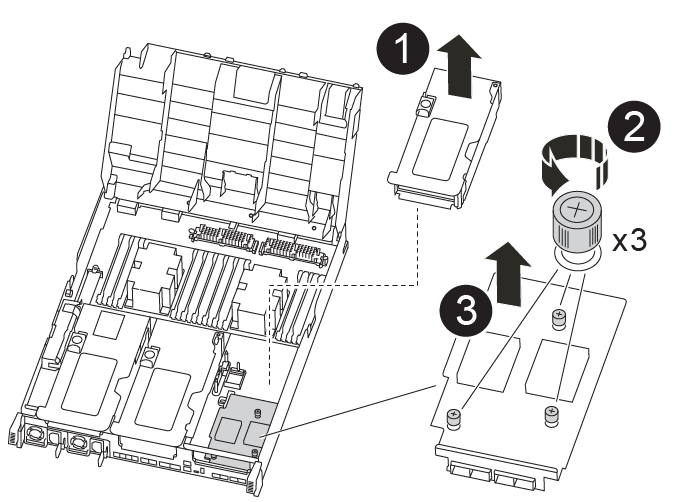

= 第 1 步：关闭受损控制器
:allow-uri-read: 

要更换 PCIe 或夹层卡，您必须断开缆线以及所有 SFP 和 QSFP 模块与卡的连接，更换发生故障的 PCIe 或夹层卡，然后重新对卡进行布线。

* 您可以将此操作步骤与系统支持的所有 ONTAP 版本结合使用
* 系统中的所有其他组件必须正常运行；否则，您必须联系技术支持。

== 第 1 步：关闭受损控制器

根据存储系统硬件配置的不同，您可以使用不同的过程关闭或接管受损的控制器。

[role="tabbed-block"]
====
.选项 1 ：大多数配置
--
要关闭受损控制器，您必须确定控制器的状态，并在必要时接管控制器，以便运行正常的控制器继续从受损控制器存储提供数据。

.关于此任务
* 如果您使用的是SAN系统，则必须已检查受损控制器SCSI刀片的事件消息  `cluster kernel-service show`。 `cluster kernel-service show`命令(在priv高级模式下)可显示该节点的节点名称link:https://docs.netapp.com/us-en/ontap/system-admin/display-nodes-cluster-task.html["仲裁状态"]、该节点的可用性状态以及该节点的运行状态。
+
每个 SCSI 刀片式服务器进程应与集群中的其他节点保持仲裁关系。在继续更换之前，必须先解决所有问题。

* If you have a cluster with more than two nodes, it must be in quorum.如果集群未达到仲裁或运行状况良好的控制器在资格和运行状况方面显示false、则必须在关闭受损控制器之前更正问题描述 ；请参见 link:https://docs.netapp.com/us-en/ontap/system-admin/synchronize-node-cluster-task.html?q=Quorum["将节点与集群同步"^]。

.步骤
. 如果启用了AutoSupport、则通过调用AutoSupport消息禁止自动创建案例： `system node autosupport invoke -node * -type all -message MAINT=<# of hours>h`
+
以下AutoSupport 消息禁止自动创建案例两小时： `cluster1:> system node autosupport invoke -node * -type all -message MAINT=2h`

. 从运行状况良好的控制器的控制台禁用自动交还： `storage failover modify -node local -auto-giveback false`
+

NOTE: 当您看到_Do you want to disable auto-giveback？_时、输入`y`。

. 将受损控制器显示为 LOADER 提示符：
+
[cols="1,2"]
|===
| 如果受损控制器显示 ... | 那么 ... 

 a| 
LOADER 提示符
 a| 
转至下一步。

 a| 
正在等待交还
 a| 
按 Ctrl-C ，然后在出现提示时回答 `y` 。

 a| 
系统提示符或密码提示符
 a| 
从运行正常的控制器接管或暂停受损的控制器： `storage failover takeover -ofnode _impaired_node_name_`

当受损控制器显示 Waiting for giveback... 时，按 Ctrl-C ，然后回答 `y` 。

|===

--
.选项 2 ：控制器位于双节点 MetroCluster 中
--
要关闭受损控制器，您必须确定控制器的状态，并在必要时切换控制器，以便运行正常的控制器继续从受损控制器存储提供数据。

.关于此任务
* 您必须在此操作步骤 末尾保持电源处于打开状态，以便为运行正常的控制器供电。

.步骤
. 检查 MetroCluster 状态以确定受损控制器是否已自动切换到运行正常的控制器： `MetroCluster show`
. 根据是否发生了自动切换，按照下表继续操作：
+
[cols="1,2"]
|===
| 如果控制器受损 ... | 那么 ... 

 a| 
已自动切换
 a| 
继续执行下一步。

 a| 
未自动切换
 a| 
从运行正常的控制器执行计划内切换操作： `MetroCluster switchover`

 a| 
未自动切换，您尝试使用 `MetroCluster switchover` 命令进行切换，并且切换已被否决
 a| 
查看否决消息，如果可能，请解决问题描述并重试。如果无法解决问题描述问题，请联系技术支持。

|===
. 在运行正常的集群中运行 `MetroCluster heal -phase aggregates` 命令，以重新同步数据聚合。
+
[listing]
----
controller_A_1::> metrocluster heal -phase aggregates
[Job 130] Job succeeded: Heal Aggregates is successful.
----
+
如果修复被否决，您可以使用 ` override-vetoes` 参数重新发出 `MetroCluster heal` 命令。如果使用此可选参数，则系统将覆盖任何阻止修复操作的软否决。

. 使用 MetroCluster operation show 命令验证操作是否已完成。
+
[listing]
----
controller_A_1::> metrocluster operation show
    Operation: heal-aggregates
      State: successful
Start Time: 7/25/2016 18:45:55
   End Time: 7/25/2016 18:45:56
     Errors: -
----
. 使用 `storage aggregate show` 命令检查聚合的状态。
+
[listing]
----
controller_A_1::> storage aggregate show
Aggregate     Size Available Used% State   #Vols  Nodes            RAID Status
--------- -------- --------- ----- ------- ------ ---------------- ------------
...
aggr_b2    227.1GB   227.1GB    0% online       0 mcc1-a2          raid_dp, mirrored, normal...
----
. 使用 `MetroCluster heal -phase root-aggregates` 命令修复根聚合。
+
[listing]
----
mcc1A::> metrocluster heal -phase root-aggregates
[Job 137] Job succeeded: Heal Root Aggregates is successful
----
+
如果修复被否决，您可以使用 -override-vetoes 参数重新发出 `MetroCluster heal` 命令。如果使用此可选参数，则系统将覆盖任何阻止修复操作的软否决。

. 在目标集群上使用 `MetroCluster operation show` 命令验证修复操作是否已完成：
+
[listing]
----

mcc1A::> metrocluster operation show
  Operation: heal-root-aggregates
      State: successful
 Start Time: 7/29/2016 20:54:41
   End Time: 7/29/2016 20:54:42
     Errors: -
----
. 在受损控制器模块上，断开电源。

--
====

== 第 2 步：卸下控制器模块

要访问控制器模块内部的组件，必须从机箱中卸下控制器模块。

. 如果您尚未接地，请正确接地。
. 释放电源线固定器，然后从电源中拔下缆线。
. 松开将缆线绑在缆线管理设备上的钩环带，然后从控制器模块上拔下系统缆线和 SFP （如果需要），并跟踪缆线的连接位置。
+
将缆线留在缆线管理设备中，以便在重新安装缆线管理设备时，缆线排列有序。

. 将缆线管理设备从控制器模块中取出并放在一旁。
. 向下按两个锁定闩锁，然后同时向下旋转两个闩锁。
+
此控制器模块会从机箱中略微移出。

+
image::../media/drw_A400_Remove_controller.png[释放控制器模块]

+
[cols="10a,90a"]
|===

 a| 
image:../media/icon_round_1.png["标注编号1"]
 a| 
锁定闩锁

 a| 
image:../media/icon_round_2.png["标注编号2"]
 a| 
控制器从机箱中略微移出

|===
. 将控制器模块滑出机箱。
+
将控制器模块滑出机箱时，请确保您支持控制器模块的底部。

. 将控制器模块放在平稳的表面上。

== 第 3 步：更换 PCIe 卡

要更换 PCIe 卡，您必须找到发生故障的 PCIe 卡，从控制器模块中卸下包含此卡的提升板，更换此卡，然后在控制器模块中重新安装 PCIe 提升板。

image:../media/drw_A400_Replace-PCIe-cards.png["卸下PCIe卡"]

[cols="10,90"]
|===

 a| 
image:../media/icon_round_1.png["标注编号1"]
 a| 
提升板锁定闩锁

 a| 
image:../media/icon_round_2.png["标注编号2"]
 a| 
PCI卡锁定闩锁

 a| 
image:../media/icon_round_3.png["标注编号3"]
 a| 
PCI锁定板

 a| 
image:../media/icon_round_4.png["标注编号4"]
 a| 
PCI卡

|===
. 卸下包含要更换的卡的提升板：
+
.. 按下通风管两侧的锁定片，将其滑向控制器模块背面，然后将其旋转到完全打开的位置，以打开通风管。
.. 卸下 PCIe 卡中可能存在的所有 SFP 或 QSFP 模块。
.. 将提升板左侧的提升板锁定闩锁向上旋转并朝通风管方向转动。
+
此竖板会从控制器模块中略微升高。

.. 竖直向上提起竖板，并将其放在平稳的平面上，

. 从提升板中卸下 PCIe 卡：
+
.. 转动提升板，以便可以访问 PCIe 卡。
.. 按下 PCIe 提升板侧面的锁定支架，然后将其旋转到打开位置。
.. 仅对于提升板 2 和 3 ，向上转动侧面板。
.. 轻轻向上推支架，然后将 PCIe 卡从插槽中竖直提出，从而从提升板中卸下 PCIe 卡。

. 将更换用的 PCIe 卡与插槽对齐，将此卡按入插槽中，然后合上此提升板上的侧面板（如果有）。
+
确保将卡正确对齐在插槽中，并在插槽中插入卡时对卡施加均匀的压力。PCIe 卡必须完全均匀地固定在插槽中。

+

NOTE: 如果您要在底部插槽中安装卡，但无法正常看到卡插槽，请卸下顶部卡，以便可以看到卡插槽，安装卡，然后重新安装从顶部插槽中卸下的卡。

. 重新安装此提升板：
+
.. 将提升板与提升板插槽侧面的插脚对齐，将提升板向下放在插脚上。
.. 将竖直推入主板上的插槽。
.. 向下旋转闩锁，使其与竖板上的金属板保持平齐。

== 第 4 步：更换夹层卡

夹层卡位于提升板 3 （插槽 4 和 5 ）下。您必须卸下此竖板才能访问夹层卡，更换夹层卡，然后重新安装 3 号竖板。有关详细信息，请参见控制器模块上的 FRU 示意图。

您可以使用以下动画，插图或写入的步骤来更换夹层卡。

.动画-更换夹层卡
video::e3fd32b6-bdbb-4c53-b666-b030018a5744[panopto]

[cols="10a,90a"]
|===

 a| 
image:../media/icon_round_1.png["标注编号1"]
 a| 
PCI Riser卡

 a| 
image:../media/icon_round_2.png["标注编号2"]
 a| 
提升板翼形螺钉

 a| 
image:../media/icon_round_3.png["标注编号3"]
 a| 
提升卡

|===
. 卸下 3 号提升板（插槽 4 和 5 ）：
+
.. 按下通风管两侧的锁定片，将其滑向控制器模块背面，然后将其旋转到完全打开的位置，以打开通风管。
.. 卸下 PCIe 卡中可能存在的所有 SFP 或 QSFP 模块。
.. 将提升板左侧的提升板锁定闩锁向上旋转并朝通风管方向转动。
+
此竖板会从控制器模块中略微升高。

.. 抬起竖板，然后将其放在平稳的平面上。

. 更换夹层卡：
+
.. 从卡中卸下所有 QSFP 或 SFP 模块。
.. 松开夹层卡上的翼形螺钉，然后将卡直接从插槽中轻轻提起并放在一旁。
.. 将更换用的夹层卡对准插槽和导销，然后将卡轻轻推入插槽。
.. 拧紧夹层卡上的翼形螺钉。

. 重新安装此提升板：
+
.. 将提升板与提升板插槽侧面的插脚对齐，将提升板向下放在插脚上。
.. 将竖直推入主板上的插槽。
.. 向下旋转闩锁，使其与竖板上的金属板保持平齐。

== 第 5 步：安装控制器模块

更换控制器模块中的组件后，必须将控制器模块重新安装到机箱中，然后将其启动至维护模式。

. 如果尚未关闭此通风管，请关闭此通风管。
. 将控制器模块的末端与机箱中的开口对齐，然后将控制器模块轻轻推入系统的一半。
+

NOTE: 请勿将控制器模块完全插入机箱中，除非系统指示您这样做。

. 根据需要重新对系统进行布线。
+
如果您已卸下介质转换器（ QSFP 或 SFP ），请记得在使用光缆时重新安装它们。

. 完成控制器模块的安装：
+
.. 将电源线插入电源，重新安装电源线锁定环，然后将电源连接到电源。
.. 使用锁定闩锁将控制器模块牢牢推入机箱，直到它与中板相距并完全就位。
+
控制器模块完全就位后，锁定闩锁会上升。

+

NOTE: 将控制器模块滑入机箱时，请勿用力过大，以免损坏连接器。

+
控制器模块一旦完全固定在机箱中，就会开始启动。准备中断启动过程。

.. 将锁定闩锁向上旋转，使其倾斜以清除锁定销，将控制器模块完全推入机箱中，然后将锁定闩锁降至锁定位置。
.. 如果尚未重新安装缆线管理设备，请重新安装该设备。
.. 按 `Ctrl-C` 中断正常启动过程并启动到 LOADER 。
+

NOTE: 如果系统停留在启动菜单处，请选择启动到 LOADER 选项。

.. 在 LOADER 提示符处，输入 `bye` 以重新初始化 PCIe 卡和其他组件，并让控制器重新启动。

. 交还控制器的存储，使其恢复正常运行： `storage failover giveback -ofnode _impaired_node_name_`
. 如果已禁用自动交还，请重新启用它： `storage failover modify -node local -auto-giveback true`

== 第 6 步：将控制器模块还原为正常运行

要还原控制器，您必须重新对系统进行配置，交还控制器模块，然后重新启用自动交还。

. 根据需要重新对系统进行布线。
+
如果您已卸下介质转换器（ QSFP 或 SFP ），请记得在使用光缆时重新安装它们。

. 交还控制器的存储，使其恢复正常运行： `storage failover giveback -ofnode _impaired_node_name_`
. 如果已禁用自动交还，请重新启用它： `storage failover modify -node local -auto-giveback true`

== 第 7 步：切回双节点 MetroCluster 配置中的聚合

在双节点 MetroCluster 配置中完成 FRU 更换后，您可以执行 MetroCluster 切回操作。这样会将配置恢复到其正常运行状态，以前受损站点上的 sync-source Storage Virtual Machine （ SVM ）现在处于活动状态，并从本地磁盘池提供数据。

此任务仅限适用场景双节点 MetroCluster 配置。

.步骤
. 验证所有节点是否处于 `enabled` 状态： `MetroCluster node show`
+
[listing]
----
cluster_B::>  metrocluster node show

DR                           Configuration  DR
Group Cluster Node           State          Mirroring Mode
----- ------- -------------- -------------- --------- --------------------
1     cluster_A
              controller_A_1 configured     enabled   heal roots completed
      cluster_B
              controller_B_1 configured     enabled   waiting for switchback recovery
2 entries were displayed.
----
. 验证所有 SVM 上的重新同步是否已完成： `MetroCluster SVM show`
. 验证修复操作正在执行的任何自动 LIF 迁移是否已成功完成： `MetroCluster check lif show`
. 在运行正常的集群中的任何节点上使用 `MetroCluster switchback` 命令执行切回。
. 验证切回操作是否已完成： `MetroCluster show`
+
当集群处于 `waiting for-switchback` 状态时，切回操作仍在运行：

+
[listing]
----
cluster_B::> metrocluster show
Cluster              Configuration State    Mode
--------------------	------------------- 	---------
 Local: cluster_B configured       	switchover
Remote: cluster_A configured       	waiting-for-switchback
----
+
当集群处于 `normal` 状态时，切回操作完成。：

+
[listing]
----
cluster_B::> metrocluster show
Cluster              Configuration State    Mode
--------------------	------------------- 	---------
 Local: cluster_B configured      		normal
Remote: cluster_A configured      		normal
----
+
如果切回需要很长时间才能完成，您可以使用 `MetroCluster config-replication resync-status show` 命令检查正在进行的基线的状态。

. 重新建立任何 SnapMirror 或 SnapVault 配置。

== 第 8 步：将故障部件退回 NetApp

按照套件随附的 RMA 说明将故障部件退回 NetApp 。 https://mysupport.netapp.com/site/info/rma["部件退回和更换"]有关详细信息、请参见页面。
