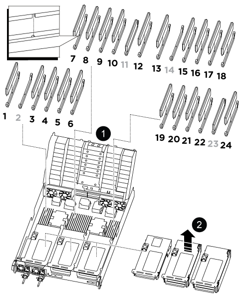

= 第 1 步：关闭受损控制器
:allow-uri-read: 

如果系统注册的可更正错误更正代码（ ECC ）数量不断增加，则必须更换控制器模块中的 DIMM ；否则会导致系统崩溃。

系统中的所有其他组件必须正常运行；否则，您必须联系技术支持。

您必须将故障组件更换为从提供商处收到的替代 FRU 组件。

== 第 1 步：关闭受损控制器

重新对控制器模块的存储和网络连接进行配线。

.步骤
. 重新对系统进行布线。
. 使用验证布线是否正确 https://mysupport.netapp.com/site/tools/tool-eula/activeiq-configadvisor["Active IQ Config Advisor"]。
+
.. 下载并安装 Config Advisor 。
.. 输入目标系统的信息，然后单击收集数据。
.. 单击布线选项卡，然后检查输出。确保显示所有磁盘架且所有磁盘均显示在输出中，以更正您发现的任何布线问题。
.. 单击相应的选项卡，然后检查 Config Advisor 的输出，以检查其他布线。

== 第 2 步：卸下控制器模块

在更换控制器模块或更换控制器模块内的组件时，您必须从机箱中卸下控制器模块。

. 如果您尚未接地，请正确接地。
. 从源拔下控制器模块电源。
. 释放电源线固定器，然后从电源中拔下缆线。
. 松开将缆线绑在缆线管理设备上的钩环带，然后从控制器模块中拔下系统缆线以及 SFP 和 QSFP 模块（如果需要），并跟踪缆线的连接位置。
+
将缆线留在缆线管理设备中，以便在重新安装缆线管理设备时，缆线排列有序。

. 将缆线管理设备从控制器模块中取出并放在一旁。
. 向下按两个锁定闩锁，然后同时向下旋转两个闩锁。
+
此控制器模块会从机箱中略微移出。

+
image::../media/drw_a800_pcm_remove.png[释放控制器模块]

+
[cols="1,4"]
|===

 a| 
image:../media/legend_icon_01.png["标注编号1"]
 a| 
锁定闩锁

 a| 
image:../media/legend_icon_02.png["标注编号2"]
 a| 
锁定销

|===
. 将控制器模块滑出机箱。
+
将控制器模块滑出机箱时，请确保您支持控制器模块的底部。

. 将控制器模块放在平稳的表面上，然后打开通风管：
+
.. 朝控制器模块中间按下通风管两侧的锁定片。
.. 将通风管滑向风扇模块，然后将其向上旋转到完全打开的位置。
+
image::../media/drw_a800_open_air_duct.png[打开空气管道]

+
[cols="1,4"]
|===

 a| 
image:../media/legend_icon_01.png["标注编号1"]
 a| 
通风管锁定卡舌

 a| 
image:../media/legend_icon_02.png["标注编号2"]
 a| 
将通风管滑向风扇模块

 a| 
image:../media/legend_icon_03.png["标注编号3"]
 a| 
向风扇模块旋转通风管

|===

== 第 3 步：更换 DIMM

要更换DIMM、您必须使用通风管顶部的DIMM映射标签在控制器模块中找到该DIMM、然后按照特定步骤顺序进行更换。

. 卸下 DIMM 时，请解锁相应提升板上的锁定闩锁，然后卸下提升板。
+

+
[cols="1,4"]
|===

 a| 
image:../media/legend_icon_01.png["标注编号1"]
 a| 
通风管盖

 a| 
image:../media/legend_icon_02.png["标注编号2"]
 a| 
提升板 1 和 DIMM 插槽 1 以及 3-6

 a| 
提升板 2 和 DIMM 插槽 7-10 ， 12-13 和 15-18
 a| 
提升板 3 和 DIMM 19-22 和 24

|===
+
* 注： * 插槽 2 和 14 为空。请勿尝试在这些插槽中安装 DIMM 。

. 记下插槽中 DIMM 的方向，以便可以按正确的方向插入更换用的 DIMM 。
. 缓慢推动 DIMM 两侧的两个 DIMM 弹出卡舌，将 DIMM 从插槽中弹出，然后将 DIMM 滑出插槽。
+

NOTE: 小心握住 DIMM 的边缘，以避免对 DIMM 电路板上的组件施加压力。

. 从防静电运输袋中取出更换用的 DIMM ，拿住 DIMM 的边角并将其与插槽对齐。
+
DIMM 插脚之间的缺口应与插槽中的突起对齐。

. 将 DIMM 垂直插入插槽。
+
DIMM 紧紧固定在插槽中，但应很容易插入。如果没有，请将 DIMM 与插槽重新对齐并重新插入。

+

NOTE: 目视检查 DIMM ，确认其均匀对齐并完全插入插槽。

. 小心而稳固地推动 DIMM 的上边缘，直到弹出器卡舌卡入到位，卡入到位于 DIMM 两端的缺口上。
. 重新安装从控制器模块中卸下的所有提升板。
. 关闭通风管。

== 第 4 步：重新安装控制器模块并启动系统

更换控制器模块中的 FRU 后，您必须重新安装控制器模块并重新启动它。

. 如果尚未关闭通风管：
+
.. 将通风管一直旋转到控制器模块。
.. 向提升板滑动通风管，直到锁定卡舌卡入到位。
.. 检查通风管，确保其正确就位并锁定到位。
+
image::../media/drw_a700s_close_air_duct.png[关闭空气管道]

+
[cols="1,4"]
|===

 a| 
image:../media/legend_icon_01.png["标注编号1"]
 a| 
锁定卡舌

 a| 
image:../media/legend_icon_02.png["标注编号2"]
 a| 
滑动柱塞

|===

. 将控制器模块的末端与机箱中的开口对齐，然后将控制器模块轻轻推入系统的一半。
+

NOTE: 请勿将控制器模块完全插入机箱中，除非系统指示您这样做。

. 根据需要重新对系统进行布线。
+
如果您已卸下介质转换器（ QSFP 或 SFP ），请记得在使用光缆时重新安装它们。

. 将电源线插入电源，重新安装电源线锁定环，然后将电源连接到电源。
. 完成控制器模块的重新安装：
+
.. 将控制器模块牢牢推入机箱，直到它与中板相距并完全就位。
+
控制器模块完全就位后，锁定闩锁会上升。

+

NOTE: 将控制器模块滑入机箱时，请勿用力过大，以免损坏连接器。

+
控制器模块一旦完全固定在机箱中，就会开始启动。

.. 向上旋转锁定闩锁，使其倾斜，以清除锁定销，然后将其降低到锁定位置。
.. 如果尚未重新安装缆线管理设备，请重新安装该设备。

== 第 5 步：将故障部件退回 NetApp

按照套件随附的 RMA 说明将故障部件退回 NetApp 。请参见 https://mysupport.netapp.com/site/info/rma["部件退回和放大器；更换"] 第页，了解更多信息。
