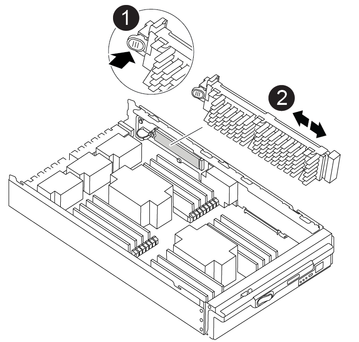

= 第 1 步：卸下控制器模块
:allow-uri-read: 

您必须拔下控制器模块、卸下并打开控制器模块、找到并更换控制器中的启动介质、然后将映像传输到替代启动介质。

== 第 1 步：卸下控制器模块

要访问控制器内部的组件，您必须先从系统中卸下控制器模块，然后再卸下控制器模块上的盖板。

.步骤
. 如果您尚未接地，请正确接地。
. 从受损控制器模块拔下缆线，并跟踪缆线的连接位置。
. 向下滑动凸轮把手上的 Terra cotta 按钮，直到其解锁为止。
+
.动画-删除控制器
video::256721fd-4c2e-40b3-841a-adf2000df5fa[panopto]
+
image::../media/drw_a900_remove_PCM.png[释放控制器]

+
[cols="1,4"]
|===

 a| 
image:../media/icon_round_1.png["标注编号1"]
 a| 
凸轮把手释放按钮

 a| 
image:../media/icon_round_2.png["标注编号2"]
 a| 
凸轮把手

|===
. 旋转凸轮把手，使其完全脱离机箱，然后将控制器模块滑出机箱。
+
将控制器模块滑出机箱时，请确保您支持控制器模块的底部。

. 将控制器模块的盖板朝上放在平稳的平面上，按下盖板上的蓝色按钮，将盖板滑至控制器模块的背面，然后向上转动盖板并将其从控制器模块中提出。
+
image::../media/drw_a900_PCM_open.png[将护盖提离控制器模块]

+
[cols="1,4"]
|===

 a| 
image:../media/icon_round_1.png["标注编号1"]
 a| 
控制器模块盖锁定按钮

|===

== 第 2 步：更换启动介质

您必须在控制器中找到启动介质并按照说明进行更换。

.步骤
. 提起控制器模块背面的黑色通风管，然后使用以下示意图或控制器模块上的 FRU 示意图找到启动介质：
+
.动画-更换启动介质
video::c5080658-765e-4d29-8456-adf2000e1495[panopto]
+

+
[cols="1,4"]
|===

 a| 
image:../media/icon_round_1.png["标注编号1"]
 a| 
按释放卡舌

 a| 
image:../media/icon_round_2.png["标注编号2"]
 a| 
启动介质

|===
. 按启动介质外壳上的蓝色按钮，将启动介质从其外壳中释放，然后将其竖直拉出启动介质插槽。
+

NOTE: 请勿将启动介质竖直向上扭曲或拉，因为这样可能会损坏插槽或启动介质。

. 将替代启动介质的边缘与启动介质插槽对齐，然后将其轻轻推入插槽。
. 检查启动介质，确保其完全固定在插槽中。
+
如有必要，请取出启动介质并将其重新插入插槽。

. 向下推启动介质以接合启动介质外壳上的锁定按钮。
. 重新安装控制器模块盖，方法是将控制器模块盖上的插脚与主板托架上的插槽对齐，然后将控制器模块盖滑入到位。

== 第 3 步：将启动映像传输到启动介质

您可以使用已安装映像的 USB 闪存驱动器将系统映像安装到替代启动介质。但是，您必须在此操作步骤期间还原 var 文件系统。

.开始之前
* 您必须具有一个已格式化为 32 位的 USB 闪存驱动器，并且容量至少为 4 GB 。
* 下载与受损控制器正在运行的映像版本相同的ONTAP的副本。您可以从NetApp支持站点上的"Downloads"部分下载相应的映像。使用 `version -v`命令显示您的ONTAP版本是否支持NVE。如果命令输出显示 `<10no- DARE>`，则您的ONTAP版本不支持NVE。
+
** 如果您的ONTAP版本支持NVE、请按照下载按钮中的说明、使用NetApp卷加密下载映像。
** 如果不支持NVE、请按照下载按钮中的说明下载不带NetApp卷加密的映像。

* 如果您的系统是独立系统，则不需要网络连接，但在还原 var 文件系统时，您必须执行额外的重新启动。

.步骤
. 如果尚未下载相应的服务映像、请将其从下载并复制 https://mysupport.netapp.com/["NetApp 支持站点"]到USB闪存驱动器。
+
.. 从页面上的"Downloads"(下载)链接将服务映像下载到笔记本电脑上的工作空间。
.. 解压缩服务映像。
+

NOTE: 如果要使用 Windows 提取内容，请勿使用 WinZip 提取网络启动映像。使用其他提取工具，例如 7-Zip 或 WinRAR 。

+
USB闪存驱动器应具有受损控制器正在运行的相应ONTAP映像。

. 将控制器模块的末端与机箱中的开口对齐，然后将控制器模块轻轻推入系统的一半。
. 根据需要重新对控制器模块进行布线。
. 将 USB 闪存驱动器插入控制器模块上的 USB 插槽。
+
确保将 USB 闪存驱动器安装在标有 USB 设备的插槽中，而不是 USB 控制台端口中。

. 将控制器模块完全推入系统中，确保凸轮把手离开 USB 闪存驱动器，用力推动凸轮把手以使控制器模块完全就位，然后将凸轮把手推至关闭位置。
+
控制器一旦完全安装到机箱中，就会开始启动。

. 按 Ctrl-C 中断启动过程，并在加载程序提示符处停止。如果看到正在启动自动启动，请按 Ctrl-C 中止 ...
+
如果未显示此消息，请按 Ctrl-C ，选择选项以启动到维护模式，然后暂停控制器以启动到加载程序。

. 如果控制器位于延伸型或光纤连接的 MetroCluster 中，则必须还原 FC 适配器配置：
+
.. 启动到维护模式： `boot_ontap maint`
.. 将 MetroCluster 端口设置为启动程序： `ucadmin modify -m fc -t ininitiator adapter_name`
.. halt 返回维护模式： `halt`

+
这些更改将在系统启动时实施。

