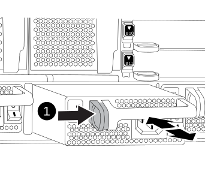

= 
:allow-uri-read: 

更换电源包括关闭、断开和卸下电源以及安装、连接和打开替代电源。

系统中的所有其他组件必须正常运行；否则，您必须联系技术支持。

.关于此任务
* 电源为冗余且可热插拔。
* 此操作步骤用于一次更换一个电源。
+

NOTE: 最好在从机箱中卸下电源后两分钟内更换电源。系统仍可正常运行，但 ONTAP 会向控制台发送有关电源降级的消息，直到更换电源为止。

* 系统中有四个电源。
* 电源可自动进行范围设置。
+

IMPORTANT: 请勿混用具有不同效率额定值的 PSU 。请始终像这样替换。

.步骤
. 根据控制台错误消息或通过电源上的 LED 确定要更换的电源。
. 如果您尚未接地，请正确接地。
. 关闭电源并断开电源线：
+
.. 关闭电源上的电源开关。
.. 打开电源线固定器，然后从电源拔下电源线。

. 按住电源手柄上的 Terra cotta 按钮，然后将电源从机箱中拉出。
+
小心

+
卸下电源时，请始终用双手支撑其重量。

+
.动画-删除/安装PSU
video::6d0eee92-72e2-4da4-a4fa-adf9016b57ff[panopto]
+

+
[cols="1,4"]
|===

 a| 
image:../media/legend_icon_01.png["标注编号1"]
 a| 
锁定按钮

|===
. 确保新电源的开关处于 OFF 位置。
. 用双手支撑电源边缘并将其与系统机箱中的开口对齐，然后将电源轻轻推入机箱，直到其锁定到位。
+
电源具有键控功能，只能单向安装。

+

IMPORTANT: 将电源滑入系统时，请勿用力过大。您可能会损坏连接器。

. 重新连接电源布线：
+
.. 将电源线重新连接到电源。
.. 使用电源线固定器将电源线固定到电源。
+
电源恢复供电后，状态 LED 应为绿色。

. 打开新电源的电源，然后验证电源活动 LED 的运行情况。
+
当 PSU 完全插入机箱时，绿色电源 LED 会亮起，而琥珀色警示 LED 最初会闪烁，但几分钟后会熄灭。

. 按照套件随附的 RMA 说明将故障部件退回 NetApp 。 https://mysupport.netapp.com/site/info/rma["部件退回和更换"^]有关详细信息、请参见页面。

