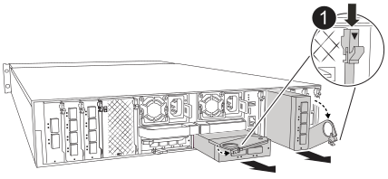

= 
:allow-uri-read: 

将出现故障的 I/O 模块替换为等效的 I/O 模块。

.步骤
. 如果您尚未接地，请正确接地。
. 向下旋转缆线管理托架、方法是拉动缆线管理托架内部的按钮、然后向下旋转。
. 从控制器模块中卸下I/O模块：
+

NOTE: 下图显示了卸下水平和垂直 I/O 模块。通常，您只会移除一个 I/O 模块。

+

+
[cols="1,4"]
|===

 a| 
image:../media/icon_round_1.png["标注编号1"]
 a| 
凸轮锁定按钮

|===
+
.. 按下凸轮闩锁按钮。
.. 将凸轮闩锁尽可能远离模块。
.. 将手指插入凸轮拉杆开口处、然后将模块拉出控制器模块、从而将模块从控制器模块中卸下。
+
跟踪 I/O 模块位于哪个插槽中。

. 将 I/O 模块放在一旁。
. 将更换用的I/O模块安装到目标插槽中：
+
.. 将 I/O 模块与插槽边缘对齐。
.. 将模块轻轻地滑入插槽、直至完全滑入控制器模块、然后将凸轮闩锁一直向上旋转、以将模块锁定到位。

. 为I/O模块布线。
. 将缆线管理托架旋转到锁定位置。

