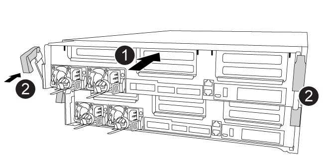

= 
:allow-uri-read: 

将所有组件从受损控制器模块移至更换控制器模块后，您必须将更换控制器模块安装到机箱中，然后将其启动至维护模式。

您可以使用以下动画，插图或写入的步骤在机箱中安装替代控制器模块。

.动画-安装控制器模块
video::0310fe80-b129-4685-8fef-ab19010e720a[panopto]

[cols="10,90"]
|===

 a| 
image:../media/icon_round_1.png["标注编号1"]
 a| 
控制器模块

 a| 
image:../media/icon_round_2.png["标注编号2"]
 a| 
控制器锁定闩锁

|===
.步骤
. 如果尚未关闭此通风管，请关闭此通风管。
. 将控制器模块的末端与机箱中的开口对齐，然后将控制器模块轻轻推入系统的一半。
+

NOTE: 请勿将控制器模块完全插入机箱中，除非系统指示您这样做。

. 仅为管理和控制台端口布线，以便您可以访问系统以执行以下各节中的任务。
+

NOTE: 您将在此操作步骤中稍后将其余缆线连接到控制器模块。

. 完成控制器模块的安装：
+
.. 使用锁定闩锁将控制器模块牢牢推入机箱，直到锁定闩锁开始上升。
+

NOTE: 将控制器模块滑入机箱时，请勿用力过大，以免损坏连接器。

.. 将锁定闩锁向上旋转，使其倾斜以清除锁定销，将控制器模块完全推入机箱中，然后将锁定闩锁降至锁定位置。
.. 将电源线插入电源、重新安装电源线锁环、然后将电源连接到电源。
+
电源恢复后、控制器模块将立即启动。Be prepared to interrupt the boot process.

.. 如果尚未重新安装缆线管理设备，请重新安装该设备。
.. 按 `Ctrl-C` 中断正常启动过程并启动到 LOADER 。
+

NOTE: 如果系统停留在启动菜单处，请选择启动到 LOADER 选项。

.. 在 LOADER 提示符处，输入 `bye` 以重新初始化 PCIe 卡和其他组件。
.. 按 `Ctrl-C` 中断启动过程并启动到加载程序提示符。
+
如果系统停留在启动菜单处，请选择启动到 LOADER 选项。

