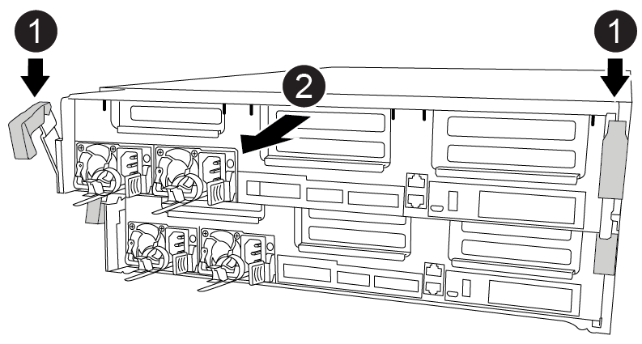
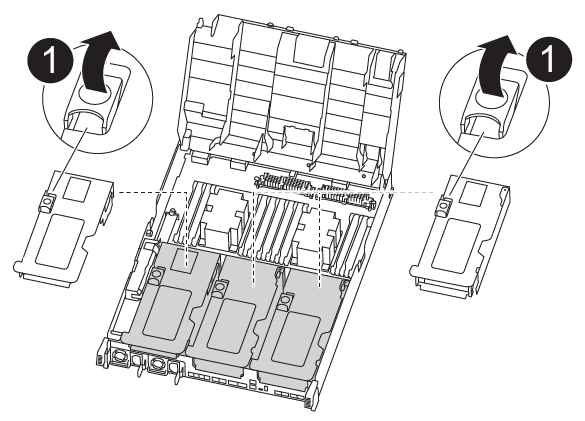

= 
:allow-uri-read: 

要访问控制器模块内部的组件，必须从机箱中卸下控制器模块。

您可以使用以下动画，插图或写入的步骤从机箱中卸下控制器模块。

.动画-删除控制器模块
video::ca74d345-e213-4390-a599-aae10019ec82[panopto]
.步骤
. 如果您尚未接地，请正确接地。
. 释放电源线固定器，然后从电源中拔下缆线。
. 松开将缆线绑在缆线管理设备上的钩环带，然后从控制器模块上拔下系统缆线和 SFP （如果需要），并跟踪缆线的连接位置。
+
将缆线留在缆线管理设备中，以便在重新安装缆线管理设备时，缆线排列有序。

. 将缆线管理设备从控制器模块中取出并放在一旁。
. 向下按两个锁定闩锁，然后同时向下旋转两个闩锁。
+
此控制器模块会从机箱中略微移出。

+

+
[cols="10a,90a"]
|===

 a| 
image:../media/icon_round_1.png["标注编号1"]
 a| 
锁定闩锁

 a| 
image:../media/icon_round_2.png["标注编号2"]
 a| 
控制器从机箱中略微移出

|===
. 将控制器模块滑出机箱。
+
将控制器模块滑出机箱时，请确保您支持控制器模块的底部。

. 将控制器模块放在平稳的表面上。
. 在更换用的控制器模块上，使用动画，插图或写入的步骤打开通风管并从控制器模块中卸下空的提升板：
+
.动画-从更换用的控制器模块中删除空的提升板
video::49053752-e813-4c15-a917-ab190147fa6e[panopto]

[cols="10,90"]
|===

 a| 
image:../media/icon_round_1.png["标注编号1"]
 a| 
提升板释放闩锁

|===
. 将通风管两侧的锁定片朝控制器模块中间按压。
. 将通风管滑向控制器模块的背面，然后将其向上旋转到完全打开的位置。
. 将提升板 1 左侧的提升板锁定闩锁向上旋转并朝通风管方向转动，提起提升板，然后将其放在一旁。
. 对其余提升板重复上述步骤。

