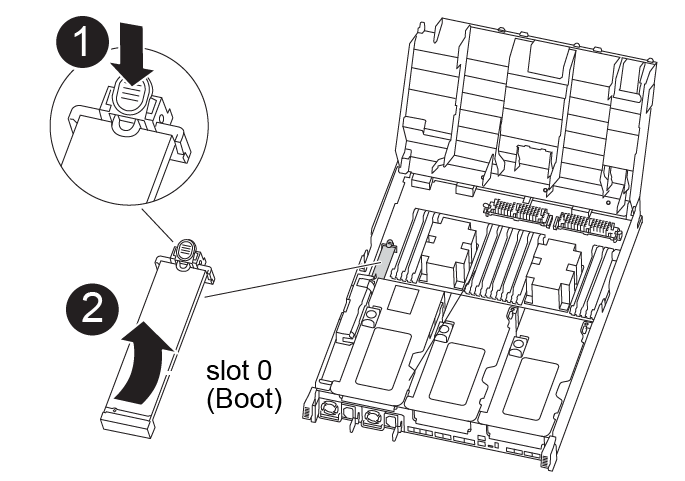

= 
:allow-uri-read: 

您必须找到启动介质，然后按照说明将其从受损的控制器模块中取出并将其插入替代控制器模块。

您可以使用以下动画，插图或写入步骤将启动介质从受损控制器模块移至更换控制器模块。

.动画—移动启动介质
video::2a14099c-85de-4a84-867c-aad9012efac8[panopto]

[cols="10,90"]
|===

 a| 
image:../media/icon_round_1.png["标注编号1"]
 a| 
启动介质锁定卡舌

 a| 
image:../media/icon_round_2.png["标注编号2"]
 a| 
启动介质

|===
.步骤
. 从控制器模块中找到并取出启动介质：
+
.. 按启动介质末端的蓝色按钮，直到启动介质上的边缘清除蓝色按钮。
.. 将启动介质向上旋转，然后将启动介质从插槽中轻轻拉出。

. 将启动介质移至新控制器模块，将启动介质的边缘与插槽外壳对齐，然后将其轻轻推入插槽。
. 检查启动介质，确保其完全固定在插槽中。
+
如有必要，请取出启动介质并将其重新插入插槽。

. 将启动介质锁定到位：
+
.. 将启动介质向下旋转到主板。
.. 按下蓝色锁定按钮，使其处于打开位置。
.. 将手指放在引导介质末端的蓝色按钮处，然后用力向下按压引导介质末端以接合蓝色锁定按钮。

