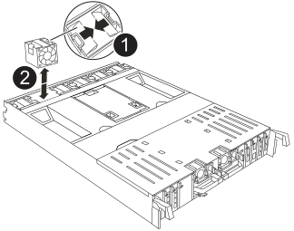

= 
:allow-uri-read: 

要更换风扇，请卸下发生故障的风扇模块并将其更换为新的风扇模块。

CAUTION: 在安装和维护过程中，请始终佩戴连接到已验证接地点的接地腕带。未遵循正确的 ESD 预防措施可能会对控制器节点、存储架和网络交换机造成永久性损坏。

.步骤
. 通过检查控制台错误消息来确定必须更换的风扇模块。
. 通过挤压风扇模块侧面的锁定卡舌，然后将风扇模块直接从控制器模块中提出来卸下风扇模块。
+

+
[cols="1,4"]
|===

 a| 
image:../media/icon_round_1.png["标注编号1"]
| 风扇锁定卡舌 

 a| 
image:../media/icon_round_2.png["标注编号2"]
| 风扇模块 
|===
. 将更换用风扇模块的边缘与控制器模块的开口对齐，然后将更换用的风扇模块滑入控制器模块，直到锁定闩锁卡入到位。

