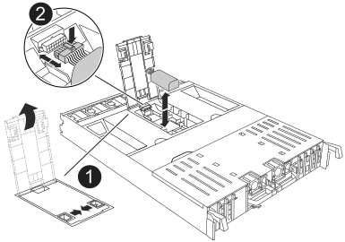

= 第 1 步：关闭受损控制器
:allow-uri-read: 

To replace the NV battery, you must remove the controller module, remove the battery, replace the battery, and then reinstall the controller module.

系统中的所有其他组件必须正常运行；否则，您必须联系技术支持。

== 第 1 步：关闭受损控制器

使用以下选项之一关闭或接管受损控制器。

[role="tabbed-block"]
====
.选项 1 ：大多数系统
--
要关闭受损控制器，您必须确定控制器的状态，并在必要时接管控制器，以便运行正常的控制器继续从受损控制器存储提供数据。

.关于此任务
* 如果您使用的是SAN系统，则必须已检查受损控制器SCSI刀片的事件消息  `cluster kernel-service show`。 `cluster kernel-service show`命令(在priv高级模式下)可显示该节点的节点名称link:https://docs.netapp.com/us-en/ontap/system-admin/display-nodes-cluster-task.html["仲裁状态"]、该节点的可用性状态以及该节点的运行状态。
+
每个 SCSI 刀片式服务器进程应与集群中的其他节点保持仲裁关系。在继续更换之前，必须先解决所有问题。

* If you have a cluster with more than two nodes, it must be in quorum.如果集群未达到仲裁或运行状况良好的控制器在资格和运行状况方面显示false、则必须在关闭受损控制器之前更正问题描述 ；请参见 link:https://docs.netapp.com/us-en/ontap/system-admin/synchronize-node-cluster-task.html?q=Quorum["将节点与集群同步"^]。

.步骤
. 如果启用了AutoSupport、则通过调用AutoSupport消息禁止自动创建案例： `system node autosupport invoke -node * -type all -message MAINT=<# of hours>h`
+
以下AutoSupport 消息禁止自动创建案例两小时： `cluster1:> system node autosupport invoke -node * -type all -message MAINT=2h`

. 从运行正常的控制器的控制台禁用自动交还： `storage failover modify – node local -auto-giveback false`
+

NOTE: 当您看到_Do you want to disable auto-giveback？_时、输入`y`。

. 将受损控制器显示为 LOADER 提示符：
+
[cols="1,2"]
|===
| 如果受损控制器显示 ... | 那么 ... 

 a| 
LOADER 提示符
 a| 
转至下一步。

 a| 
正在等待交还
 a| 
按 Ctrl-C ，然后在出现提示时回答 `y` 。

 a| 
系统提示符或密码提示符
 a| 
从运行正常的控制器接管或暂停受损的控制器： `storage failover takeover -ofnode _impaired_node_name_`

当受损控制器显示 Waiting for giveback... 时，按 Ctrl-C ，然后回答 `y` 。

|===

--
.选项 2 ：控制器位于 MetroCluster 中
--
要关闭受损控制器，您必须确定控制器的状态，并在必要时接管控制器，以便运行正常的控制器继续从受损控制器存储提供数据。

* If you have a cluster with more than two nodes, it must be in quorum.如果集群未达到仲裁或运行状况良好的控制器在资格和运行状况方面显示false、则必须在关闭受损控制器之前更正问题描述 ；请参见 link:https://docs.netapp.com/us-en/ontap/system-admin/synchronize-node-cluster-task.html?q=Quorum["将节点与集群同步"^]。
* 您必须确认已配置MetroCluster配置状态，并且节点处于启用和正常状态(`metrocluster node show`)。

.步骤
. 如果启用了 AutoSupport ，则通过调用 AutoSupport 消息禁止自动创建案例： `ssystem node AutoSupport invoke -node * -type all -message MAINT=number_of_hours_downh`
+
以下 AutoSupport 消息禁止自动创建案例两小时： `cluster1 ： * > system node AutoSupport invoke -node * -type all -message MAINT=2h`

. 从运行正常的控制器的控制台禁用自动交还： `storage failover modify – node local -auto-giveback false`
. 将受损控制器显示为 LOADER 提示符：
+
[cols="1,2"]
|===
| 如果受损控制器显示 ... | 那么 ... 

 a| 
LOADER 提示符
 a| 
转至下一节。

 a| 
正在等待交还
 a| 
按 Ctrl-C ，然后在出现提示时回答 `y` 。

 a| 
系统提示符或密码提示符（输入系统密码）
 a| 
从运行正常的控制器接管或暂停受损的控制器： `storage failover takeover -ofnode _impaired_node_name_`

当受损控制器显示 Waiting for giveback... 时，按 Ctrl-C ，然后回答 `y` 。

|===

--
====

== 第 2 步：卸下控制器模块

在更换控制器模块或更换控制器模块内的组件时，您必须从机箱中卸下控制器模块。

. 在机箱正面、用拇指用力推入每个驱动器、直到您感觉到有一定的停机。这样可确保驱动器牢固地固定在机箱中板上。
+
image::../media/drw_a800_drive_seated_IEOPS-960.svg[安装磁盘驱动器]

. 检查受损控制器模块背面插槽4/5中的琥珀色NVRAM状态指示灯是否熄灭。查找NV图标。
+
image::../media/drw_a1K-70-90_nvram-led_ieops-1463.svg[NVRAM警示和状态LED位置图]

+
[cols="1,4"]
|===

 a| 
image:../media/icon_round_1.png["标注编号1"]
 a| 
NVRAM 状态 LED

 a| 
image:../media/icon_round_2.png["标注编号2"]
 a| 
NVRAM警示LED

|===
+

NOTE: 如果NVRAM状态LED闪烁、则可能表示控制器模块未被接管或正常暂停(未提交的数据)。如果受损控制器模块未被配对控制器模块成功接管、请先联系、 https://mysupport.netapp.com/site/global/dashboard["NetApp 支持"] 然后再继续此过程。

+
受损控制器模块上的NVRAM状态LED的一般行为如下：

+
** 当控制器模块断电、存储系统处于"正在等待恢复"状态、或者控制器模块未被正确接管或暂停(未提交的数据)时、NVRAM状态LED会闪烁。
** 从机箱中卸下控制器模块后、NVRAM状态LED会闪烁、这可能意味着控制器模块未被接管或暂停(未提交的数据)。确认此控制器模块已被配对控制器模块完全接管，或者受损控制器模块显示 `waiting for giveback`。然后、可以忽略闪烁的LED指示灯(并且可以从机箱中卸下控制器模块)。

. 如果您尚未接地，请正确接地。
. 从控制器模块电源(PSU)上拔下控制器模块电源线。
+

NOTE: 如果您的系统使用直流电源、请断开电源块与PSU的连接。

. 从控制器模块拔下系统缆线以及SFP和QSFP模块(如果需要)、并记录缆线的连接位置。
+
将缆线留在缆线管理设备中，以便在重新安装缆线管理设备时，缆线排列有序。

. 从控制器模块中卸下缆线管理设备。
. 向下按两个锁定闩锁，然后同时向下旋转两个闩锁。
+
此控制器模块会从机箱中略微移出。

+
image::../media/drw_a70-90_pcm_remove_replace_ieops-1365.svg[控制器删除图形]

+
[cols="1,4"]
|===

 a| 
image:../media/icon_round_1.png["标注编号1"]
| A锁定闩锁 

 a| 
image:../media/icon_round_2.png["标注编号2"]
 a| 
锁定销

|===
. 将控制器模块滑出机箱、然后将其放在平稳的表面上。
+
将控制器模块滑出机箱时，请确保您支持控制器模块的底部。

== 第3步：更换NV电池

从控制器模块中取出发生故障的NV电池、然后安装更换用的NV电池。

. 打开空气管道盖、找到NV电池。
+

+
[cols="1,4"]
|===

| image:../media/icon_round_1.png["标注编号1"]  a| 
NV蓄电池空气管道盖

 a| 
image:../media/icon_round_2.png["标注编号2"]
| NV电池插头 
|===
. 向上提起蓄电池以接触蓄电池插头。
. 挤压电池插头表面的夹子以从插座中释放插头、然后从插座中拔下电池电缆。
. 将电池从空气管道和控制器模块中提出、然后放在一旁。
. 从包装中取出更换用电池。
. 将更换用的电池组安装到控制器中：
+
.. 将电池插头插入提升板插槽，并确保插头锁定到位。
.. 将电池组插入插槽，然后用力向下按电池组，以确保其锁定到位。

. 合上NV空气管道盖。
+
确保插头锁定在插槽中。

== 第 4 步：重新安装控制器模块

重新安装控制器模块并重新启动。

. 将空气管道向下旋转到可以移动的位置、确保空气管道完全关闭。
+
它必须与控制器模块金属板平齐。

. 将控制器模块的末端与机箱中的开口对齐，然后将控制器模块轻轻推入系统的一半。
+

NOTE: 请勿将控制器模块完全插入机箱中，除非系统指示您这样做。

. 根据需要重新对系统进行布线。
+
如果您删除了收发器(QSFP或SFP)、请记得在使用光缆时重新安装它们。

. 完成控制器模块的重新安装：
+
.. 将控制器模块牢牢推入机箱，直到它与中板相距并完全就位。
+
控制器模块完全就位后，锁定闩锁会上升。

+

NOTE: 将控制器模块滑入机箱时，请勿用力过大，以免损坏连接器。

+
.. 将锁定闩锁向上旋转到锁定位置。

. 将电源线插入电源。
+

NOTE: 如果您有直流电源、请在控制器模块完全固定在机箱中后、将电源块重新连接到电源。

+
电源恢复后、控制器模块将启动。如果启动到加载程序提示符、请使用命令重新启动控制器 `boot_ontap` 。

. 使用 `storage failover modify -node local -auto-giveback true` 命令禁用自动交还后，可将其还原。
. 如果启用了AutoSupport、请使用命令还原/取消禁止自动创建案例 `system node autosupport invoke -node * -type all -message MAINT=END` 。

== 第 5 步：将故障部件退回 NetApp

按照套件随附的 RMA 说明将故障部件退回 NetApp 。 https://mysupport.netapp.com/site/info/rma["部件退回和更换"]有关详细信息、请参见页面。
