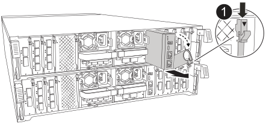

= 第 1 步：关闭受损控制器
:allow-uri-read: 

系统管理模块位于控制器背面的插槽8中、包含用于系统管理的板载组件以及用于外部管理的端口。要更换受损的系统管理模块或更换启动介质、必须关闭目标控制器。

系统管理模块具有以下板载组件：

* 启动介质、无需卸下控制器模块即可更换启动介质。
* BMC
* 管理交换机

系统管理模块还包含以下用于外部管理的端口：

* RJ45串行
* USB串行(C型)
* USB Type-A (启动恢复)
* e0M RJ45以太网

要更换系统管理模块或或启动介质、必须关闭受损控制器。

.开始之前
* 此操作步骤使用以下术语：
+
** 受损控制器是指要在其中执行维护的控制器。
** 运行正常的控制器是受损控制器的 HA 配对控制器。

* 所有其他系统组件必须正常工作。
* 配对控制器必须能够接管受损控制器。
* 您必须将故障组件更换为从提供商处收到的替代 FRU 组件。

== 第 1 步：关闭受损控制器

使用以下选项之一关闭或接管受损控制器。

[role="tabbed-block"]
====
.选项 1 ：大多数系统
--
要关闭受损控制器，您必须确定控制器的状态，并在必要时接管控制器，以便运行正常的控制器继续从受损控制器存储提供数据。

.关于此任务
* 如果您使用的是SAN系统，则必须已检查受损控制器SCSI刀片的事件消息  `cluster kernel-service show`。 `cluster kernel-service show`命令(在priv高级模式下)可显示节点名称、该节点的仲裁状态、该节点的可用性状态以及该节点的运行状态。
+
每个 SCSI 刀片式服务器进程应与集群中的其他节点保持仲裁关系。在继续更换之前，必须先解决所有问题。

* If you have a cluster with more than two nodes, it must be in quorum.如果集群未达到仲裁或运行状况良好的控制器在资格和运行状况方面显示false、则必须在关闭受损控制器之前更正问题描述 ；请参见 link:https://docs.netapp.com/us-en/ontap/system-admin/synchronize-node-cluster-task.html?q=Quorum["将节点与集群同步"^]。

.步骤
. 如果启用了AutoSupport、则通过调用AutoSupport消息禁止自动创建案例： `system node autosupport invoke -node * -type all -message MAINT=<# of hours>h`
+
以下AutoSupport 消息禁止自动创建案例两小时： `cluster1:> system node autosupport invoke -node * -type all -message MAINT=2h`

. 从运行正常的控制器的控制台禁用自动交还： `storage failover modify – node local -auto-giveback false`
+

NOTE: 当您看到_Do you want to disable auto-giveback？_时、输入`y`。

. 将受损控制器显示为 LOADER 提示符：
+
[cols="1,2"]
|===
| 如果受损控制器显示 ... | 那么 ... 

 a| 
LOADER 提示符
 a| 
转至下一步。

 a| 
正在等待交还
 a| 
按 Ctrl-C ，然后在出现提示时回答 `y` 。

 a| 
系统提示符或密码提示符
 a| 
从运行正常的控制器接管或暂停受损的控制器： `storage failover takeover -ofnode _impaired_node_name_`

当受损控制器显示 Waiting for giveback... 时，按 Ctrl-C ，然后回答 `y` 。

|===

--
.选项 2 ：控制器位于 MetroCluster 中
--
要关闭受损控制器，您必须确定控制器的状态，并在必要时接管控制器，以便运行正常的控制器继续从受损控制器存储提供数据。

* If you have a cluster with more than two nodes, it must be in quorum.如果集群未达到仲裁或运行状况良好的控制器在资格和运行状况方面显示false、则必须在关闭受损控制器之前更正问题描述 ；请参见 link:https://docs.netapp.com/us-en/ontap/system-admin/synchronize-node-cluster-task.html?q=Quorum["将节点与集群同步"^]。
* 如果您使用的是 MetroCluster 配置，则必须确认已配置 MetroCluster 配置状态，并且节点处于已启用且正常的状态（`MetroCluster node show` ）。

.步骤
. 如果启用了 AutoSupport ，则通过调用 AutoSupport 消息禁止自动创建案例： `ssystem node AutoSupport invoke -node * -type all -message MAINT=number_of_hours_downh`
+
以下 AutoSupport 消息禁止自动创建案例两小时： `cluster1 ： * > system node AutoSupport invoke -node * -type all -message MAINT=2h`

. 从运行正常的控制器的控制台禁用自动交还： `storage failover modify – node local -auto-giveback false`
. 将受损控制器显示为 LOADER 提示符：
+
[cols="1,2"]
|===
| 如果受损控制器显示 ... | 那么 ... 

 a| 
LOADER 提示符
 a| 
转至下一步。

 a| 
正在等待交还
 a| 
按 Ctrl-C ，然后在出现提示时回答 `y` 。

 a| 
系统提示符或密码提示符（输入系统密码）
 a| 
从运行正常的控制器接管或暂停受损的控制器： `storage failover takeover -ofnode _impaired_node_name_`

当受损控制器显示 Waiting for giveback... 时，按 Ctrl-C ，然后回答 `y` 。

|===

--
====

== 第2步：更换受损的系统管理模块

更换受损的系统管理模块。

. 在机箱正面、用拇指用力推入每个驱动器、直到您感觉到有一定的停机。这样可确保驱动器牢固地固定在机箱中板上。
+

NOTE: 确保NVRAM已完成减载、然后再继续。

+
image::../media/drw_a800_drive_seated_IEOPS-960.svg[安装磁盘驱动器]

. 转至机箱背面。如果您尚未接地，请正确接地。
. 通过将控制器模块拉出大约三英寸来断开控制器模块的电源：
+
.. 向下按控制器模块的两个锁定闩锁、然后同时向下旋转两个闩锁。
.. 将控制器模块从机箱中拉出约3英寸以断开电源。

. 向下旋转缆线管理托架、方法是拉动缆线管理托架内侧两侧的按钮、然后向下旋转托架。
. 删除系统管理模块：
+
.. 拔下连接到系统管理模块的所有电缆。确保在电缆的连接位置贴上标签、以便在重新安装模块时将其连接到正确的端口。
+

+
[cols="1,4"]
|===

 a| 
image::../media/legend_icon_01.svg[标注编号1]
 a| 
系统管理模块凸轮闩锁

|===

. 删除系统管理模块：
+
.. 按下系统管理凸轮按钮。凸轮杆移离机箱。
.. 向下旋转凸轮杆。
.. 将手指环入凸轮杆、然后将模块直接拉出系统。
.. 将系统管理模块放在防静电垫上、以便可以访问启动介质。

. 将启动介质移至替代系统管理模块：
+
image::../media/drw_a70-90_sys-mgmt_replace_ieops-1373.svg[启动介质更换]

+
[cols="1,4"]
|===

 a| 
image::../media/legend_icon_01.svg[标注编号1]
 a| 
系统管理模块凸轮闩锁

 a| 
image::../media/legend_icon_02.svg[标注编号2]
 a| 
启动介质锁定按钮

 a| 
image::../media/legend_icon_03.svg[标注编号3]
 a| 
启动介质

|===
+
.. 按下蓝色锁定按钮。启动介质稍微向上旋转。
.. 向上旋转启动介质、将其滑出插槽。
.. 在替代系统管理模块中安装启动介质：
+
... 将启动介质的边缘与插槽外壳对齐，然后将其轻轻直推入插槽。
... 向下旋转行李箱介质、直至其与锁定按钮啮合。如有必要、按下蓝色锁定。

. 安装系统管理模块：
+
.. 将更换用的系统管理模块的边缘与系统开口对齐、然后将其轻轻推入控制器模块。
.. 将模块轻轻滑入插槽、直到凸轮闩锁开始与I/O凸轮销啮合、然后一直向上旋转凸轮闩锁以将模块锁定到位。

. 重新对系统管理模块进行配置。
. 重新连接控制器模块的电源：
+
.. 将控制器模块牢牢推入机箱，直到它与中板相距并完全就位。
+
控制器模块完全就位后，锁定闩锁会上升。

.. 将锁定闩锁向上旋转到锁定位置。

. 将缆线管理托架向上旋转到关闭位置。

== 第3步：重新启动控制器模块

重新启动控制器模块。

. 在加载程序提示符处输入_BYE_。
. 通过交还控制器的存储、使其恢复正常运行：_storage Failover gi交还-ofnode _d受损_ne_name_
. 使用还原自动交还 `storage failover modify -node local -auto-giveback true` 命令：
. 如果已触发AutoSupport维护窗口、请使用结束此窗口 `system node autosupport invoke -node * -type all -message MAINT=END` 命令：

== 第4步：安装许可证并注册序列号

如果受损节点正在使用需要标准(节点锁定)许可证的ONTAP功能、则必须为此节点安装新许可证。对于具有标准许可证的功能，集群中的每个节点都应具有自己的功能密钥。

.关于此任务
在安装许可证密钥之前、需要标准许可证的功能仍可供节点使用。但是、如果此节点是集群中唯一具有此功能许可证的节点、则不允许对此功能进行配置更改。此外、在节点上使用未经许可的功能可能会使您违反许可协议、因此您应尽快在上为此节点安装替代许可证密钥。

.开始之前
许可证密钥必须采用 28 个字符的格式。

您有 90 天的宽限期来安装许可证密钥。宽限期过后，所有旧许可证将失效。安装有效的许可证密钥后，您可以在 24 小时内安装所有密钥，直到宽限期结束。

.步骤
. 如果需要新的许可证密钥，请在上获取替代许可证密钥 https://mysupport.netapp.com/site/global/dashboard["NetApp 支持站点"] 在软件许可证下的我的支持部分中。
+

NOTE: 系统会自动生成所需的新许可证密钥，并将其发送到文件中的电子邮件地址。如果您未能在 30 天内收到包含许可证密钥的电子邮件，应联系技术支持。

. 安装每个许可证密钥： ` + system license add -license-code license-key ， license-key...+`
. 如果需要，删除旧许可证：
+
.. 检查未使用的许可证： `license clean-up -unused -simulate`
.. 如果列表显示正确，请删除未使用的许可证： `license clean-up -unused`

. 向 NetApp 支持部门注册系统序列号。
+
** 如果启用了 AutoSupport ，请发送 AutoSupport 消息以注册序列号。
** 如果未启用 AutoSupport ，请调用 https://mysupport.netapp.com["NetApp 支持"] 注册序列号。

== 第 5 步：将故障部件退回 NetApp

按照套件随附的 RMA 说明将故障部件退回 NetApp 。 https://mysupport.netapp.com/site/info/rma["部件退回和更换"]有关详细信息、请参见页面。
