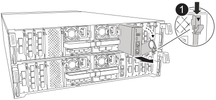

= 
:allow-uri-read: 

更换受损的系统管理模块。

.步骤
. 使用拇指推动每个驱动器、直至感觉到强制停止、以确保机箱中的所有驱动器都牢固地固定在中板上。
. 确保NVRAM已完成减载、然后再继续。当NV模块上的LED熄灭时、NVRAM将被解除。如果LED闪烁、请等待闪烁停止。如果闪烁持续时间超过5分钟、请联系技术支持以获得帮助。
+
image::../media/drw_a800_drive_seated_IEOPS-960.svg[安装磁盘驱动器]

. 转至机箱背面。如果您尚未接地，请正确接地。
. 拔下控制器的 PSU。
+

NOTE: 如果您的系统使用直流电源、请断开电源块与PSU的连接。

. 向下旋转缆线管理托架、方法是拉动缆线管理托架内侧两侧的按钮、然后向下旋转托架。
. 拔下连接到系统管理模块的所有电缆。确保在电缆的连接位置贴上标签、以便在重新安装模块时将其连接到正确的端口。
+

+
[cols="1,4"]
|===

 a| 
image::../media/icon_round_1.png[标注编号1]
 a| 
系统管理模块凸轮闩锁

|===
. 删除系统管理模块：
+
.. 按下系统管理凸轮按钮。凸轮杆移离机箱。
.. 向下旋转凸轮杆。
.. 将手指环入凸轮杆、然后将模块直接拉出系统。
.. 将系统管理模块放在防静电垫上、以便可以访问启动介质。

. 将启动介质移至替代系统管理模块：
+
image::../media/drw_a70-90_sys-mgmt_replace_ieops-1373.svg[启动介质更换]

+
[cols="1,4"]
|===

 a| 
image::../media/icon_round_1.png[标注编号1]
 a| 
系统管理模块凸轮闩锁

 a| 
image::../media/icon_round_2.png[标注编号2]
 a| 
启动介质锁定按钮

 a| 
image::../media/icon_round_3.png[标注编号3]
 a| 
启动介质

|===
+
.. 按下蓝色锁定按钮。启动介质稍微向上旋转。
.. 向上旋转启动介质、将其滑出插槽。
.. 在替代系统管理模块中安装启动介质：
+
... 将启动介质的边缘与插槽外壳对齐，然后将其轻轻直推入插槽。
... 向下旋转行李箱介质、直至其与锁定按钮啮合。如有必要、按下蓝色锁定。

. 安装系统管理模块：
+
.. 将更换用的系统管理模块的边缘与系统开口对齐、然后将其轻轻推入控制器模块。
.. 将模块轻轻滑入插槽、直到凸轮闩锁开始与I/O凸轮销啮合、然后一直向上旋转凸轮闩锁以将模块锁定到位。

. 重新对系统管理模块进行配置。
. 将电源线插入电源。一旦电源恢复，控制器就会重新启动。
+

NOTE: 如果您有直流电源，请将电源块重新连接到电源。

. 将缆线管理托架向上旋转到关闭位置。

