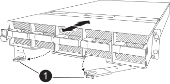

= 
:allow-uri-read: 

在更换控制器模块或更换控制器模块内部的组件时、您必须从机柜中卸下控制器模块。

. 检查位于系统插槽 4/5 中的 NVRAM 状态 LED 和 NVRAM12-EX 状态插槽 6/7。控制器模块的前面板上还有一个 NVRAM LED。寻找 NV 图标：
+
image::../media/drw_a1K-70-90_nvram-led_ieops-1463.svg[NVRAM警示和状态LED位置图]

+
[cols="1,4"]
|===

2+| *NVRAM* 

 a| 
image:../media/icon_round_1.png["标注编号1"]
 a| 
NVRAM 状态 LED

 a| 
image:../media/icon_round_2.png["标注编号2"]
 a| 
NVRAM警示LED

|===
+
image::../media/drw_afx_emr_nvram-led_ieops-2962.svg[NVRAM12-EX 注意和状态 LED 位置图形]

+
[cols="1,4"]
|===

2+| *NVRAM12-EX* 

 a| 
image:../media/icon_round_1.png["标注编号1"]
 a| 
NVRAM12-EX 状态 LED

 a| 
image:../media/icon_round_2.png["标注编号2"]
 a| 
NVRAM12-EX 注意 LED

|===
+
** 如果NV LED熄灭、请转至下一步。
** 如果NV LED闪烁、请等待闪烁停止。如果闪烁持续时间超过5分钟、请联系技术支持以获得帮助。

. 如果您尚未接地，请正确接地。
. 用双手抓住挡板两侧的开口并向自己方向拉，直至挡板从底盘框架上的球头螺栓上松开，从而拆下挡板（如有必要）。
. 在设备正面、将手指钩入锁定凸轮上的孔中、挤压凸轮杆上的卡舌、然后同时朝您的方向轻轻而稳固地旋转两个闩锁。
+
控制器模块会稍微移出机柜。

+

+
[cols="1,4"]
|===

 a| 
image:../media/icon_round_1.png["标注编号1"]
| 锁定凸轮闩锁 
|===
. 将控制器模块滑出机箱、然后将其放在平稳的表面上。
+
将控制器模块滑出机柜时、请确保支撑好其底部。

