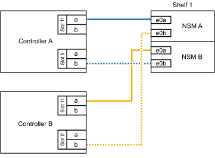

= 
:allow-uri-read: 

如果需要为一个AFF A70或AFF A90 HA对热添加更多存储(到内部磁盘架)、则最多可以将两个NS224磁盘架添加到其中。

.开始之前
* 您必须已查看 link:requirements-hot-add-shelf.html["热添加要求和最佳实践"]。
* 您必须已完成中的适用过程 link:prepare-hot-add-shelf.html["准备热添加磁盘架"]。
* 您必须已安装磁盘架并为其通电，然后按照中所述设置磁盘架ID link:prepare-hot-add-shelf.html["安装用于热添加的磁盘架"]。

.关于此任务
* 此过程假设HA对只有内部存储(无外部磁盘架)、并且您要在每个控制器中热添加最多两个额外磁盘架和两个支持RoCE的I/O模块。
* 此过程可解决以下热添加情形：
+
** 在每个控制器中使用一个支持RoCE的I/O模块将第一个磁盘架热添加到HA对。
** 在每个控制器中使用两个支持RoCE的I/O模块将第一个磁盘架热添加到HA对。
** 热-将第二个磁盘架添加到每个控制器中具有两个支持RoCE的I/O模块的HA对中。

.步骤
. 如果要在每个控制器模块中使用一组支持RoCE的端口(一个支持RoCE的I/O模块)热添加一个磁盘架、并且这是HA对中唯一的NS224磁盘架、请完成以下子步骤。
+
否则，请转至下一步。

+

NOTE: 此步骤假定您已将支持RoCE的I/O模块安装在插槽11中。

+
.. 使用缆线将磁盘架 NSM A 端口 e0a 连接到控制器 A 插槽 11 端口 A （ e11a ）。
.. 使用缆线将磁盘架 NSM A 端口 e0b 连接到控制器 B 插槽 11 端口 b （ e11b ）。
.. 使用缆线将磁盘架 NSM B 端口 e0a 连接到控制器 B 插槽 11 端口 A （ e11a ）。
.. 使用缆线将磁盘架 NSM B 端口 e0b 连接到控制器 A 插槽 11 端口 b （ e11b ）。
+
下图显示了在每个控制器模块中使用一个支持 RoCE 的 I/O 模块为一个热添加磁盘架布线：

+
image::../media/drw_ns224_vino_i_1shelf_1card_ieops-1639.svg[使用缆线连接具有一个磁盘架和一个IO模块的AFF A70或A90]

. 如果要在每个控制器模块中使用两组支持 RoCE 的端口（两个支持 RoCE 的 I/O 模块）热添加一个或两个磁盘架，请完成相应的子步骤。
+

NOTE: 此步骤假定您已在插槽11和8中安装了支持RoCE的I/O模块。

+
[cols="1,3"]
|===
| 磁盘架 | 布线 

 a| 
磁盘架 1
 a| 
.. 使用缆线将NSM A端口e0a连接到控制器A插槽11端口A (e11a)。
.. 使用缆线将NSM A端口e0b连接到控制器B插槽8端口b (e8b)。
.. 使用缆线将NSM B端口e0a连接到控制器B插槽11端口A (e11a)。
.. 使用缆线将NSM B端口e0b连接到控制器A插槽8端口b (e8b)。
.. 如果要热添加第二个磁盘架，请完成 `Shelf 2` 子步骤；否则，请转至步骤 3 。

下图显示了如何在每个控制器模块中使用两个支持RoCE的I/O模块为一个热添加磁盘架布线：

 a| 
磁盘架 2
 a| 
.. 使用缆线将NSM A端口e0a连接到控制器A插槽8端口A (E8a)。
.. 使用缆线将NSM A端口e0b连接到控制器B插槽11端口b (e11b)。
.. 使用缆线将NSM B端口e0a连接到控制器B插槽8端口A (E8a)。
.. 使用缆线将NSM B端口e0b连接到控制器A插槽11端口b (e11b)。
.. 转至步骤 3 。

下图显示了在每个控制器模块中使用两个支持RoCE的I/O模块为两个热添加磁盘架布线：

image::../media/drw_ns224_vino_i_2shelves_2cards_ieops-1641.svg[为具有两个磁盘架和两个IO模块的AFF A70或A90布线]

|===
. 使用验证热添加磁盘架的布线是否正确 https://mysupport.netapp.com/site/tools/tool-eula/activeiq-configadvisor["Active IQ Config Advisor"^]。
+
如果生成任何布线错误，请按照提供的更正操作进行操作。

.下一步是什么？
If you disabled automatic drive assignment as part of the preparation for this procedure, you need to manually assign drive ownership and then reenable automatic drive assignment, if needed.转到。 link:complete-hot-add-shelf.html["完成热添加"]

否则、您将完成热添加磁盘架过程。
