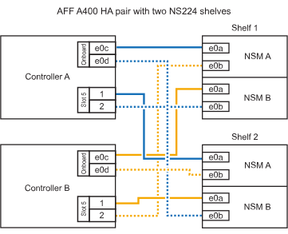

= 
:allow-uri-read: 

.开始之前
* 您必须已查看 link:requirements-hot-add-shelf.html["热添加要求和最佳实践"]。
* 您必须已完成中的适用过程 link:prepare-hot-add-shelf.html["准备热添加磁盘架"]。
* 您必须已安装磁盘架并为其通电，然后按照中所述设置磁盘架ID link:prepare-hot-add-shelf.html["安装用于热添加的磁盘架"]。

*用电缆将磁盘架连接到AFF A400 HA对*

对于AFF A400 HA对、您可以根据需要热添加最多两个磁盘架、并使用板载端口e0c/e0d和插槽5中的端口。

.步骤
. 如果要在每个控制器上使用一组支持RoCE的端口(板载支持RoCE的端口)热添加一个磁盘架、并且这是HA对中唯一的NS224磁盘架、请完成以下子步骤。
+
否则，请转至下一步。

+
.. 使用缆线将磁盘架 NSM A 端口 e0a 连接到控制器 A 端口 e0c 。
.. 使用缆线将磁盘架 NSM A 端口 e0b 连接到控制器 B 端口 e0d 。
.. 使用缆线将磁盘架 NSM B 端口 e0a 连接到控制器 B 端口 e0c 。
.. 使用缆线将磁盘架 NSM B 端口 e0b 连接到控制器 A 端口 e0d 。
+
下图显示了如何在每个控制器上使用一组支持RoCE的端口为一个热添加磁盘架布线：

+
image::../media/drw_ns224_a400_1shelf.png[为AFF具有一个NS224磁盘架和一组板载端口的NSS/ ASA A400布线]

. 如果要在每个控制器上使用两组支持RoCE的端口(板载端口和支持RoCE的PCIe卡端口)热添加一个或两个磁盘架、请完成以下子步骤。
+
[cols="1,3"]
|===
| 磁盘架 | 布线 

 a| 
磁盘架 1
 a| 
.. 使用缆线将 NSM A 端口 e0a 连接到控制器 A 端口 e0c 。
.. 使用缆线将NSM A端口e0b连接到控制器B插槽5端口2 (e5b)。
.. 使用缆线将 NSM B 端口 e0a 连接到控制器 B 端口 e0c 。
.. 使用缆线将NSM B端口e0b连接到控制器A插槽5端口2 (e5b)。
.. 如果要热添加第二个磁盘架，请完成 `Shelf 2` 子步骤；否则，请转至步骤 3 。

 a| 
磁盘架 2
 a| 
.. 使用缆线将NSM A端口e0a连接到控制器A插槽5端口1 (e5a)。
.. 使用缆线将 NSM A 端口 e0b 连接到控制器 B 端口 e0d 。
.. 使用缆线将NSM B端口e0a连接到控制器B插槽5端口1 (e5a)。
.. 使用缆线将 NSM B 端口 e0b 连接到控制器 A 端口 e0d 。
.. 转至步骤 3 。

|===
+
下图显示了两个热添加磁盘架的布线：

+

. 使用验证热添加磁盘架的布线是否正确 https://mysupport.netapp.com/site/tools/tool-eula/activeiq-configadvisor["Active IQ Config Advisor"^]。
+
如果生成任何布线错误，请按照提供的更正操作进行操作。

. If you disabled automatic drive assignment as part of the preparation for this procedure, you need to manually assign drive ownership and then re enable automatic drive assignment, if needed.请参阅。 link:complete-hot-add-shelf.html["完成热添加"]
+
否则，您将使用此操作步骤。

*用电缆将磁盘架连接到AFF C400 HA对*

对于AFF C400 HA对、您最多可以热添加两个磁盘架、并根据需要使用插槽4和5中的端口。

.步骤
. 如果要在每个控制器上使用一组支持RoCE的端口热添加一个磁盘架、并且这是HA对中唯一的NS224磁盘架、请完成以下子步骤。
+
否则，请转至下一步。

+
.. 使用缆线将磁盘架NSM A端口e0a连接到控制器A插槽4端口1 (E4A)。
.. 使用缆线将磁盘架NSM A端口e0b连接到控制器B插槽4端口2 (e4b)。
.. 使用缆线将磁盘架NSM B端口e0a连接到控制器B插槽4端口1 (E4A)。
.. 使用缆线将磁盘架NSM B端口e0b连接到控制器A插槽4端口2 (e4b)。
+
下图显示了如何在每个控制器上使用一组支持RoCE的端口为一个热添加磁盘架布线：

+
image::../media/drw_ns224_c400_1shelf_IEOPS-985.svg[为具有一个NS224磁盘架和一组AFF卡端口的ASA C400布线]

. 如果要在每个控制器上使用两组支持RoCE的端口热添加一个或两个磁盘架、请完成以下子步骤。
+
[cols="1,3"]
|===
| 磁盘架 | 布线 

 a| 
磁盘架 1
 a| 
.. 使用缆线将NSM A端口e0a连接到控制器A插槽4端口1 (E4A)。
.. 使用缆线将NSM A端口e0b连接到控制器B插槽5端口2 (e5b)。
.. 使用缆线将NSM B端口e0a连接到控制器B端口插槽4端口1 (E4A)。
.. 使用缆线将NSM B端口e0b连接到控制器A插槽5端口2 (e5b)。
.. 如果要热添加第二个磁盘架，请完成 `Shelf 2` 子步骤；否则，请转至步骤 3 。

 a| 
磁盘架 2
 a| 
.. 使用缆线将NSM A端口e0a连接到控制器A插槽5端口1 (e5a)。
.. 使用缆线将NSM A端口e0b连接到控制器B插槽4端口2 (e4b)。
.. 使用缆线将NSM B端口e0a连接到控制器B插槽5端口1 (e5a)。
.. 使用缆线将NSM B端口e0b连接到控制器A插槽4端口2 (e4b)。
.. 转至步骤 3 。

|===
+
下图显示了两个热添加磁盘架的布线：

+
image::../media/drw_ns224_c400_2shelves_IEOPS-984.svg[为具有两个NS224磁盘架和两组AFF卡端口的ASA C400布线]

. 使用验证热添加磁盘架的布线是否正确 https://mysupport.netapp.com/site/tools/tool-eula/activeiq-configadvisor["Active IQ Config Advisor"^]。
+
如果生成任何布线错误，请按照提供的更正操作进行操作。

.下一步是什么？
If you disabled automatic drive assignment as part of the preparation for this procedure, you need to manually assign drive ownership and then reenable automatic drive assignment, if needed.转到。 link:complete-hot-add-shelf.html["完成热添加"]

否则、您将完成热添加磁盘架过程。
