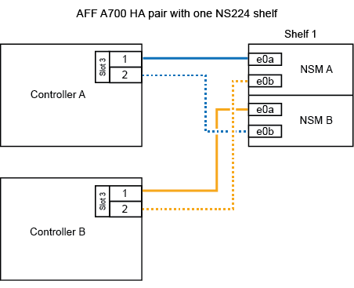
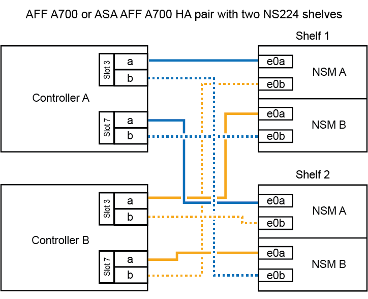

= 
:allow-uri-read: 

.开始之前
如果要热添加初始NS224磁盘架(HA对中不存在NS224磁盘架)、则必须在每个控制器中安装一个核心转储模块(X9170A、NVMe 1TB SSD)、以支持核心转储(存储核心文件)。

+ 请参见 link:../fas9000/caching-module-and-core-dump-module-replace.html["更换缓存模块或添加 / 更换核心转储模块— AFF A700 和 FAS9000"^]。

.关于此任务
如何使用缆线将NS224磁盘架连接到AFF A700 HA对取决于要热添加的磁盘架数量以及控制器上使用的支持RoCE的端口集数量(一个或两个)。

.步骤
. 如果要在每个控制器上使用一组支持RoCE的端口(一个支持RoCE的I/O模块)热添加一个磁盘架、并且这是HA对中唯一的NS224磁盘架、请完成以下子步骤。
+
否则，请转至下一步。

+

NOTE: 此步骤假定您已将支持RoCE的I/O模块安装在每个控制器的插槽3 (而不是插槽7)中。

+
.. 使用缆线将磁盘架 NSM A 端口 e0a 连接到控制器 A 插槽 3 端口 a
.. 使用缆线将磁盘架 NSM A 端口 e0b 连接到控制器 B 插槽 3 端口 b
.. 使用缆线将磁盘架 NSM B 端口 e0a 连接到控制器 B 插槽 3 端口 a
.. 使用缆线将磁盘架 NSM B 端口 e0b 连接到控制器 A 插槽 3 端口 b
+
下图显示了如何在每个控制器中使用一个支持RoCE的I/O模块为一个热添加磁盘架布线：

+

. 如果要在每个控制器中使用两组支持RoCE的端口(两个支持RoCE的I/O模块)热添加一个或两个磁盘架、请完成相应的子步骤。
+
[cols="1,3"]
|===
| 磁盘架 | 布线 

 a| 
磁盘架 1
 a| 

NOTE: 这些子步骤假定您开始布线时使用的是将磁盘架端口 e0a 连接到插槽 3 中支持 RoCE 的 I/O 模块，而不是插槽 7 。

.. 使用缆线将 NSM A 端口 e0a 连接到控制器 A 插槽 3 端口 a
.. 使用缆线将 NSM A 端口 e0b 连接到控制器 B 插槽 7 端口 b
.. 使用缆线将 NSM B 端口 e0a 连接到控制器 B 插槽 3 端口 a
.. 使用缆线将 NSM B 端口 e0b 连接到控制器 A 插槽 7 端口 b
.. 如果您要快速添加第二个搁板，请完成“`搁板 2`”子步骤；否则，请转到下一步。

 a| 
磁盘架 2
 a| 

NOTE: 这些子步骤假定您开始布线时使用的是将磁盘架端口 e0a 连接到插槽 7 中支持 RoCE 的 I/O 模块，而不是插槽 3 （与磁盘架 1 的布线子步骤相关）。

.. 使用缆线将 NSM A 端口 e0a 连接到控制器 A 插槽 7 端口 a
.. 使用缆线将 NSM A 端口 e0b 连接到控制器 B 插槽 3 端口 b
.. 使用缆线将 NSM B 端口 e0a 连接到控制器 B 插槽 7 端口 a
.. 使用缆线将 NSM B 端口 e0b 连接到控制器 A 插槽 3 端口 b
.. 转至下一步。

|===
+
下图显示了第一个和第二个热添加磁盘架的布线：

+

. 使用验证热添加磁盘架的布线是否正确 https://mysupport.netapp.com/site/tools/tool-eula/activeiq-configadvisor["Active IQ Config Advisor"^]。
+
如果生成任何布线错误，请按照提供的更正操作进行操作。

