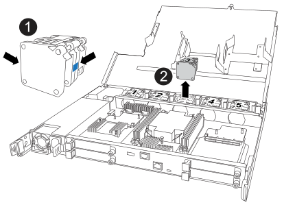

= 
:allow-uri-read: 

要更换风扇、请卸下故障风扇、然后使用新风扇进行更换。

.步骤
. 通过检查控制台错误消息确定必须更换的风扇。
. 卸下故障风扇：
+

+
[cols="1,4"]
|===

 a| 
image::../media/icon_round_1.png[标注编号1]
| 握住风扇两侧的蓝色触点。 

 a| 
image::../media/icon_round_2.png[标注编号2]
| 将风扇竖直向上拉出插槽。 
|===
. 通过将替代风扇与导板对齐来插入、然后向下推、直到风扇连接器完全固定在插槽中。

