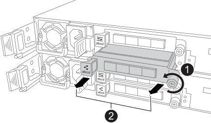

= 
:allow-uri-read: 

要更换发生故障的I/O模块、请在控制器中找到该模块、然后按照特定步骤顺序进行操作。

CAUTION: 在安装和维护过程中，请始终佩戴连接到已验证接地点的接地腕带。未遵循正确的 ESD 预防措施可能会对控制器节点、存储架和网络交换机造成永久性损坏。

.步骤
. 从发生故障的I/O模块上拔下电缆。
+
请务必为电缆贴上标签、以便您知道电缆的来源。

. 从控制器中卸下故障I/O模块：
+

+
[cols="1,4"]
|===

 a| 
image::../media/icon_round_1.png[标注编号1]
 a| 
逆时针旋转I/O模块指旋螺钉以拧松。

 a| 
image::../media/icon_round_2.png[标注编号2]
 a| 
使用左侧的端口标签卡舌和翼形螺钉将I/O模块从控制器中拉出。

|===
. 将更换用的I/O模块安装到目标插槽中：
+
.. 将 I/O 模块与插槽边缘对齐。
.. 将I/O模块轻轻推入插槽、确保将模块正确插入连接器。
+
您可以使用左侧的卡舌和指旋螺钉推入I/O模块。

.. 顺时针旋转翼形螺钉以拧紧。

. 为I/O模块布线。

