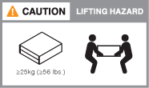
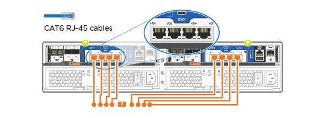
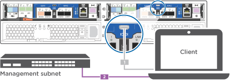

= 详细指南—AFF A150
:allow-uri-read: 
:icons: font
:imagesdir: ../media/

[role="lead"]
本节提供了安装AFF A150系统的详细分步说明。

如果您使用的是MetroCluster 配置、请使用 https://docs.netapp.com/us-en/ontap-metrocluster/index.html["MetroCluster 文档"^]。

*警告：*如果您的系统安装了ONTAP 9．13.1P8－9.13.1P11、ONTAP 9．14.1P1 9.14.1P7或ONTAP 9．15．1 9.15.1P2，并且您的系统包含10个或更多的内部固态驱动器，则必须采取其它步骤来准备安装系统。请参阅问题 https://mysupport.netapp.com/site/bugs-online/product/ONTAP/JiraNgage/CONTAP-285173["COOTP-285173 - ADP不会在具有10个或更多内部驱动器的AFF A150上保留备用根分区"^]。

== 第 1 步：准备安装

要安装AFF A150系统、您需要在NetApp 支持站点 上创建一个帐户、注册系统并获取许可证密钥。You also need to inventory the appropriate number and type of cables for your system and collect specific network information.

.开始之前
* 确保您有权访问 link:https://hwu.netapp.com["NetApp Hardware Universe"^] （ HWU ），了解有关站点要求以及已配置系统上的追加信息的信息。
* 确保您有权访问 link:http://mysupport.netapp.com/documentation/productlibrary/index.html?productID=62286["发行说明"^] 有关此系统的详细信息，请参见您的 ONTAP 版本。
* 有关将系统连接到交换机的信息、请与网络管理员联系。
* 确保您的站点具有以下物品：
+
** 存储系统的机架空间
** 2 号十字螺丝刀
** 使用其他网络缆线通过 Web 浏览器将系统连接到网络交换机和笔记本电脑或控制台
** 具有 RJ-45 连接并可访问 Web 浏览器的笔记本电脑或控制台

.步骤
. 打开所有框内容的包装。
. 记录控制器的系统序列号。
+
image::../media/drw_ssn_label.png[系统序列号示例]

. 设置您的帐户：
+
.. 登录到现有帐户或创建帐户。
.. https://mysupport.netapp.com/eservice/registerSNoAction.do?moduleName=RegisterMyProduct["注册您的系统"]。

. 下载并安装 https://mysupport.netapp.com/site/tools/tool-eula/activeiq-configadvisor["Config Advisor"] 在您的笔记本电脑上。
. 清点并记下收到的缆线数量和类型。
+
The following table identifies the types of cables you might receive.如果您收到的缆线未在表中列出，请参见 https://hwu.netapp.com["NetApp Hardware Universe"] 以找到缆线并确定其用途。

+
[cols="1,2,1,2"]
|===
| 缆线类型 ... | 部件号和长度 | 连接器类型 | 针对 ... 

 a| 
10 GbE 缆线（取决于订单）
 a| 
X6566B-05-R6 （ 112-00297 ）， 0.5 米

X6566B-2-R6 （ 112-00299 ）， 2 米
 a| 
image:../media/oie_cable_sfp_gbe_copper.png["GbE SFP铜缆连接器"]
 a| 
集群互连网络

 a| 
10 GbE 缆线（取决于订单）
 a| 
部件号 X6566B-2-R6 （ 112-00299 ）， 2 米

或 X6566B-3-R6 （ 112-00300 ）， 3 米

X6566B-5-R6 （ 112-00301 ）， 5 米
 a| 
image:../media/oie_cable_sfp_gbe_copper.png["GbE SFP铜缆连接器"]
 a| 
数据

 a| 
光纤网络缆线（取决于订单）
 a| 
X6553-R6 （ 112-00188 ）， 2 米

X6536-R6 （ 112-00090 ）， 5 米

X6554-R6 （ 112-00189 ）， 15 米
 a| 
image:../media/oie_cable_fiber_lc_connector.png["LC光纤连接器"]
 a| 
FC 主机网络

 a| 
6 类， RJ-45 （取决于订单）
 a| 
部件号 X6585-R6 （ 112-00291 ）， 3 米

X6562-R6 （ 112-00196 ）， 5 米
 a| 
image:../media/oie_cable_rj45.png["RJ-45电缆连接器"]
 a| 
管理网络和以太网数据

 a| 
存储（取决于订单）
 a| 
部件号 X66030A （ 112-00435 ）， 0.5 米

X66031A （ 112-00436A ）， 1 米

X66032A （ 112-00437 ）， 2 米

X66033A （ 112-00438 ）， 3 米
 a| 
image:../media/oie_cable_mini_sas_hd_to_mini_sas_hd.png["迷你SAS到迷你SAS连接器"]
 a| 
存储

 a| 
微型 USB 控制台缆线
 a| 
不适用
 a| 
image:../media/oie_cable_micro_usb.png["微型USB连接器"]
 a| 
在非 Windows 或 Mac 笔记本电脑 / 控制台上设置软件期间连接控制台

 a| 
电源线
 a| 
不适用
 a| 
image:../media/oie_cable_power.png["电源线"]
 a| 
启动系统

|===
. https://library.netapp.com/ecm/ecm_download_file/ECMLP2839002["下载并填写集群配置工作表"]。

== 第 2 步：安装硬件

您可以根据需要将系统安装在四柱机架或NetApp系统机柜中。

.步骤
. 根据需要安装导轨套件。
. 按照导轨套件附带的说明安装并固定系统。
+

NOTE: 您需要了解与系统重量相关的安全问题。

+

. 连接缆线管理设备（如图所示）。
+
image::../media/drw_cable_management_arm_install.png[正在连接电缆管理设备]

. 将挡板放在系统正面。

== 第3步：使用缆线将控制器连接到网络

您可以使用双节点无交换机集群方法或有交换机集群方法将控制器连接到网络。

.关于此任务
下表列出了双节点无交换机集群网络布线和有交换机集群网络布线的插图中的缆线类型以及呼出编号和缆线颜色。

[cols="20%,80%"]
|===
| 布线 | 连接类型 

 a| 
image::../media/icon_square_1_green.png[标注编号1]
 a| 
集群互连

 a| 
image::../media/icon_square_2_orange.png[标注编号2]
 a| 
用于托管数据网络交换机的控制器

 a| 
image::../media/icon_square_3_purple.png[标注编号3]
 a| 
控制器连接到管理网络交换机

|===
[role="tabbed-block"]
====
.选项 1 ：双节点无交换机集群
--
为双节点无交换机集群布线。

.关于此任务
请务必检查插图箭头以确定正确的缆线连接器拉片方向。

image::../media/oie_cable_pull_tab_down.png[底部带有推拉卡舌的电缆连接器]

NOTE: 插入连接器时，您应感觉到连接器卡入到位；如果您不认为连接器卡嗒声，请将其卸下，然后将其翻转并重试。

.步骤
. 使用集群互连缆线将集群互连端口e0a连接到e0a、并将e0b连接到e0b。
 +
image:../media/drw_c190_u_tnsc_clust_cbling.png["集群互连布线"]
. 使用缆线将控制器连接到UTA2数据网络或以太网网络：
+
UTA2数据网络配置:: 使用以下缆线类型之一将UTA2数据端口连接到主机网络。
+
--
** 对于FC主机、请使用0c和0d *或* 0e和0f。
** 对于10GbE系统、请使用e0c和e0d *或* e0e和e0f。
+
image:../media/drw_c190_u_fc_10gbe_cabling.png["数据端口连接"]

+
您可以将一个端口对作为 CNA 连接，将一个端口对作为 FC 连接，也可以将两个端口对作为 CNA 连接，或者将两个端口对作为 FC 连接。

--
以太网网络配置:: 使用Cat 6 RJ45电缆将e0c通过e0f端口连接到主机网络。在下图中。
+
--

--

. 使用 RJ45 缆线将 e0M 端口连接到管理网络交换机。
+
image:../media/drw_c190_u_mgmt_cabling.png["管理端口布线"]

IMPORTANT: 此时请勿插入电源线。

--
.选项 2 ：交换集群
--
为您的交换集群布线。

.关于此任务
请务必检查插图箭头以确定正确的缆线连接器拉片方向。

image::../media/oie_cable_pull_tab_down.png[底部带有推拉卡舌的电缆连接器]

NOTE: 插入连接器时，您应感觉到连接器卡入到位；如果您不认为连接器卡嗒声，请将其卸下，然后将其翻转并重试。

.步骤
. 对于每个控制器模块、使用集群互连缆线将e0a和e0b连接到集群互连交换机。
+
image:../media/drw_c190_u_switched_clust_cbling.png["集群互连布线"]

. 您可以使用UTA2数据网络端口或以太网数据网络端口将控制器连接到主机网络：
+
UTA2数据网络配置:: 使用以下缆线类型之一将UTA2数据端口连接到主机网络。
+
--
** 对于FC主机、请使用0c和0d **或** 0e和0f。
** 对于10GbE系统、请使用e0c和e0d **或** e0e和e0f。
+
image:../media/drw_c190_u_fc_10gbe_cabling.png["数据端口连接"]

+
您可以将一个端口对作为 CNA 连接，将一个端口对作为 FC 连接，也可以将两个端口对作为 CNA 连接，或者将两个端口对作为 FC 连接。

--
以太网网络配置:: 使用Cat 6 RJ45电缆将e0c通过e0f端口连接到主机网络。
+
--

--

. 使用 RJ45 缆线将 e0M 端口连接到管理网络交换机。
+
image:../media/drw_c190_u_mgmt_cabling.png["管理端口布线"]

IMPORTANT: 此时请勿插入电源线。

--
====

== 第 4 步：使用缆线将控制器连接到驱动器架

使用板载存储端口将控制器连接到磁盘架。NetApp recommends MP-HA cabling for systems with external storage.

.关于此任务
* If you have a SAS tape drive, you can use single-path cabling.If you have no external shelves, MP-HA cabling to internal drives is optional (not shown) if the SAS cables are ordered with the system.
* 您必须使用缆线连接磁盘架到磁盘架的连接，然后使用缆线将两个控制器连接到驱动器磁盘架。
* 请务必检查插图箭头以确定正确的缆线连接器拉片方向。
+
image::../media/oie_cable_pull_tab_down.png[底部带有推拉卡舌的电缆连接器]

.步骤
. 使用缆线将HA对与外部驱动器架连接起来。
+
以下示例显示了DS224C驱动器架的布线。此布线与其他受支持的驱动器架类似。

+
image::../media/drw_a150_ha_storage_cabling_IEOPS-1032.svg[DRW A150 HA存储布线IEOPS 1032]

. 为磁盘架到磁盘架端口布线。
+
** IOM A 上的端口 3 连接到磁盘架正下方 IOM A 上的端口 1 。
** IOM B 上的端口 3 连接到磁盘架正下方 IOM B 上的端口 1 。
+
image:../media/oie_cable_mini_sas_hd_to_mini_sas_hd.png["迷你SAS到迷你SAS连接器"]     mini-SAS HD to mini-SAS HD cables

. 将每个节点连接到堆栈中的 IOM A 。
+
** 控制器 1 端口 0b 连接到堆栈中最后一个驱动器架上的 IOM A 端口 3 。
** 控制器 2 端口 0a 连接到堆栈中第一个驱动器架上的 IOM A 端口 1 。
+
image:../media/oie_cable_mini_sas_hd_to_mini_sas_hd.png["迷你SAS到迷你SAS连接器"]     mini-SAS HD to mini-SAS HD cables

. 将每个节点连接到堆栈中的 IOM B
+
** 控制器 1 端口 0a 连接到堆栈中第一个驱动器架上的 IOM B 端口 1 。
** Controller 2 port 0b to IOM B port 3 on the last drive shelf in the stack.+image:../media/oie_cable_mini_sas_hd_to_mini_sas_hd.png["迷你SAS到迷你SAS连接器"]迷你SAS HD到迷你SAS HD缆线

有关其它布线信息，请参阅link:../sas3/install-new-system.html["为新系统安装安装安装磁盘架并为其布线—带有IOM12/IOM12B模块的磁盘架"]。

== 第5步：完成系统设置

您可以使用仅连接到交换机和笔记本电脑的集群发现完成系统设置和配置，也可以直接连接到系统中的控制器，然后连接到管理交换机。

[role="tabbed-block"]
====
.选项 1 ：如果启用了网络发现
--
如果您在笔记本电脑上启用了网络发现，则可以使用自动集群发现完成系统设置和配置。

.步骤
. Use the following animation to set one or more drive shelf IDs:
+
.动画—设置驱动器架ID
video::c600f366-4d30-481a-89d9-ab1b0066589b[panopto]
. 将电源线插入控制器电源，然后将其连接到不同电路上的电源。
. 打开两个节点的电源开关。
+
image::../media/drw_turn_on_power_switches_to_psus.png[打开电源]

+

NOTE: 初始启动可能需要长达八分钟的时间。

. 确保您的笔记本电脑已启用网络发现。
+
有关详细信息，请参见笔记本电脑的联机帮助。

. 将笔记本电脑连接到管理交换机。
+
image::../media/dwr_laptop_to_switch_only.svg[DWR 笔记本电脑仅连接到交换机]

. 选择列出的 ONTAP 图标以发现：
+
image::../media/drw_autodiscovery_controler_select_ieops-1849.svg[选择ONTAP图标]

+
.. 打开文件资源管理器。
.. 单击左窗格中的*网络*，右键单击并选择*refresh。
.. 双击 ONTAP 图标并接受屏幕上显示的任何证书。
+

NOTE: XXXXX 是目标节点的系统序列号。

+
此时将打开 System Manager 。

. Configure the system using the data you collected in the https://library.netapp.com/ecm/ecm_download_file/ECMLP2862613["《 ONTAP 配置指南》"]。
. 设置您的帐户并下载 Active IQ Config Advisor ：
+
.. 登录到 https://mysupport.netapp.com/site/user/registration["现有帐户或创建和帐户"]。
.. https://mysupport.netapp.com/site/systems/register["注册"] 您的系统。
.. 下载 https://mysupport.netapp.com/site/tools["Active IQ Config Advisor"]。

. 运行 Config Advisor 以验证系统的运行状况。
. After you have completed the initial configuration, go to the https://docs.netapp.com/us-en/ontap-family/["ONTAP 文档"] 有关在ONTAP 中配置其他功能的信息、请访问。

--
.选项 2 ：如果未启用网络发现
--
如果您的笔记本电脑未启用网络发现，则必须使用此任务完成配置和设置。

.步骤
. 连接并配置您的笔记本电脑或控制台。
+
.. 使用 N-8-1 将笔记本电脑或控制台上的控制台端口设置为 115200 波特。
+
有关如何配置控制台端口的说明、请参见笔记本电脑或控制台的联机帮助。

.. 将控制台缆线连接到笔记本电脑或控制台，并使用系统随附的控制台缆线连接控制器上的控制台端口。
+
image::../media/drw_console_connect_fas2700_affa200.png[正在连接到控制台端口]

.. 将笔记本电脑或控制台连接到管理子网上的交换机。
+

.. 使用管理子网上的一个 TCP/IP 地址为笔记本电脑或控制台分配 TCP/IP 地址。

. 使用以下动画设置一个或多个驱动器架 ID ：
+
.动画—设置驱动器架ID
video::c600f366-4d30-481a-89d9-ab1b0066589b[panopto]
. 将电源线插入控制器电源，然后将其连接到不同电路上的电源。
. 打开两个节点的电源开关。
+
image::../media/drw_turn_on_power_switches_to_psus.png[打开电源]

+

NOTE: 初始启动可能需要长达八分钟的时间。

. 将初始节点管理 IP 地址分配给其中一个节点。
+
[cols="1-3"]
|===
| 如果管理网络具有 DHCP... | 那么 ... 

 a| 
已配置
 a| 
记录分配给新控制器的 IP 地址。

 a| 
未配置
 a| 
.. 使用 PuTTY ，终端服务器或环境中的等效项打开控制台会话。
+

NOTE: 如果您不知道如何配置 PuTTY ，请查看笔记本电脑或控制台的联机帮助。

.. 在脚本提示时输入管理 IP 地址。

|===
. 在笔记本电脑或控制台上使用System Manager配置集群。
+
.. 将浏览器指向节点管理 IP 地址。
+

NOTE: 此地址的格式为 +https://x.x.x.x.+

.. Configure the system using the data you collected in the https://library.netapp.com/ecm/ecm_download_file/ECMLP2862613["《 ONTAP 配置指南》"]。

. 设置您的帐户并下载 Active IQ Config Advisor ：
+
.. 登录到 https://mysupport.netapp.com/site/user/registration["现有帐户或创建和帐户"]。
.. https://mysupport.netapp.com/site/systems/register["注册"] 您的系统。
.. 下载 https://mysupport.netapp.com/site/tools["Active IQ Config Advisor"]。

. 运行 Config Advisor 以验证系统的运行状况。
. After you have completed the initial configuration, go to the https://docs.netapp.com/us-en/ontap-family/["ONTAP 文档"] 有关在ONTAP 中配置其他功能的信息、请访问。

--
====