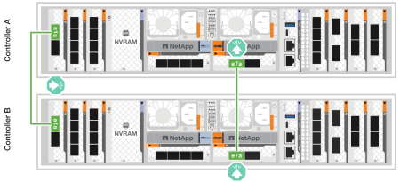
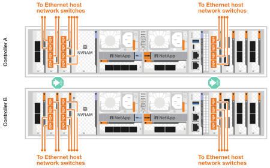
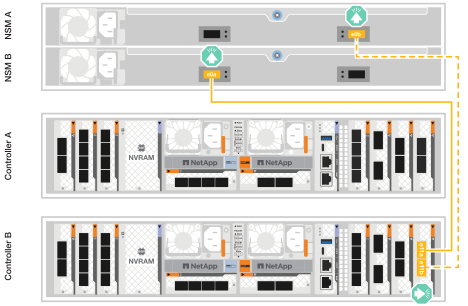

= 连接硬件- AFF A1K
:allow-uri-read: 
:icons: font
:imagesdir: ../media/

[role="lead"]
为AFF A1K存储系统安装机架硬件后、请安装控制器的网络缆线、并在控制器和存储架之间连接缆线。

.开始之前
检查布线图中的图示箭头、了解电缆连接器推拉卡舌的正确方向。

image::../media/drw_cable_pull_tab_direction_ieops-1699.svg[电缆推拉卡舌方向示例]

* 插入连接器时、您应感觉到它卡入到位；如果您没有感觉到它卡入到位、请将其卸下、将电缆头翻转并重试。
* 如果要连接到光纤交换机、请先将小型可插拔(Small form-纤 巧型可插拔、SFP)收发器插入控制器端口、然后再使用缆线连接到该端口。

== 第1步：将存储控制器连接到网络

将存储控制器连接到主机网络。

.开始之前
有关将存储系统连接到交换机的信息、请与网络管理员联系。

.关于此任务
以下过程显示了常见配置。请注意、具体布线取决于为存储系统订购的组件。有关全面的配置和插槽优先级详细信息，请参见 link:https://hwu.netapp.com["NetApp Hardware Universe"^]。

[role="tabbed-block"]
====
.选项1：将控制器连接到无交换机ONTAP集群
--
将存储控制器相互连接以创建ONTAP集群连接、然后将每个控制器上的以太网端口连接到主机网络。

.步骤
. 使用集群/HA互连缆线将端口e1a连接到e1a、并将端口e7a连接到e7a。
+

NOTE: 集群互连流量和HA流量共享相同的物理端口。

+
.. 将控制器A上的端口e1a连接到控制器B上的端口e1a
.. 将控制器A上的端口e7a连接到控制器B上的端口e7a
+
*集群/HA互连缆线*

+
image::../media/oie_cable_25Gb_Ethernet_SFP28_IEOPS-1069.svg[集群HA缆线]

+

. 将以太网模块端口连接到主机网络。
+
以下是一些典型的主机网络布线示例。有关您的特定系统配置、请参见 link:https://hwu.netapp.com["NetApp Hardware Universe"^] 。

+
.. 将端口e9a和e9b连接到以太网数据网络交换机、如图所示。
+

NOTE: 为了最大程度地提高集群和HA流量的系统性能、请勿将端口e1b和e7b端口用于主机网络连接。使用单独的主机卡以最大程度地提高性能。

+
*100 GbE电缆*

+
image::../media/oie_cable_sfp_gbe_copper.png[100 Gb以太网电缆]

+
image::../media/drw_a1k_network_cabling1_ieops-1649.svg[使用缆线连接到100 Gb以太网网络]

.. 连接1025 GbE主机网络交换机。
+
*1025 GbE主机*

+
image::../media/oie_cable_sfp_gbe_copper.png[1025Gb以太网电缆]

+

. 使用1000BASE-T RJ-45缆线将控制器管理(扳手)端口连接到管理网络交换机。
+
image::../media/oie_cable_rj45.png[RJ-45电缆]

+
*1000BASE-T RJ-45电缆*

+
image::../media/drw_a1k_management_connection_ieops-1651.svg[连接到管理网络]

IMPORTANT: 请勿插入电源线。

--
.选项2：将控制器连接到有交换机ONTAP集群
--
将存储控制器连接到集群网络交换机以创建ONTAP集群连接、然后将每个控制器上的以太网端口连接到主机网络。

.步骤
. 进行以下布线连接：
+

NOTE: 集群互连流量和HA流量共享相同的物理端口。

+
.. 将控制器A上的端口e1a和控制器B上的端口e1a连接到集群网络交换机A
.. 将控制器A上的端口e7a和控制器B上的端口e7a连接到集群网络交换机B
+
*100 GbE电缆*

+
image::../media/oie_cable100_gbe_qsfp28.png[100 Gb缆线]

+
image::../media/drw_a1k_switched_cluster_cabling_ieops-1652.svg[使用缆线将集群连接到集群网络]

. 将以太网模块端口连接到主机网络。
+
以下是一些典型的主机网络布线示例。有关您的特定系统配置、请参见 link:https://hwu.netapp.com["NetApp Hardware Universe"^] 。

+
.. 将端口e9a和e9b连接到以太网数据网络交换机、如图所示。
+

NOTE: 为了最大程度地提高集群和HA流量的系统性能、请勿将端口e1b和e7b端口用于主机网络连接。使用单独的主机卡以最大程度地提高性能。

+
*100 GbE电缆*

+
image::../media/oie_cable_sfp_gbe_copper.png[100 Gb以太网电缆]

+
image::../media/drw_a1k_network_cabling1_ieops-1649.svg[使用缆线连接到100 Gb以太网网络]

.. 连接1025 GbE主机网络交换机。
+
*4端口，1025 GbE主机*

+
image::../media/oie_cable_sfp_gbe_copper.png[1025Gb以太网电缆]

+

. 使用1000BASE-T RJ-45缆线将控制器管理(扳手)端口连接到管理网络交换机。
+
image::../media/oie_cable_rj45.png[RJ-45电缆]

+
*1000BASE-T RJ-45电缆*

+
image::../media/drw_a1k_management_connection_ieops-1651.svg[连接到管理网络]

IMPORTANT: 请勿插入电源线。

--
====

== 第2步：将存储控制器连接到存储架

以下布线过程显示了如何将控制器连接到一个磁盘架和两个磁盘架。您最多可以将四个磁盘架直接连接到控制器。

[role="tabbed-block"]
====
.选项1：连接到一个NS224存储架
--
将每个控制器连接到NS224磁盘架上的NSM模块。图中显示了每个控制器的布线：控制器A的布线显示为蓝色、控制器B的布线显示为黄色。

*100 GbE QSFP28铜缆*

image::../media/oie_cable100_gbe_qsfp28.png[100 GbE QSFP28铜缆]

.步骤
. 在控制器A上、连接以下端口：
+
.. 将端口e11a连接到NSM A端口e0a。
.. 将端口e11b连接到端口NSM B端口e0b。
+
image:../media/drw_a1k_1shelf_cabling_a_ieops-1703.svg["控制器A e11a和e11b连接到一个NS224磁盘架"]

. 在控制器B上、连接以下端口：
+
.. 将端口e11a连接到NSM B端口e0a。
.. 将端口e11b连接到NSM A端口e0b。
+

--
.选项2：连接到两个NS224存储架
--
将每个控制器连接到两个NS224磁盘架上的NSM模块。图中显示了每个控制器的布线：控制器A的布线显示为蓝色、控制器B的布线显示为黄色。

*100 GbE QSFP28铜缆*

image::../media/oie_cable100_gbe_qsfp28.png[100 GbE QSFP28铜缆]

.步骤
. 在控制器A上、连接以下端口：
+
.. 将端口e11a连接到磁盘架1 NSM A端口e0a。
.. 将端口e11b连接到磁盘架2 NSM B端口e0b。
.. 将端口E10A连接到磁盘架2 NSM A端口e0a。
.. 将端口e10b连接到磁盘架1 NSM A端口e0b。
+
image:../media/drw_a1k_2shelf_cabling_a_ieops-1705.svg["控制器A的控制器到磁盘架连接"]

. 在控制器B上、连接以下端口：
+
.. 将端口e11a连接到磁盘架1 NSM B端口e0a。
.. 将端口e11b连接到磁盘架2 NSM A端口e0b。
.. 将端口E10A连接到磁盘架2 NSM B端口e0a。
.. 将端口e10b连接到磁盘架1 NSM A端口e0b。
+
image:../media/drw_a1k_2shelf_cabling_b_ieops-1706.svg["控制器B的控制器到磁盘架连接"]

--
====
.下一步是什么？
为AFF A1K系统的硬件布线后，您可以link:install-power-hardware.html["启动AFF A1K存储系统"]。
