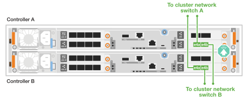

= 为硬件AFF A20、AFF A30和AFF A50布线
:allow-uri-read: 
:icons: font
:imagesdir: ../media/

[role="lead"]
安装AFF A20、AFF A30或AFF A50存储系统硬件后、使用缆线将控制器连接到网络和磁盘架。

.开始之前
有关将存储系统连接到网络交换机的信息、请与网络管理员联系。

.关于此任务
* 布线图中的箭头图标显示了将连接器插入端口时电缆连接器推拉卡舌的正确方向(向上或向下)。
+
插入连接器时、您应感觉到连接器卡入到位；如果您不觉得连接器卡嗒声、请将其卸下、然后将其翻转并重试。

+
image:../media/drw_cable_pull_tab_direction_ieops-1699.svg["电缆拉片方向"]

* 如果使用缆线连接到光纤交换机、请先将光纤收发器插入控制器端口、然后再使用缆线连接到交换机端口。

== 第1步：为集群/HA连接布线

创建ONTAP集群连接。对于无交换机集群、请将控制器相互连接。对于有交换机集群、将控制器连接到集群网络交换机。

[NOTE]
====
集群/HA 布线示例展示了常见的配置。

如果在此处未看到您的配置、请访问link:https://hwu.netapp.com["NetApp Hardware Universe"^]以获取全面的配置和插槽优先级信息、以便为存储系统布线。

====
[role="tabbed-block"]
====
.无交换机集群布线
--
.具有两个双端口40/100 GbE I/O模块的AFF A30或AFF A50
[%collapsible]
=====
.步骤
. 为集群/HA互连连接布线：
+

NOTE: 集群互连流量和HA流量共享相同的物理端口(位于插槽2和4的I/O模块上)。端口为40/100 GbE。

+
.. 使用缆线将控制器A端口E2A连接到控制器B端口E2A。
.. 使用缆线将控制器A端口e4a连接到控制器B端口e4a。
+

NOTE: I/O模块端口e2b和e4b未使用、可用于主机网络连接。

+
*100 GbE集群/HA互连缆线*

+
image::../media/oie_cable100_gbe_qsfp28.png[集群HA 100 GbE缆线]

+
image::../media/drw_isi_a30-50_switchless_2p_100gbe_2card_cabling_ieops-2011.svg[使用两个100GbE IO模块的A30和A50无交换机集群布线图]

=====
.带有一个双端口40/100 GbE I/O模块的AFF A30或AFF A50
[%collapsible]
=====
.步骤
. 为集群/HA互连连接布线：
+

NOTE: 集群互连流量和HA流量共享相同的物理端口(位于插槽4中的I/O模块上)。端口为40/100 GbE。

+
.. 使用缆线将控制器A端口e4a连接到控制器B端口e4a。
.. 使用缆线将控制器A端口e4b连接到控制器B端口e4b。
+
*100 GbE集群/HA互连缆线*

+
image::../media/oie_cable100_gbe_qsfp28.png[集群HA 100 GbE缆线]

+
image::../media/drw_isi_a30-50_switchless_2p_100gbe_1card_cabling_ieops-1925.svg[使用一个100GbE IO模块的A30和A50无交换机集群布线图]

=====
.带有一个双端口1025 GbE I/O模块的AFF A20
[%collapsible]
=====
.步骤
. 为集群/HA互连连接布线：
+

NOTE: 集群互连流量和HA流量共享相同的物理端口(位于插槽4中的I/O模块上)。端口为1025 GbE。

+
.. 使用缆线将控制器A端口e4a连接到控制器B端口e4a。
.. 使用缆线将控制器A端口e4b连接到控制器B端口e4b。
+
*25 GbE集群/HA互连缆线*

+
image:../media/oie_cable_sfp_gbe_copper.png["GbE SFP铜缆连接器"]

+
image::../media/drw_isi_a20_switchless_2p_25gbe_cabling_ieops-2018.svg[使用一个25 GbE IO模块的2020无交换机集群布线图]

=====
--
.Switched cluster cabling
--
.具有两个双端口40/100 GbE I/O模块的AFF A30或AFF A50
[%collapsible]
=====
.步骤
. 为集群/HA互连连接布线：
+

NOTE: 集群互连流量和HA流量共享相同的物理端口(位于插槽2和4的I/O模块上)。端口为40/100 GbE。

+
.. 使用缆线将控制器A端口e4a连接到集群网络交换机A
.. 使用缆线将控制器A端口E2A连接到集群网络交换机B
.. 使用缆线将控制器B端口e4a连接到集群网络交换机A
.. 使用缆线将控制器B端口E2A连接到集群网络交换机B
+

NOTE: I/O模块端口e2b和e4b未使用、可用于主机网络连接。

+
*40/100 GbE集群/HA互连缆线*

+
image::../media/oie_cable100_gbe_qsfp28.png[集群HA 40/100 GbE缆线]

+
image::../media/drw_isi_a30-50_switched_2p_100gbe_2card_cabling_ieops-2013.svg[使用两个100GbE IO模块的A30和A50交换集群布线图]

=====
.带有一个双端口40/100 GbE I/O模块的AFF A30或AFF A50
[%collapsible]
=====
.步骤
. 使用缆线将控制器连接到集群网络交换机：
+

NOTE: 集群互连流量和HA流量共享相同的物理端口(位于插槽4中的I/O模块上)。端口为40/100 GbE。

+
.. 使用缆线将控制器A端口e4a连接到集群网络交换机A
.. 使用缆线将控制器A端口e4b连接到集群网络交换机B
.. 使用缆线将控制器B端口e4a连接到集群网络交换机A
.. 使用缆线将控制器B端口e4b连接到集群网络交换机B
+
*40/100 GbE集群/HA互连缆线*

+
image::../media/oie_cable100_gbe_qsfp28.png[集群HA 40/100 GbE缆线]

+
image::../media/drw_isi_a30-50_2p_100gbe_1card_switched_cabling_ieops-1926.svg[使用缆线将集群连接到集群网络]

=====
.带有一个双端口1025 GbE I/O模块的AFF A20
[%collapsible]
=====
. 使用缆线将控制器连接到集群网络交换机：
+

NOTE: 集群互连流量和HA流量共享相同的物理端口(位于插槽4中的I/O模块上)。端口为1025 GbE。

+
.. 使用缆线将控制器A端口e4a连接到集群网络交换机A
.. 使用缆线将控制器A端口e4b连接到集群网络交换机B
.. 使用缆线将控制器B端口e4a连接到集群网络交换机A
.. 使用缆线将控制器B端口e4b连接到集群网络交换机B
+
*1025 GbE集群/HA互连缆线*

+
image:../media/oie_cable_sfp_gbe_copper.png["GbE SFP铜缆连接器"]

+

=====
--
====

== 第2步：为主机网络连接布线

使用缆线将控制器连接到以太网或FC主机网络。

[NOTE]
====
主机网络布线示例展示了常见的配置。

如果在此处未看到您的配置、请访问link:https://hwu.netapp.com["NetApp Hardware Universe"^]以获取全面的配置和插槽优先级信息、以便为存储系统布线。

====
[role="tabbed-block"]
====
.以太网主机布线
--
.具有两个双端口40/100 GbE I/O模块的AFF A30或AFF A50
[%collapsible]
=====
.步骤
. 在每个控制器上、使用缆线将端口e2b和e4b连接到以太网主机网络交换机。
+

NOTE: 插槽2和4中I/O模块上的端口为40/100 GbE (主机连接为40/100 GbE)。

+
*40/100 GbE缆线*

+
image::../media/oie_cable_sfp_gbe_copper.png[40/100 GB电缆]

+
image::../media/drw_isi_a30-50_host_2p_40-100gbe_2card_cabling_ieops-2014.svg[使用缆线连接到40/100GbE以太网主机网络交换机]

=====
.带有一个4端口1025 GbE I/O模块的AFF A20、A30或AFF A50
[%collapsible]
=====
.步骤
. 在每个控制器上、使用缆线将端口e2a、e2b、e2C和e2d连接到以太网主机网络交换机。
+
*1025 GbE缆线*

+
image:../media/oie_cable_sfp_gbe_copper.png["GbE SFP铜缆连接器"]

+
image::../media/drw_isi_a30-50_host_2p_40-100gbe_1card_cabling_ieops-1923.svg[使用缆线连接到40/100GbE以太网主机网络交换机]

=====
--
.FC主机布线
--
.带有一个4端口64 Gb/秒FC I/O模块的AFF A20、A30或AFF A50
[%collapsible]
=====
.步骤
. 在每个控制器上、使用缆线将端口1a、1b、1c和1d连接到FC主机网络交换机。
+
*64 Gb/秒FC缆线*

+
image:../media/oie_cable_sfp_gbe_copper.png["64 Gb光纤信道电缆"]

+
image::../media/drw_isi_a30-50_4p_64gb_fc_1card_cabling_ieops-1924.svg[连接到64 GB FC主机网络交换机的缆线]

=====
--
====

== 第3步：为管理网络连接布线

使用缆线将控制器连接到管理网络。

. 使用缆线将每个控制器上的管理(扳手)端口连接到管理网络交换机。
+
*1000BASE-T RJ-45电缆*

+
image::../media/oie_cable_rj45.png[RJ-45电缆]

+
image::../media/drw_isi_g_wrench_cabling_ieops-1928.svg[连接到管理网络]

IMPORTANT: 请勿插入电源线。

== 第4步：为磁盘架连接布线

此过程介绍如何使用缆线将控制器连接到一个NS224磁盘架。

.关于此任务
* 有关存储系统和所有布线选项(例如光纤和交换机连接)支持的最大磁盘架数量，请参见link:https://hwu.netapp.com["NetApp Hardware Universe"^]。
* NS224 机架布线流程中显示的是 NSM100B 模块，而不是 NSM100 模块。无论使用哪种类型的 NSM 模块，布线流程均相同，只是端口名称不同：
+
** NSM100B 模块使用插槽 1 中 I/O 模块上的端口 e1a 和 e1b。
** NSM100 模块使用内置（板载）端口 e0a 和 e0b。

* 使用存储系统附带的存储电缆将每个控制器连接到 NS224 架上的每个 NSM 模块，存储电缆可以是以下电缆类型：
+
*100 GbE QSFP28铜缆*

+
image::../media/oie_cable100_gbe_qsfp28.png[100 GbE QSFP28铜缆]

* 图中显示控制器A的布线为蓝色、控制器B的布线为黄色。

.步骤
. 使用缆线将控制器 A 连接到磁盘架：
+
.. 使用缆线将控制器A端口e3a连接到NSM A端口e1a。
.. 使用缆线将控制器A端口e3b连接到NSM B端口e1b。
+
image:../media/drw_isi_g_1_ns224_controller_a_cabling_ieops-1945.svg["控制器A端口e3a和e3b连接到一个NS224磁盘架"]

. Cable controller B to the shelf:
+
.. 使用缆线将控制器B端口e3a连接到NSM B端口e1a。
.. 使用缆线将控制器B端口e3b连接到NSM A端口e1b。
+
image:../media/drw_isi_g_1_ns224_controller_b_cabling_ieops-1946.svg["控制器B端口e3a和e3b连接到一个NS224磁盘架"]

.下一步是什么？
在为存储系统的硬件布线之后，您可以link:install-power-hardware.html["启动存储系统"]。
