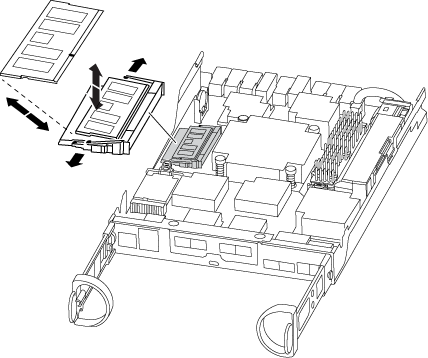

= 更换DIMM - AFF A220
:allow-uri-read: 
:icons: font
:imagesdir: ../media/

[role="lead"]
如果系统注册的可更正错误更正代码（ ECC ）数量不断增加，则必须更换控制器模块中的 DIMM ；否则会导致系统崩溃。

系统中的所有其他组件必须正常运行；否则，您必须联系技术支持。

您必须将故障组件更换为从提供商处收到的替代 FRU 组件。

== 第 1 步：关闭受损控制器

要关闭受损控制器，您必须确定控制器的状态，并在必要时接管控制器，以便运行正常的控制器继续从受损控制器存储提供数据。

.关于此任务
* 如果您使用的是NetApp存储加密、则必须按照中的说明重置MSID link:https://docs.netapp.com/us-en/ontap/encryption-at-rest/return-seds-unprotected-mode-task.html["将SED恢复到未受保护的模式"]。
* 如果您使用的是SAN系统、则必须已检查事件消息  `cluster kernel-service show`)。。 `cluster kernel-service show` command可显示节点名称、该节点的仲裁状态、该节点的可用性状态以及该节点的运行状态。
+
每个 SCSI 刀片式服务器进程应与集群中的其他节点保持仲裁关系。在继续更换之前，必须先解决所有问题。

* If you have a cluster with more than two nodes, it must be in quorum.如果集群未达到仲裁或运行状况良好的控制器在资格和运行状况方面显示false、则必须在关闭受损控制器之前更正问题描述 ；请参见 link:https://docs.netapp.com/us-en/ontap/system-admin/synchronize-node-cluster-task.html?q=Quorum["将节点与集群同步"^]。

.步骤
. 如果启用了 AutoSupport ，则通过调用 AutoSupport 消息禁止自动创建案例： `ssystem node AutoSupport invoke -node * -type all -message MAINT=number_of_hours_downh`
+
以下AutoSupport 消息禁止自动创建案例两小时： `cluster1:> system node autosupport invoke -node * -type all -message MAINT=2h`

. 从运行正常的控制器的控制台禁用自动交还： `storage failover modify – node local -auto-giveback false`
+

NOTE: 当您看到_Do you want to disable auto-giveback？_时、输入`y`。

. 将受损控制器显示为 LOADER 提示符：
+
[cols="1,2"]
|===
| 如果受损控制器显示 ... | 那么 ... 

 a| 
LOADER 提示符
 a| 
转至 "Remove controller module" 。

 a| 
正在等待交还
 a| 
按 Ctrl-C ，然后在出现提示时回答 `y` 。

 a| 
系统提示符或密码提示符
 a| 
从运行正常的控制器接管或暂停受损的控制器： `storage failover takeover -ofnode _impaired_node_name_`

当受损控制器显示 Waiting for giveback... 时，按 Ctrl-C ，然后回答 `y` 。

|===
. 如果系统机箱中只有一个控制器模块，请关闭电源，然后从电源中拔下受损控制器的电源线。

== 第 2 步：卸下控制器模块

要访问控制器内部的组件，您必须先从系统中卸下控制器模块，然后再卸下控制器模块上的盖板。

.步骤
. 如果您尚未接地，请正确接地。
. 松开将缆线绑在缆线管理设备上的钩环带，然后从控制器模块上拔下系统缆线和 SFP （如果需要），并跟踪缆线的连接位置。
+
将缆线留在缆线管理设备中，以便在重新安装缆线管理设备时，缆线排列有序。

. 从控制器模块的左右两侧卸下缆线管理设备并将其放在一旁。
+
image::../media/drw_25xx_cable_management_arm.png[DRW 25xx 缆线管理臂]

. 按压凸轮把手上的闩锁，直到其释放为止，完全打开凸轮把手以从中板释放控制器模块，然后用两只手将控制器模块拉出机箱。
+
image::../media/drw_2240_x_opening_cam_latch.png[DRW 2240 x 打开凸轮闩锁]

. 将控制器模块翻转，将其放在平稳的表面上。
. 滑动蓝色卡舌以释放盖板，然后向上翻盖并打开，从而打开盖板。
+
image::../media/drw_2600_opening_pcm_cover.png[DRW 2600 打开 PCM 盖板]

== 第 3 步：更换 DIMM

要更换 DIMM ，请在控制器中找到它们，然后按照特定步骤顺序进行操作。

如果要更换 DIMM ，则需要在从控制器模块中拔下 NVMEM 电池后将其卸下。

.步骤
. 如果您尚未接地，请正确接地。
. 检查控制器模块背面的NVMEM LED。
+
在更换系统组件之前，您必须完全关闭系统，以避免丢失非易失性内存（ NVMEM ）中未写入的数据。此 LED 位于控制器模块的背面。查找以下图标：

+
image::../media/drw_hw_nvram_icon.png[DRW 硬件 NVRAM 图标]

. 如果 NVMEM LED 未闪烁，则 NVMEM 中没有任何内容；您可以跳过以下步骤并继续执行此操作步骤中的下一项任务。
. 如果 NVMEM LED 闪烁，则 NVMEM 中存在数据，您必须断开电池以清除内存：
+
.. 找到电池，按下电池插头正面的夹子以从插头插槽中释放锁定夹，然后从插槽中拔下电池缆线。
+
image::../media/drw_2600_nvmem_battery_unplug.png[DRW 2600 nvmem 电池已拔下]

.. 确认 NVMEM LED 不再亮起。
.. 重新连接电池连接器。

. 返回到 <<第 3 步：更换 DIMM>> 在此操作步骤 中重新检查NVMEM LED。
. 找到控制器模块上的 DIMM 。
. 记下插槽中 DIMM 的方向，以便可以按正确的方向插入更换用的 DIMM 。
. 缓慢推动 DIMM 两侧的两个 DIMM 弹出卡舌，将 DIMM 从插槽中弹出，然后将 DIMM 滑出插槽。
+

NOTE: 小心握住 DIMM 的边缘，以避免对 DIMM 电路板上的组件施加压力。

+
系统 DIMM 的数量和位置取决于系统型号。

+
下图显示了系统 DIMM 的位置：

+

. 从防静电运输袋中取出更换用的 DIMM ，拿住 DIMM 的边角并将其与插槽对齐。
+
DIMM 插脚之间的缺口应与插槽中的突起对齐。

. 确保连接器上的 DIMM 弹出器卡舌处于打开位置，然后将 DIMM 垂直插入插槽。
+
DIMM 紧紧固定在插槽中，但应很容易插入。如果没有，请将 DIMM 与插槽重新对齐并重新插入。

+

NOTE: 目视检查 DIMM ，确认其均匀对齐并完全插入插槽。

. 小心而稳固地推动 DIMM 的上边缘，直到弹出器卡舌卡入到位，卡入到位于 DIMM 两端的缺口上。
. 找到 NVMEM 电池插头插槽，然后挤压电池缆线插头正面的夹子，将其插入插槽中。
+
确保插头锁定在控制器模块上。

. 合上控制器模块外盖。

== 第 4 步：重新安装控制器模块

更换控制器模块中的组件后，将其重新安装到机箱中。

.步骤
. 如果您尚未接地，请正确接地。
. 如果您尚未更换控制器模块上的外盖，请进行更换。
. 将控制器模块的末端与机箱中的开口对齐，然后将控制器模块轻轻推入系统的一半。
+

NOTE: 请勿将控制器模块完全插入机箱中，除非系统指示您这样做。

. 根据需要重新对系统进行布线。
+
如果您已卸下介质转换器（ QSFP 或 SFP ），请记得在使用光缆时重新安装它们。

. 完成控制器模块的重新安装：
+
[cols="1,2"]
|===
| 如果您的系统位于 ... | 然后执行以下步骤 ... 

 a| 
HA 对
 a| 
控制器模块一旦完全固定在机箱中，就会开始启动。

.. 在凸轮把手处于打开位置的情况下，用力推入控制器模块，直到它与中板并完全就位，然后将凸轮把手合上到锁定位置。
+

NOTE: 将控制器模块滑入机箱时，请勿用力过大，以免损坏连接器。

+
控制器一旦固定在机箱中，就会开始启动。

.. 如果尚未重新安装缆线管理设备，请重新安装该设备。
.. 使用钩环带将缆线绑定到缆线管理设备。

 a| 
一种独立配置
 a| 
.. 在凸轮把手处于打开位置的情况下，用力推入控制器模块，直到它与中板并完全就位，然后将凸轮把手合上到锁定位置。
+

NOTE: 将控制器模块滑入机箱时，请勿用力过大，以免损坏连接器。

.. 如果尚未重新安装缆线管理设备，请重新安装该设备。
.. 使用钩环带将缆线绑定到缆线管理设备。
.. 将电源线重新连接到电源和电源，然后打开电源以启动启动过程。

|===

== 第 5 步：切回双节点 MetroCluster 配置中的聚合

在双节点 MetroCluster 配置中完成 FRU 更换后，您可以执行 MetroCluster 切回操作。这样会将配置恢复到其正常运行状态，以前受损站点上的 sync-source Storage Virtual Machine （ SVM ）现在处于活动状态，并从本地磁盘池提供数据。

此任务仅限适用场景双节点 MetroCluster 配置。

.步骤
. 验证所有节点是否处于 `enabled` 状态： `MetroCluster node show`
+
[listing]
----
cluster_B::>  metrocluster node show

DR                           Configuration  DR
Group Cluster Node           State          Mirroring Mode
----- ------- -------------- -------------- --------- --------------------
1     cluster_A
              controller_A_1 configured     enabled   heal roots completed
      cluster_B
              controller_B_1 configured     enabled   waiting for switchback recovery
2 entries were displayed.
----
. 验证所有 SVM 上的重新同步是否已完成： `MetroCluster SVM show`
. 验证修复操作正在执行的任何自动 LIF 迁移是否已成功完成： `MetroCluster check lif show`
. 在运行正常的集群中的任何节点上使用 `MetroCluster switchback` 命令执行切回。
. 验证切回操作是否已完成： `MetroCluster show`
+
当集群处于 `waiting for-switchback` 状态时，切回操作仍在运行：

+
[listing]
----
cluster_B::> metrocluster show
Cluster              Configuration State    Mode
--------------------	------------------- 	---------
 Local: cluster_B configured       	switchover
Remote: cluster_A configured       	waiting-for-switchback
----
+
当集群处于 `normal` 状态时，切回操作完成。：

+
[listing]
----
cluster_B::> metrocluster show
Cluster              Configuration State    Mode
--------------------	------------------- 	---------
 Local: cluster_B configured      		normal
Remote: cluster_A configured      		normal
----
+
如果切回需要很长时间才能完成，您可以使用 `MetroCluster config-replication resync-status show` 命令检查正在进行的基线的状态。

. 重新建立任何 SnapMirror 或 SnapVault 配置。

== 第 6 步：将故障部件退回 NetApp

按照套件随附的 RMA 说明将故障部件退回 NetApp 。请参见 https://mysupport.netapp.com/site/info/rma["部件退回和放大器；更换"] 第页，了解更多信息。
