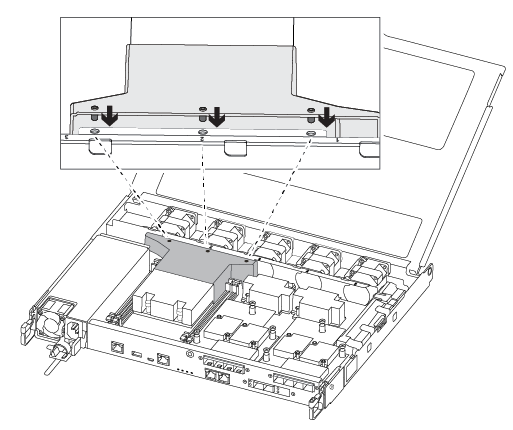

= 更换 DIMM - AFF A250
:allow-uri-read: 
:icons: font
:imagesdir: ../media/

[role="lead"]
如果存储系统遇到错误(例如、基于运行状况监控器警报的CECC (可更正错误更正代码)错误过多或不可更正的ECC错误)、通常是由于单个DIMM故障导致存储系统无法启动ONTAP而导致的、则必须更换控制器中的DIMM。

.关于此任务
系统中的所有其他组件必须正常运行；否则，您必须联系技术支持。

您必须将故障组件更换为从提供商处收到的替代 FRU 组件。

== 第 1 步：关闭受损控制器

要关闭受损控制器，您必须确定控制器的状态，并在必要时接管控制器，以便运行正常的控制器继续从受损控制器存储提供数据。

.关于此任务
* 如果您使用的是SAN系统，则必须已检查受损控制器SCSI刀片的事件消息  `cluster kernel-service show`。 `cluster kernel-service show`命令(在priv高级模式下)可显示该节点的节点名称link:https://docs.netapp.com/us-en/ontap/system-admin/display-nodes-cluster-task.html["仲裁状态"]、该节点的可用性状态以及该节点的运行状态。
+
每个 SCSI 刀片式服务器进程应与集群中的其他节点保持仲裁关系。在继续更换之前，必须先解决所有问题。

* If you have a cluster with more than two nodes, it must be in quorum.如果集群未达到仲裁或运行状况良好的控制器在资格和运行状况方面显示false、则必须在关闭受损控制器之前更正问题描述 ；请参见 link:https://docs.netapp.com/us-en/ontap/system-admin/synchronize-node-cluster-task.html?q=Quorum["将节点与集群同步"^]。

.步骤
. 如果启用了AutoSupport 、则通过调用AutoSupport 消息禁止自动创建案例：
+
`system node autosupport invoke -node * -type all -message MAINT=<# of hours>h`

+
以下AutoSupport 消息禁止自动创建案例两小时：

+
`cluster1:> system node autosupport invoke -node * -type all -message MAINT=2h`

. 禁用自动交还：
+
.. 从健康控制器的控制台输入以下命令：
+
`storage failover modify -node _impaired_node_name_ -auto-giveback false`

.. 进入 `y`当您看到提示“您是否要禁用自动回馈？”时

. 将受损控制器显示为 LOADER 提示符：
+
[cols="1,2"]
|===
| 如果受损控制器显示 ... | 那么 ... 

 a| 
LOADER 提示符
 a| 
转至下一步。

 a| 
正在等待交还
 a| 
按 Ctrl-C ，然后在出现提示时回答 `y` 。

 a| 
系统提示符或密码提示符
 a| 
从运行正常的控制器接管或暂停受损控制器：

`storage failover takeover -ofnode _impaired_node_name_ -halt _true_`

-halt true参数将进入Loader提示符。

|===

== 第 2 步：卸下控制器模块

更换控制器模块内部的组件时，必须从机箱中卸下控制器模块。

请确保为这些缆线贴上标签，以便您知道这些缆线来自何处。

. 如果您尚未接地，请正确接地。
. 从源拔下控制器模块电源。
. 释放电源线固定器，然后从电源中拔下缆线。
. 将前掌插入控制器模块两侧的锁定装置中，用拇指按下控制杆，然后将控制器轻轻拉出机箱几英寸。
+

NOTE: 如果在卸下控制器模块时遇到困难，请将食指从内部穿过指孔（通过跨越臂）。

+
image::../media/drw_a250_pcm_remove_install.png[打开闩锁装置]

+
[cols="1,3"]
|===

 a| 
image:../media/icon_round_1.png["标注编号1"]
| 控制杆 

 a| 
image:../media/icon_round_2.png["标注编号2"]
 a| 
锁定机制

|===
. 用双手抓住控制器模块两侧，将其轻轻拉出机箱，并将其放在平稳的表面上。
. 逆时针转动控制器模块正面的翼形螺钉，然后打开控制器模块盖板。
+
image::../media/drw_a250_open_controller_module_cover.png[打开控制器模块护盖]

+
[cols="1,3"]
|===

 a| 
image:../media/icon_round_1.png["标注编号1"]
| 翼形螺钉 

 a| 
image:../media/icon_round_2.png["标注编号2"]
 a| 
控制器模块盖板。

|===
. 取下通风管盖。
+
image::../media/drw_a250_remove_airduct_cover.png[提起空气管道盖]

== 第 3 步：更换 DIMM

要更换DIMM、您必须使用通风管顶部的DIMM映射标签在控制器模块中找到该DIMM、然后按照特定步骤顺序进行更换。

使用以下视频或表格中的步骤更换 DIMM ：

.动画-更换DIMM
video::fa6b8107-86fb-4332-aa57-ac5b01605e52[panopto]
. 更换控制器模块上损坏的 DIMM 。
+
DIMM 位于主板上的插槽 3 或 1 中。插槽 2 和 4 为空。请勿尝试在这些插槽中安装 DIMM 。

+
image::../media/drw_a250_dimm_replace.png[更换DIMM]

. 记下插槽中 DIMM 的方向，以便可以按正确的方向插入更换用的 DIMM 。
. 缓慢地将 DIMM 两侧的 DIMM 弹出卡舌分开，然后将 DIMM 滑出插槽。
. 使连接器上的 DIMM 弹出器卡舌保持打开状态。
. 从防静电运输袋中取出更换用的 DIMM ，拿住 DIMM 的边角并将其与插槽对齐。
+

NOTE: 握住 DIMM 的边缘，以避免对 DIMM 电路板上的组件施加压力。

. 将更换用的 DIMM 垂直插入插槽。
+
DIMM 紧紧固定在插槽中。如果没有，请重新插入 DIMM ，使其与插槽重新对齐。

. 目视检查 DIMM ，确认其均匀对齐并完全插入插槽。

== 第 4 步：安装控制器模块

更换控制器模块中的组件后、必须将控制器模块重新安装到机箱中、然后启动它。

您可以使用下图或写入的步骤在机箱中安装替代控制器模块。

. 如果尚未安装此通风管，请安装此通风管。
+

. 合上控制器模块盖并拧紧翼形螺钉。
+
image::../media/drw_a250_close_controller_module_cover.png[合上控制器模块护盖]

+
[cols="1,3"]
|===

 a| 
image:../media/icon_round_1.png["标注编号1"]
| 控制器模块盖板 

 a| 
image:../media/icon_round_2.png["标注编号2"]
 a| 
翼形螺钉

|===
. 将控制器模块插入机箱：
+
.. 确保锁定机制臂锁定在完全展开的位置。
.. 用双手将控制器模块对齐并轻轻滑入锁定装置臂，直到其停止。
.. 将食指从锁定装置内侧的指孔中穿过。
.. 用拇指向下按压闩锁装置顶部的橙色卡舌，然后将控制器模块轻轻推至停止位置上方。
.. 从锁定机制顶部释放拇指，然后继续推动，直到锁定机制卡入到位。
+
控制器模块应完全插入，并与机箱边缘平齐。

. 将电源线插入电源、重新安装电源线锁环、然后将电源连接到电源。
+
电源恢复后、控制器模块将立即启动。Be prepared to interrupt the boot process.

. 根据需要重新对系统进行布线。
. 交还控制器的存储，使其恢复正常运行： `storage failover giveback -ofnode _impaired_node_name_`
. 如果已禁用自动交还，请重新启用它： `storage failover modify -node local -auto-giveback true`

== 第 5 步：将故障部件退回 NetApp

按照套件随附的 RMA 说明将故障部件退回 NetApp 。 https://mysupport.netapp.com/site/info/rma["部件退回和更换"]有关详细信息、请参见页面。
