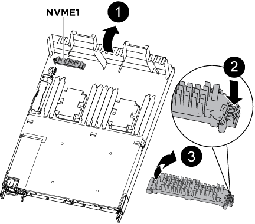
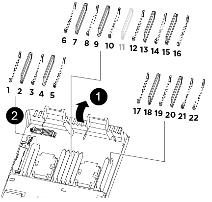

= 更换控制器模块— AFF A320
:icons: font
:imagesdir: ../media/

[role="lead"]
要更换控制器模块硬件，您必须卸下受损节点，将 FRU 组件移至更换用的控制器模块，在机箱中安装更换用的控制器模块，然后将系统启动至维护模式。

== 第 1 步：卸下控制器模块

要访问控制器模块内部的组件，必须从机箱中卸下控制器模块。

您可以使用以下映像或写入的步骤从机箱中删除控制器模块。

下图显示了如何从受损控制器模块中卸下缆线和缆线管理臂：

image::../media/drw_a320_controller_cable_unplug_animated_gif.png[DRW A320 控制器缆线拔下动画 gif]

下图显示了如何从机箱中卸下受损的控制器模块：

image::../media/drw_a320_controller_remove_animated_gif.png[DRW A320 控制器删除动画 gif]

. 如果您尚未接地，请正确接地。
. 从电源拔下控制器模块电源。
. 松开将缆线绑在缆线管理设备上的钩环带，然后从控制器模块上拔下系统缆线和 SFP （如果需要），并跟踪缆线的连接位置。
+
将缆线留在缆线管理设备中，以便在重新安装缆线管理设备时，缆线排列有序。

. 从控制器模块的左右两侧卸下缆线管理设备并将其放在一旁。
. 从机箱中卸下控制器模块：
+
.. 将前掌插入控制器模块两侧的锁定装置。
.. 向下按压闩锁装置顶部的橙色卡舌，直到其脱离机箱上的闩锁销。
+
闩锁机制挂钩应接近垂直，并且应远离机箱销。

.. 将控制器模块轻轻向您的方向拉几英寸，以便抓住控制器模块两侧。
.. 用双手将控制器模块轻轻拉出机箱，并将其放在平稳的表面上。

== 第 2 步：移动电源

更换控制器模块时，必须将受损控制器模块中的电源移至更换控制器模块。

. 旋转凸轮把手，以便在按下蓝色锁定卡舌的同时，可以将电源从控制器模块中拉出。
+

CAUTION: 电源不足。从控制器模块中取出时，请始终用双手托住它，以免它突然从控制器模块中自由转动并给您造成损害。

. 将电源移至新控制器模块，然后安装它。
. 用双手支撑电源边缘并将其与控制器模块的开口对齐，然后将电源轻轻推入控制器模块，直到锁定卡舌卡入到位。
+
电源只能与内部连接器正确接合并单向锁定到位。

+

NOTE: 为避免损坏内部连接器，请勿在将电源滑入系统时用力过大。

== 第 3 步：移动 NVDIMM 电池

要将 NVDIMM 电池从受损控制器模块移至更换控制器模块，您必须执行一系列特定步骤。

您可以使用下图或写入的步骤将 NVDIMM 电池从受损的控制器模块移至替代控制器模块。

image::../media/drw_a320_nvbat_move_animated_gif.png[DRW A320 nvbat move 动画 gif]

. 在控制器模块中找到 NVDIMM 电池。
. 找到电池插头，然后挤压电池插头正面的夹子，将插头从插槽中释放，然后从插槽中拔下电池缆线。
. 抓住电池并按下标记为推送的蓝色锁定卡舌，然后将电池从电池架和控制器模块中提出。
. 将电池移至更换用的控制器模块。
. 将电池模块与电池的开口对齐，然后将电池轻轻推入插槽，直至其锁定到位。
+

NOTE: 除非系统指示，否则请勿将电池缆线重新插入主板。

== 第 4 步：移动启动介质

您必须找到启动介质，然后按照说明将其从受损的控制器模块中取出并将其插入替代控制器模块。

您可以使用下图或写入的步骤将启动介质从受损的控制器模块移至替代控制器模块。

. 打开通风管，并使用下图或控制器模块上的 FRU 示意图找到启动介质：
. 从控制器模块中找到并取出启动介质：
+
.. 按启动介质末端的蓝色按钮，直到启动介质上的边缘清除蓝色按钮。
.. 将启动介质向上旋转，然后将启动介质从插槽中轻轻拉出。

. 将启动介质移至新控制器模块，将启动介质的边缘与插槽外壳对齐，然后将其轻轻推入插槽。
. 检查启动介质，确保其完全固定在插槽中。
+
如有必要，请取出启动介质并将其重新插入插槽。

. 将启动介质锁定到位：
+
.. 将启动介质向下旋转到主板。
.. 将一根手指放在启动介质的末端，然后按下启动介质的一端，以接合蓝色锁定按钮。
.. 向下推启动介质时，提起蓝色锁定按钮以将启动介质锁定到位。

== 第 5 步：移动 DIMM

您需要找到 DIMM ，然后将其从受损的控制器模块移至替代控制器模块。

您必须准备好新的控制器模块，以便可以将 DIMM 直接从受损的控制器模块移至更换用的控制器模块中的相应插槽。

您可以使用以下插图或写入的步骤将 DIMM 从受损的控制器模块移至更换用的控制器模块。

image::../media/drw_a320_dimm_move_animated_gif.png[DRW A320 DIMM 移动动画 gif]

. 找到控制器模块上的 DIMM 。
+

+
|===

 a| 
image:../media/legend_icon_01.png[""]
| 通风管 

 a| 
image:../media/legend_icon_02.png[""]
 a| 
** 系统 DIMM 插槽： 2 ， 4 ， 7 ， 9 ， 13 ， 15 ， 18 和 20
** NVDIMM 插槽： 11
+

NOTE: NVDIMM 与系统 DIMM 的外观截然不同。

|===
. 记下插槽中 DIMM 的方向，以便可以按正确的方向将 DIMM 插入更换用的控制器模块中。
. 验证 NVDIMM 电池是否未插入新控制器模块。
. 将受损控制器模块中的 DIMM 移至替代控制器模块：
+

NOTE: 确保将每个 DIMM 安装到受损控制器模块中其占用的同一插槽中。

+
.. 缓慢推动 DIMM 两侧的 DIMM 弹出卡舌，将 DIMM 从插槽中弹出，然后将 DIMM 滑出插槽。
+

NOTE: 小心握住 DIMM 的边缘，以避免对 DIMM 电路板上的组件施加压力。

.. 在更换用的控制器模块上找到相应的 DIMM 插槽。
.. 确保 DIMM 插槽上的 DIMM 弹出卡舌处于打开位置，然后将 DIMM 垂直插入插槽。
+
DIMM 紧紧固定在插槽中，但应易于插入。如果没有，请将 DIMM 与插槽重新对齐并重新插入。

.. 目视检查 DIMM ，确认其均匀对齐并完全插入插槽。
.. 对其余 DIMM 重复这些子步骤。

. 将 NVDIMM 电池插入主板。
+
确保插头锁定在控制器模块上。

== 第 6 步：移动 PCIe 提升板

您必须将安装有 PCIe 卡的 PCIe 提升板从受损控制器模块移至更换用的控制器模块。

您可以使用下图或写入的步骤将 PCIe 提升板从受损控制器模块移至更换控制器模块。

image::../media/drw_a320_pci_riser_move_animated_gif.png[DRW A320 PCI 提升板移动动画 gif]

. 拧下 PCIe 提升板上的蓝色翼形螺钉，将盖板滑向您的方向，向上旋转盖板，将其从控制器模块上取下，然后将其放在一旁。
. 从更换用的控制器模块中卸下空的提升板。
+
.. 将前掌放在竖板模块左侧的孔中，然后用拇指抓住竖板。
.. 竖直向上提起竖板并将其从托架中取出，然后将其放在一旁。
.. 对第二个提升板重复这些子步骤。

. 将受损控制器模块中的 PCIe 提升板移至替代控制器模块上的相同提升板托架：
+
.. 从受损控制器模块中卸下一个竖板，然后将其移至更换用的控制器模块。
.. 将竖板竖直向下放入托架中，使其与托架成方形，并且竖板的销滑入托架背面的导孔中。
.. 沿竖板边缘均匀向下施加压力，直至其固定到位，从而将竖板竖直向下插入插槽。
+
竖板应平稳安装，但阻力极小。如果在插槽中插入提升板时遇到明显阻力，请重新拔插托架中的提升板。

.. 对第二个提升板重复这些子步骤。
.. 重新安装 PCIe 提升板上的盖板。

== 第 7 步：安装控制器模块

将所有组件从受损控制器模块移至更换控制器模块后，您必须将更换控制器模块安装到机箱中，然后将其启动至维护模式。

您可以使用下图或写入的步骤在机箱中安装替代控制器模块。

image::../media/drw_a320_controller_install_animated_gif.png[DRW A320 控制器安装动画 gif]

. 如果尚未关闭控制器模块后部的通风管，请将盖板重新安装到 PCIe 卡上。
. 将控制器模块的末端与机箱中的开口对齐，然后将控制器模块轻轻推入系统的一半。
+

NOTE: 请勿将控制器模块完全插入机箱中，除非系统指示您这样做。

. 仅为管理和控制台端口布线，以便您可以访问系统以执行以下各节中的任务。
+

NOTE: 您将在此操作步骤中稍后将其余缆线连接到控制器模块。

. 完成控制器模块的重新安装：
+
.. 确保闩锁臂锁定在扩展位置。
.. 使用闩锁臂将控制器模块推入机箱托架，直到其停止。
.. 按住锁定机制顶部的橙色卡舌。
.. 将控制器模块轻轻推入机箱托架，直至其与机箱边缘平齐。
+

NOTE: 锁定机制臂滑入机箱。

+
控制器模块一旦完全固定在机箱中，就会开始启动。

.. 释放闩锁，将控制器模块锁定到位。
.. 已重新连接电源。
.. 如果尚未重新安装缆线管理设备，请重新安装该设备。
.. 按 `Ctrl-C` 以中断正常启动过程。

