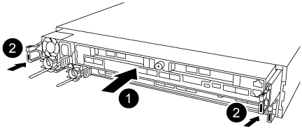

= 更换 NVDIMM 电池— AFF A320
:allow-uri-read: 
:icons: font
:imagesdir: ../media/

[role="lead"]
要更换 NVDIMM 电池，您必须卸下控制器模块，取出电池，更换电池，然后重新安装控制器模块。

系统中的所有其他组件必须正常运行；否则，您必须联系技术支持。

== 第 1 步：关闭控制器

要关闭受损控制器，您必须确定控制器的状态，并在必要时接管控制器，以便运行正常的控制器继续从受损控制器存储提供数据。

.关于此任务
* 如果您使用的是SAN系统，则必须已检查受损控制器SCSI刀片的事件消息  `cluster kernel-service show`。 `cluster kernel-service show`命令(在priv高级模式下)可显示该节点的节点名称link:https://docs.netapp.com/us-en/ontap/system-admin/display-nodes-cluster-task.html["仲裁状态"]、该节点的可用性状态以及该节点的运行状态。
+
每个 SCSI 刀片式服务器进程应与集群中的其他节点保持仲裁关系。在继续更换之前，必须先解决所有问题。

* If you have a cluster with more than two nodes, it must be in quorum.如果集群未达到仲裁或运行状况良好的控制器在资格和运行状况方面显示false、则必须在关闭受损控制器之前更正问题描述 ；请参见 link:https://docs.netapp.com/us-en/ontap/system-admin/synchronize-node-cluster-task.html?q=Quorum["将节点与集群同步"^]。

.步骤
. 如果启用了AutoSupport、则通过调用AutoSupport消息禁止自动创建案例： `system node autosupport invoke -node * -type all -message MAINT=<# of hours>h`
+
以下AutoSupport 消息禁止自动创建案例两小时： `cluster1:> system node autosupport invoke -node * -type all -message MAINT=2h`

. 从运行状况良好的控制器的控制台禁用自动交还： `storage failover modify -node local -auto-giveback false`
+

NOTE: 当您看到_Do you want to disable auto-giveback？_时、输入`y`。

. 将受损控制器显示为 LOADER 提示符：
+
[cols="1,2"]
|===
| 如果受损控制器显示 ... | 那么 ... 

 a| 
LOADER 提示符
 a| 
转至下一步。

 a| 
正在等待交还
 a| 
按 Ctrl-C ，然后在出现提示时回答 `y` 。

 a| 
系统提示符或密码提示符
 a| 
从运行正常的控制器接管或暂停受损的控制器： `storage failover takeover -ofnode _impaired_node_name_`

当受损控制器显示 Waiting for giveback... 时，按 Ctrl-C ，然后回答 `y` 。

|===

== 第 2 步：卸下控制器模块

要访问控制器模块内部的组件，必须从机箱中卸下控制器模块。

. 如果您尚未接地，请正确接地。
. 从电源拔下控制器模块电源。
. 松开将缆线绑在缆线管理设备上的钩环带，然后从控制器模块上拔下系统缆线和 SFP （如果需要），并跟踪缆线的连接位置。
+
image::../media/drw_a320_controller_cable_unplug_animated_gif.png[卸下缆线管理设备]

+
将缆线留在缆线管理设备中，以便在重新安装缆线管理设备时，缆线排列有序。

. 从控制器模块的左右两侧卸下缆线管理设备并将其放在一旁。
. 从机箱中卸下控制器模块：
+
image::../media/drw_a320_controller_remove_animated_gif.png[卸下控制器]

+
.. 将前掌插入控制器模块两侧的锁定装置。
.. 向下按压闩锁装置顶部的橙色卡舌，直到其脱离机箱上的闩锁销。

+
闩锁机制挂钩应接近垂直，并且应远离机箱销。

+
.. 将控制器模块轻轻向您的方向拉几英寸，以便抓住控制器模块两侧。
.. 用双手将控制器模块轻轻拉出机箱，并将其放在平稳的表面上。

== 第 3 步：更换 NVDIMM 电池

要更换 NVDIMM 电池，您必须从控制器模块中取出故障电池，然后将更换电池安装到控制器模块中。

image::../media/drw_a320_nvbat_move_animated_gif.png[更换NV电池]

. 打开通风管并找到 NVDIMM 电池。
. 找到电池插头，然后挤压电池插头正面的夹子，将插头从插槽中释放，然后从插槽中拔下电池缆线。
. 抓住电池并按下标记为推送的蓝色锁定卡舌，然后将电池从电池架和控制器模块中提出。
. 从包装中取出更换用电池。
. 将电池模块与电池的开口对齐，然后将电池轻轻推入插槽，直至其锁定到位。
. 将电池插头重新插入控制器模块，然后关闭通风管。

== 第 4 步：安装控制器模块

更换控制器模块中的组件后、必须将控制器模块重新安装到机箱中、然后启动它。

. 如果尚未关闭控制器模块后部的通风管，请将盖板重新安装到 PCIe 卡上。
. 将控制器模块的末端与机箱中的开口对齐，然后将控制器模块轻轻推入系统的一半。
+

+

NOTE: 请勿将控制器模块完全插入机箱中，除非系统指示您这样做。

. 仅为管理和控制台端口布线，以便您可以访问系统以执行以下各节中的任务。
+

NOTE: 您将在此操作步骤中稍后将其余缆线连接到控制器模块。

. 完成控制器模块的重新安装：
+
.. 确保闩锁臂锁定在扩展位置。
.. 使用闩锁臂将控制器模块推入机箱托架，直到其停止。
.. 按住锁定机制顶部的橙色卡舌。
.. 将控制器模块轻轻推入机箱托架，直至其与机箱边缘平齐。
+

NOTE: 锁定机制臂滑入机箱。

+
控制器模块一旦完全固定在机箱中，就会开始启动。

.. 释放闩锁，将控制器模块锁定到位。
.. 已重新连接电源。
.. 如果尚未重新安装缆线管理设备，请重新安装该设备。

== Step 5: Restore the controller module to operation

您必须重新对系统进行数据恢复、交还控制器模块、然后重新启用自动交还。

. 根据需要重新对系统进行布线。
+
如果您已卸下介质转换器（ QSFP 或 SFP ），请记得在使用光缆时重新安装它们。

. 交还控制器的存储，使其恢复正常运行： `storage failover giveback -ofnode _impaired_node_name_`
. 如果已禁用自动交还，请重新启用它： `storage failover modify -node local -auto-giveback true`

== 第 6 步：将故障部件退回 NetApp

按照套件随附的 RMA 说明将故障部件退回 NetApp 。 https://mysupport.netapp.com/site/info/rma["部件退回和更换"]有关详细信息、请参见页面。
