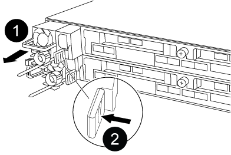

= 更换电源— AFF A320
:allow-uri-read: 
:icons: font
:imagesdir: ../media/

[role="lead"]
更换电源（ PSU ）包括断开目标 PSU 与电源的连接，拔下电源线，卸下旧 PSU 并安装替代 PSU ，然后将替代 PSU 重新连接到电源。

* 电源为冗余且可热插拔。
* 此操作步骤用于一次更换一个电源。
+

NOTE: 最好在从机箱中卸下电源后两分钟内更换电源。系统仍可正常运行，但 ONTAP 会向控制台发送有关电源降级的消息，直到更换电源为止。

* 电源可自动进行范围设置。

.步骤

. 如果您尚未接地，请正确接地。
. 根据控制台错误消息或通过电源上的 LED 确定要更换的电源。
. 断开电源：
+
.. 打开电源线固定器，然后从电源拔下电源线。
.. 从电源拔下电源线。

. 卸下电源：
+
.. 旋转凸轮把手，以便可以使用它将电源从机箱中拉出。
.. 按下蓝色锁定卡舌以从机箱中释放电源。
.. 用双手将电源从机箱中拉出，然后放在一旁。

. 用双手支撑电源边缘并将其与控制器模块的开口对齐，然后将电源轻轻推入控制器模块，直到锁定卡舌卡入到位。
+
电源只能与内部连接器正确接合并单向锁定到位。

+

NOTE: 为避免损坏内部连接器，请勿在将电源滑入系统时用力过大。

. " 旋转凸轮把手，使其与电源平齐。 "
. 重新连接电源布线：
+
.. 将电源线重新连接到电源和电源。
.. 使用电源线固定器将电源线固定到电源。

+
电源恢复供电后，状态 LED 应为绿色。

. 更换部件后，您可以按照套件随附的 RMA 说明将故障部件退回 NetApp 。请通过联系技术支持 https://mysupport.netapp.com/site/global/dashboard["NetApp 支持"]， 888-463-8277 （北美）， 00-800-44-638277 （欧洲）或 +800-800-80-800 （亚太地区）（如果您需要 RMA 编号或有关更换操作步骤的其他帮助）。

