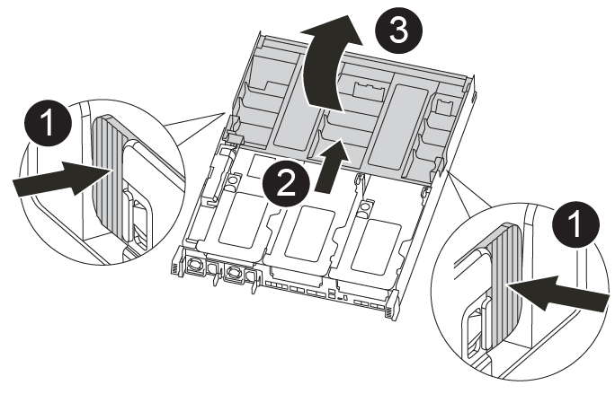
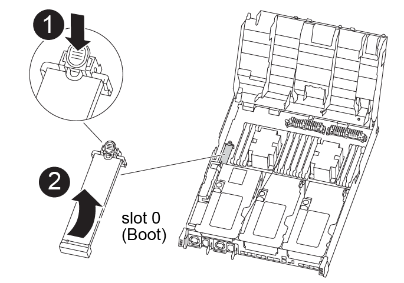

= 更换启动介质— AFF A400
:allow-uri-read: 
:icons: font
:imagesdir: ../media/

[role="lead"]
要更换启动介质，您必须卸下受损的控制器模块，安装替代启动介质并将启动映像传输到 USB 闪存驱动器。

== 第 1 步：卸下控制器模块

要访问控制器模块内部的组件，必须从机箱中卸下控制器模块。

.步骤
. 如果您尚未接地，请正确接地。
. 释放电源线固定器，然后从电源中拔下缆线。
. 松开将缆线绑在缆线管理设备上的钩环带，然后从控制器模块上拔下系统缆线和 SFP （如果需要），并跟踪缆线的连接位置。
+
将缆线留在缆线管理设备中，以便在重新安装缆线管理设备时，缆线排列有序。

. 将缆线管理设备从控制器模块中取出并放在一旁。
. 向下按两个锁定闩锁，然后同时向下旋转两个闩锁。
+
此控制器模块会从机箱中略微移出。

+
image::../media/drw_A400_Remove_controller.png[释放控制器模块]

+
|===

 a| 
image:../media/icon_round_1.png["标注编号1"]
 a| 
锁定闩锁

 a| 
image:../media/icon_round_2.png["标注编号2"]
 a| 
控制器从机箱中略微移出

|===
. 将控制器模块滑出机箱。
+
将控制器模块滑出机箱时，请确保您支持控制器模块的底部。

. 将控制器模块放在平稳的表面上。

== 第 2 步：更换启动介质

您必须在控制器模块中找到启动介质（请参见控制器模块上的 FRU 映射），然后按照说明进行更换。

.开始之前
虽然启动介质的内容已加密，但最好在更换启动介质之前先擦除此介质的内容。有关详细信息，请参见 https://mysupport.netapp.com/info/web/ECMP1132988.html["易失性声明"] NetApp 支持站点上适用于您的系统的。

NOTE: 您必须登录到 NetApp 支持站点，才能显示系统的 _statement of volatil性 _ 。

您可以使用以下动画，插图或写入的步骤来更换启动介质。

.动画-更换启动介质
video::bb4d91d7-2be1-44d8-ba18-afcf01681872[panopto]
.步骤
. 打开通风管：
+

+
|===

 a| 
image:../media/icon_round_1.png["标注编号1"]
 a| 
锁定卡舌

 a| 
image:../media/icon_round_2.png["标注编号2"]
 a| 
将通风管滑向控制器背面

 a| 
image::../media/icon_round_3.png[标注编号3]
 a| 
向上旋转通风管

|===
+
.. 将通风管两侧的锁定片朝控制器模块中间按压。
.. 将通风管滑向控制器模块的背面，然后将其向上旋转到完全打开的位置。

. 从控制器模块中找到并取出启动介质：
+

+
|===

 a| 
image:../media/icon_round_1.png["标注编号1"]
 a| 
按蓝色按钮

 a| 
image:../media/icon_round_2.png["标注编号2"]
 a| 
向上旋转启动介质并从插槽中取出

|===
+
.. 按启动介质末端的蓝色按钮，直到启动介质上的边缘清除蓝色按钮。
.. 将启动介质向上旋转，然后将启动介质从插槽中轻轻拉出。

. 将替代启动介质的边缘与启动介质插槽对齐，然后将其轻轻推入插槽。
. 检查启动介质，确保其完全固定在插槽中。
+
如有必要，请取出启动介质并将其重新插入插槽。

. 将启动介质锁定到位：
+
.. 将启动介质向下旋转到主板。
.. 将一根手指放在启动介质的末端，然后按下启动介质的一端，以接合蓝色锁定按钮。
.. 向下推启动介质时，提起蓝色锁定按钮以将启动介质锁定到位。

. 关闭通风管。

== 第 3 步：将启动映像传输到启动介质

您安装的替代启动介质没有启动映像，因此您需要使用 USB 闪存驱动器传输启动映像。

.开始之前
* 您必须具有一个 USB 闪存驱动器，该驱动器已格式化为 MBR/FAT32 ，并且容量至少为 4 GB
* 与受损控制器运行的 ONTAP 映像版本相同的副本。您可以从 NetApp 支持站点上的 "Downloads" 部分下载相应的映像
+
** 如果启用了 NVE ，请按照下载按钮中的指示，使用 NetApp 卷加密下载映像。
** 如果未启用 NVE ，请按照下载按钮中的指示，在不使用 NetApp 卷加密的情况下下载映像。

* 如果您的系统是 HA 对，则必须具有网络连接。
* 如果您的系统是独立系统，则不需要网络连接，但在还原 `var` 文件系统时，您必须执行额外的重新启动。

.步骤
. 将相应的服务映像从 NetApp 支持站点下载并复制到 USB 闪存驱动器。
+
.. 将服务映像下载到笔记本电脑上的工作空间。
.. 解压缩服务映像。
+

NOTE: 如果要使用 Windows 提取内容，请勿使用 WinZip 提取网络启动映像。使用其他提取工具，例如 7-Zip 或 WinRAR 。

+
解压缩的服务映像文件中有两个文件夹：

+
*** `启动`
*** `EFI`

.. 将 `EFI` 文件夹复制到 USB 闪存驱动器上的顶部目录。
+
USB 闪存驱动器应具有 EFI 文件夹，并且与受损控制器运行的服务映像（ BIOS ）版本相同。

.. 从笔记本电脑中取出 USB 闪存驱动器。

. 如果尚未关闭此通风管，请关闭此通风管。
. 将控制器模块的末端与机箱中的开口对齐，然后将控制器模块轻轻推入系统的一半。
. 重新安装缆线管理设备，并根据需要重新对系统进行布线。
+
重新布线时，如果已卸下介质转换器（ SFP 或 QSFP ），请务必重新安装它们。

. 将电源线插入电源，然后重新安装电源线固定器。
. 将 USB 闪存驱动器插入控制器模块上的 USB 插槽。
+
确保将 USB 闪存驱动器安装在标有 USB 设备的插槽中，而不是 USB 控制台端口中。

. 完成控制器模块的安装：
+
.. 将电源线插入电源，重新安装电源线锁定环，然后将电源连接到电源。
.. 将控制器模块牢牢推入机箱，直到它与中板相距并完全就位。
+
控制器模块完全就位后，锁定闩锁会上升。

+

NOTE: 将控制器模块滑入机箱时，请勿用力过大，以免损坏连接器。

+
控制器模块一旦完全固定在机箱中，就会开始启动。准备中断启动过程。

.. 向上旋转锁定闩锁，使其倾斜，以清除锁定销，然后将其降低到锁定位置。
.. 如果尚未重新安装缆线管理设备，请重新安装该设备。

. 按 Ctrl-C 在 LOADER 提示符处停止，以中断启动过程。
+
如果您未收到此消息，请按 Ctrl-C ，选择选项以启动到维护模式，然后 `halt` 控制器以启动到加载程序。

. 如果控制器位于延伸型或光纤连接的 MetroCluster 中，则必须还原 FC 适配器配置：
+
.. 启动到维护模式： `boot_ontap maint`
.. 将 MetroCluster 端口设置为启动程序： `ucadmin modify -m fc -t _initiator adapter_name_`
.. halt 返回维护模式： `halt`

+
这些更改将在系统启动时实施。

