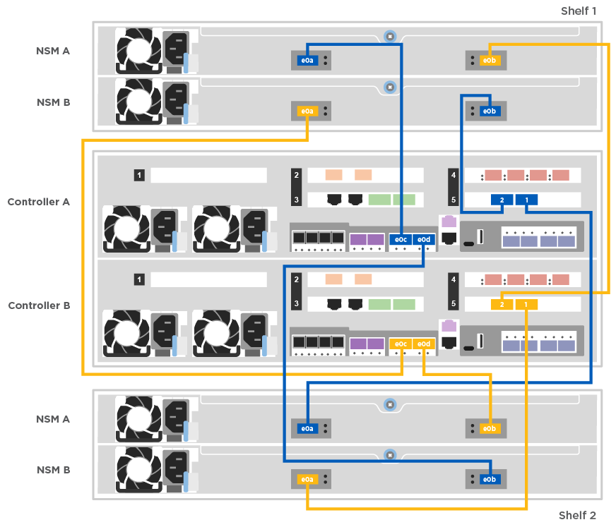
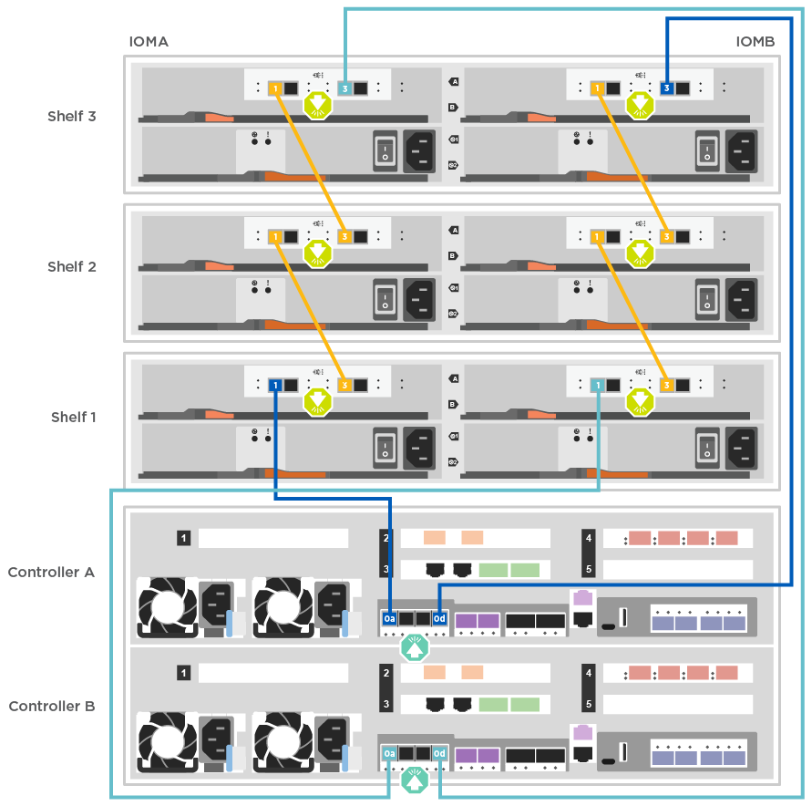

= 详细指南— AFF A400
:allow-uri-read: 
:icons: font
:imagesdir: ../media/

[role="lead"]
本指南详细介绍了安装典型 NetApp 系统的分步说明。如果您需要更详细的安装说明，请使用本指南。

== 第 1 步：准备安装

要安装系统，您需要创建帐户，注册系统并获取许可证密钥。此外，您还需要为系统清点适当数量和类型的缆线，并收集特定的网络信息。

.开始之前
您需要能够访问 Hardware Universe 以了解有关站点要求的信息，以及已配置系统上的追加信息。有关此系统的详细信息，您可能还希望能够访问适用于您的 ONTAP 版本的发行说明。

https://["NetApp Hardware Universe"]

http://["查找适用于您的 ONTAP 9 版本的发行说明"]

您需要在站点上提供以下内容：

* 存储系统的机架空间
* 2 号十字螺丝刀
* 使用其他网络缆线通过 Web 浏览器将系统连接到网络交换机和笔记本电脑或控制台

.步骤
. 打开所有框内容的包装。
. 记录控制器的系统序列号。
+
image::../media/drw_ssn_label.png[DRW SSN 标签]

. 清点并记下收到的缆线数量和类型。
+
下表列出了您可能收到的电缆类型。如果您收到的电缆未在表中列出，请参见 Hardware Universe 以找到该电缆并确定其用途。

+
https://["NetApp Hardware Universe"]

+
[cols="1,2,1,2"]
|===
| 缆线类型 ... | 部件号和长度 | 连接器类型 | 针对 ... 

 a| 
100 GbE 缆线（ QSF （ 28 ）
 a| 
X6621A-05 （ 112-00595 ）， 0.5 米

X6621A-1 （ 112-00573 ）， 1 米

X6621A-2 （ 112-00574 ）， 2 米

X6621A-5 （ 112-00574 ）， 5 米
 a| 
image:../media/oie_cable100_gbe_qsfp28.png[""]
 a| 
存储，集群互连 /HA 和以太网数据（取决于订单）

 a| 
25 GbE 缆线（ SFP28 ）
 a| 
X66240-2 （ 112-00598 ）， 2 米

X66240-5 （ 112-00639 ）， 5 米
 a| 
image:../media/oie_cable_sfp_gbe_copper.png[""]
 a| 
GbE 网络连接（取决于订单）

 a| 
32 Gb FC （ SFP+ 操作）
 a| 
X66250-2 （ 112-00342 ）， 2 米

X66250-5 （ 112-00344 ）， 5 米

X66250-15 （ 112-00346 ）， 15 米
 a| 
image:../media/oie_cable_sfp_gbe_copper.png[""]
 a| 
FC 网络连接

 a| 
存储缆线
 a| 
X66030A （ 112-00435 ）， 0.5 米

X66031A （ 112-00436A ）， 1 米

X66032A （ 112-00437 ）， 2 米

X66033A （ 112-00438 ）， 3 米
 a| 
image:../media/oie_cable_mini_sas_hd_to_mini_sas_hd.png[""]
 a| 
迷你 SAS HD 到迷你 SAS HD 缆线（取决于订单）

 a| 
光缆
 a| 
X66250-2-N-C （ 112-00342 ）
 a| 

 a| 
用于夹层卡的 16 Gb FC 或 25GbE 缆线（取决于订单）

 a| 
RJ-45 （取决于订单）
 a| 
X6555-R6 （ 112-00291 ）， 3 米

X6562-R6 （ 112-00196 ）， 5 米
 a| 
image:../media/oie_cable_rj45.png[""]
 a| 
管理网络

 a| 
微型 USB 控制台缆线
 a| 
不适用
 a| 
image:../media/oie_cable_micro_usb.png[""]
 a| 
如果笔记本电脑或控制台不支持网络发现，则在软件设置期间使用控制台连接。

 a| 
电源线
 a| 
不适用
 a| 
image:../media/oie_cable_power.png[""]
 a| 
启动系统

|===
. 查看 _NetApp ONTAP 配置指南 _ 并收集该指南中列出的所需信息。
+
https://["《 ONTAP 配置指南》"]

== 第 2 步：安装硬件

您需要根据需要将系统安装在四柱机架或 NetApp 系统机柜中。

. 根据需要安装导轨套件。
. 按照导轨套件附带的说明安装并固定系统。
+

NOTE: 您需要了解与系统重量相关的安全问题。

+
image::../media/drw_katana_lifting_restriction_icon.png[DRW katana 提升限制图标]

. 连接缆线管理设备（如图所示）。
+
image::../media/drw_a320_cable_management_arms.png[DRW A320 缆线管理臂]

. 将挡板放在系统正面。

== 第 3 步：使用缆线将控制器连接到网络

您可以使用双节点无交换机集群方法或集群互连网络将控制器连接到网络。

NOTE: 如果卡上的端口标签不可见、请检查卡安装方向(PCIe连接器插槽位于A400和FAS8300/8700中卡插槽的左侧)、然后按部件号在中查找此卡 https://["NetApp Hardware Universe"^] 用于显示端口标签的挡板图形。可以使用查找卡部件号 `sysconfig -a` 命令或。

NOTE: 如果要为MetroCluster IP配置布线、则端口e0a/e0b可用于托管数据LIF (通常在默认IP空间中)。

=== 选项 1 ：为双节点无交换机集群布线

控制器模块上的可选数据端口，可选 NIC 卡和管理端口均连接到交换机。两个控制器模块上都使用缆线连接集群互连和 HA 端口。

您必须已联系网络管理员，了解有关将系统连接到交换机的信息。

在端口中插入缆线时，请务必检查缆线拉片的方向。所有板载端口的缆线拉片均已启动，扩展（ NIC ）卡的缆线拉片已关闭。

image::../media/oie_cable_pull_tab_up.png[OIE 缆线拉片向上]

image::../media/oie_cable_pull_tab_down.png[OIE 缆线下拉卡舌]

NOTE: 插入连接器时，您应感觉到连接器卡入到位；如果您不认为连接器卡嗒声，请将其卸下，然后将其翻转并重试。

.步骤
. 使用动画或插图完成控制器与交换机之间的布线：
+
.动画—双节点无交换机集群布线
video::48552ddf-0925-4f88-8e93-ab1b00666489[panopto]
+
image::../media/drw_A400_TNSC-network-cabling.png[DRW A400 TNSC 网络布线]

. 转至 <<第 4 步：使用缆线将控制器连接到驱动器架>> 有关驱动器架布线说明。

=== 选项 2 ：为有交换机的集群布线

控制器模块上的可选数据端口，可选 NIC 卡，夹层卡和管理端口均连接到交换机。集群互连和 HA 端口通过缆线连接到集群 /HA 交换机。

您必须已联系网络管理员，了解有关将系统连接到交换机的信息。

在端口中插入缆线时，请务必检查缆线拉片的方向。所有板载端口的缆线拉片均已启动，扩展（ NIC ）卡的缆线拉片已关闭。

image::../media/oie_cable_pull_tab_up.png[OIE 缆线拉片向上]

image::../media/oie_cable_pull_tab_down.png[OIE 缆线下拉卡舌]

NOTE: 插入连接器时，您应感觉到连接器卡入到位；如果您不认为连接器卡嗒声，请将其卸下，然后将其翻转并重试。

.步骤
. 使用动画或插图完成控制器与交换机之间的布线：
+
.动画—切换集群布线
video::8fefba75-f395-4cf2-ba3c-ab1b00665870[panopto]
+
image::../media/drw_a400_switched_network_cabling.png[DRW a400 交换网络布线]

. 转至 <<第 4 步：使用缆线将控制器连接到驱动器架>> 有关驱动器架布线说明。

== 第 4 步：使用缆线将控制器连接到驱动器架

您可以使用缆线将 NSS224 或 SAS 磁盘架连接到系统。

=== 选项 1 ：使用缆线将控制器连接到一个驱动器架

您必须使用缆线将每个控制器连接到 NS224 驱动器架上的 NSM 模块。

请务必检查插图箭头以确定正确的缆线连接器拉片方向。NS224 的缆线拉片已启动。

image::../media/oie_cable_pull_tab_up.png[OIE 缆线拉片向上]

NOTE: 插入连接器时，您应感觉到连接器卡入到位；如果您不认为连接器卡嗒声，请将其卸下，然后将其翻转并重试。

.步骤
. 使用以下动画或插图将控制器连接到一个驱动器架。
+
.动画-使用缆线将控制器连接到一个NS224驱动器架
video::48d68897-c91d-47dc-b4b0-ab1b0066808a[panopto]
+
image::../media/drw_a400_one_ns224_shelves.png[DRW a400 一个 nss224 磁盘架]

. 转至 <<第 5 步：完成系统设置和配置>> 完成系统设置和配置。

=== 选项 2 ：使用缆线将控制器连接到两个驱动器架

您必须使用缆线将每个控制器连接到两个 NS224 驱动器架上的 NSM 模块。

请务必检查插图箭头以确定正确的缆线连接器拉片方向。NS224 的缆线拉片已启动。

image::../media/oie_cable_pull_tab_up.png[OIE 缆线拉片向上]

NOTE: 插入连接器时，您应感觉到连接器卡入到位；如果您不认为连接器卡嗒声，请将其卸下，然后将其翻转并重试。

.步骤
. 使用以下动画或插图将控制器连接到两个驱动器架。
+
.动画-使用缆线将控制器连接到一个NS224驱动器架
video::5501c7bf-8b74-49e8-8067-ab1b00668804[panopto]
+

. 转至 <<第 5 步：完成系统设置和配置>> 完成系统设置和配置。

=== 选项 3 ：使用缆线将控制器连接到 SAS 驱动器架

您必须使用缆线将每个控制器连接到两个 SAS 驱动器架上的 IOM 模块。

请务必检查插图箭头以确定正确的缆线连接器拉片方向。DS224-C 的缆线拉片已关闭。

image::../media/oie_cable_pull_tab_down.png[OIE 缆线下拉卡舌]

NOTE: 插入连接器时，您应感觉到连接器卡入到位；如果您不认为连接器卡嗒声，请将其卸下，然后将其翻转并重试。

.步骤
. 使用下图将控制器连接到两个驱动器架。
+
.动画-使用缆线将控制器连接到SAS驱动器架
video::cbb0280e-708d-4365-92b6-ab1b006677ef[panopto]
+

. 转至 <<第 5 步：完成系统设置和配置>> 完成系统设置和配置。

== 第 5 步：完成系统设置和配置

您可以使用仅连接到交换机和笔记本电脑的集群发现完成系统设置和配置，也可以直接连接到系统中的控制器，然后连接到管理交换机。

=== 选项 1 ：如果启用了网络发现，则完成系统设置和配置

如果您在笔记本电脑上启用了网络发现，则可以使用自动集群发现完成系统设置和配置。

. 使用以下动画设置一个或多个驱动器架 ID ：
+
如果您的系统具有 NS224 驱动器架，则磁盘架会预先设置为磁盘架 ID 00 和 01 。如果要更改磁盘架 ID ，则必须创建一个工具，将其插入按钮所在的孔中。

+
.动画—设置驱动器架ID
video::c600f366-4d30-481a-89d9-ab1b0066589b[panopto]
. 将电源线插入控制器电源，然后将其连接到不同电路上的电源。
. 确保您的笔记本电脑已启用网络发现。
+
有关详细信息，请参见笔记本电脑的联机帮助。

. 使用以下动画将您的笔记本电脑连接到管理交换机。
+
.动画—将笔记本电脑连接到管理交换机
video::d61f983e-f911-4b76-8b3a-ab1b0066909b[panopto]
. 选择列出的 ONTAP 图标以发现：
+
image::../media/drw_autodiscovery_controler_select.png[DRW 自动发现控制器选择]

+
.. 打开文件资源管理器。
.. 单击左窗格中的 network 。
.. 右键单击并选择刷新。
.. 双击 ONTAP 图标并接受屏幕上显示的任何证书。
+

NOTE: XXXXX 是目标节点的系统序列号。

+
此时将打开 System Manager 。

. 使用 System Manager 引导式设置，使用在 _NetApp ONTAP 配置指南 _ 中收集的数据配置系统。
+
https://["《 ONTAP 配置指南》"]

. 设置您的帐户并下载 Active IQ Config Advisor ：
+
.. 登录到现有帐户或创建帐户。
+
https://["NetApp 支持注册"]

.. 注册您的系统。
+
https://["NetApp 产品注册"]

.. 下载 Active IQ Config Advisor 。
+
https://["NetApp 下载： Config Advisor"]

. 运行 Config Advisor 以验证系统的运行状况。
. 完成初始配置后，转到 https://["ONTAP 和 AMP ； ONTAP System Manager 文档资源"] 页面，了解有关在 ONTAP 中配置其他功能的信息。

=== 选项 2 ：如果未启用网络发现，则完成系统设置和配置

如果您的笔记本电脑未启用网络发现，则必须使用此任务完成配置和设置。

. 为笔记本电脑或控制台布线并进行配置：
+
.. 使用 N-8-1 将笔记本电脑或控制台上的控制台端口设置为 115200 波特。
+

NOTE: 有关如何配置控制台端口的信息，请参见笔记本电脑或控制台的联机帮助。

.. 使用系统随附的控制台缆线将控制台缆线连接到笔记本电脑或控制台，然后将此笔记本电脑连接到管理子网上的管理交换机。
.. 使用管理子网上的一个 TCP/IP 地址为笔记本电脑或控制台分配 TCP/IP 地址。

. 使用以下动画设置一个或多个驱动器架 ID ：
+
.动画—设置驱动器架ID
video::c600f366-4d30-481a-89d9-ab1b0066589b[panopto]
+
如果您的系统具有 NS224 驱动器架，则磁盘架会预先设置为磁盘架 ID 00 和 01 。如果要更改磁盘架 ID ，则必须创建一个工具，将其插入按钮所在的孔中。

+
.动画—设置驱动器架ID
video::c600f366-4d30-481a-89d9-ab1b0066589b[panopto]
. 将电源线插入控制器电源，然后将其连接到不同电路上的电源。
+

NOTE: 所示为 FAS8300 和 FAS8700 。

+
.动画—打开控制器的电源
video::50cdf200-ede1-45a9-b4b5-ab1b006698d7[panopto]
+

NOTE: 初始启动可能需要长达八分钟的时间。

. 将初始节点管理 IP 地址分配给其中一个节点。
+
[cols="1,2"]
|===
| 如果管理网络具有 DHCP... | 那么 ... 

 a| 
已配置
 a| 
记录分配给新控制器的 IP 地址。

 a| 
未配置
 a| 
.. 使用 PuTTY ，终端服务器或环境中的等效项打开控制台会话。
+

NOTE: 如果您不知道如何配置 PuTTY ，请查看笔记本电脑或控制台的联机帮助。

.. 在脚本提示时输入管理 IP 地址。

|===
. 使用笔记本电脑或控制台上的 System Manager 配置集群：
+
.. 将浏览器指向节点管理 IP 地址。
+

NOTE: 此地址的格式为 +https://x.x.x.x.+

.. 使用您在 _NetApp ONTAP 配置指南 _ 中收集的数据配置系统。
+
https://["《 ONTAP 配置指南》"]

. 设置您的帐户并下载 Active IQ Config Advisor ：
+
.. 登录到现有帐户或创建帐户。
+
https://["NetApp 支持注册"]

.. 注册您的系统。
+
https://["NetApp 产品注册"]

.. 下载 Active IQ Config Advisor 。
+
https://["NetApp 下载： Config Advisor"]

. 运行 Config Advisor 以验证系统的运行状况。
. 完成初始配置后，转到 https://["ONTAP 和 AMP ； ONTAP System Manager 文档资源"] 页面，了解有关在 ONTAP 中配置其他功能的信息。

