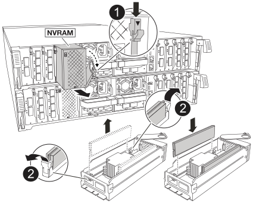

= 更换控制器模块- AFF A70、AFF A90
:allow-uri-read: 
:icons: font
:imagesdir: ../media/

[role="lead"]
要更换控制器、您必须卸下受损控制器、将FRU组件从受损控制器模块移至更换用的控制器模块、在机箱中安装更换用的控制器模块、然后将系统启动至维护模式。

== 第 1 步：卸下控制器模块

在更换控制器模块或更换控制器模块内的组件时，您必须从机箱中卸下控制器模块。

. 在机箱正面、用拇指用力推入每个驱动器、直到您感觉到有一定的停机。这样可确保驱动器牢固地固定在机箱中板上。
+
image::../media/drw_a800_drive_seated_IEOPS-960.svg[安装磁盘驱动器]

. 检查受损控制器模块背面插槽4/5中的琥珀色NVRAM状态指示灯是否熄灭。查找NV图标。
+
image::../media/drw_a1K-70-90_nvram-led_ieops-1463.svg[NVRAM警示和状态LED位置图]

+
[cols="1,4"]
|===

 a| 
image:../media/legend_icon_01.svg["标注编号1、宽度=30制"]
 a| 
NVRAM 状态 LED

 a| 
image:../media/legend_icon_02.svg["标注编号1、宽度=30制"]
 a| 
NVRAM警示LED

|===
+

NOTE: 如果NVRAM状态LED闪烁、则可能表示控制器模块未被接管或正常暂停(未提交的数据)。如果受损控制器模块未被配对控制器模块成功接管、请先联系、 https://mysupport.netapp.com/site/global/dashboard["NetApp 支持"] 然后再继续此过程。

+
受损控制器模块上的NVRAM状态LED的一般行为如下：

+
** 当控制器模块断电、存储系统处于"正在等待恢复"状态、或者控制器模块未被正确接管或暂停(未提交的数据)时、NVRAM状态LED会闪烁。
** 从机箱中卸下控制器模块后、NVRAM状态LED会闪烁、这可能意味着控制器模块未被接管或暂停(未提交的数据)。确认此控制器模块已被配对控制器模块完全接管，或者受损控制器模块显示 `waiting for giveback`。然后、可以忽略闪烁的LED指示灯(并且可以从机箱中卸下控制器模块)。

. 如果您尚未接地，请正确接地。
. 从控制器模块电源(PSU)上拔下控制器模块电源线。
+

NOTE: 如果您的系统使用直流电源、请断开电源块与PSU的连接。

. 从控制器模块拔下系统缆线以及SFP和QSFP模块(如果需要)、并记录缆线的连接位置。
+
将缆线留在缆线管理设备中，以便在重新安装缆线管理设备时，缆线排列有序。

. 从控制器模块中卸下缆线管理设备。
. 向下按两个锁定闩锁，然后同时向下旋转两个闩锁。
+
此控制器模块会从机箱中略微移出。

+
image::../media/drw_a70-90_pcm_remove_replace_ieops-1365.svg[控制器删除图形]

+
[cols="1,4"]
|===

 a| 
image:../media/legend_icon_01.svg["标注编号1、宽度=30制"]
| A锁定闩锁 

 a| 
image:../media/legend_icon_02.svg["标注编号2、宽度=30制"]
 a| 
锁定销

|===
. 将控制器模块滑出机箱、然后将其放在平稳的表面上。
+
将控制器模块滑出机箱时，请确保您支持控制器模块的底部。

== 第 2 步：移动电源

将电源移至更换用的控制器。

. 旋转凸轮把手，以便在按下锁定卡舌的同时，可以将电源从控制器模块中拉出。
+

CAUTION: 电源不足。从控制器模块中取出时，请始终用双手托住它，以免它突然从控制器模块中自由转动并给您造成损害。

+
image::../media/drw_a70-90_psu_remove_replace_ieops-1368.svg[卸下PSU]

+
[cols="1,4"]
|===

 a| 
image::../media/legend_icon_01.svg[标注编号1]
| Terrac兵马俑PSU锁定卡舌 

 a| 
image::../media/legend_icon_02.svg[标注编号2]
 a| 
电源

|===
. 将电源移至新控制器模块，然后安装它。
. 用双手支撑电源边缘并将其与控制器模块的开口对齐，然后将电源轻轻推入控制器模块，直到锁定卡舌卡入到位。
+
电源只能与内部连接器正确接合并单向锁定到位。

+

NOTE: 为避免损坏内部连接器，请勿在将电源滑入系统时用力过大。

== 第 3 步：移动风扇

将风扇模块移至更换用的控制器模块。

. 通过挤压风扇模块侧面的锁定卡舌，然后将风扇模块直接从控制器模块中提出来卸下风扇模块。
+
image::../media/drw_a70-90_fan_remove_replace_ieops-1366.svg[卸下风扇]

+
[cols="1,4"]
|===

 a| 
image::../media/legend_icon_01.svg[标注编号1]
 a| 
风扇锁定卡舌

 a| 
image::../media/legend_icon_02.svg[标注编号2]
 a| 
风扇模块

|===
. 将风扇模块移至更换用的控制器模块，然后通过将风扇模块的边缘与控制器模块中的开口对齐来安装此风扇模块，然后将此风扇模块滑入控制器模块，直到锁定闩锁卡入到位为止。
. 对其余风扇模块重复上述步骤。

== Step 4: Move the NV battery

Move the NV battery to the replacement controller module.

. 打开控制器模块中间的通风管盖、找到NV电池。
+
image::../media/drw_a70-90_remove_replace_nvmembat_ieops-1369.svg[移动NV电池]

+
[cols="1,4"]
|===

 a| 
image::../media/legend_icon_01.svg[标注编号1]
| NV蓄电池空气管道 

 a| 
image::../media/legend_icon_02.svg[标注编号2]
 a| 
NV电池组插头

|===
+
*注意：*暂停系统后，将内容转存到闪存时，NV模块LED会闪烁。After the destage is complete, the LED turns off.

. 向上提起蓄电池以接触蓄电池插头。
. 挤压电池插头表面的夹子以从插座中释放插头、然后从插座中拔下电池电缆。
. 将电池从空气管道和控制器模块中提出。
. 将电池组移至更换用的控制器模块、然后将其安装在更换用的控制器模块中：
+
.. 打开备用控制器模块中的NV电池通风管。
.. 将电池插头插入插座、并确保插头锁定到位。
.. 将电池组插入插槽，然后用力向下按电池组，以确保其锁定到位。
.. 关闭NV蓄电池空气管道。

== Step 5: Move system DIMMs

将DIMM移至更换用的控制器模块。

. 打开控制器顶部的控制器通风管。
+
.. 将手指插入空气管道远端的凹槽中。
.. 提起空气管道、将其向上旋转至最远位置。

. 找到主板上的系统DIMM。
+
image::../media/drw_a70_90_dimm_ieops-1513.svg[DIMM映射]

+
[cols="1,4"]
|===

 a| 
image::../media/legend_icon_01.svg[标注编号1]
| 系统DIMM 
|===
. 记下插槽中 DIMM 的方向，以便可以按正确的方向将 DIMM 插入更换用的控制器模块中。
. 缓慢推动 DIMM 两侧的两个 DIMM 弹出卡舌，将 DIMM 从插槽中弹出，然后将 DIMM 滑出插槽。
+

NOTE: 小心握住 DIMM 的边缘，以避免对 DIMM 电路板上的组件施加压力。

. 在更换用的控制器模块上找到要安装DIMM的插槽。
. 将 DIMM 垂直插入插槽。
+
DIMM 紧紧固定在插槽中，但应很容易插入。如果没有，请将 DIMM 与插槽重新对齐并重新插入。

+

NOTE: 目视检查 DIMM ，确认其均匀对齐并完全插入插槽。

. 小心而稳固地推动 DIMM 的上边缘，直到弹出器卡舌卡入到位，卡入到位于 DIMM 两端的缺口上。
. 对其余 DIMM 重复上述步骤。
. 关闭控制器空气管道。

== 第6步：移动I/O模块

将I/O模块移至更换用的控制器模块。

image::../media/drw_a70_90_io_remove_replace_ieops-1532.svg[卸下I/O模块]

[cols="1,4"]
|===

 a| 
image::../media/legend_icon_01.svg[标注编号1]
| I/O模块凸轮拉杆 
|===
. 拔下目标 I/O 模块上的所有布线。
+
请确保为这些缆线贴上标签，以便您知道这些缆线来自何处。

. 向下旋转缆线管理ARM、方法是拉动缆线管理ARM内侧的按钮、然后向下旋转它。
. 从控制器模块中卸下I/O模块：
+
.. 按下目标I/O模块凸轮闩锁按钮。
+
凸轮杆移离控制器模块。

.. 将凸轮闩锁向下旋转到最远位置。对于水平模块、将凸轮尽可能远离模块。
.. 将手指插入凸轮拉杆开口处、然后将模块拉出控制器模块、从而将模块从控制器模块中卸下。
+
确保跟踪 I/O 模块所在的插槽。

.. 将更换用的I/O模块安装到更换用的控制器模块中、方法是将I/O模块轻轻滑入插槽、直到I/O凸轮闩锁开始与I/O凸轮销啮合、然后将I/O凸轮闩锁一直向上推、以将模块锁定到位。

. 重复上述步骤、将其余I/O模块(插槽6和7中的模块除外)移至更换用的控制器模块。
+

NOTE: 要从插槽6和7移动I/O模块、必须将包含这些I/O模块的托架从受损控制器模块移动到更换用的控制器模块。

. 将插槽6和7中包含I/O模块的托架移至更换用的控制器模块：
+
.. 按下托架手柄最右侧手柄上的按钮。..将托架从受损控制器模块中滑出、将其以在受损控制器模块中的相同位置插入更换用的控制器模块。
.. 轻轻地将托架完全推入更换用的控制器模块、直到其锁定到位。

== 第7步：移动系统管理模块

将系统管理模块移至更换用的控制器模块。

image::../media/drw_a70-90_sys-mgmt_replace_ieops-1373.svg[更换系统管理模块]

[cols="1,4"]
|===

 a| 
image::../media/legend_icon_01.svg[标注编号1]
 a| 
系统管理模块凸轮闩锁

 a| 
image::../media/legend_icon_02.svg[标注编号2]
 a| 
启动介质锁定按钮

 a| 
image::../media/legend_icon_03.svg[标注编号3]
 a| 
更换系统管理模块

|===
. 从受损控制器模块中卸下系统管理模块：
+
.. 按下系统管理凸轮按钮。凸轮杆移离机箱。
.. 向下旋转凸轮杆。
.. 将手指环入凸轮杆、然后将模块直接拉出系统。

. 将系统管理模块安装到受损控制器模块上的同一插槽中的替代控制器模块中：
+
.. 将系统管理模块的边缘与系统开口对齐、然后将其轻轻推入控制器模块。
.. 将模块轻轻滑入插槽、直到凸轮闩锁开始与I/O凸轮销啮合、然后一直向上旋转凸轮闩锁以将模块锁定到位。

== 第8步：移动NVRAM模块

将NVRAM模块移至更换用的控制器模块。

[cols="1,4"]
|===

 a| 
image:../media/legend_icon_01.svg["标注编号1、Wides=30bex"]
| 凸轮锁定按钮 

 a| 
image:../media/legend_icon_02.svg["标注编号2、宽度=30个"]
 a| 
DIMM锁定卡舌

|===
. 从受损控制器模块中卸下NVRAM模块：
+
.. 按下凸轮闩锁按钮。
+
凸轮按钮离开机箱。

.. 将凸轮闩锁旋转到最远位置。
.. 通过将手指插入凸轮拉杆开口并将NVRAM模块拉出机柜、从机柜中卸下NVRAM模块。

. 将NVRAM模块安装到替代控制器模块的插槽4/5中：
+
.. 将模块与插槽4/5中机箱开口的边缘对齐。
.. 将模块轻轻滑入插槽中、然后将凸轮闩锁一直向上推、以将模块锁定到位。

== Step 9: Install the controller module

重新安装控制器模块并重新启动。

. 将空气管道向下旋转到可以移动的位置、确保空气管道完全关闭。
+
它必须与控制器模块金属板平齐。

. 将控制器模块的末端与机箱中的开口对齐，然后将控制器模块轻轻推入系统的一半。
+

NOTE: 请勿将控制器模块完全插入机箱中，除非系统指示您这样做。

. 根据需要重新对系统进行布线。
+
如果您删除了收发器(QSFP或SFP)、请记得在使用光缆时重新安装它们。

. 完成控制器模块的重新安装：
+
.. 将控制器模块牢牢推入机箱，直到它与中板相距并完全就位。
+
控制器模块完全就位后，锁定闩锁会上升。

+

NOTE: 将控制器模块滑入机箱时，请勿用力过大，以免损坏连接器。

+
.. 将锁定闩锁向上旋转到锁定位置。

. 将电源线插入电源。
+

NOTE: 如果您有直流电源、请在控制器模块完全固定在机箱中后、将电源块重新连接到电源。

+
电源恢复后、控制器模块将启动。如果启动到加载程序提示符、请使用命令重新启动控制器 `boot_ontap` 。

. 使用 `storage failover modify -node local -auto-giveback true` 命令禁用自动交还后，可将其还原。
. 如果启用了AutoSupport、请使用命令还原/取消禁止自动创建案例 `system node autosupport invoke -node * -type all -message MAINT=END` 。
. 如果尚未重新安装缆线管理设备并对控制器重新布线、请执行此操作。

