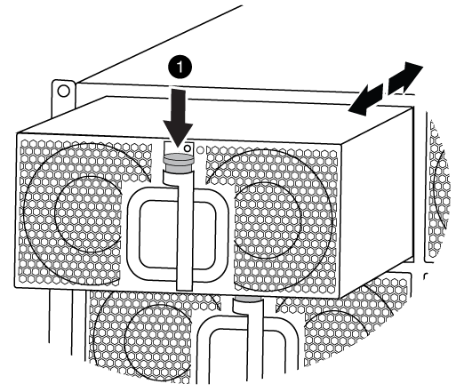

= 换用风扇- AFF A700
:allow-uri-read: 
:icons: font
:imagesdir: ../media/

[role="lead"]
要在不中断服务的情况下交换风扇模块，您必须执行一系列特定的任务。

NOTE: 您必须在将风扇模块从机箱中卸下后两分钟内更换此风扇模块。系统气流中断，控制器模块或模块在两分钟后关闭，以避免过热。

.步骤
. 如果您尚未接地，请正确接地。
. 如有必要，请用两只手抓住挡板每一侧的开口，然后将其拉向您，直到挡板从机箱框架上的球形螺柱上松开，从而卸下挡板。
. 通过检查控制台错误消息并查看每个风扇模块上的警示 LED 来确定必须更换的风扇模块。
. 按下风扇模块上的橙色按钮，将风扇模块竖直拉出机箱，确保用您的空闲手托住它。
+

CAUTION: 风扇模块较短。请始终用您的空闲手托住风扇模块的底部，以免其突然从机箱中脱离并造成您的人身伤害。

+

+
[cols="1,4"]
|===

 a| 
image:../media/legend_icon_01.png["标注编号1"]
 a| 
橙色释放按钮

|===
. 将风扇模块放在一旁。
. 将替代风扇模块的边缘与机箱中的开口对齐，然后将其滑入机箱，直至其卡入到位。
+
将风扇模块成功插入机箱后，琥珀色警示 LED 会闪烁四次。

. 将挡板与球形螺柱对齐，然后将挡板轻轻推入球形螺柱上。
. 按照套件随附的 RMA 说明将故障部件退回 NetApp 。请参见 https://mysupport.netapp.com/site/info/rma["部件退回和放大器；更换"^] 第页，了解更多信息。

