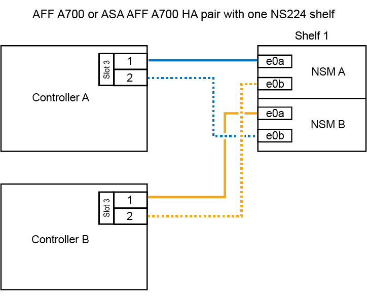
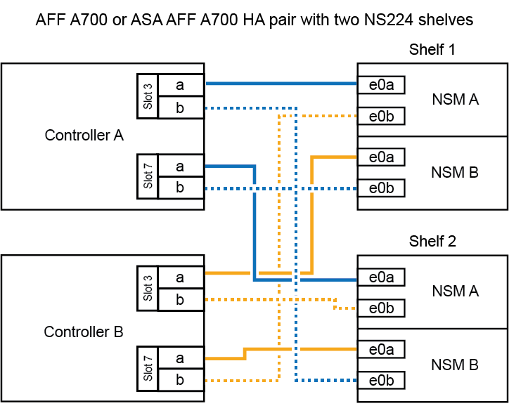

= 详细指南—AFF A700
:allow-uri-read: 
:icons: font
:imagesdir: ../media/

[role="lead"]
本指南详细介绍了安装典型 NetApp 系统的分步说明。如果您需要更详细的安装说明，请使用本指南。

== 第 1 步：准备安装

要安装系统，您需要在 NetApp 支持站点上创建帐户，注册系统并获取许可证密钥。此外，您还需要为系统清点适当数量和类型的缆线，并收集特定的网络信息。

.开始之前
您需要能够访问 Hardware Universe 以了解有关站点要求的信息，以及已配置系统上的追加信息。有关此系统的详细信息，您可能还希望能够访问适用于您的 ONTAP 版本的发行说明。

https://hwu.netapp.com["NetApp Hardware Universe"]

http://mysupport.netapp.com/documentation/productlibrary/index.html?productID=62286["查找适用于您的 ONTAP 9 版本的发行说明"]

您需要在站点上提供以下内容：

* 存储系统的机架空间
* 2 号十字螺丝刀
* 使用其他网络缆线通过 Web 浏览器将系统连接到网络交换机和笔记本电脑或控制台

.步骤
. 打开所有框内容的包装。
. 记录控制器的系统序列号。
+
image::../media/drw_ssn_label.png[系统序列号示例]

. 清点并记下收到的缆线数量和类型。
+
下表列出了您可能收到的电缆类型。如果您收到的电缆未在表中列出，请参见 Hardware Universe 以找到该电缆并确定其用途。

+
https://hwu.netapp.com["NetApp Hardware Universe"]

+
[cols="1,2,1,2"]
|===
| 缆线类型 ... | 部件号和长度 | 连接器类型 | 针对 ... 

 a| 
10 GbE 网络缆线
 a| 
X6566B-2-R6 ，（ 112-00299 ）， 2 米

X6566B-3-R6 ， 112-00300 ， 3 米

X6566B-5-R6 ， 112-00301 ， 5 米
 a| 
image:../media/oie_cable_sfp_gbe_copper.png["GbE SFP铜缆连接器"]
 a| 
网络缆线

 a| 
40 GbE 网络缆线

40 GbE 集群互连
 a| 
X66100-1 ， 112-00542 ， 1 米

X66100-3 ， 112-00543 ， 3 米
 a| 
image:../media/oie_cable100_gbe_qsfp28.png["100 GbE QSFP28连接器"]
 a| 
40 GbE 网络

集群互连

 a| 
100 GbE 网络缆线

100 GbE 存储缆线
 a| 
X6621A-05 （ 112-00595 ）， 0.5 米

X6621A-1 （ 112-00573 ）， 1 米

X6621A-2 （ 112-00574 ）， 2 米

X6621A-5 （ 112-00574 ）， 5 米
 a| 
image:../media/oie_cable100_gbe_qsfp28.png["100 GbE QSFP28连接器"]
 a| 
网络缆线

存储缆线

NOTE: 此缆线仅适用于适用场景 AFF A700 。

 a| 
光纤网络缆线（取决于订单）
 a| 
X6553-R6 （ 112-00188 ）， 2 米

X6536-R6 （ 112-00090 ）， 5 米
 a| 
image:../media/oie_cable_fiber_lc_connector.png["LC光纤连接器"]
 a| 
FC 主机网络

 a| 
6 类， RJ-45 （取决于订单）
 a| 
部件号 X6585-R6 （ 112-00291 ）， 3 米

X6562-R6 （ 112-00196 ）， 5 米
 a| 
image:../media/oie_cable_rj45.png["RJ-45电缆连接器"]
 a| 
管理网络和以太网数据

 a| 
存储
 a| 
X66031A （ 112-00436A ）， 1 米

X66032A （ 112-00437 ）， 2 米

X66033A （ 112-00438 ）， 3 米
 a| 
image:../media/oie_cable_mini_sas_hd_to_mini_sas_hd.png["迷你SAS到迷你SAS连接器"]
 a| 
存储

 a| 
微型 USB 控制台缆线
 a| 
不适用
 a| 
image:../media/oie_cable_micro_usb.png["微型USB连接器"]
 a| 
在非 Windows 或 Mac 笔记本电脑 / 控制台上设置软件期间连接控制台

 a| 
电源线
 a| 
不适用
 a| 
image:../media/oie_cable_power.png["电源线"]
 a| 
启动系统

|===
. 查看 _NetApp ONTAP 配置指南 _ 并收集该指南中列出的所需信息。
+
https://library.netapp.com/ecm/ecm_download_file/ECMLP2862613["《 ONTAP 配置指南》"]

== 第 2 步：安装硬件

您需要根据需要将系统安装在四柱机架或 NetApp 系统机柜中。

.步骤
. 根据需要安装导轨套件。
. 按照导轨套件附带的说明安装并固定系统。
+

NOTE: 您需要了解与系统重量相关的安全问题。

+
image::../media/drw_9000_lifting_icon.png[起重注意事项]

+

NOTE: 左侧的标签表示空机箱，右侧的标签表示系统已完全填充。

. 连接缆线管理设备（如图所示）。
+
image::../media/drw_9000_cable_management_arms.png[正在连接电缆管理设备]

. 将挡板放在系统正面。

== 第 3 步：使用缆线将控制器连接到网络

您可以使用双节点无交换机集群方法或集群互连网络将控制器连接到网络。

=== 选项 1 ：双节点无交换机集群

控制器上的管理网络，数据网络和管理端口连接到交换机。两个控制器上的集群互连端口均已通过缆线连接。

您必须已联系网络管理员，了解有关将系统连接到交换机的信息。

在端口中插入缆线时，请务必检查缆线拉片的方向。所有网络模块端口的缆线拉片均已启动。

image::../media/oie_cable_pull_tab_up.png[电缆连接器，顶部带有推拉卡舌]

NOTE: 插入连接器时，您应感觉到连接器卡入到位；如果您不认为连接器卡嗒声，请将其卸下，然后将其翻转并重试。

.步骤
. 使用动画或插图完成控制器与交换机之间的布线：
+
.动画—为双节点无交换机集群布线
video::7a55b98a-e8b8-41d5-821f-ac5b0032ead0[panopto]
+
image::../media/drw_9000_TNSC_composite_cabling.png[双节点无交换机集群复合布线]

. 转至 <<第 4 步：使用缆线将控制器连接到驱动器架>> 有关驱动器架布线说明。

=== 选项 2 ：交换集群

控制器上的管理网络，数据网络和管理端口连接到交换机。集群互连和 HA 端口通过缆线连接到集群 /HA 交换机。

您必须已联系网络管理员，了解有关将系统连接到交换机的信息。

在端口中插入缆线时，请务必检查缆线拉片的方向。所有网络模块端口的缆线拉片均已启动。

image::../media/oie_cable_pull_tab_up.png[电缆连接器，顶部带有推拉卡舌]

NOTE: 插入连接器时，您应感觉到连接器卡入到位；如果您不认为连接器卡嗒声，请将其卸下，然后将其翻转并重试。

.步骤
. 使用动画或插图完成控制器与交换机之间的布线：
+
.动画—切换集群布线
video::6381b3f1-4ce5-4805-bd0a-ac5b0032f51d[panopto]
+
image:../media/drw_9000_switched_cluster_cabling.png["有交换机集群复合布线"]

. 转至 <<第 4 步：使用缆线将控制器连接到驱动器架>> 有关驱动器架布线说明。

== 第 4 步：使用缆线将控制器连接到驱动器架

您可以使用缆线将新系统连接到 DS212C ， DS224C 或 NS224 磁盘架，具体取决于它是 AFF 还是 FAS 系统。

=== 选项 1 ：使用缆线将控制器连接到 DS212C 或 DS224C 驱动器架

您必须使用缆线连接磁盘架到磁盘架的连接，然后使用缆线将两个控制器连接到 DS212C 或 DS224C 驱动器磁盘架。

将缆线插入驱动器架，拉片朝下，而将缆线的另一端插入控制器存储模块，拉片朝上。

image::../media/oie_cable_pull_tab_down.png[底部带有推拉卡舌的电缆连接器]

image::../media/oie_cable_pull_tab_up.png[电缆连接器，顶部带有推拉卡舌]

.步骤
. 使用以下动画或插图将驱动器架连接到控制器。
+

NOTE: 这些示例使用 DS224C 磁盘架。布线与其他受支持的 SAS 驱动器架类似。

+
** 在 FAS9000 ， AFF A700 和 ASA AFF A700 ， ONTAP 9.7 及更早版本中为 SAS 磁盘架布线：
+
.动画—为ONTAP 9.7及更早版本的SAS存储布线
video::a312e09e-df56-47b3-9b5e-ab2300477f67[panopto]

+
image:../media/SAS_storage_ONTAP_9.7_and_earlier.png["适用于ONTAP 9.7及更早版本的SAS存储布线"]

+
** 在 FAS9000 ， AFF A700 和 ASA AFF A700 ， ONTAP 9.8 及更高版本中为 SAS 磁盘架布线：
+
.动画—为SAS存储布线—ONTAP 9.8及更高版本
video::61d23302-9526-4a2b-9335-ac5b0032eafd[panopto]
+
image:../media/SAS_storage_ONTAP_9.8_and_later.png["适用于ONTAP 9.8及更高版本的SAS存储布线"]

+

NOTE: 如果您有多个驱动器架堆栈，请参见适用于您的驱动器架类型的 _Installation and Cabling Guide_ 。

+
link:../sas3/install-new-system.html["安装新系统安装的磁盘架并为其布线—带有 IOM12 模块的磁盘架"]

+
image:../media/Cable_shelves_new_system_IOM12_shelves.png["使用SAS磁盘架进行存储系统布线"]

. 转至 <<第 5 步：完成系统设置和配置>> 完成系统设置和配置。

=== 选项 2 ：在仅运行 ONTAP 9.8 及更高版本的 AFF A700 和 ASA AFF A700 系统中，使用缆线将控制器连接到一个 NS224 驱动器架

必须使用缆线将每个控制器连接到运行系统 ONTAP 9.8 或更高版本的 AFF A700 或 ASA AFF A700 上 NS224 驱动器架上的 NSM 模块。

* 此任务仅限运行 ONTAP 9.8 或更高版本的适用场景 AFF A700 和 ASA AFF A700 。
* The systems must have at least one X91148A module installed in slots 3 and/or 7 for each controller.动画或插图显示了此模块同时安装在插槽 3 和 7 中。
* 请务必检查插图箭头以确定正确的缆线连接器拉片方向。存储模块的缆线拉片已启动，而磁盘架上的拉片已关闭。
+
image::../media/oie_cable_pull_tab_up.png[电缆连接器，顶部带有推拉卡舌]

+
image::../media/oie_cable_pull_tab_down.png[底部带有推拉卡舌的电缆连接器]

+

NOTE: 插入连接器时，您应感觉到连接器卡入到位；如果您不认为连接器卡嗒声，请将其卸下，然后将其翻转并重试。

.步骤
. 使用以下动画或图将具有两个 X91148A 存储模块的控制器连接到一个 NS224 驱动器架，或者使用此图将具有一个 X91148A 存储模块的控制器连接到一个 NS224 驱动器架。
+
.动画—为单个NS224磁盘架布线—ONTAP 9.8及更高版本
video::6520eb01-87b3-4520-9109-ac5b0032ea4e[panopto]
+

+
image::../media/single_NS224_shelf.png[单磁盘架布线]

. 转至 <<第 5 步：完成系统设置和配置>> 完成系统设置和配置。

=== 选项 3 ：仅使用缆线将控制器连接到运行 ONTAP 9.8 及更高版本的 AFF A700 和 ASA AFF A700 系统中的两个 NS224 驱动器架

必须使用缆线将每个控制器连接到运行系统 ONTAP 9.8 或更高版本的 AFF A700 或 ASA AFF A700 上 NS224 驱动器架上的 NSM 模块。

* 此任务仅限运行 ONTAP 9.8 或更高版本的适用场景 AFF A700 和 ASA AFF A700 。
* 系统必须在插槽 3 和 7 中为每个控制器安装两个 X91148A 模块。
* 请务必检查插图箭头以确定正确的缆线连接器拉片方向。存储模块的缆线拉片已启动，而磁盘架上的拉片已关闭。
+
image::../media/oie_cable_pull_tab_up.png[电缆连接器，顶部带有推拉卡舌]

+
image::../media/oie_cable_pull_tab_down.png[底部带有推拉卡舌的电缆连接器]

+

NOTE: 插入连接器时，您应感觉到连接器卡入到位；如果您不认为连接器卡嗒声，请将其卸下，然后将其翻转并重试。

.步骤
. 使用以下动画或图将控制器连接到两个 NS224 驱动器架。
+
.动画—用缆线连接两个NS224磁盘架—ONTAP 9.8及更高版本
video::34098e39-73ad-45de-9af7-ac5b0032ea9a[panopto]
+

+
image::../media/two_NS224_shelves.png[双磁盘架布线]

. 转至 <<第 5 步：完成系统设置和配置>> 完成系统设置和配置。

== 第 5 步：完成系统设置和配置

您可以使用仅连接到交换机和笔记本电脑的集群发现完成系统设置和配置，也可以直接连接到系统中的控制器，然后连接到管理交换机。

=== 选项 1 ：如果启用了网络发现，则完成系统设置和配置

如果您在笔记本电脑上启用了网络发现，则可以使用自动集群发现完成系统设置和配置。

.步骤
. 使用以下动画设置一个或多个驱动器架 ID ：
+
如果您的系统具有 NS224 驱动器架，则磁盘架会预先设置为磁盘架 ID 00 和 01 。如果要更改磁盘架 ID ，则必须创建一个工具，将其插入按钮所在的孔中。

+
.Animation—设置SAS或NVMe驱动器架ID
video::95a29da1-faa3-4ceb-8a0b-ac7600675aa6[panopto]
. 将电源线插入控制器电源，然后将其连接到不同电路上的电源。
. 打开两个节点的电源开关。
+
.动画—打开控制器的电源
video::bb04eb23-aa0c-4821-a87d-ab2300477f8b[panopto]
+

NOTE: 初始启动可能需要长达八分钟的时间。

. 确保您的笔记本电脑已启用网络发现。
+
有关详细信息，请参见笔记本电脑的联机帮助。

. 使用以下动画将您的笔记本电脑连接到管理交换机。
+
.动画—将笔记本电脑连接到管理交换机
video::d61f983e-f911-4b76-8b3a-ab1b0066909b[panopto]
. 选择列出的 ONTAP 图标以发现：
+
image::../media/drw_autodiscovery_controler_select.png[选择ONTAP图标]

+
.. 打开文件资源管理器。
.. 单击左窗格中的*网络*，右键单击并选择*refresh。
.. 双击 ONTAP 图标并接受屏幕上显示的任何证书。
+

NOTE: XXXXX 是目标节点的系统序列号。

+
此时将打开 System Manager 。

. 使用 System Manager 引导式设置，使用在 _NetApp ONTAP 配置指南 _ 中收集的数据配置系统。
+
https://library.netapp.com/ecm/ecm_download_file/ECMLP2862613["《 ONTAP 配置指南》"]

. 设置您的帐户并下载 Active IQ Config Advisor ：
+
.. 登录到现有帐户或创建帐户。
+
https://mysupport.netapp.com/eservice/public/now.do["NetApp 支持注册"]

.. 注册您的系统。
+
https://mysupport.netapp.com/eservice/registerSNoAction.do?moduleName=RegisterMyProduct["NetApp 产品注册"]

.. 下载 Active IQ Config Advisor 。
+
https://mysupport.netapp.com/site/tools/tool-eula/activeiq-configadvisor["NetApp 下载： Config Advisor"]

. 运行 Config Advisor 以验证系统的运行状况。
. 完成初始配置后、请转到、 https://docs.netapp.com/us-en/ontap/index.html["ONTAP 9 文档"^]了解有关在ONTAP中配置其他功能的信息。

=== 选项 2 ：如果未启用网络发现，则完成系统设置和配置

如果您的笔记本电脑未启用网络发现，则必须使用此任务完成配置和设置。

.步骤
. 为笔记本电脑或控制台布线并进行配置：
+
.. 使用 N-8-1 将笔记本电脑或控制台上的控制台端口设置为 115200 波特。
+

NOTE: 有关如何配置控制台端口的信息，请参见笔记本电脑或控制台的联机帮助。

.. 使用系统随附的控制台缆线将控制台缆线连接到笔记本电脑或控制台，然后将此笔记本电脑连接到管理子网上的管理交换机。
+
image::../media/drw_9000_cable_console_switch_controller.png[控制台布线]

.. 使用管理子网上的一个 TCP/IP 地址为笔记本电脑或控制台分配 TCP/IP 地址。

. 使用以下动画设置一个或多个驱动器架 ID ：
+
如果您的系统具有 NS224 驱动器架，则磁盘架会预先设置为磁盘架 ID 00 和 01 。如果要更改磁盘架 ID ，则必须创建一个工具，将其插入按钮所在的孔中。

+
.Animation—设置SAS或NVMe驱动器架ID
video::95a29da1-faa3-4ceb-8a0b-ac7600675aa6[panopto]
. 将电源线插入控制器电源，然后将其连接到不同电路上的电源。
. 打开两个节点的电源开关。
+
.动画—打开控制器的电源
video::bb04eb23-aa0c-4821-a87d-ab2300477f8b[panopto]
+

NOTE: 初始启动可能需要长达八分钟的时间。

. 将初始节点管理 IP 地址分配给其中一个节点。
+
[cols="1,3"]
|===
| 如果管理网络具有 DHCP... | 那么 ... 

 a| 
已配置
 a| 
记录分配给新控制器的 IP 地址。

 a| 
未配置
 a| 
.. 使用 PuTTY ，终端服务器或环境中的等效项打开控制台会话。
+

NOTE: 如果您不知道如何配置 PuTTY ，请查看笔记本电脑或控制台的联机帮助。

.. 在脚本提示时输入管理 IP 地址。

|===
. 使用笔记本电脑或控制台上的 System Manager 配置集群：
+
.. 将浏览器指向节点管理 IP 地址。
+

NOTE: 此地址的格式为 +https://x.x.x.x.+

.. 使用您在 _NetApp ONTAP 配置指南 _ 中收集的数据配置系统。
+
https://library.netapp.com/ecm/ecm_download_file/ECMLP2862613["《 ONTAP 配置指南》"]

. 设置您的帐户并下载 Active IQ Config Advisor ：
+
.. 登录到现有帐户或创建帐户。
+
https://mysupport.netapp.com/eservice/public/now.do["NetApp 支持注册"]

.. 注册您的系统。
+
https://mysupport.netapp.com/eservice/registerSNoAction.do?moduleName=RegisterMyProduct["NetApp 产品注册"]

.. 下载 Active IQ Config Advisor 。
+
https://mysupport.netapp.com/site/tools/tool-eula/activeiq-configadvisor["NetApp 下载： Config Advisor"]

. 运行 Config Advisor 以验证系统的运行状况。
. 完成初始配置后、请转到、 https://docs.netapp.com/us-en/ontap/index.html["ONTAP 9 文档"^]了解有关在ONTAP中配置其他功能的信息。

