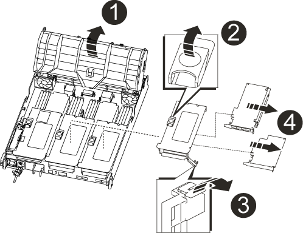

= 更换控制器模块硬件—AFF A700s
:allow-uri-read: 
:icons: font
:imagesdir: ../media/

[role="lead"]
要更换控制器模块硬件，您必须卸下受损的控制器，将 FRU 组件移至更换用的控制器模块，在机箱中安装更换用的控制器模块，然后将系统启动至维护模式。

== 第 1 步：卸下控制器模块

在更换控制器模块或更换控制器模块内的组件时，您必须从机箱中卸下控制器模块。

. 如果您尚未接地，请正确接地。
. 松开将缆线绑在缆线管理设备上的钩环带，然后从控制器模块上拔下系统缆线和 SFP （如果需要），并跟踪缆线的连接位置。
+
将缆线留在缆线管理设备中，以便在重新安装缆线管理设备时，缆线排列有序。

. 从源拔下控制器模块电源，然后从电源拔下缆线。
. 将缆线管理设备从控制器模块中取出并放在一旁。
. 向下按两个锁定闩锁，然后同时向下旋转两个闩锁。
+
此控制器模块会从机箱中略微移出。

+
image::../media/drw_a700s_pcm_remove.png[卸下 DRW a700s PCM]

+
[cols="1,4"]
|===

 a| 
image:../media/legend_icon_01.png[""]
| 锁定闩锁 

 a| 
image:../media/legend_icon_02.png[""]
 a| 
锁定销

|===
. 将控制器模块滑出机箱。
+
将控制器模块滑出机箱时，请确保您支持控制器模块的底部。

. 将控制器模块放在平稳的表面上，然后打开通风管：
+
.. 朝控制器模块中间按下通风管两侧的锁定片。
.. 将通风管滑向风扇模块，然后将其向上旋转到完全打开的位置。
+
image::../media/drw_a700s_open_air_duct.png[DRW a700s 开放式通风管]

+
[cols="1,4"]
|===

 a| 
image:../media/legend_icon_01.png[""]
| 通风管锁定卡舌 

 a| 
image:../media/legend_icon_02.png[""]
 a| 
提升板

 a| 
image:../media/legend_icon_03.png[""]
 a| 
通风管

|===

== 第 2 步：移动 NVRAM 卡

在控制器更换过程中，您必须从受损控制器模块的提升板 1 中卸下 NVRAM 卡，然后将该卡安装到更换控制器模块的提升板 1 中。只有在将 DIMM 从受损的控制器模块移至更换用的控制器模块后，才应将提升板 1 重新安装到更换用的控制器模块中。

. 从控制器模块中卸下 NVRAM 提升板提升板 1 ：
+
.. 将提升板左侧的提升板锁定闩锁向上旋转并朝风扇方向旋转。
+
NVRAM 提升板从控制器模块略微升高。

.. 提起 NVRAM 提升板，将其移向风扇，以使提升板上的金属板边缘脱离控制器模块的边缘，然后将提升板竖直向上提出控制器模块。 然后，将其放在平稳的平面上，以便可以访问 NVRAM 卡。
+
image::../media/drw_a700s_nvme_replace.png[DRW a700s NVMe 更换]

+
[cols="1,4"]
|===

 a| 
image:../media/legend_icon_01.png[""]
| 通风管 

 a| 
image:../media/legend_icon_02.png[""]
 a| 
提升板 1 锁定闩锁

 a| 
image:../media/legend_icon_03.png[""]
 a| 
连接到 NVRAM 卡的 NVRAM 电池缆线插头

 a| 
image:../media/legend_icon_04.png[""]
 a| 
卡锁定支架

 a| 
image:../media/legend_icon_05.png[""]
 a| 
NVRAM 卡

|===

. 从提升板模块中卸下 NVRAM 卡：
+
.. 转动提升板模块，以便可以访问 NVRAM 卡。
.. 拔下连接到 NVRAM 卡的 NVRAM 电池缆线。
.. 按下 NVRAM 提升板侧面的锁定支架，然后将其旋转到打开位置。
.. 从提升板模块中卸下 NVRAM 卡。

. 从更换用的控制器模块中卸下 NVRAM 提升板。
. 将 NVRAM 卡安装到 NVRAM 提升板中：
+
.. 将卡与提升板模块上的卡导轨和提升板中的卡插槽对齐。
.. 将卡垂直滑入卡插槽。
+

NOTE: 确保此卡完全，正对着提升板插槽。

.. 将电池缆线连接到 NVRAM 卡上的插槽。
.. 将锁定闩锁旋转到锁定位置，并确保锁定到位。

== 第 3 步：移动 PCIe 卡

在更换控制器过程中，您必须从受损的控制器模块中卸下 PCIe 提升板模块提升板 2 （中间提升板）和提升板 3 （最右侧的提升板），并从提升板模块中卸下 PCIe 卡。 并将其安装在更换用的控制器模块中的相同提升板模块中。将 DIMM 移至更换用的控制器模块后，您需要将提升板模块安装到更换用的控制器模块中。

. 从控制器模块中卸下 PCIe 提升板：
+
.. 卸下 PCIe 卡中可能存在的所有 SFP 模块。
.. 将提升板左侧的模块锁定闩锁向上旋转并朝风扇模块方向旋转。
+
PCIe 提升板从控制器模块略微升高。

.. 提起 PCIe 提升板，将其移向风扇，使提升板上的金属板边缘脱离控制器模块的边缘，将提升板从控制器模块中提出，然后将其放在平稳的平面上。
+

+
[cols="1,4"]
|===

 a| 
image:../media/legend_icon_01.png[""]
| 通风管 

 a| 
image:../media/legend_icon_02.png[""]
 a| 
提升板锁定闩锁

 a| 
image:../media/legend_icon_03.png[""]
 a| 
卡锁定支架

 a| 
image:../media/legend_icon_04.png[""]
 a| 
提升板 2 （中间提升板）和提升板插槽 2 和 3 中的 PCI 卡。

|===

. 从提升板中卸下 PCIe 卡：
+
.. 转动提升板，以便可以访问 PCIe 卡。
.. 按下 PCIe 提升板侧面的锁定支架，然后将其旋转到打开位置。
.. 从提升板中卸下 PCIe 卡。

. 从更换用的控制器模块中卸下相应的提升板。
. 将 PCIe 卡安装到 PCIe 提升板中的同一插槽中：
+
.. 将卡与提升板上的卡导轨和提升板中的卡插槽对齐，然后将其垂直滑入提升板中的插槽。
+

NOTE: 确保此卡完全，正对着提升板插槽。

.. 将锁定闩锁旋转到位，直到其卡入到位。

. 对受损控制器模块中插槽 4 和 5 中的提升板 3 和 PCIe 卡重复上述步骤。

== 第 4 步：移动启动介质

There are two boot media devices in the AFF A700s, a primary and a secondary or backup boot media.您必须将其从受损控制器移至 _replacement_ 控制器，并将其安装到 _replacement_ 控制器中相应的插槽中。

启动介质位于中间 PCIe 提升板模块提升板 2 下。要访问启动介质，必须卸下此 PCIe 模块。

. 找到启动介质：
+
.. 如果需要，打开通风管。
.. 如果需要，请解锁锁定闩锁，然后从控制器模块中卸下提升板，以卸下中间 PCIe 模块提升板 2 。
+
image::../media/drw_a700s_boot_media_replace.png[DRW a700s 启动介质更换]

+
[cols="1,4"]
|===

 a| 
image:../media/legend_icon_01.png[""]
| 通风管 

 a| 
image:../media/legend_icon_02.png[""]
 a| 
提升板 2 （中间 PCIe 模块）

 a| 
image:../media/legend_icon_03.png[""]
 a| 
启动介质螺钉

 a| 
image:../media/legend_icon_04.png[""]
 a| 
启动介质

|===
. 从控制器模块中取出启动介质：
+
.. 使用 1 号十字螺丝刀卸下固定启动介质的螺钉，并将螺钉放在安全位置。
.. 抓住启动介质的两侧，将启动介质轻轻向上旋转，然后将启动介质竖直拉出插槽并放在一旁。

. 将启动介质移至新控制器模块并安装：
+

NOTE: 将启动介质安装到更换控制器模块中与受损控制器模块中安装的相同插槽中；将主启动介质插槽（插槽 1 ）安装到主启动介质插槽中，将二级启动介质插槽（插槽 2 ）安装到二级启动介质插槽中。

+
.. 将启动介质的边缘与插槽外壳对齐，然后将其轻轻直推入插槽。
.. 将启动介质向下旋转到主板。
.. 使用启动介质螺钉将启动介质固定到主板。
+
请勿过度拧紧螺钉，否则可能会损坏启动介质。

== 第 5 步：移动风扇

在更换发生故障的控制器模块时，您必须将受损控制器模块中的风扇移至更换模块。

. 通过挤压风扇模块侧面的锁定卡舌，然后将风扇模块直接从控制器模块中提出来卸下风扇模块。
+
image::../media/drw_a700s_replace_fan.png[DRW a700s 更换风扇]

+
[cols="1,4"]
|===

 a| 
image:../media/legend_icon_01.png[""]
| 风扇锁定卡舌 

 a| 
image:../media/legend_icon_02.png[""]
 a| 
风扇模块

|===
. 将风扇模块移至更换用的控制器模块，然后通过将风扇模块的边缘与控制器模块中的开口对齐来安装此风扇模块，然后将此风扇模块滑入控制器模块，直到锁定闩锁卡入到位为止。
. 对其余风扇模块重复上述步骤。

== 第 6 步：移动系统 DIMM

[role="lead"]
要移动 DIMM ，请找到 DIMM 并将其从受损控制器移至更换控制器，然后按照特定步骤顺序进行操作。

. 找到控制器模块上的 DIMM 。
+
image::../media/drw_a700s_dimm_replace.png[更换 DRW a700s DIMM]

+
[cols="1,4"]
|===

 a| 
image:../media/legend_icon_01.png[""]
| 通风管 

 a| 
image:../media/legend_icon_02.png[""]
 a| 
提升板 1 和 DIMM 插槽 1-4

 a| 
image:../media/legend_icon_03.png[""]
 a| 
提升板 2 和 DIMM 插槽 5-8 和 9-12

 a| 
image:../media/legend_icon_04.png[""]
 a| 
提升板 3 和 DIMM 插槽 13-16

|===
. 记下插槽中 DIMM 的方向，以便可以按正确的方向将 DIMM 插入更换用的控制器模块中。
. 缓慢推动 DIMM 两侧的两个 DIMM 弹出卡舌，将 DIMM 从插槽中弹出，然后将 DIMM 滑出插槽。
+

NOTE: 小心握住 DIMM 的边缘，以避免对 DIMM 电路板上的组件施加压力。

. 找到要安装 DIMM 的插槽。
. 确保连接器上的 DIMM 弹出器卡舌处于打开位置，然后将 DIMM 垂直插入插槽。
+
DIMM 紧紧固定在插槽中，但应很容易插入。如果没有，请将 DIMM 与插槽重新对齐并重新插入。

+

NOTE: 目视检查 DIMM ，确认其均匀对齐并完全插入插槽。

. 小心而稳固地推动 DIMM 的上边缘，直到弹出器卡舌卡入到位，卡入到位于 DIMM 两端的缺口上。
. 对其余 DIMM 重复上述步骤。

== 第 7 步：安装 NVRAM 模块

要安装 NVRAM 模块，必须按照特定步骤顺序进行操作。

. 将此提升板安装到控制器模块中：
+
.. 将竖板的边缘与控制器模块金属板的下侧对齐。
.. 沿着控制器模块中的插脚引导此提升板，然后将此提升板降低到控制器模块中。
.. 向下转动锁定闩锁并将其卡入锁定位置。
+
锁定后，锁定闩锁将与提升板顶部平齐，而提升板恰好位于控制器模块中。

.. 重新插入从 PCIe 卡中卸下的所有 SFP 模块。

== 第 8 步：移动 NVRAM 电池

更换控制器模块时，必须将 NVRAM 电池从受损控制器模块移至更换用的控制器模块

. 找到提升板模块左侧的 NVRAM 电池提升板 1 。
+
image::../media/drw_a700s_nvme_battery_replace.png[DRW a700s NVMe 电池更换]

+
[cols="1,4"]
|===

 a| 
image:../media/legend_icon_01.png[""]
| NVRAM 电池插头 

 a| 
image:../media/legend_icon_02.png[""]
 a| 
蓝色 NVRAM 电池锁定选项卡

|===
. 找到电池插头，然后挤压电池插头正面的夹子，将插头从插槽中释放，然后从插槽中拔下电池缆线。
. 抓住电池并按下标记为推送的蓝色锁定卡舌，然后将电池从电池架和控制器模块中提出。
. 将电池组移至更换用的控制器模块，然后将其安装到 NVRAM 提升板中：
+
.. 沿着金属板侧墙向下滑动电池组，直到侧面板上的支撑卡舌扣入电池组上的插槽，并且电池组闩锁扣入并锁定到位。
.. 用力向下按电池组，确保其锁定到位。
.. 将电池插头插入提升板插槽，并确保插头锁定到位。

== 第 9 步：安装 PCIe 提升板

要安装 PCIe 提升板，必须按照特定步骤顺序进行操作。

. 如果您尚未接地，请正确接地。
. 将此提升板安装到控制器模块中：
+
.. 将竖板的边缘与控制器模块金属板的下侧对齐。
.. 沿着控制器模块中的插脚引导此提升板，然后将此提升板降低到控制器模块中。
.. 向下转动锁定闩锁并将其卡入锁定位置。
+
锁定后，锁定闩锁将与提升板顶部平齐，而提升板恰好位于控制器模块中。

.. 重新插入从 PCIe 卡中卸下的所有 SFP 模块。

. 对受损控制器模块中插槽 4 和 5 中的提升板 3 和 PCIe 卡重复上述步骤。

== 第 10 步：移动电源

在更换控制器模块时，您必须将受损控制器模块中的电源和电源设备挡片移至替代控制器模块。

. 如果您尚未接地，请正确接地。
. 旋转凸轮把手，以便在按下锁定卡舌的同时，可以将电源从控制器模块中拉出。
+

CAUTION: 电源不足。从控制器模块中取出时，请始终用双手托住它，以免它突然从控制器模块中自由转动并给您造成损害。

+
image::../media/drw_a700s_replace_psu.gif[DRW a700s 更换 PSU]

+
|===

 a| 
image:../media/legend_icon_01.png[""]
| 蓝色电源锁定卡舌 

 a| 
image:../media/legend_icon_02.png[""]
 a| 
电源

|===
. 将电源移至新控制器模块，然后安装它。
. 用双手支撑电源边缘并将其与控制器模块的开口对齐，然后将电源轻轻推入控制器模块，直到锁定卡舌卡入到位。
+
电源只能与内部连接器正确接合并单向锁定到位。

+

NOTE: 为避免损坏内部连接器，请勿在将电源滑入系统时用力过大。

. 从受损控制器模块中卸下 PSU 空白面板，然后将其安装到更换用的控制器模块中。

== 第 11 步：安装控制器模块

将所有组件从受损控制器模块移至更换控制器模块后，您必须将更换控制器模块安装到机箱中，然后将其启动至维护模式。

. 如果您尚未接地，请正确接地。
. 如果尚未关闭通风管：
+
.. 将通风管一直旋转到控制器模块。
.. 向提升板滑动通风管，直到锁定卡舌卡入到位。
.. 检查通风管，确保其正确就位并锁定到位。
+
image::../media/drw_a700s_close_air_duct.png[DRW a700s 封闭通风管]

+
|===

 a| 
image:../media/legend_icon_01.png[""]
| 锁定卡舌 

 a| 
image:../media/legend_icon_02.png[""]
 a| 
滑动柱塞

|===
. 将控制器模块的末端与机箱中的开口对齐，然后将控制器模块轻轻推入系统的一半。
+

NOTE: 请勿将控制器模块完全插入机箱中，除非系统指示您这样做。

. 仅为管理和控制台端口布线，以便您可以访问系统以执行以下各节中的任务。
+

NOTE: 您将在此操作步骤中稍后将其余缆线连接到控制器模块。

. 完成控制器模块的重新安装：
+
.. 将控制器模块牢牢推入机箱，直到它与中板相距并完全就位。
+
控制器模块完全就位后，锁定闩锁会上升。

+

NOTE: 将控制器模块滑入机箱时，请勿用力过大，以免损坏连接器。

+
控制器模块一旦完全固定在机箱中，就会开始启动。准备中断启动过程。

.. 向上旋转锁定闩锁，使其倾斜，以清除锁定销，然后将其降低到锁定位置。
.. 按`Ctrl-C`以中断启动过程。

. 将系统缆线和收发器模块插入控制器模块，然后重新安装缆线管理设备。
. 将电源线插入电源，然后重新安装电源线固定器。
. 如果您的系统配置为在 40 GbE NIC 或板载端口上支持 10 GbE 集群互连和数据连接，请在维护模式下使用 nicadmin convert 命令将这些端口转换为 10 GbE 连接。
+

NOTE: 请务必在完成转换后退出维护模式。

