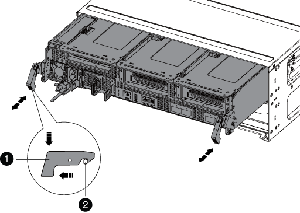

= 更换 DIMM - AFF A700s
:allow-uri-read: 
:icons: font
:imagesdir: ../media/

[role="lead"]
如果系统注册的可更正错误更正代码（ ECC ）数量不断增加，则必须更换控制器模块中的 DIMM ；否则会导致系统崩溃。

系统中的所有其他组件必须正常运行；否则，您必须联系技术支持。

您必须将故障组件更换为从提供商处收到的替代 FRU 组件。

== 第 1 步：关闭受损控制器

要关闭受损控制器，您必须确定控制器的状态，并在必要时接管控制器，以便运行正常的控制器继续从受损控制器存储提供数据。

If you have a cluster with more than two nodes, it must be in quorum.如果集群未达到仲裁或运行状况良好的控制器在资格和运行状况方面显示 false ，则必须在关闭受损控制器之前更正问题描述 。

link:https://docs.netapp.com/us-en/ontap/system-admin/synchronize-node-cluster-task.html?q=Quorum["将节点与集群同步"^]

.步骤
. 如果受损控制器属于 HA 对，请从运行正常的控制器的控制台禁用自动交还： `storage failover modify -node local -auto-giveback false`
. 将受损控制器显示为 LOADER 提示符：
+
[cols="1,2"]
|===
| 如果受损控制器显示 ... | 那么 ... 

 a| 
LOADER 提示符
 a| 
转至下一步。

 a| 
`正在等待交还 ...`
 a| 
按 Ctrl-C ，然后回答 `y` 。

 a| 
系统提示符或密码提示符（输入系统密码）
 a| 
接管或暂停受损控制器： `storage failover takeover -ofnode _impaired_node_name_`

当受损控制器显示 `Waiting for giveback...` 时，按 Ctrl-C ，然后回答 `y` 。

|===

== 第 2 步：卸下控制器模块

在更换控制器模块或更换控制器模块内的组件时，您必须从机箱中卸下控制器模块。

. 如果您尚未接地，请正确接地。
. 松开将缆线绑在缆线管理设备上的钩环带，然后从控制器模块上拔下系统缆线和 SFP （如果需要），并跟踪缆线的连接位置。
+
将缆线留在缆线管理设备中，以便在重新安装缆线管理设备时，缆线排列有序。

. 从源拔下控制器模块电源，然后从电源拔下缆线。
. 将缆线管理设备从控制器模块中取出并放在一旁。
. 向下按两个锁定闩锁，然后同时向下旋转两个闩锁。
+
此控制器模块会从机箱中略微移出。

+

+
|===

 a| 
image:../media/legend_icon_01.png["标注编号1"]
 a| 
锁定闩锁

 a| 
image:../media/legend_icon_02.png["标注编号2"]
 a| 
锁定销

|===
. 将控制器模块滑出机箱。
+
将控制器模块滑出机箱时，请确保您支持控制器模块的底部。

. 将控制器模块放在平稳的表面上，然后打开通风管：
+
.. 朝控制器模块中间按下通风管两侧的锁定片。
.. 将通风管滑向风扇模块，然后将其向上旋转到完全打开的位置。
+
image::../media/drw_a700s_open_air_duct.png[DRW a700s 开放式通风管]

+
[cols="1,4"]
|===

 a| 
image:../media/legend_icon_01.png["标注编号1"]
 a| 
通风管锁定卡舌

 a| 
image:../media/legend_icon_02.png["标注编号2"]
 a| 
提升板

 a| 
image:../media/legend_icon_03.png["标注编号3"]
 a| 
通风管

|===

== 第 3 步：更换 DIMM

要更换DIMM、您必须使用控制器模块内部的DIMM映射在控制器模块中找到该DIMM、然后按照特定步骤顺序进行更换。

. 如果您尚未接地，请正确接地。
. 卸下适用的提升板。
+
image::../media/drw_a700s_dimm_replace.png[更换 DRW a700s DIMM]

+
[cols="1,4"]
|===

 a| 
image:../media/legend_icon_01.png["标注编号1"]
 a| 
通风管盖

 a| 
image:../media/legend_icon_02.png["标注编号2"]
 a| 
提升板 1 和 DIMM 插槽 1-4

 a| 
image:../media/legend_icon_03.png["标注编号3"]
 a| 
提升板 2 和 DIMM 插槽 5-8 和 9-12

 a| 
image:../media/legend_icon_04.png["标注编号4"]
 a| 
提升板 3 和 DIMM 13-16

|===
+
** 如果要卸下或移动插槽 1-4 中的 DIMM ，请拔下 NVRAM 电池，解锁提升板 1 上的锁定闩锁，然后卸下提升板。
** 如果要卸下或移动插槽 5-8 或 9-12 中的 DIMM ，请解锁提升板 2 上的锁定闩锁，然后卸下提升板。
** 如果要卸下或移动内存组 13-16 中的 DIMM ，请解锁提升板 3 上的锁定闩锁，然后卸下提升板。

. 记下插槽中 DIMM 的方向，以便可以按正确的方向插入更换用的 DIMM 。
. 缓慢推动 DIMM 两侧的两个 DIMM 弹出卡舌，将 DIMM 从插槽中弹出，然后将 DIMM 滑出插槽。
+

NOTE: 小心握住 DIMM 的边缘，以避免对 DIMM 电路板上的组件施加压力。

. 从防静电运输袋中取出更换用的 DIMM ，拿住 DIMM 的边角并将其与插槽对齐。
+
DIMM 插脚之间的缺口应与插槽中的突起对齐。

. 确保连接器上的 DIMM 弹出器卡舌处于打开位置，然后将 DIMM 垂直插入插槽。
+
DIMM 紧紧固定在插槽中，但应很容易插入。如果没有，请将 DIMM 与插槽重新对齐并重新插入。

+

NOTE: 目视检查 DIMM ，确认其均匀对齐并完全插入插槽。

. 小心而稳固地推动 DIMM 的上边缘，直到弹出器卡舌卡入到位，卡入到位于 DIMM 两端的缺口上。
. 重新安装从控制器模块中卸下的所有提升板。
+
如果您已卸下 NVRAM 提升板和提升板 1 ，请确保将 NVRAM 电池插入控制器模块。

. 关闭通风管。

== 步骤4：重新安装控制器模块并启动系统

更换控制器模块中的 FRU 后，您必须重新安装控制器模块并重新启动它。

对于在同一机箱中具有两个控制器模块的 HA 对，安装控制器模块的顺序尤为重要，因为一旦将其完全装入机箱，它就会尝试重新启动。

. 如果您尚未接地，请正确接地。
. 将控制器模块的末端与机箱中的开口对齐，然后将控制器模块轻轻推入系统的一半。
+

NOTE: 请勿将控制器模块完全插入机箱中，除非系统指示您这样做。

. 根据需要重新对系统进行布线。
+
如果您已卸下介质转换器（ QSFP 或 SFP ），请记得在使用光缆时重新安装它们。

. 将电源线插入电源，重新安装电源线锁定环，然后将电源连接到电源。
. 完成控制器模块的重新安装：
+
.. 如果尚未重新安装缆线管理设备，请重新安装该设备。
.. 将控制器模块牢牢推入机箱，直到它与中板相距并完全就位。
+
控制器模块完全就位后，锁定闩锁会上升。

+

NOTE: 将控制器模块滑入机箱时，请勿用力过大，以免损坏连接器。

+
控制器模块一旦完全固定在机箱中，就会开始启动。

.. 向上旋转锁定闩锁，使其倾斜，以清除锁定销，然后将其降低到锁定位置。

== 第5步：将故障部件退回给NetApp

按照套件随附的 RMA 说明将故障部件退回 NetApp 。请参见 https://mysupport.netapp.com/site/info/rma["部件退回和放大器；更换"] 第页，了解更多信息。
