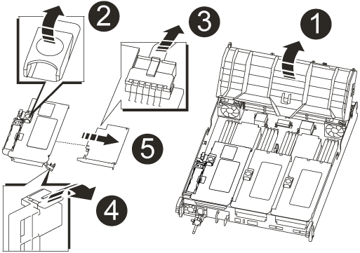

= 更换 NVRAM 模块和 NVRAM DIMM — AFF A700s
:allow-uri-read: 
:icons: font
:imagesdir: ../media/

[role="lead"]
要更换发生故障的 NVRAM 卡，您必须从控制器模块中卸下 NVRAM 提升板提升板 1 ，从提升板中卸下故障卡，在提升板中安装新的 NVRAM 卡，然后在控制器模块中重新安装提升板。由于系统 ID 源自 NVRAM 卡，因此，如果更换模块，则属于系统的磁盘将重新分配给新的系统 ID 。

.开始之前
* 所有磁盘架都必须正常工作。
* 如果您的系统位于 HA 对中，则配对控制器必须能够接管与要更换的 NVRAM 模块关联的控制器。
* 此操作步骤使用以下术语：
+
** 受损 _ 控制器是要在其中执行维护的控制器。
** _health_ 控制器是受损控制器的 HA 配对控制器。

* 此操作步骤包括自动或手动将磁盘重新分配给与新 NVRAM 模块关联的控制器模块的步骤。当操作步骤中指示您重新分配磁盘时，您必须重新分配这些磁盘。在交还之前完成磁盘重新分配可能会出现发生原因问题。
* 您必须将故障组件更换为从提供商处收到的替代 FRU 组件。
* 您不能在此操作步骤中更改任何磁盘或磁盘架。

== 第 1 步：关闭受损控制器

.步骤
要关闭受损控制器，您必须确定控制器的状态，并在必要时接管控制器，以便运行正常的控制器继续从受损控制器存储提供数据。

If you have a cluster with more than two nodes, it must be in quorum.如果集群未达到仲裁或运行状况良好的控制器在资格和运行状况方面显示false、则必须在关闭受损控制器之前更正问题描述 ；请参见 link:https://docs.netapp.com/us-en/ontap/system-admin/synchronize-node-cluster-task.html?q=Quorum["将节点与集群同步"^]。

.步骤
. 如果启用了 AutoSupport ，则通过调用 AutoSupport 消息禁止自动创建案例： `ssystem node AutoSupport invoke -node * -type all -message MAIN=_number_of_hours_down_h`
+
以下 AutoSupport 消息禁止自动创建案例两小时： `cluster1 ： * > system node AutoSupport invoke -node * -type all -message MAINT=2h`

. 如果受损控制器属于 HA 对，请从运行正常的控制器的控制台禁用自动交还： `storage failover modify -node local -auto-giveback false`
. 将受损控制器显示为 LOADER 提示符：
+
[cols="1,2"]
|===
| 如果受损控制器显示 ... | 那么 ... 

 a| 
LOADER 提示符
 a| 
转至 "Remove controller module" 。

 a| 
正在等待交还
 a| 
按 Ctrl-C ，然后回答 `y` 。

 a| 
系统提示符或密码提示符（输入系统密码）
 a| 
从运行正常的控制器接管或暂停受损的控制器： `storage failover takeover -ofnode _impaired_node_name_`

当受损控制器显示 Waiting for giveback... 时，按 Ctrl-C ，然后回答 `y` 。

|===
+
** 如果您使用的是 NetApp 存储加密，则必须按照 _ONTAP 9 NetApp 加密高级指南 _ 的 "`将 SED 返回到未受保护的模式` " 一节中的说明重置 MSID 。
+
https://docs.netapp.com/ontap-9/topic/com.netapp.doc.pow-nve/home.html["《 ONTAP 9 NetApp 加密高级指南》"]

== 第 2 步：卸下控制器模块

在更换控制器模块或更换控制器模块内的组件时，您必须从机箱中卸下控制器模块。

. 如果您尚未接地，请正确接地。
. 松开将缆线绑在缆线管理设备上的钩环带，然后从控制器模块上拔下系统缆线和 SFP （如果需要），并跟踪缆线的连接位置。
+
将缆线留在缆线管理设备中，以便在重新安装缆线管理设备时，缆线排列有序。

. 从源拔下控制器模块电源，然后从电源拔下缆线。
. 将缆线管理设备从控制器模块中取出并放在一旁。
. 向下按两个锁定闩锁，然后同时向下旋转两个闩锁。
+
此控制器模块会从机箱中略微移出。

+
image::../media/drw_a700s_pcm_remove.png[松开控制器模块]

+
[cols="1,4"]
|===

 a| 
image:../media/legend_icon_01.png["标注编号1"]
 a| 
锁定闩锁

 a| 
image:../media/legend_icon_02.png["标注编号2"]
 a| 
锁定销

|===
. 将控制器模块滑出机箱。
+
将控制器模块滑出机箱时，请确保您支持控制器模块的底部。

. 将控制器模块放在平稳的表面上，然后打开通风管：
+
.. 朝控制器模块中间按下通风管两侧的锁定片。
.. 将通风管滑向风扇模块，然后将其向上旋转到完全打开的位置。
+
image::../media/drw_a700s_open_air_duct.png[打开空气管道]

+
[cols="1,4"]
|===

 a| 
image:../media/legend_icon_01.png["标注编号1"]
 a| 
通风管锁定卡舌

 a| 
image:../media/legend_icon_02.png["标注编号2"]
 a| 
提升板

 a| 
image:../media/legend_icon_03.png["标注编号3"]
 a| 
通风管

|===

== 第3步：卸下NVRAM卡

更换 NVRAM 包括：从控制器模块中卸下 NVRAM 提升板提升板 1 ，断开 NVRAM 电池与 NVRAM 卡的连接，卸下故障 NVRAM 卡并安装更换的 NVRAM 卡，然后将 NVRAM 提升板重新安装回控制器模块。

. 如果您尚未接地，请正确接地。
. 从控制器模块中卸下 NVRAM 提升板提升板 1 ：
+
.. 将提升板左侧的提升板锁定闩锁向上旋转并朝风扇方向旋转。
+
NVRAM 提升板从控制器模块略微升高。

.. 提起 NVRAM 提升板，将其移向风扇，以使提升板上的金属板边缘脱离控制器模块的边缘，然后将提升板竖直向上提出控制器模块。 然后，将其放在平稳的平面上，以便可以访问 NVRAM 卡。
+

+
[cols="1,4"]
|===

 a| 
image:../media/legend_icon_01.png["标注编号1"]
 a| 
通风管

 a| 
image:../media/legend_icon_02.png["标注编号2"]
 a| 
提升板 1 锁定闩锁

 a| 
image:../media/legend_icon_03.png["标注编号3"]
 a| 
连接到 NVRAM 卡的 NVRAM 电池缆线插头

 a| 
image:../media/legend_icon_04.png["标注编号4"]
 a| 
卡锁定支架

 a| 
image:../media/legend_icon_05.png["标注编号5"]
 a| 
NVRAM 卡

|===

. 从提升板模块中卸下 NVRAM 卡：
+
.. 转动提升板模块，以便可以访问 NVRAM 卡。
.. 拔下连接到 NVRAM 卡的 NVRAM 电池缆线。
.. 按下 NVRAM 提升板侧面的锁定支架，然后将其旋转到打开位置。
.. 从提升板模块中卸下 NVRAM 卡。

. 将 NVRAM 卡安装到 NVRAM 提升板中：
+
.. 将卡与提升板模块上的卡导轨和提升板中的卡插槽对齐。
.. 将卡垂直滑入卡插槽。
+

NOTE: 确保此卡完全，正对着提升板插槽。

.. 将电池缆线连接到 NVRAM 卡上的插槽。
.. 将锁定闩锁旋转到锁定位置，并确保锁定到位。

. 将此提升板安装到控制器模块中：
+
.. 将竖板的边缘与控制器模块金属板的下侧对齐。
.. 沿着控制器模块中的插脚引导此提升板，然后将此提升板降低到控制器模块中。
.. 向下转动锁定闩锁并将其卡入锁定位置。
+
锁定后，锁定闩锁将与提升板顶部平齐，而提升板恰好位于控制器模块中。

.. 重新插入从 PCIe 卡中卸下的所有 SFP 模块。

== 第 4 步：重新安装控制器模块并启动系统

更换控制器模块中的 FRU 后，您必须重新安装控制器模块并重新启动它。

对于在同一机箱中具有两个控制器模块的 HA 对，安装控制器模块的顺序尤为重要，因为一旦将其完全装入机箱，它就会尝试重新启动。

. 如果您尚未接地，请正确接地。
. 将控制器模块的末端与机箱中的开口对齐，然后将控制器模块轻轻推入系统的一半。
+

NOTE: 请勿将控制器模块完全插入机箱中，除非系统指示您这样做。

. 根据需要重新对系统进行布线。
+
如果您已卸下介质转换器（ QSFP 或 SFP ），请记得在使用光缆时重新安装它们。

. 将电源线插入电源，重新安装电源线锁定环，然后将电源连接到电源。
. 完成控制器模块的重新安装：
+
.. 如果尚未重新安装缆线管理设备，请重新安装该设备。
.. 将控制器模块牢牢推入机箱，直到它与中板相距并完全就位。
+
控制器模块完全就位后，锁定闩锁会上升。

+

NOTE: 将控制器模块滑入机箱时，请勿用力过大，以免损坏连接器。

+
控制器模块一旦完全固定在机箱中，就会开始启动。准备中断启动过程。

.. 向上旋转锁定闩锁，使其倾斜，以清除锁定销，然后将其降低到锁定位置。
.. 出现 `Press Ctrl-C for Boot Menu` 时按 `Ctrl-C` 以中断启动过程。
.. 从显示的菜单中选择启动至维护模式的选项。

== 第5步：验证HA系统上的系统ID更改

您必须在启动 _replacement_ 控制器时确认系统 ID 更改，然后确认更改是否已实施。

此操作步骤仅适用于在 HA 对中运行 ONTAP 的系统。

. 如果 _replacement_ 控制器处于维护模式（显示 ` * >` 提示符），请退出维护模式并转到 LOADER 提示符： `halt`
. 在 _replacement_ 控制器上的 LOADER 提示符处，启动控制器，如果系统因系统 ID 不匹配而提示您覆盖系统 ID ，请输入 `y` ：``boot_ontap``
. 请等待 `Waiting for giveback...` 消息显示在 _replacement_ 控制器控制台上，然后从运行正常的控制器中验证是否已自动分配新的配对系统 ID ： `storage failover show`
+
在命令输出中，您应看到一条消息，指出受损控制器上的系统 ID 已更改，其中显示了正确的旧 ID 和新 ID 。In the following example, node2 has undergone replacement and has a new system ID of 151759706.

+
[listing]
----
node1> `storage failover show`
                                    Takeover
Node              Partner           Possible     State Description
------------      ------------      --------     -------------------------------------
node1             node2             false        System ID changed on partner (Old:
                                                  151759755, New: 151759706), In takeover
node2             node1             -            Waiting for giveback (HA mailboxes)
----
. 在运行正常的控制器中，验证是否已保存任何核心转储：
+
.. 更改为高级权限级别： `set -privilege advanced`
+
系统提示您继续进入高级模式时，您可以回答 `y` 。此时将显示高级模式提示符（ * > ）。

.. 保存任何核心转储： `ssystem node run -node _local-node-name_ partner savecore`
.. 等待 `savecore`命令完成，然后再发出交还。
+
您可以输入以下命令来监控 savecore 命令的进度： `ssystem node run -node _local-node-name_ partner savecore -s`

.. 返回到管理权限级别： `set -privilege admin`

. 交还控制器：
+
.. 从运行正常的控制器中，交还更换的控制器的存储： `storage failover giveback -ofnode _replacement_node_name_`
+
_replacement_ 控制器将收回其存储并完成启动。

+
如果由于系统 ID 不匹配而提示您覆盖系统 ID ，则应输入 `y` 。

+

NOTE: 如果交还被否决，您可以考虑覆盖此否决。

+
http://mysupport.netapp.com/documentation/productlibrary/index.html?productID=62286["查找适用于您的 ONTAP 9 版本的《高可用性配置指南》"]

.. 交还完成后，确认 HA 对运行状况良好且可以接管： `storage failover show`
+
`storage failover show` 命令的输出不应包含 System ID changed on partner 消息。

. 验证是否已正确分配磁盘： `storage disk show -ownership`
+
属于 _replacement_ 控制器的磁盘应显示新的系统 ID 。In the following example, the disks owned by node1 now show the new system ID, 1873775277:

+
[listing]
----
node1> `storage disk show -ownership`

Disk  Aggregate Home  Owner  DR Home  Home ID    Owner ID  DR Home ID Reserver  Pool
----- ------    ----- ------ -------- -------    -------    -------  ---------  ---
1.0.0  aggr0_1  node1 node1  -        1873775277 1873775277  -       1873775277 Pool0
1.0.1  aggr0_1  node1 node1           1873775277 1873775277  -       1873775277 Pool0
.
.
.
----
. 验证每个控制器是否存在所需的卷： `vol show -node node-name`
. 如果您在重新启动时禁用了自动接管，请从运行正常的控制器启用它： `storage failover modify -node replacement-node-name -onreboot true`

== 第 6 步：将故障部件退回 NetApp

按照套件随附的 RMA 说明将故障部件退回 NetApp 。 https://mysupport.netapp.com/site/info/rma["部件退回和更换"]有关详细信息、请参见页面。
