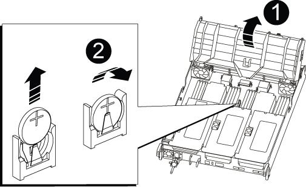

= 更换实时时钟电池— AFF A700s
:allow-uri-read: 
:icons: font
:imagesdir: ../media/

[role="lead"]
您需要更换控制器模块中的实时时钟（ Real-Time Clock ， RTC ）电池，以便依靠准确时间同步的系统服务和应用程序可以继续运行。

* 您可以将此操作步骤与系统支持的所有 ONTAP 版本结合使用
* 系统中的所有其他组件必须正常运行；否则，您必须联系技术支持。

== 第 1 步：关闭受损控制器

要关闭受损控制器，您必须确定控制器的状态，并在必要时接管控制器，以便运行正常的控制器继续从受损控制器存储提供数据。

If you have a cluster with more than two nodes, it must be in quorum.如果集群未达到仲裁或运行状况良好的控制器在资格和运行状况方面显示false、则必须在关闭受损控制器之前更正问题描述 ；请参见 link:https://docs.netapp.com/us-en/ontap/system-admin/synchronize-node-cluster-task.html?q=Quorum["将节点与集群同步"^]。

.步骤
. 如果启用了 AutoSupport ，则通过调用 AutoSupport 消息禁止自动创建案例： `ssystem node AutoSupport invoke -node * -type all -message MAIN=_number_of_hours_down_h`
+
以下 AutoSupport 消息禁止自动创建案例两小时： `cluster1 ： * > system node AutoSupport invoke -node * -type all -message MAINT=2h`

. 如果受损控制器属于 HA 对，请从运行正常的控制器的控制台禁用自动交还： `storage failover modify -node local -auto-giveback false`
. 将受损控制器显示为 LOADER 提示符：
+
[cols="1,2"]
|===
| 如果受损控制器显示 ... | 那么 ... 

 a| 
LOADER 提示符
 a| 
转至 "Remove controller module" 。

 a| 
正在等待交还
 a| 
按 Ctrl-C ，然后回答 `y` 。

 a| 
系统提示符或密码提示符（输入系统密码）
 a| 
从运行正常的控制器接管或暂停受损的控制器： `storage failover takeover -ofnode _impaired_node_name_`

当受损控制器显示 Waiting for giveback... 时，按 Ctrl-C ，然后回答 `y` 。

|===

== 第 2 步：卸下控制器模块

在更换控制器模块或更换控制器模块内的组件时，您必须从机箱中卸下控制器模块。

. 如果您尚未接地，请正确接地。
. 松开将缆线绑在缆线管理设备上的钩环带，然后从控制器模块上拔下系统缆线和 SFP （如果需要），并跟踪缆线的连接位置。
+
将缆线留在缆线管理设备中，以便在重新安装缆线管理设备时，缆线排列有序。

. 从源拔下控制器模块电源，然后从电源拔下缆线。
. 将缆线管理设备从控制器模块中取出并放在一旁。
. 向下按两个锁定闩锁，然后同时向下旋转两个闩锁。
+
此控制器模块会从机箱中略微移出。

+
image::../media/drw_a700s_pcm_remove.png[卸下 DRW a700s PCM]

+
|===

 a| 
image:../media/legend_icon_01.png[""]
 a| 
锁定闩锁

 a| 
image:../media/legend_icon_02.png[""]
 a| 
锁定销

|===
. 将控制器模块滑出机箱。
+
将控制器模块滑出机箱时，请确保您支持控制器模块的底部。

. 将控制器模块放在平稳的表面上，然后打开通风管：
+
.. 朝控制器模块中间按下通风管两侧的锁定片。
.. 将通风管滑向风扇模块，然后将其向上旋转到完全打开的位置。
+
image::../media/drw_a700s_open_air_duct.png[DRW a700s 开放式通风管]

+
[cols="1,3"]
|===

 a| 
image:../media/legend_icon_01.png[""]
 a| 
通风管锁定卡舌

 a| 
image:../media/legend_icon_02.png[""]
 a| 
提升板

 a| 
image:../media/legend_icon_03.png[""]
 a| 
通风管

|===

== 第 3 步：更换 RTC 电池

要更换 RTC 电池，请在控制器中找到该电池，然后按照特定步骤顺序进行操作。

. 如果您尚未接地，请正确接地。
. 找到 RTC 电池。
+

+
[cols="1,3"]
|===

 a| 
image:../media/legend_icon_01.png[""]
 a| 
通风管

 a| 
image:../media/legend_icon_02.png[""]
 a| 
RTC 电池和外壳

|===
. 将电池轻轻推离电池架，将其旋转出电池架，然后将其从电池架中取出。
+

NOTE: 从电池架中取出电池时，请注意电池的极性。电池标有加号，必须正确放置在支架中。电池座旁边的加号用于指示电池的位置。

. 从防静电运输袋中取出更换用电池。
. 记下 RTC 电池的极性，然后将电池倾斜并向下推，将其插入电池架中。
. 目视检查电池，确保其已完全安装到电池架中，并且极性正确。

== 第 4 步：重新安装控制器模块并设置更换 RTC 电池后的时间 / 日期

更换控制器模块中的组件后，您必须在系统机箱中重新安装控制器模块，重置控制器上的时间和日期，然后启动它。

. 如果尚未关闭通风管或控制器模块盖板，请将其关闭。
. 将控制器模块的末端与机箱中的开口对齐，然后将控制器模块轻轻推入系统的一半。
+
请勿将控制器模块完全插入机箱中，除非系统指示您这样做。

. 根据需要重新对系统进行布线。
+
如果您已卸下介质转换器（ QSFP 或 SFP ），请记得在使用光缆时重新安装它们。

. 如果已拔下电源，请重新插入电源，然后重新安装电源线固定器。
. 完成控制器模块的重新安装：
+
.. 将控制器模块牢牢推入机箱，直到它与中板相距并完全就位。
+
控制器模块完全就位后，锁定闩锁会上升。

+

NOTE: 将控制器模块滑入机箱时，请勿用力过大，以免损坏连接器。

+
控制器模块一旦完全固定在机箱中，就会开始启动。

.. 向上旋转锁定闩锁，使其倾斜，以清除锁定销，然后将其降低到锁定位置。
.. 如果尚未重新安装缆线管理设备，请重新安装该设备。
.. 在 LOADER 提示符处暂停控制器。

. 重置控制器上的时间和日期：
+
.. 使用 `show date` 命令检查运行状况良好的控制器上的日期和时间。
.. 在目标控制器上的 LOADER 提示符处，检查时间和日期。
.. 如有必要，请使用 `set date MM/dd/yyyy` 命令修改日期。
.. 如有必要，请使用 `set time hh ： mm ： ss` 命令在 GMT 中设置时间。
.. 确认目标控制器上的日期和时间。

. 在 LOADER 提示符处，输入 `bye` 以重新初始化 PCIe 卡和其他组件，并让控制器重新启动。
. 交还控制器的存储，使其恢复正常运行： `storage failover giveback -ofnode _impaired_node_name_`
. 如果已禁用自动交还，请重新启用它： `storage failover modify -node local -auto-giveback true`

== 第 5 步：将故障部件退回 NetApp

按照套件随附的 RMA 说明将故障部件退回 NetApp 。请参见 https://["部件退回和放大器；更换"] 第页，了解更多信息。
