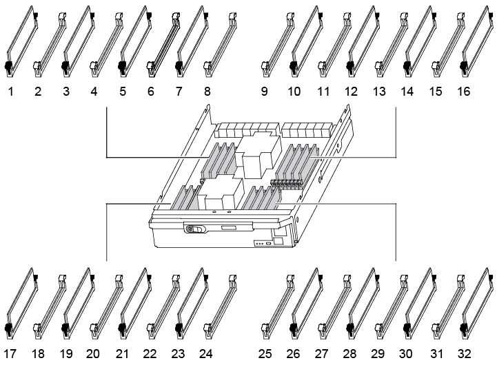

= 更换 DIMM - AFF A900
:allow-uri-read: 
:icons: font
:imagesdir: ../media/

[role="lead"]
如果系统注册的可更正错误更正代码（ ECC ）数量不断增加，则必须更换控制器模块中的 DIMM ；否则会导致系统崩溃。

系统中的所有其他组件必须正常运行；否则，您必须联系技术支持。

您必须将故障组件更换为从提供商处收到的替代 FRU 组件。

== 第 1 步：关闭受损控制器

[role="lead"]
使用以下选项之一关闭或接管受损控制器。

[role="tabbed-block"]
====
.选项 1 ：大多数系统
--
要关闭受损控制器，您必须确定控制器的状态，并在必要时接管控制器，以便运行正常的控制器继续从受损控制器存储提供数据。

.关于此任务
* 如果您使用的是 NetApp 存储加密，则必须按照 _ONTAP 9 NetApp 加密高级指南 _ 的 "`将 SED 返回到未受保护的模式` " 一节中的说明重置 MSID 。
+
https://docs.netapp.com/ontap-9/topic/com.netapp.doc.pow-nve/home.html["《 ONTAP 9 NetApp 加密高级指南》"^]

* 如果您使用的是SAN系统、则必须已检查受损控制器SCSI刀片式服务器的事件消息(`event log show`)。
+
每个 SCSI 刀片式服务器进程应与集群中的其他节点保持仲裁关系。在继续更换之前，必须先解决所有问题。

* If you have a cluster with more than two nodes, it must be in quorum.如果集群未达到仲裁或运行状况良好的控制器在资格和运行状况方面显示 false ，则必须在关闭受损控制器之前更正问题描述 ；请参见 link:https://docs.netapp.com/us-en/ontap/system-admin/index.html["CLI 管理概述"^]。
* 如果您使用的是 MetroCluster 配置，则必须确认已配置 MetroCluster 配置状态，并且节点处于已启用且正常的状态（`MetroCluster node show` ）。

.步骤
. 如果启用了 AutoSupport ，则通过调用 AutoSupport 消息禁止自动创建案例： `ssystem node AutoSupport invoke -node * -type all -message MAINT=number_of_hours_downh`
+
以下 AutoSupport 消息禁止自动创建案例两小时： `cluster1 ： * > system node AutoSupport invoke -node * -type all -message MAINT=2h`

. 从运行正常的控制器的控制台禁用自动交还： `storage failover modify – node local -auto-giveback false`
+

NOTE: 当您看到_Do you want to disable auto-giveback？_时、输入`y`。

. 将受损控制器显示为 LOADER 提示符：
+
[cols="1,2"]
|===
| 如果受损控制器显示 ... | 那么 ... 

 a| 
LOADER 提示符
 a| 
转至 "Remove controller module" 。

 a| 
正在等待交还
 a| 
按 Ctrl-C ，然后在出现提示时回答 `y` 。

 a| 
系统提示符或密码提示符（输入系统密码）
 a| 
从运行正常的控制器接管或暂停受损的控制器： `storage failover takeover -ofnode _impaired_node_name_`

当受损控制器显示 Waiting for giveback... 时，按 Ctrl-C ，然后回答 `y` 。

|===

--
.选项 2 ：控制器位于 MetroCluster 中
--

NOTE: 如果您的系统采用双节点 MetroCluster 配置，请勿使用此操作步骤。

要关闭受损控制器，您必须确定控制器的状态，并在必要时接管控制器，以便运行正常的控制器继续从受损控制器存储提供数据。

* If you have a cluster with more than two nodes, it must be in quorum.如果集群未达到仲裁或运行状况良好的控制器在资格和运行状况方面显示 false ，则必须在关闭受损控制器之前更正问题描述 ；请参见 link:https://docs.netapp.com/us-en/ontap/system-admin/index.html["CLI 管理概述"^]。
* 如果您使用的是 MetroCluster 配置，则必须确认已配置 MetroCluster 配置状态，并且节点处于已启用且正常的状态（`MetroCluster node show` ）。

.步骤
. 如果启用了 AutoSupport ，则通过调用 AutoSupport 消息禁止自动创建案例： `ssystem node AutoSupport invoke -node * -type all -message MAINT=number_of_hours_downh`
+
以下 AutoSupport 消息禁止自动创建案例两小时： `cluster1 ： * > system node AutoSupport invoke -node * -type all -message MAINT=2h`

. 从运行正常的控制器的控制台禁用自动交还： `storage failover modify – node local -auto-giveback false`
. 将受损控制器显示为 LOADER 提示符：
+
[cols="1,2"]
|===
| 如果受损控制器显示 ... | 那么 ... 

 a| 
LOADER 提示符
 a| 
转至 "Remove controller module" 。

 a| 
正在等待交还
 a| 
按 Ctrl-C ，然后在出现提示时回答 `y` 。

 a| 
系统提示符或密码提示符（输入系统密码）
 a| 
从运行正常的控制器接管或暂停受损的控制器： `storage failover takeover -ofnode _impaired_node_name_`

当受损控制器显示 Waiting for giveback... 时，按 Ctrl-C ，然后回答 `y` 。

|===

--
====

== 第 2 步：卸下控制器模块

[role="lead"]
要访问控制器内部的组件，您必须先从系统中卸下控制器模块，然后再卸下控制器模块上的盖板。

. 如果您尚未接地，请正确接地。
. 从受损控制器模块拔下缆线，并跟踪缆线的连接位置。
. 向下滑动凸轮把手上的 Terra cotta 按钮，直到其解锁为止。
+
.动画-删除控制器
video::256721fd-4c2e-40b3-841a-adf2000df5fa[panopto]
+
image::../media/drw_a900_remove_PCM.png[DRW a900 删除 PCM]

+
[cols="10,90"]
|===

 a| 
image:../media/legend_icon_01.png[""]
 a| 
凸轮把手释放按钮

 a| 
image:../media/legend_icon_02.png[""]
 a| 
凸轮把手

|===
. 旋转凸轮把手，使其完全脱离机箱，然后将控制器模块滑出机箱。
+
将控制器模块滑出机箱时，请确保您支持控制器模块的底部。

. 将控制器模块的盖板朝上放在平稳的平面上，按下盖板上的蓝色按钮，将盖板滑至控制器模块的背面，然后向上转动盖板并将其从控制器模块中提出。
+
image::../media/drw_a900_PCM_open.png[DRW a900 PCM 已打开]

+
[cols="10,90"]
|===

 a| 
image:../media/legend_icon_01.png[""]
 a| 
控制器模块盖锁定按钮

|===

== 第 3 步：更换 DIMM

[role="lead"]
要更换 DIMM ，请在控制器中找到它们，然后按照特定步骤顺序进行操作。

. 如果您尚未接地，请正确接地。
. 找到控制器模块上的 DIMM 。

. 缓慢推动 DIMM 两侧的两个 DIMM 弹出卡舌，将 DIMM 从插槽中弹出，然后将 DIMM 滑出插槽。
+

IMPORTANT: 小心握住 DIMM 的边缘，以避免对 DIMM 电路板上的组件施加压力。

+
.动画-更换DIMM
video::db161030-298a-4ae4-b902-adf2000e2aa4[panopto]
+
image::../media/drw_a900_replace_PCM_dimms.png[DRW a900 可更换 PCM DIMM]

+
[cols="10,90"]
|===

 a| 
image:../media/legend_icon_01.png[""]
 a| 
DIMM 弹出器卡舌

 a| 
image:../media/legend_icon_02.png[""]
 a| 
DIMM

|===
. 从防静电运输袋中取出更换用的 DIMM ，拿住 DIMM 的边角并将其与插槽对齐。
+
DIMM 插脚之间的缺口应与插槽中的突起对齐。

. 确保连接器上的 DIMM 弹出器卡舌处于打开位置，然后将 DIMM 垂直插入插槽。
+
DIMM 紧紧固定在插槽中，但应很容易插入。如果没有，请将 DIMM 与插槽重新对齐并重新插入。

+

IMPORTANT: 目视检查 DIMM ，确认其均匀对齐并完全插入插槽。

. 小心而稳固地推动 DIMM 的上边缘，直到弹出器卡舌卡入到位，卡入到位于 DIMM 两端的缺口上。
. 合上控制器模块外盖。

== 第 4 步：安装控制器

[role="lead"]
将组件安装到控制器模块后，您必须将控制器模块安装回系统机箱并启动操作系统。

对于在同一机箱中具有两个控制器模块的 HA 对，安装控制器模块的顺序尤为重要，因为一旦将其完全装入机箱，它就会尝试重新启动。

. 如果您尚未接地，请正确接地。
. 如果您尚未更换控制器模块上的外盖，请进行更换。
+
image::../media/drw_a900_PCM_open.png[DRW a900 PCM 已打开]

+
[cols="10,90"]
|===

 a| 
image:../media/legend_icon_01.png[""]
 a| 
控制器模块盖锁定按钮

|===
. 将控制器模块的末端与机箱中的开口对齐，然后将控制器模块轻轻推入系统的一半。
+
.动画-安装控制器
video::099237f3-d7f2-4749-86e2-adf2000df53c[panopto]
+
image::../media/drw_a900_remove_PCM.png[DRW a900 删除 PCM]

+
[cols="10,90"]
|===

 a| 
image:../media/legend_icon_01.png[""]
 a| 
凸轮把手释放按钮

 a| 
image:../media/legend_icon_02.png[""]
 a| 
凸轮把手

|===
+

NOTE: 请勿将控制器模块完全插入机箱中，除非系统指示您这样做。

. 仅为管理和控制台端口布线，以便您可以访问系统以执行以下各节中的任务。
+

NOTE: 您将在此操作步骤中稍后将其余缆线连接到控制器模块。

. 完成控制器模块的重新安装：
+
.. 如果尚未重新安装缆线管理设备，请重新安装该设备。
.. 将控制器模块牢牢推入机箱，直到它与中板相距并完全就位。
+
控制器模块完全就位后，锁定闩锁会上升。

+

IMPORTANT: 将控制器模块滑入机箱时，请勿用力过大，以免损坏连接器。

+
控制器模块一旦完全固定在机箱中，就会开始启动。准备中断启动过程。

.. 向上旋转锁定闩锁，使其倾斜，以清除锁定销，然后将其降低到锁定位置。
.. 出现 Press Ctrl-C for Boot Menu 时，按 `Ctrl-C` 以中断启动过程。
.. 从显示的菜单中选择启动至维护模式的选项。

== 第 5 步：运行系统级诊断

[role="lead"]
安装新 DIMM 后，您应运行诊断。

您的系统必须处于 LOADER 提示符处，才能启动系统级诊断。

诊断过程中的所有命令都是从要更换组件的控制器发出的。

. 如果要维护的控制器不在 LOADER 提示符处，请执行以下步骤：
+
.. 从显示的菜单中选择维护模式选项。
.. 控制器启动到维护模式后，暂停控制器： `halt`
+
问题描述命令后，您应等待系统停留在 LOADER 提示符处。

+

IMPORTANT: 在启动过程中，您可以安全地响应 `y` 提示。

+
*** 如果显示一条提示，警告您在 HA 配置中进入维护模式时，必须确保运行正常的控制器保持关闭状态。

. 在 LOADER 提示符处，访问专为系统级诊断而设计的特殊驱动程序以正常运行： `boot_diags`
+
在启动过程中，您可以安全地对提示 `y` 做出响应，直到显示维护模式提示符（ * > ）为止。

. 对系统内存运行诊断： `sldiag device run -dev mem`
. 验证更换 DIMM 是否未导致硬件问题： `sldiag device status -dev mem -long -state failed`
+
如果没有测试失败，则系统级诊断会返回到提示符，或者会列出因测试组件而导致的失败的完整状态。

. 根据上一步的结果继续操作：
+
[cols="1,2"]
|===
| 如果系统级诊断测试 ... | 那么 ... 

 a| 
已完成，无任何故障
 a| 
.. 清除状态日志： `sldiag device clearstatus`
.. 验证是否已清除日志： `sldiag device status`
+
此时将显示以下默认响应：

+
SLDIAG ：不存在日志消息。

.. 退出维护模式： `halt`
+
控制器将显示 LOADER 提示符。

.. 从 LOADER 提示符处启动控制器： `bye`
.. 使控制器恢复正常运行：

|===
+
[cols="1,2"]
|===
| 如果控制器位于 ... | 那么 ... 

 a| 
HA 对
 a| 
执行交还： `storage failover giveback -ofnode replacement_node_name` * 注意： * 如果禁用了自动交还，请使用 storage failover modify 命令重新启用它。

 a| 
导致某些测试失败
 a| 
确定问题的发生原因：

.. 退出维护模式： `halt`
+
问题描述命令后，请等待，直到系统停留在 LOADER 提示符处。

.. 验证您是否已遵循在运行系统级诊断时确定的所有注意事项，缆线是否已牢固连接以及硬件组件是否已正确安装在存储系统中。
.. 启动您正在维护的控制器模块，在系统提示您进入启动菜单时按 `Ctrl-C` 以中断启动：
+
*** 如果机箱中有两个控制器模块，请将您正在维护的控制器模块完全固定在机箱中。
+
控制器模块在完全就位后启动。

*** 如果机箱中有一个控制器模块，请连接电源，然后将其打开。

.. 从菜单中选择 Boot to maintenance mode 。
.. 输入以下命令退出维护模式： `halt`
+
问题描述命令后，请等待，直到系统停留在 LOADER 提示符处。

.. 重新运行系统级诊断测试。

|===

== 第 6 步：将故障部件退回 NetApp

[role="lead"]
按照套件随附的 RMA 说明将故障部件退回 NetApp 。请参见 https://mysupport.netapp.com/site/info/rma["部件退回和放大器；更换"] 第页，了解更多信息。
