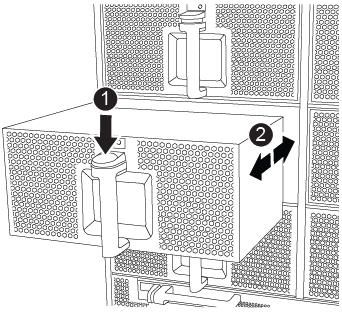

= 更换风扇— AFF A900
:icons: font
:imagesdir: ../media/

[role="lead"]
要在不中断服务的情况下交换风扇模块，您必须执行一系列特定的任务。

IMPORTANT: 您必须在将风扇模块从机箱中卸下后两分钟内更换此风扇模块。系统气流中断，控制器模块或模块在两分钟后关闭，以避免过热。

.步骤
. 如果您尚未接地，请正确接地。
. 如有必要，请用两只手抓住挡板每一侧的开口，然后将其拉向您，直到挡板从机箱框架上的球形螺柱上松开，从而卸下挡板。
. 通过检查控制台错误消息并查看每个风扇模块上的警示 LED 来确定必须更换的风扇模块。
. 按下风扇模块上的 Terra cotta 按钮，然后将风扇模块竖直拉出机箱，确保用您的空闲手托住该模块。
+

IMPORTANT: 风扇模块较短。请始终用您的空闲手托住风扇模块的底部，以免其突然从机箱中脱离并造成您的人身伤害。

+
https://netapp.hosted.panopto.com/Panopto/Pages/Viewer.aspx?id=3c3c8d93-b48e-4554-87c8-adf9016af819["动画—拆卸 / 安装风扇"^]

+

+
[cols="10,90"]
|===

 a| 
image:../media/legend_icon_01.png[""]
 a| 
Terra cotta 释放按钮

 a| 
image:../media/legend_icon_02.png[""]
 a| 
将风扇滑入 / 滑出机箱

|===
. 将风扇模块放在一旁。
. 将替代风扇模块的边缘与机箱中的开口对齐，然后将其滑入机箱，直至其卡入到位。
+
将风扇模块成功插入机箱后，琥珀色警示 LED 会闪烁四次。

. 将挡板与球形螺柱对齐，然后将挡板轻轻推入球形螺柱上。
. 更换部件后，您可以按照套件随附的 RMA 说明将故障部件退回 NetApp 。请通过联系技术支持 https://mysupport.netapp.com/site/global/dashboard["NetApp 支持"]， 888-463-8277 （北美）， 00-800-44-638277 （欧洲）或 +800-800-80-800 （亚太地区）（如果您需要 RMA 编号或有关更换操作步骤的其他帮助）。

