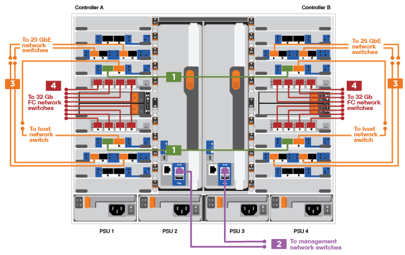
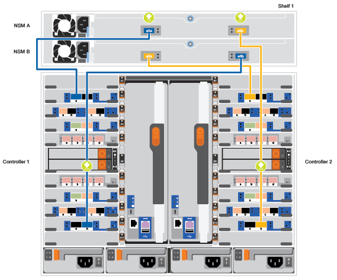
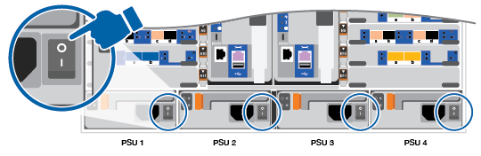

= 详细步骤— AFF 900
:allow-uri-read: 
:icons: font
:imagesdir: ../media/

[role="lead"]
本文详细介绍了安装典型 NetApp 系统的分步说明。如果您需要更详细的安装说明，请使用本文。

== 第 1 步：准备安装

要安装系统，您需要在 NetApp 支持站点上创建帐户，注册系统并获取许可证密钥。此外，您还需要为系统清点适当数量和类型的缆线，并收集特定的网络信息。

.开始之前
[role="lead"]
您需要有权访问 https://hwu.netapp.com["NetApp Hardware Universe"^] 有关站点要求以及已配置系统上的追加信息的信息。

您可能还希望有权访问 http://mysupport.netapp.com/documentation/productlibrary/index.html?productID=62286["《 ONTAP 9 发行说明》"^] 有关此系统的详细信息，请参见您的 ONTAP 版本。

您需要在站点上提供以下内容：

* 存储系统的机架空间
* 2 号十字螺丝刀
* 使用其他网络缆线通过 Web 浏览器将系统连接到网络交换机和笔记本电脑或控制台

.步骤
. 打开所有框内容的包装。
. 记录控制器的系统序列号。
+
image::../media/drw_ssn_label.png[DRW SSN 标签]

. 清点并记下收到的缆线数量和类型。
+
下表列出了您可能收到的电缆类型。如果您收到的电缆未在表中列出，请参见 Hardware Universe 以找到该电缆并确定其用途。

+
https://hwu.netapp.com["NetApp Hardware Universe"^]

+
[cols="1,2,2,2"]
|===
| 缆线类型 ... | 部件号和长度 | 连接器类型 | 针对 ... 

 a| 
25 GbE 数据缆线
 a| 
X66240A-05 （ 112-00639 ）， 0.5 米

X66240A-2 （ 112-00598 ）， 2 米

X66240A-5 （ 112-00600 ）， 5 米
| image:../media/oie_cable_sfp_gbe_copper.png[""]  a| 
网络缆线

 a| 
32 Gb FC （ SFP+ 操作）
 a| 
X66250-2 （ 112-00342 ）， 2 米

X66250-5 （ 112-00344 ）， 5 米

X66250-15 （ 112-00346 ）， 15 米
 a| 
image:../media/oie_cable_sfp_gbe_copper.png[""]
 a| 
FC 光纤网络缆线

 a| 
40 GbE 网络缆线
 a| 
X66100-1 （ 112-00542 ）， 1 米

X66100-3 （ 112-00543 ）， 3 米

X66100-5 （ 112-00544 ）， 5 米
 a| 
image:../media/oie_cable100_gbe_qsfp28.png[""]
 a| 
以太网数据，集群网络

 a| 
100 GbE 缆线
 a| 
X6621B-1 （ 112-00573 ）， 1 米

X6621B-2 （ 112-00574 ）， 2 米

X6621B-5 （ 112-00576 ）， 5 米
 a| 
image:../media/oie_cable100_gbe_qsfp28.png[""]
 a| 
网络，

NVMe 存储，

以太网数据，

集群网络

 a| 
光缆
 a| 
X66031A （ 112-00436A ）， 1 米

X66032A （ 112-00437 ）， 2 米

X66033A （ 112-00438 ）， 3 米
 a| 
image:../media/oie_cable_fiber_lc_connector.png[""]
 a| 
FC 光纤网络

 a| 
6 类， RJ-45 （取决于订单）
 a| 
部件号 X6585-R6 （ 112-00291 ）， 3 米

X6562-R6 （ 112-00196 ）， 5 米
 a| 
image:../media/oie_cable_rj45.png[""]
 a| 
管理网络和以太网数据

 a| 
微型 USB 控制台缆线
 a| 
不适用
 a| 
image:../media/oie_cable_micro_usb.png[""]
 a| 
在非 Windows 或 Mac 笔记本电脑 / 控制台上设置软件期间连接控制台

 a| 
电源线
 a| 
不适用
 a| 
image:../media/oie_cable_power.png[""]
 a| 
启动系统

|===
. 查看 https://library.netapp.com/ecm/ecm_download_file/ECMLP2862613["《 ONTAP 配置指南》"^] 并收集该指南中列出的所需信息。

== 第 2 步：安装硬件

[role="lead"]
您需要根据需要将系统安装在四柱机架或 NetApp 系统机柜中。

. 根据需要安装导轨套件。
. 按照导轨套件附带的说明安装并固定系统。
+

NOTE: 您需要了解与系统重量相关的安全问题。

+
image::../media/drw_9000_lifting_icon.png[DRW 9000 起重图标]

. 连接缆线管理设备（如图所示）。
+
image::../media/drw_9000_cable_management_arms.png[DRW 9000 缆线管理臂]

. 将挡板放在系统正面。

== 第 3 步：使用缆线将控制器连接到网络

[role="lead"]
您可以使用双节点无交换机集群方法或集群互连网络将控制器连接到网络。

=== 选项 1 ：双节点无交换机集群

[role="lead"]
控制器上的管理网络，数据网络和管理端口连接到交换机。两个控制器上的集群互连端口均已通过缆线连接。

.开始之前
您必须已联系网络管理员，了解有关将系统连接到交换机的信息。

在端口中插入缆线时，请务必检查缆线拉片的方向。所有网络模块端口的缆线拉片均已启动。

image::../media/oie_cable_pull_tab_up.png[OIE 缆线拉片向上]

NOTE: 插入连接器时，您应感觉到连接器卡入到位；如果您不认为连接器卡嗒声，请将其卸下，然后将其翻转并重试。

. 使用动画或插图完成控制器与交换机之间的布线：
+
.动画—为双节点无交换机集群布线
video::7a55b98a-e8b8-41d5-821f-ac5b0032ead0[panopto]
+

+
|===
| 步骤 | 在每个控制器上执行 

 a| 
image:../media/oie_legend_icon_1_lg.png[""]
 a| 
使用缆线连接集群互连端口：

** 插槽 A4 和 B4 （ E4A ）
** 插槽 -A8 和 B8 （ E8a ）

image:../media/oie_cable100_gbe_qsfp28.png[""]

 a| 

 a| 
使用缆线连接控制器管理（扳手）端口。

image::../media/oie_cable_rj45.png[OIE 缆线 RJ45]

 a| 
image::../media/oie_legend_icon_3_o.png[OIE 图例图标 3 o]
 a| 
使用缆线连接 25 GbE 网络交换机：

插槽 A3 和 B3 （ E3A 和 E3C ）以及插槽 A9 和 B9 （ e9a 和 e9c ）中的端口连接到 25 GbE 网络交换机。

image::../media/oie_cable_sfp_gbe_copper.png[OIE 使用缆线连接 SFP GbE 铜缆]

40GbE 主机网络交换机：

使用缆线将插槽 A4 和 B4 （ e4b ）以及插槽 A4 和 B8 （ e8b ）中的主机‐端 b 端口连接到主机交换机。

image:../media/oie_cable100_gbe_qsfp28.png[""]

 a| 

 a| 
使用缆线连接 32 Gb FC 连接：

使用缆线将插槽 5 和 B5 （ 5a ， 5b ， 5c 和 5d ）以及插槽 A7 和 B7 （ 7a ， 7b ， 7c 和 7d ）中的端口连接到 32 Gb FC 网络交换机。

image:../media/oie_cable_sfp_gbe_copper.png[""]

|===
. To cable your storage, see <<第 4 步：使用缆线将控制器连接到驱动器架>>。

=== 选项 2 ：交换集群

[role="lead"]
控制器上的管理网络，数据网络和管理端口连接到交换机。集群互连和 HA 端口通过缆线连接到集群 /HA 交换机。

.开始之前
您必须已联系网络管理员，了解有关将系统连接到交换机的信息。

在端口中插入缆线时，请务必检查缆线拉片的方向。所有网络模块端口的缆线拉片均已启动。

image::../media/oie_cable_pull_tab_up.png[OIE 缆线拉片向上]

NOTE: 插入连接器时，您应感觉到连接器卡入到位；如果您不认为连接器卡嗒声，请将其卸下，然后将其翻转并重试。

. 使用动画或插图完成控制器与交换机之间的布线：
+
.动画—为有交换机集群布线
video::6381b3f1-4ce5-4805-bd0a-ac5b0032f51d[panopto]
+
image::../media/drw_a900_switched_network_cabling.png[DRW a900 交换网络布线]

+
|===
| 步骤 | 在每个控制器上执行 

 a| 
image:../media/oie_legend_icon_1_lg.png[""]
 a| 
使用缆线连接集群互连 A 端口：

** 插槽 A4 和 B4 （ E4A ）连接到集群网络交换机。
** 插槽 "A8 和 B8 （ E8a ）连接到集群网络交换机。

image:../media/oie_cable100_gbe_qsfp28.png[""]

 a| 

 a| 
使用缆线连接控制器管理（扳手）端口。

image::../media/oie_cable_rj45.png[OIE 缆线 RJ45]

 a| 
image::../media/oie_legend_icon_3_o.png[OIE 图例图标 3 o]
 a| 
使用缆线连接 25GbE 网络交换机：

插槽 A3 和 B3 （ E3A 和 E3C ）以及插槽 A9 和 B9 （ e9a 和 e9c ）中的端口连接到 25 GbE 网络交换机。

image::../media/oie_cable_sfp_gbe_copper.png[OIE 使用缆线连接 SFP GbE 铜缆]

40GbE 主机网络交换机：

使用缆线将插槽 A4 和 B4 （ e4b ）以及插槽 A4 和 B8 （ e8b ）中的主机‐端 b 端口连接到主机交换机。

image:../media/oie_cable100_gbe_qsfp28.png[""]

 a| 

 a| 
使用缆线连接 32 Gb FC 连接：

使用缆线将插槽 5 和 B5 （ 5a ， 5b ， 5c 和 5d ）以及插槽 A7 和 B7 （ 7a ， 7b ， 7c 和 7d ）中的端口连接到 32 Gb FC 网络交换机。

image:../media/oie_cable_sfp_gbe_copper.png[""]

|===
. To cable your storage, see <<第 4 步：使用缆线将控制器连接到驱动器架>>。

== 第 4 步：使用缆线将控制器连接到驱动器架

=== 选项 1 ：使用缆线将控制器连接到 AFF A900 中的一个 NS224 驱动器架

[role="lead"]
您必须使用缆线将每个控制器连接到 AFF A900 系统上 NS224 驱动器架上的 NSM 模块。

.开始之前
* 请务必检查插图箭头以确定正确的缆线连接器拉片方向。存储模块的缆线拉片已启动，而磁盘架上的拉片已关闭。
+
image::../media/oie_cable_pull_tab_up.png[OIE 缆线拉片向上]

+
image::../media/oie_cable_pull_tab_down.png[OIE 缆线下拉卡舌]

+

NOTE: 插入连接器时，您应感觉到连接器卡入到位；如果您不认为连接器卡嗒声，请将其卸下，然后将其翻转并重试。

+
.. 使用以下动画或图形将控制器连接到一个 NS224 驱动器架。
+
.动画-为一个NS224磁盘架布线
video::6520eb01-87b3-4520-9109-ac5b0032ea4e[panopto]
+

+
|===
| 步骤 | 在每个控制器上执行 

 a| 
image:../media/oie_legend_icon_1_mb.png[""]
 a| 
** 将控制器 A 端口 E2A 连接到磁盘架上 NSM A 上的端口 e0a 。
** 将控制器 A 端口 e10b 连接到磁盘架上 NSM B 上的端口 e0b 。

image:../media/oie_cable100_gbe_qsfp28.png[""]

100 GbE 缆线

 a| 
image:../media/oie_legend_icon_2_lo.png[""]
 a| 
** 将控制器 B 端口 E2A 连接到磁盘架上 NSM B 上的端口 e0a 。
** 将控制器 B 端口 e10b 连接到磁盘架上 NSM A 上的端口 e0b 。

image:../media/oie_cable100_gbe_qsfp28.png[""]

100 GbE 缆线

|===
+
.. To complete setting up your system, see <<第 5 步：完成系统设置和配置>>。

=== 选项 2 ：使用缆线将控制器连接到 AFF A900 中的两个 NS224 驱动器架

[role="lead"]
您必须使用缆线将每个控制器连接到 NS224 驱动器架上的 NSM 模块。

.开始之前
* 请务必检查插图箭头以确定正确的缆线连接器拉片方向。存储模块的缆线拉片已启动，而磁盘架上的拉片已关闭。
+
image::../media/oie_cable_pull_tab_up.png[OIE 缆线拉片向上]

image::../media/oie_cable_pull_tab_down.png[OIE 缆线下拉卡舌]

NOTE: 插入连接器时，您应感觉到连接器卡入到位；如果您不认为连接器卡嗒声，请将其卸下，然后将其翻转并重试。

. Use the following animation or diagram to cable your controllers to two NS224 drive shelves.
+
.动画-使用缆线连接两个NS224磁盘架
video::34098e39-73ad-45de-9af7-ac5b0032ea9a[panopto]
+

+
image::../media/drw_a900_NS224_two shelf_cabling.png[DRW a900 NS224 两个磁盘架布线]

+
|===
| 步骤 | 在每个控制器上执行 

 a| 
image:../media/oie_legend_icon_1_mb.png[""]
 a| 
** 将控制器 A 端口 E2A 连接到磁盘架 1 上的 NSM A e0a 。
** 将控制器 A 端口 e10b 连接到磁盘架 1 上的 NSM B e0b 。
** 将控制器 A 端口 e2b 连接到磁盘架 2 上的 NSM B e0b 。
** 将控制器 A 端口 E10A 连接到磁盘架 2 上的 NSM A e0a 。
+
image:../media/oie_cable100_gbe_qsfp28.png[""]

100 GbE 缆线

 a| 
image:../media/oie_legend_icon_2_lo.png[""]
 a| 
** 将控制器 B 端口 E2A 连接到磁盘架 1 上的 NSM B e0a 。
** 将控制器 B 端口 e10b 连接到磁盘架 1 上的 NSM A e0b 。
** 将控制器 B 端口 e2b 连接到磁盘架 2 上的 NSM A e0b 。
** 将控制器 B 端口 E10A 连接到磁盘架 2 上的 NSM B e0a 。

image:../media/oie_cable100_gbe_qsfp28.png[""]

100 GbE 缆线

|===
. To complete setting up your system, see <<第 5 步：完成系统设置和配置>>。

== 第 5 步：完成系统设置和配置

[role="lead"]
您可以使用仅连接到交换机和笔记本电脑的集群发现完成系统设置和配置，也可以直接连接到系统中的控制器，然后连接到管理交换机。

=== 选项 1 ：如果启用了网络发现

[role="lead"]
如果您在笔记本电脑上启用了网络发现，则可以使用自动集群发现完成系统设置和配置。

. 使用以下动画或图形设置一个或多个驱动器架 ID ：
+
NS224 磁盘架已预先设置为磁盘架 ID 00 和 01 。If you want to change the shelf IDs, you must create a tool to insert into the hole where button is located.请参见 https://docs.netapp.com/us-en/ontap-systems/ns224/change-shelf-id.html["更改磁盘架 ID — NS224 磁盘架"] 有关详细说明、请参见。

+
.Animation—设置SAS或NVMe驱动器架ID
video::95a29da1-faa3-4ceb-8a0b-ac7600675aa6[panopto]
+
image::../media/drw_a900_oie_change_ns224_shelf ID_IEOPS-836.svg[DRW a900 OIE change nss224 shelf ID IEOPS 836]

+
[cols="25h,~"]
|===

 a| 
image:../media/legend_icon_01.png[""]
 a| 
磁盘架端盖

 a| 
image:../media/legend_icon_02.png[""]
 a| 
磁盘架面板

 a| 
image:../media/legend_icon_03.png[""]
 a| 
磁盘架ID LED

 a| 
image:../media/legend_icon_04.png[""]
 a| 
磁盘架ID设置按钮

|===
. 将电源线插入控制器电源，然后将其连接到不同电路上的电源。
. 打开两个节点的电源开关。
+
.动画—打开控制器的电源
video::a905e56e-c995-4704-9673-adfa0005a891[panopto]
+

+

NOTE: 初始启动可能需要长达八分钟的时间。

. 确保您的笔记本电脑已启用网络发现。
+
有关详细信息，请参见笔记本电脑的联机帮助。

. 使用以下动画将您的笔记本电脑连接到管理交换机。
+
.动画—将笔记本电脑连接到管理交换机
video::d61f983e-f911-4b76-8b3a-ab1b0066909b[panopto]
+
image::../media/dwr_laptop_to_switch_only.png[DWR 笔记本电脑仅连接到交换机]

. 选择列出的 ONTAP 图标以发现：
+
image::../media/drw_autodiscovery_controler_select.png[DRW 自动发现控制器选择]

+
.. 打开文件资源管理器。
.. 单击左窗格中的 network 。
.. 右键单击并选择刷新。
.. 双击 ONTAP 图标并接受屏幕上显示的任何证书。
+

NOTE: XXXXX 是目标节点的系统序列号。

+
此时将打开 System Manager 。

. 使用 System Manager 引导式设置使用中收集的数据配置系统 https://library.netapp.com/ecm/ecm_download_file/ECMLP2862613["《 ONTAP 配置指南》"^]。
. 设置您的帐户并下载 Active IQ Config Advisor ：
+
.. 登录到现有帐户或创建帐户。
+
https://mysupport.netapp.com/eservice/public/now.do["NetApp 支持注册"^]

.. 注册您的系统。
+
https://mysupport.netapp.com/eservice/registerSNoAction.do?moduleName=RegisterMyProduct["NetApp 产品注册"^]

.. 下载 Active IQ Config Advisor 。
+
https://mysupport.netapp.com/site/tools/tool-eula/activeiq-configadvisor["NetApp 下载： Config Advisor"^]

. 运行 Config Advisor 以验证系统的运行状况。
. After you have completed the initial configuration, go to the https://www.netapp.com/data-management/oncommand-system-documentation/["ONTAP 和 AMP ； ONTAP System Manager 文档资源"^] page for information about configuring additional features in ONTAP.

=== 选项 2 ：如果未启用网络发现

[role="lead"]
如果您使用的不是基于 Windows 或 Mac 的笔记本电脑或控制台，或者未启用自动发现，则必须使用此任务完成配置和设置。

. 为笔记本电脑或控制台布线并进行配置：
+
.. 使用 N-8-1 将笔记本电脑或控制台上的控制台端口设置为 115200 波特。
+

NOTE: 有关如何配置控制台端口的信息，请参见笔记本电脑或控制台的联机帮助。

.. 使用系统随附的控制台缆线将控制台缆线连接到笔记本电脑或控制台，然后将此笔记本电脑连接到管理子网上的管理交换机。
+
image::../media/drw_9000_cable_console_switch_controller.png[DRW 9000 缆线控制台交换机控制器]

.. 使用管理子网上的一个 TCP/IP 地址为笔记本电脑或控制台分配 TCP/IP 地址。

. 使用以下动画设置一个或多个驱动器架 ID ：
+
NS224 磁盘架已预先设置为磁盘架 ID 00 和 01 。If you want to change the shelf IDs, you must create a tool to insert into the hole where button is located.请参见 https://docs.netapp.com/us-en/ontap-systems/ns224/change-shelf-id.html["更改磁盘架 ID — NS224 磁盘架"] 有关详细说明、请参见。

+
.Animation—设置SAS或NVMe驱动器架ID
video::95a29da1-faa3-4ceb-8a0b-ac7600675aa6[panopto]
+
image::../media/drw_a900_oie_change_ns224_shelf ID_IEOPS-836.svg[DRW a900 OIE change nss224 shelf ID IEOPS 836]

+
[cols="25h,~"]
|===

 a| 
image:../media/legend_icon_01.png[""]
 a| 
磁盘架端盖

 a| 
image:../media/legend_icon_02.png[""]
 a| 
磁盘架面板

 a| 
image:../media/legend_icon_03.png[""]
 a| 
磁盘架ID LED

 a| 
image:../media/legend_icon_04.png[""]
 a| 
磁盘架ID设置按钮

|===
. 将电源线插入控制器电源，然后将其连接到不同电路上的电源。
. 打开两个节点的电源开关。
+
.动画—打开控制器的电源
video::bb04eb23-aa0c-4821-a87d-ab2300477f8b[panopto]

NOTE: 初始启动可能需要长达八分钟的时间。

. 将初始节点管理 IP 地址分配给其中一个节点。
+
|===

| 如果管理网络具有 DHCP... | 那么 ... 

 a| 
已配置
 a| 
记录分配给新控制器的 IP 地址。

 a| 
未配置
 a| 
.. 使用 PuTTY ，终端服务器或环境中的等效项打开控制台会话。
+

NOTE: 如果您不知道如何配置 PuTTY ，请查看笔记本电脑或控制台的联机帮助。

.. 在脚本提示时输入管理 IP 地址。

|===
. 使用笔记本电脑或控制台上的 System Manager 配置集群：
+
.. 将浏览器指向节点管理 IP 地址。
+

NOTE: The format for the address is +https://x.x.x.x+.

.. 使用您在 _NetApp ONTAP 配置指南 _ 中收集的数据配置系统。
+
https://library.netapp.com/ecm/ecm_download_file/ECMLP2862613["《 ONTAP 配置指南》"^]

. 设置您的帐户并下载 Active IQ Config Advisor ：
+
.. 登录到现有帐户或创建帐户。
+
https://mysupport.netapp.com/eservice/public/now.do["NetApp 支持注册"^]

.. 注册您的系统。
+
https://mysupport.netapp.com/eservice/registerSNoAction.do?moduleName=RegisterMyProduct["NetApp 产品注册"^]

.. 下载 Active IQ Config Advisor 。
+
https://mysupport.netapp.com/site/tools/tool-eula/activeiq-configadvisor["NetApp 下载： Config Advisor"^]

. 运行 Config Advisor 以验证系统的运行状况。
. After you have completed the initial configuration, go to the https://www.netapp.com/data-management/oncommand-system-documentation/["ONTAP 和 AMP ； ONTAP System Manager 文档资源"^] page for information about configuring additional features in ONTAP.

