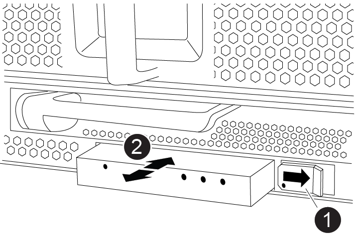

= 更换 LED USB 模块 - AFF A900
:allow-uri-read: 
:icons: font
:imagesdir: ../media/

[role="lead"]
LED USB 模块可连接到控制台端口和系统状态。更换此模块不需要工具，也不会中断服务。

== 第 1 步：更换 LED USB 模块

.步骤
. 卸下旧的 LED USB 模块：
+
https://netapp.hosted.panopto.com/Panopto/Pages/Viewer.aspx?id=eb715462-cc20-454f-bcf9-adf9016af84e["动画—删除 / 安装 LED/USB 模块"^]

+

+
[cols="10,90"]
|===

 a| 
image:../media/legend_icon_01.png[""]
 a| 
锁定按钮

 a| 
image:../media/legend_icon_02.png[""]
 a| 
USB LED 模块

|===
+
.. 卸下挡板后，找到机箱正面左下方的 LED USB 模块。
.. 滑动闩锁以部分弹出模块。
.. 将模块从托架中拉出，以断开其与中板的连接。请勿将插槽留空。

. 安装新的 LED USB 模块：
+
.. 将模块与托架对齐，使其与模块边角的缺口靠近机箱上的滑块闩锁。此托架将阻止您将模块安装到正面。
.. 将模块推入托架，直至其与机箱完全就位。
+
如果模块已固定并连接到中板，则会听到卡嗒声。

== 第 2 步：返回故障组件

. 更换部件后，您可以按照套件随附的 RMA 说明将故障部件退回 NetApp 。请通过联系技术支持 https://mysupport.netapp.com/site/global/dashboard["NetApp 支持"]， 888-463-8277 （北美）， 00-800-44-638277 （欧洲）或 +800-800-80-800 （亚太地区）（如果您需要 RMA 编号或有关更换操作步骤的其他帮助）。

