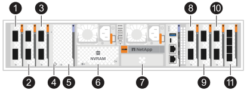

= 添加和更换 I/O 模块概述 - AFX 2K
:allow-uri-read: 
:icons: font
:imagesdir: ../media/

[role="lead"]
AFX 2K 存储系统提供扩展或更换 I/O 模块的灵活性，以增强网络连接和性能。在升级网络功能或解决故障模块时，添加或更换 I/O 模块至关重要。

您可以使用相同类型的 I/O 模块或不同类型的 I/O 模块替换 AFX 2K 存储系统中出现故障的 I/O 模块。您还可以将 I/O 模块添加到具有空插槽的系统中。

* link:io-module-add.html["添加I/O模块"]
+
添加更多模块可以提高冗余度、有助于确保即使一个模块出现故障、系统仍可正常运行。

* link:io-module-replace.html["更换I/O模块"]
+
更换发生故障的I/O模块可以将系统还原到其最佳运行状态。

.I/O插槽编号
AFX 2K 控制器上的 I/O 插槽编号为 1 到 11，如下图所示。

[cols="10%,23%,10%,24%,10%,23%"]
|===
| 插槽编号 | I/O 插槽 | 插槽编号 | I/O 插槽 | 插槽编号 | I/O 插槽 

 a| 
image::../media/icon_round_1.svg[标注编号1]
| HA  a| 
image::../media/icon_round_4.svg[标注编号4]

| NVRAM12  a| 
image::../media/icon_round_9.svg[标注编号 9]
| 网络 

 a| 
image::../media/icon_round_2.svg[标注编号2]
| 集群  a| 
image::../media/icon_round_6.svg[标注编号 6]

image::../media/icon_round_7.svg[标注编号 7]
| NVRAM12-EX  a| 
image::../media/icon_round_10.svg[标注编号 10]
| 存储 

 a| 
image::../media/icon_round_3.svg[标注编号3]
| 网络  a| 
image::../media/icon_round_8.svg[标注编号 8]
| 存储  a| 
image::../media/icon_round_11.svg[标注编号 11]
| (*可选*)四端口 25GbE SFP28，用于附加管理连接 
|===