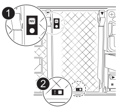
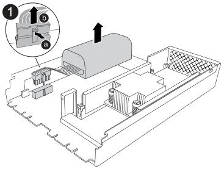

= 更换 NVRAM12-EX - AFX 2K
:allow-uri-read: 
:icons: font
:imagesdir: ../media/

[role="lead"]
当非易失性内存出现故障或需要升级时，请更换 AFX 2K 存储系统中的 NVRAM12-EX。更换过程包括关闭受损控制器，更换 NVRAM12-EX 模块、NVRAM DIMM 或 NVRAM 电池，并将故障部件返回 NetApp。

NVRAM12-EX 模块由 NVRAM12 硬件和现场可更换 DIMM 组成。您可以更换故障的 NVRAM12-EX 模块、DIMM 或 NVRAM12-EX 模块内的 NVRAM 电池。

.开始之前
* 确保您已准备好更换部件。您必须使用从NetApp收到的更换组件来更换故障组件。
* 确保存储系统中的所有其他组件均正常运行；如果未正常运行，请联系 https://support.netapp.com["NetApp 支持"]。
+

NOTE: 在更换 NVRAM12-EX 模块之前，请确保先关闭受损控制器的电源，然后再继续更换操作。

== 第 1 步：关闭受损控制器

关闭或接管受损控制器。

接管并停止受损的控制器，以便健康控制器继续从受损的控制器的存储中提供数据。为此，您需要在 AutoSupport 中禁止自动创建案例，禁用自动回馈，并将受损的控制器带到 LOADER 提示符处。LOADER 提示符是安全停止状态，您可以从中更换 FRU。

.关于此任务
* 如果您的集群具有四个以上的节点，则它必须达到法定人数。要查看有关节点的集群信息，请使用 `cluster show`命令。有关 `cluster show`命令，请参阅link:https://docs.netapp.com/us-en/ontap/system-admin/display-nodes-cluster-task.html["查看ONTAP集群中的节点级详细信息"^]。
* 如果集群不处于法定人数，或者任何控制器（受损控制器除外）的健康状况或资格显示为错误，则必须在关闭受损控制器之前纠正该问题。看link:https://docs.netapp.com/us-en/ontap/system-admin/synchronize-node-cluster-task.html?q=Quorum["将节点与集群同步"^] 。

.步骤
. 如果启用了AutoSupport 、则通过调用AutoSupport 消息禁止自动创建案例：
+
`system node autosupport invoke -node * -type all -message MAINT=<# of hours>h`

+
以下AutoSupport 消息禁止自动创建案例两小时：

+
`cluster1:> system node autosupport invoke -node * -type all -message MAINT=2h`

. 从受损控制器的控制台禁用自动交还：
+
`storage failover modify -node impaired-node -auto-giveback-of false`

+

NOTE: 当您看到“您想禁用自动回馈吗？”时，请输入 `y`。

. 将受损控制器显示为 LOADER 提示符：
+
[cols="1,2"]
|===
| 如果受损控制器显示 ... | 那么 ... 

 a| 
LOADER 提示符
 a| 
转至下一步。

 a| 
系统提示符或密码提示符
 a| 
从健康控制器接管或停止受损控制器：
`storage failover takeover -ofnode _impaired_node_name_ -halt _true_`

_-halt true_ 参数将受损节点带入 LOADER 提示符。

|===

== 步骤2：更换NVRAM12-EX模块、NVRAM DIMM或NVRAM电池

使用以下选项更换 NVRAM12-EX 模块、NVRAM DIMM 或 NVRAM 电池。

在更换控制器模块或更换控制器模块内部的组件时、您必须从机柜中卸下控制器模块。

[role="tabbed-block"]
====
.选项 1：更换 NVRAM12-EX 模块
--
要更换 NVRAM12-EX 模块，请在机箱的插槽 6/7 中找到该模块，并按照特定步骤顺序进行操作。

. 检查位于系统插槽 4/5 中的 NVRAM 状态 LED 和 NVRAM12-EX 状态插槽 6/7。控制器模块的前面板上还有一个 NVRAM LED。寻找 NV 图标：
+

+
[cols="1,4"]
|===

2+| *NVRAM* 

 a| 
image:../media/icon_round_1.png["标注编号1"]
 a| 
NVRAM 状态 LED

 a| 
image:../media/icon_round_2.png["标注编号2"]
 a| 
NVRAM警示LED

|===
+
image::../media/drw_afx_emr_nvram-led_ieops-2962.svg[NVRAM12-EX 注意和状态 LED 位置图形]

+
[cols="1,4"]
|===

2+| *NVRAM12-EX* 

 a| 
image:../media/icon_round_1.png["标注编号1"]
 a| 
NVRAM12-EX 状态 LED

 a| 
image:../media/icon_round_2.png["标注编号2"]
 a| 
NVRAM12-EX 注意 LED

|===
+
** 如果NV LED熄灭、请转至下一步。
** 如果NV LED闪烁、请等待闪烁停止。如果闪烁持续时间超过5分钟、请联系技术支持以获得帮助。

. 如果您尚未接地，请正确接地。
. 从控制器上拔下 PSU 的电源线。
. 轻轻拉动缆线管理托架两端的插销并向下旋转托架、向下旋转该托架。
. 从外壳中取出受损的 NVRAM12-EX 模块：
+
.. 按下锁定凸轮按钮。
.. 通过将受损的 NVRAM12-EX 模块从外壳中拉出，将其从外壳中取出。
+
image::../media/drw_afx_emr_nv12l_remove_replace_ieops-2879.svg[卸下 NVRAM12-EX 模块]

+
[cols="1,4"]
|===

 a| 
image:../media/icon_round_1.png["标注编号1"]
| 凸轮锁定按钮 
|===

. 将 NVRAM12-EX 模块放置在稳定的平面上。
. 使用手指或螺丝刀打开 NVRAM12-EX 模块的盖子，松开盖子上的单个指旋螺钉，然后将盖子从模块上取下。
+
image::../media/drw_afx_emr_nv12l_remove_cover_ieops-2929.svg[卸下 NVRAM12-EX 盖]

+
[cols="1,4"]
|===

 a| 
image:../media/icon_round_1.png["标注编号1"]
| NVRAM12-EX 外盖专用指旋螺钉 
|===
. 一次从受损的 NVRAM12-EX 模块中取出一个 DIMM，并将其安装在更换的 NVRAM12-EX 模块中。
+
image::../media/drw_afx_emr_nv12l_remove_dimms_ieops-2883.svg[卸下 NVRAM12-EX DIMM]

+
[cols="1,4"]
|===

 a| 
image:../media/icon_round_1.png["标注编号1"]
| DIMM锁定卡舌 
|===
. 断开电池与 NVRAM12-EX 模块的连接：
+
.. 挤压电池插头表面的夹子，将插头从插座上松开。
.. 从插槽中拔下电池缆线。

. 向上抬起电池，将其从模块中取出，以卸下已断开连接的电池。
+

+
[cols="1,4"]
|===

 a| 
image:../media/icon_round_1.png["标注编号1"]
| NVRAM12-EX电池连接夹 
|===
. 将电池安装到更换的 NVRAM12-EX 模块：
+
.. 将电池连接夹插入插座，并确保插头锁定到位。
.. 将电池组插入插槽，然后用力向下按电池组，以确保其锁定到位。

. 通过将盖子与螺丝孔对齐并用指旋螺钉固定盖子，安装 NVRAM12-EX 模块的盖子。
. 将更换的 NVRAM12-EX 模块安装到机箱：
+
.. 将模块与插槽 6/7 中外壳开口的边缘对齐。
.. 轻轻将模块滑入插槽，直至完全锁定到位。

. 将缆线管理托架向上旋转到关闭位置。

--
.选项2：更换NVRAM DIMM
--
要更换 NVRAM12-EX 模块中的 NVRAM DIMM，必须卸下 NVRAM12-EX 模块，然后更换目标 DIMM。

. 检查位于系统插槽 4/5 中的 NVRAM 状态 LED 和 NVRAM12-EX 状态插槽 6/7。控制器模块的前面板上还有一个 NVRAM LED。寻找 NV 图标：
+

+
[cols="1,4"]
|===

2+| *NVRAM* 

 a| 
image:../media/icon_round_1.png["标注编号1"]
 a| 
NVRAM 状态 LED

 a| 
image:../media/icon_round_2.png["标注编号2"]
 a| 
NVRAM警示LED

|===
+
image::../media/drw_afx_emr_nvram-led_ieops-2962.svg[NVRAM12-EX 注意和状态 LED 位置图形]

+
[cols="1,4"]
|===

2+| *NVRAM12-EX* 

 a| 
image:../media/icon_round_1.png["标注编号1"]
 a| 
NVRAM12-EX 状态 LED

 a| 
image:../media/icon_round_2.png["标注编号2"]
 a| 
NVRAM12-EX 注意 LED

|===
+
** 如果NV LED熄灭、请转至下一步。
** 如果NV LED闪烁、请等待闪烁停止。如果闪烁持续时间超过5分钟、请联系技术支持以获得帮助。

. 如果您尚未接地，请正确接地。
. 从 PSU 上拔下电源线。
. 轻轻拉动缆线管理托架两端的插销并向下旋转托架、向下旋转该托架。
. 从机箱中取出目标 NVRAM12-EX 模块：
+
.. 按下锁定凸轮按钮。
.. 通过将受损的 NVRAM12-EX 模块从外壳中拉出，将其从外壳中取出。
+
image::../media/drw_afx_emr_nv12l_remove_replace_ieops-2879.svg[卸下 NVRAM12-EX 模块]

+
[cols="1,4"]
|===

 a| 
image:../media/icon_round_1.png["标注编号1"]
| 凸轮锁定按钮 
|===

. 将 NVRAM12-EX 模块放置在稳定的平面上。
. 使用手指或螺丝刀打开 NVRAM12-EX 模块的盖子，松开盖子上的单个指旋螺钉，然后将盖子从模块上取下。
+
image::../media/drw_afx_emr_nv12l_remove_cover_ieops-2929.svg[卸下 NVRAM12-EX 盖]

+
[cols="1,4"]
|===

 a| 
image:../media/icon_round_1.png["标注编号1"]
| NVRAM12-EX 外盖专用指旋螺钉 
|===
. 在 NVRAM12-EX 模块内找到要更换的 DIMM。
+

NOTE: 请参阅 NVRAM12-EX 模块侧面的 FRU 映射标签，以确定 DIMM 插槽 1 和 2 的位置。

. 向下按DIMM锁定卡舌并将DIMM从插槽中提出、以卸下DIMM。
+
image::../media/drw_afx_emr_nv12l_remove_dimms_ieops-2883.svg[卸下 NVRAM12-EX DIMM]

+
[cols="1,4"]
|===

 a| 
image:../media/icon_round_1.png["标注编号1"]
| DIMM锁定卡舌 
|===
. 安装更换用的 DIMM ，方法是将 DIMM 与插槽对齐，然后将 DIMM 轻轻推入插槽，直到锁定卡舌锁定到位。
. 通过将盖子与螺丝孔对齐并用指旋螺钉固定盖子，安装 NVRAM12-EX 模块的盖子。
. 将 NVRAM12-EX 模块安装到机箱：
+
.. 轻轻将模块滑入插槽，直至锁定到位。

. 将缆线管理托架向上旋转到关闭位置。

--
.选项 3：更换 NVRAM 电池
--
要更换 NVRAM12-EX 模块中的 NVRAM DIMM，必须卸下 NVRAM12-EX 模块，然后更换电池。

. 检查位于系统插槽 4/5 中的 NVRAM 状态 LED 和 NVRAM12-EX 状态插槽 6/7。控制器模块的前面板上还有一个 NVRAM LED。寻找 NV 图标：
+

+
[cols="1,4"]
|===

2+| *NVRAM* 

 a| 
image:../media/icon_round_1.png["标注编号1"]
 a| 
NVRAM 状态 LED

 a| 
image:../media/icon_round_2.png["标注编号2"]
 a| 
NVRAM警示LED

|===
+
image::../media/drw_afx_emr_nvram-led_ieops-2962.svg[NVRAM12-EX 注意和状态 LED 位置图形]

+
[cols="1,4"]
|===

2+| *NVRAM12-EX* 

 a| 
image:../media/icon_round_1.png["标注编号1"]
 a| 
NVRAM12-EX 状态 LED

 a| 
image:../media/icon_round_2.png["标注编号2"]
 a| 
NVRAM12-EX 注意 LED

|===
+
** 如果NV LED熄灭、请转至下一步。
** 如果NV LED闪烁、请等待闪烁停止。如果闪烁持续时间超过5分钟、请联系技术支持以获得帮助。

. 如果您尚未接地，请正确接地。
. 从 PSU 上拔下电源线。
. 轻轻拉动缆线管理托架两端的插销并向下旋转托架、向下旋转该托架。
. 从机箱中取出目标 NVRAM12-EX 模块：
+
.. 按下锁定凸轮按钮。
.. 通过将受损的 NVRAM12-EX 模块从外壳中拉出，将其从外壳中取出。
+
image::../media/drw_afx_emr_nv12l_remove_replace_ieops-2879.svg[卸下 NVRAM12-EX 模块]

+
[cols="1,4"]
|===

 a| 
image:../media/icon_round_1.png["标注编号1"]
| 凸轮锁定按钮 
|===

. 将 NVRAM12-EX 模块放置在稳定的平面上。
. 使用手指或螺丝刀打开 NVRAM12-EX 模块的盖子，松开盖子上的单个指旋螺钉，然后将盖子从模块上取下。
+
image::../media/drw_afx_emr_nv12l_remove_cover_ieops-2929.svg[卸下 NVRAM12-EX 盖]

+
[cols="1,4"]
|===

 a| 
image:../media/icon_round_1.png["标注编号1"]
| NVRAM12-EX 外盖专用指旋螺钉 
|===
. 断开电池与 NVRAM12-EX 模块的连接：
+
.. 挤压电池插头表面的夹子，将插头从插座上松开。
.. 从插槽中拔下电池缆线。

. 向上抬起电池，将其从模块中取出，以卸下已断开连接的电池。
+

+
[cols="1,4"]
|===

 a| 
image:../media/icon_round_1.png["标注编号1"]
| NVRAM12-EX电池连接夹 
|===
. 从包装中取出更换用电池。
. 将更换电池组安装到 NVRAM12-EX 模块：
+
.. 将电池连接夹插入插座，并确保插头锁定到位。
.. 将电池组插入插槽，然后用力向下按电池组，以确保其锁定到位。

. 通过将盖子与螺丝孔对齐并用指旋螺钉固定盖子，安装 NVRAM12-EX 模块的盖子。
. 将 NVRAM12-EX 模块安装到机箱：
+
.. 轻轻将模块滑入插槽，直至锁定到位。

. 将缆线管理托架向上旋转到关闭位置。

--
====

== 第3步：重新启动控制器

更换 FRU 后，必须重新启动控制器模块。

. 将电源线重新插入 PSU。
+
系统将开始重新启动、通常会显示加载程序提示符。

. 进入 `bye`在 LOADER 提示符下。

== 步骤4：完成NVRAM12-EX更换

请执行以下步骤以完成 NVRAM12-EX 的更换。

.步骤
. 从健康的控制器验证新的合作伙伴系统 ID 是否已自动分配：
`_storage failover show_`
+
在命令输出中，您应该会看到一条消息，显示存储替换的当前状态。在以下示例中， `node2`已进行替换，并将当前状态显示为 `In takeover`。

+
[listing]
----
node1:> storage failover show
                                    Takeover
Node              Partner           Possible     State Description
------------      ------------      --------     -------------------------------------
node1             node2             false        In takeover
node2             node1             -            Waiting for giveback
----
. 交还控制器：
+
.. 从健康的控制器中，归还更换的控制器的存储空间： `_storage failover giveback -ofnode impaired_node_name_`
+
控制器将收回其存储并完成启动。

+

NOTE: 如果交还被否决，您可以考虑覆盖此否决。

+
有关详细信息，请参见 https://docs.netapp.com/us-en/ontap/high-availability/ha_manual_giveback.html#if-giveback-is-interrupted["手动交还命令"^] 主题以覆盖否决。

.. 完成交还后、确认HA对运行状况良好且可以进行接管：_storage Failover show_
+
`storage failover show` 命令的输出不应包含 System ID changed on partner 消息。

. 验证每个控制器是否存在预期的卷：
+
`vol show -node node-name`

. 当控制台消息停止时、按<enter>。
+
** 如果您看到_login_提示，请转到下一步。
** 如果您没有看到登录提示，请登录合作伙伴节点。

. 在恢复报告完成后等待5分钟、然后检查故障转移状态和恢复状态：
+
`storage failover show`和 `storage failover show-giveback`

+

NOTE: 以下命令仅在诊断模式权限级别下可用。

. 如果已禁用自动交还、请重新启用它：
+
`storage failover modify -node local -auto-giveback-of true`

. 如果启用了AutoSupport、则还原/取消禁止自动创建案例：
+
`system node autosupport invoke -node * -type all -message MAINT=END`

== 第 5 步：将故障部件退回 NetApp

按照套件随附的 RMA 说明将故障部件退回 NetApp 。 https://mysupport.netapp.com/site/info/rma["部件退回和更换"]有关详细信息、请参见页面。
