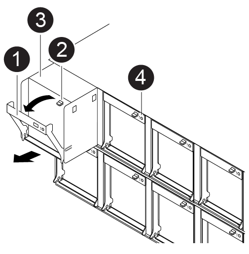

= 热插拔风扇模块- ASA C400
:allow-uri-read: 
:icons: font
:imagesdir: ../media/

[role="lead"]
要在不中断服务的情况下交换风扇模块，您必须执行一系列特定的任务。

NOTE: 您必须在将风扇模块从机箱中卸下后两分钟内更换此风扇模块。系统气流中断，控制器模块或模块在两分钟后关闭，以避免过热。

您可以使用以下动画，插图或写入的步骤热插拔风扇模块。

.动画-更换风扇
video::ae59d53d-7746-402c-bd6b-aad9012efa89[panopto]

[cols="10,90"]
|===

 a| 
image:../media/legend_icon_01.png["标注编号1"]
 a| 
风扇手柄

 a| 
image:../media/legend_icon_02.png["标注编号2"]
 a| 
锁定卡舌

 a| 
image:../media/legend_icon_03.png["标注编号3"]
 a| 
风扇

 a| 
image:../media/legend_icon_04.png["标注编号4"]
 a| 
状态LED

|===
. 如果您尚未接地，请正确接地。
. 如有必要，请用两只手抓住挡板每一侧的开口，然后将其拉向您，直到挡板从机箱框架上的球形螺柱上松开，从而卸下挡板。
. 通过检查控制台错误消息并查看每个风扇模块上的警示 LED 来确定必须更换的风扇模块。
. 向下按风扇模块凸轮把手上的释放闩锁，然后向下旋转凸轮把手。
+
风扇模块会从机箱中移出一点。

. 将风扇模块从机箱中竖直拉出，确保用您的空闲手托住该模块，使其不会从机箱中摆出。
+

NOTE: 风扇模块较短。请始终用您的空闲手托住风扇模块的底部，以免其突然从机箱中脱离并造成您的人身伤害。

. 将风扇模块放在一旁。
. 将替代风扇模块与开口对齐，然后将其滑入机箱，从而将其插入机箱。
. 用力推动风扇模块凸轮把手，使其完全固定到机箱中。
+
风扇模块完全就位后，凸轮把手会略微升高。

. 将凸轮把手向上旋转到其闭合位置，确保凸轮把手释放闩锁卡入到锁定位置。
+
在风扇就位且转速已达到运行速度后，警示 LED 不应亮起。

. 将挡板与球形螺柱对齐，然后将挡板轻轻推入球形螺柱上。
. 按照套件随附的 RMA 说明将故障部件退回 NetApp 。 https://mysupport.netapp.com/site/info/rma["部件退回和更换"^]有关详细信息、请参见页面。

