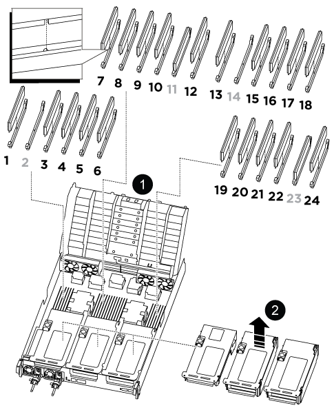

= 更换DIMM - ASA C800
:allow-uri-read: 
:icons: font
:imagesdir: ../media/

[role="lead"]
如果检测到过多的可纠正或不可纠正的内存错误，请更换ASA C800系统中的 DIMM。此类错误可能会阻止存储系统启动ONTAP。更换过程包括关闭受损的控制器、将其移除、更换 DIMM、重新安装控制器，然后将故障部件返回给NetApp。

.开始之前
* 确保系统中的所有其他组件均正常运行；否则，您必须联系技术支持。
* 请确保将故障组件更换为从NetApp收到的更换组件。

== 第 1 步：关闭受损控制器

关闭或接管故障控制器

要关闭受损控制器，您必须确定控制器的状态，并在必要时接管控制器，以便运行正常的控制器继续从受损控制器存储提供数据。

.关于此任务
* 如果您使用的是SAN系统，则必须已检查受损控制器SCSI刀片的事件消息  `cluster kernel-service show`。 `cluster kernel-service show`命令(在priv高级模式下)可显示该节点的节点名称link:https://docs.netapp.com/us-en/ontap/system-admin/display-nodes-cluster-task.html["仲裁状态"]、该节点的可用性状态以及该节点的运行状态。
+
每个 SCSI 刀片式服务器进程应与集群中的其他节点保持仲裁关系。在继续更换之前，必须先解决所有问题。

* If you have a cluster with more than two nodes, it must be in quorum.如果集群未达到仲裁或运行状况良好的控制器在资格和运行状况方面显示false、则必须在关闭受损控制器之前更正问题描述 ；请参见 link:https://docs.netapp.com/us-en/ontap/system-admin/synchronize-node-cluster-task.html?q=Quorum["将节点与集群同步"^]。

.步骤
. 如果启用了AutoSupport 、则通过调用AutoSupport 消息禁止自动创建案例：
+
`system node autosupport invoke -node * -type all -message MAINT=<# of hours>h`

+
以下AutoSupport 消息禁止自动创建案例两小时：

+
`cluster1:> system node autosupport invoke -node * -type all -message MAINT=2h`

. 禁用自动交还：
+
.. 从健康控制器的控制台输入以下命令：
+
`storage failover modify -node _impaired_node_name_ -auto-giveback false`

.. 进入 `y`当您看到提示“您是否要禁用自动回馈？”时

. 将受损控制器显示为 LOADER 提示符：
+
[cols="1,2"]
|===
| 如果受损控制器显示 ... | 那么 ... 

 a| 
LOADER 提示符
 a| 
转至下一步。

 a| 
正在等待交还
 a| 
按 Ctrl-C ，然后在出现提示时回答 `y` 。

 a| 
系统提示符或密码提示符
 a| 
从运行正常的控制器接管或暂停受损控制器：

`storage failover takeover -ofnode _impaired_node_name_ -halt _true_`

-halt true参数将进入Loader提示符。

|===

== 第 2 步：卸下控制器模块

在更换控制器模块或更换控制器模块内的组件时，您必须从机箱中卸下控制器模块。

.步骤
. 如果您尚未接地，请正确接地。
. 使用拇指推动每个驱动器、直至感觉到强制停止、以确保机箱中的所有驱动器都牢固地固定在中板上。
+
.视频 - 确认驾驶员座椅
video::2c46e4af-2c21-4f12-b065-b38b003d0ea2[panopto]
+
image::../media/drw_a800_drive_seated_IEOPS-960.svg[将驱动器安装到位]

. 根据系统状态检查控制器驱动器：
+
.. 在运行正常的控制器上，检查是否存在任何处于降级状态、故障状态或两者兼有的状态：
+
[source, cli]
----
storage aggregate show -raidstatus !*normal*
----
+
*** 如果命令返回 `There are no entries matching your query.`继续<<Check-missing-drives,进入下一个子步骤，检查是否存在缺失的驱动器。>>。
*** 如果该命令返回任何其他结果，请从两个控制器收集AutoSupport数据，并联系NetApp支持部门以获取进一步帮助。
+
[source, cli]
----
system node autosupport invoke -node * -type all -message '<message_name>'
----

.. [[检查缺失驱动器]]检查文件系统或备用驱动器是否存在缺失驱动器问题：
+
[source, cli]
----
event log show -severity * -node * -message-name *disk.missing*
----
+
*** 如果命令返回 `There are no entries matching your query.`继续<<remove-power-cables,进入下一步>>。
*** 如果该命令返回任何其他结果，请从两个控制器收集AutoSupport数据，并联系NetApp支持部门以获取进一步帮助。
+
[source, cli]
----
system node autosupport invoke -node * -type all -message '<message_name>'
----

. [[移除电源线]]移除电源线固定器，然后从电源上拔下电源线。
. 松开线缆管理装置上的魔术贴绑带。从控制器模块上拔下系统电缆和 SFP/QSFP 模块（如果需要）。记下每根电缆的位置。
+
将缆线留在缆线管理设备中，以便在重新安装缆线管理设备时，缆线排列有序。

. 将缆线管理设备从控制器模块中取出并放在一旁。
. 向下按两个锁定闩锁，然后同时向下旋转两个闩锁。
+
此控制器模块会从机箱中略微移出。

+
image::../media/drw_a800_pcm_remove.png[Removing the controller module]

+
[cols="1,4"]
|===

 a| 
image:../media/icon_round_1.png["标注编号1"]
 a| 
锁定闩锁

 a| 
image:../media/icon_round_2.png["标注编号2"]
 a| 
锁定销

|===
. 将控制器模块滑出机箱、然后将其放在平稳的表面上。
+
托住控制器模块的底部，将其从机箱中滑出。

== 第 3 步：更换 DIMM

更换控制器中的内存条。

要更换DIMM、您必须使用通风管顶部的DIMM映射标签在控制器模块中找到该DIMM、然后按照特定步骤顺序进行更换。

. 打开通风管：
+
.. 朝控制器模块中间按下通风管两侧的锁定片。
.. 将通风管滑向风扇模块，然后将其向上旋转到完全打开的位置。

. 卸下 DIMM 时，请解锁相应提升板上的锁定闩锁，然后卸下提升板。
+

+
[cols="1,4"]
|===

 a| 
image:../media/icon_round_1.png["标注编号1"]
 a| 
通风管盖

 a| 
image:../media/icon_round_2.png["标注编号2"]
 a| 
提升板 1 和 DIMM 插槽 1 以及 3-6

 a| 
提升板 2 和 DIMM 插槽 7-10 ， 12-13 和 15-18
 a| 
提升板 3 和 DIMM 19-22 和 24

|===
+
* 注： * 插槽 2 和 14 为空。请勿尝试在这些插槽中安装 DIMM 。

. 记下插槽中 DIMM 的方向，以便可以按正确的方向插入更换用的 DIMM 。
. 缓慢推动 DIMM 两侧的两个 DIMM 弹出卡舌，将 DIMM 从插槽中弹出，然后将 DIMM 滑出插槽。
+

NOTE: 小心握住 DIMM 的边缘，以避免对 DIMM 电路板上的组件施加压力。

. 从防静电运输袋中取出更换用的 DIMM ，拿住 DIMM 的边角并将其与插槽对齐。
+
DIMM 插脚之间的缺口应与插槽中的突起对齐。

. 将 DIMM 垂直插入插槽。
+
DIMM 紧紧固定在插槽中，但应很容易插入。如果没有，请将 DIMM 与插槽重新对齐并重新插入。

+

NOTE: 目视检查 DIMM ，确认其均匀对齐并完全插入插槽。

. 小心而稳固地推动 DIMM 的上边缘，直到弹出器卡舌卡入到位，卡入到位于 DIMM 两端的缺口上。
. 重新安装从控制器模块中卸下的所有提升板。
. 关闭通风管。

== 第 4 步：重新安装控制器模块

重新安装控制器模块并重新启动。

.步骤
. 将控制器模块的末端与机箱中的开口对齐，然后将控制器模块轻轻推入系统的一半。
+

NOTE: 请勿将控制器模块完全插入机箱中，除非系统指示您这样做。

. 根据需要重新对系统进行布线。
+
如果您已卸下介质转换器（ QSFP 或 SFP ），请记得在使用光缆时重新安装它们。

. 完成控制器模块的重新安装：
+
.. 将控制器模块牢牢推入机箱，直到它与中板相距并完全就位。
+
控制器模块完全就位后，锁定闩锁会上升。

+

NOTE: 将控制器模块滑入机箱时，请勿用力过大，以免损坏连接器。

.. 向上旋转锁定闩锁，使其倾斜，以清除锁定销，然后将其降低到锁定位置。
.. 将电源线插入电源、重新安装电源线锁环、然后将电源连接到电源。
+
电源恢复后、控制器模块将立即启动。Be prepared to interrupt the boot process.

.. 如果尚未重新安装缆线管理设备，请重新安装该设备。

. 通过交还存储使受损控制器恢复正常运行：
+
`storage failover giveback -ofnode _impaired_node_name_`(英文)

. 如果已禁用自动交还、请重新启用它：
+
`storage failover modify -node local -auto-giveback true`(英文)

. 如果启用了AutoSupport、则还原/取消禁止自动创建案例：
+
`system node autosupport invoke -node * -type all -message MAINT=END`(英文)

== 第 5 步：将故障部件退回 NetApp

按照套件随附的 RMA 说明将故障部件退回 NetApp 。 https://mysupport.netapp.com/site/info/rma["部件退回和更换"]有关详细信息、请参见页面。
