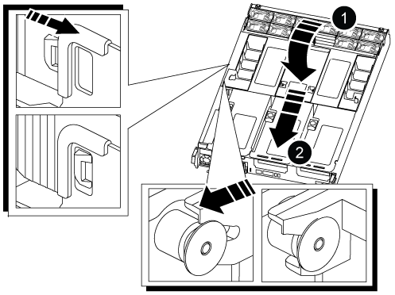

= 更换PCIe卡- ASA C800
:allow-uri-read: 
:icons: font
:imagesdir: ../media/

[role="lead"]
要更换 PCIe 卡，您必须断开卡的缆线连接，从卡中卸下 SFP 和 QSFP 模块，然后再卸下提升板，重新安装提升板，最后重新安装 SFP 和 QSFP 模块，最后再为卡布线。

* 您可以将此操作步骤与系统支持的所有 ONTAP 版本结合使用
* 系统中的所有其他组件必须正常运行；否则，您必须联系技术支持。

== 第 1 步：关闭受损控制器

要关闭受损控制器，您必须确定控制器的状态，并在必要时接管控制器，以便运行正常的控制器继续从受损控制器存储提供数据。

.关于此任务
* 如果您使用的是SAN系统，则必须已检查受损控制器SCSI刀片的事件消息  `cluster kernel-service show`。 `cluster kernel-service show`命令(在priv高级模式下)可显示该节点的节点名称link:https://docs.netapp.com/us-en/ontap/system-admin/display-nodes-cluster-task.html["仲裁状态"]、该节点的可用性状态以及该节点的运行状态。
+
每个 SCSI 刀片式服务器进程应与集群中的其他节点保持仲裁关系。在继续更换之前，必须先解决所有问题。

* If you have a cluster with more than two nodes, it must be in quorum.如果集群未达到仲裁或运行状况良好的控制器在资格和运行状况方面显示false、则必须在关闭受损控制器之前更正问题描述 ；请参见 link:https://docs.netapp.com/us-en/ontap/system-admin/synchronize-node-cluster-task.html?q=Quorum["将节点与集群同步"^]。

.步骤
. 如果启用了AutoSupport 、则通过调用AutoSupport 消息禁止自动创建案例：
+
`system node autosupport invoke -node * -type all -message MAINT=<# of hours>h`

+
以下AutoSupport 消息禁止自动创建案例两小时：

+
`cluster1:> system node autosupport invoke -node * -type all -message MAINT=2h`

. 从运行状况良好的控制器的控制台禁用自动交还：
+
`storage failover modify -node local -auto-giveback false`

+

NOTE: 当您看到_Do you want to disable auto-giveback？_时、输入`y`。

. 将受损控制器显示为 LOADER 提示符：
+
[cols="1,2"]
|===
| 如果受损控制器显示 ... | 那么 ... 

 a| 
LOADER 提示符
 a| 
转至下一步。

 a| 
正在等待交还
 a| 
按 Ctrl-C ，然后在出现提示时回答 `y` 。

 a| 
系统提示符或密码提示符
 a| 
从运行正常的控制器接管或暂停受损控制器：

`storage failover takeover -ofnode _impaired_node_name_ -halt _true_`

-halt true参数将进入Loader提示符。

|===

== 第 2 步：卸下控制器模块

在更换控制器模块或更换控制器模块内的组件时，您必须从机箱中卸下控制器模块。

. 如果您尚未接地，请正确接地。
. 使用拇指推动每个驱动器、直至感觉到强制停止、以确保机箱中的所有驱动器都牢固地固定在中板上。
+
image::../media/drw_a800_drive_seated_IEOPS-960.svg[安装磁盘驱动器]

. 从源拔下控制器模块电源。
. 释放电源线固定器，然后从电源中拔下缆线。
. 松开将缆线绑在缆线管理设备上的钩环带，然后从控制器模块中拔下系统缆线以及 SFP 和 QSFP 模块（如果需要），并跟踪缆线的连接位置。
+
将缆线留在缆线管理设备中，以便在重新安装缆线管理设备时，缆线排列有序。

. 将缆线管理设备从控制器模块中取出并放在一旁。
. 向下按两个锁定闩锁，然后同时向下旋转两个闩锁。
+
此控制器模块会从机箱中略微移出。

+
image::../media/drw_a800_pcm_remove.png[松开控制器模块]

+
[cols="1,4"]
|===

 a| 
image:../media/icon_round_1.png["标注编号1"]
 a| 
锁定闩锁

 a| 
image:../media/icon_round_2.png["标注编号2"]
 a| 
锁定销

|===
. 将控制器模块滑出机箱。
+
将控制器模块滑出机箱时，请确保您支持控制器模块的底部。

. 将控制器模块放在平稳的表面上，然后打开通风管：
+
.. 朝控制器模块中间按下通风管两侧的锁定片。
.. 将通风管滑向风扇模块，然后将其向上旋转到完全打开的位置。
+
image::../media/drw_a800_open_air_duct.png[打开空气管道]

+
[cols="1,4"]
|===

 a| 
image:../media/icon_round_1.png["标注编号1"]
 a| 
通风管锁定卡舌

 a| 
image:../media/icon_round_2.png["标注编号2"]
 a| 
将通风管滑向风扇模块

 a| 
image:../media/icon_round_3.png["标注编号3"]
 a| 
向风扇模块旋转通风管

|===

== 第 3 步：更换 PCIe 卡

要更换 PCIe 卡，您必须从目标提升板中 PCIe 卡上的端口上卸下布线以及任何 QSFP 和 SFP ，从控制器模块中卸下提升板，卸下并更换 PCIe 卡，将提升板以及任何 QSFP 和 SFP 重新安装到端口上。 并为端口布线。

. 确定要更换的卡是来自提升板 1 ，还是来自提升板 2 或 3 。
+
** 如果要更换提升板 1 中的 100GbE PCIe 卡，请执行步骤 2 - 3 和步骤 6 - 7 。
** 如果要从提升板 2 或 3 更换 PCIe 卡，请执行步骤 4 至 7 。

. 从控制器模块中卸下提升板 1 ：
+
.. 卸下可能位于 PCIe 卡中的 QSFP 模块。
.. 将提升板左侧的提升板锁定闩锁向上旋转并朝风扇模块方向旋转。
+
此竖板会从控制器模块中略微升高。

.. 抬起竖板，将其移向风扇，使竖板上的金属片边缘脱离控制器模块的边缘，将其从控制器模块中提出，然后将其放在平稳的平面上。
+
image::../media/drw_a800_pcie_1_replace.png[更换Riser卡1中的PCI卡]

+
[cols="1,4"]
|===

 a| 
image:../media/icon_round_1.png["标注编号1"]
 a| 
通风管

 a| 
image:../media/icon_round_2.png["标注编号2"]
 a| 
提升板锁定闩锁

 a| 
image:../media/icon_round_3.png["标注编号3"]
 a| 
卡锁定支架

 a| 
image:../media/icon_round_4.png["标注编号4"]
 a| 
提升板 1 （左提升板），插槽 1 中装有 100GbE PCIe 卡。

|===

. 从提升板 1 中卸下 PCIe 卡：
+
.. 转动提升板，以便可以访问 PCIe 卡。
.. 按下 PCIe 提升板侧面的锁定支架，然后将其旋转到打开位置。
.. 从提升板中卸下 PCIe 卡。

. 从控制器模块中卸下 PCIe 提升板：
+
.. 卸下 PCIe 卡中可能存在的所有 SFP 或 QSFP 模块。
.. 将提升板左侧的提升板锁定闩锁向上旋转并朝风扇模块方向旋转。
+
此竖板会从控制器模块中略微升高。

.. 抬起竖板，将其移向风扇，使竖板上的金属片边缘脱离控制器模块的边缘，将其从控制器模块中提出，然后将其放在平稳的平面上。
+
image::../media/drw_a800_pcie_2_5_replace.gif[更换中间和右侧Riser卡中的PCI卡2至5]

+
[cols="1,4"]
|===

 a| 
image:../media/icon_round_1.png["标注编号1"]
 a| 
通风管

 a| 
image:../media/icon_round_2.png["标注编号2"]
 a| 
提升板 2 （中间提升板）或 3 （右侧提升板）锁定闩锁

 a| 
image:../media/icon_round_3.png["标注编号3"]
 a| 
卡锁定支架

 a| 
image:../media/icon_round_4.png["标注编号4"]
 a| 
提升板 2 或 3 上的侧面板

 a| 
image:../media/icon_round_5.png["标注编号5"]
 a| 
提升板 2 或 3 中的 PCIe 卡

|===

. 从提升板中卸下 PCIe 卡：
+
.. 转动提升板，以便可以访问 PCIe 卡。
.. 按下 PCIe 提升板侧面的锁定支架，然后将其旋转到打开位置。
.. 将侧面板从竖板上摆动。
.. 从提升板中卸下 PCIe 卡。

. 将 PCIe 卡安装到提升板中的同一插槽中：
+
.. 将卡与提升板中的卡插槽对齐，然后将其垂直滑入提升板中的插槽。
+

NOTE: 确保此卡完全，正对着提升板插槽。

.. 对于提升板 2 或 3 ，请合上侧面板。
.. 将锁定闩锁旋转到位，直到其卡入到位。

. 将此提升板安装到控制器模块中：
+
.. 将竖板的边缘与控制器模块金属板的下侧对齐。
.. 沿着控制器模块中的插脚引导此提升板，然后将此提升板降低到控制器模块中。
.. 向下转动锁定闩锁并将其卡入锁定位置。
+
锁定后，锁定闩锁将与提升板顶部平齐，而提升板恰好位于控制器模块中。

.. 重新插入从 PCIe 卡中卸下的所有 SFP 模块。

== 第 4 步：重新安装控制器模块

更换控制器模块中的组件后，您必须在系统机箱中重新安装控制器模块并启动它。

. 如果尚未关闭通风管：
+
.. 将通风管一直旋转到控制器模块。
.. 向提升板滑动通风管，直到锁定卡舌卡入到位。
.. 检查通风管，确保其正确就位并锁定到位。
+

+
[cols="1,4"]
|===

 a| 
image:../media/icon_round_1.png["标注编号1"]
 a| 
锁定卡舌

 a| 
image:../media/icon_round_2.png["标注编号2"]
 a| 
滑动柱塞

|===

. 将控制器模块的末端与机箱中的开口对齐，然后将控制器模块轻轻推入系统的一半。
+

NOTE: 请勿将控制器模块完全插入机箱中，除非系统指示您这样做。

. 仅为管理和控制台端口布线，以便您可以访问系统以执行以下各节中的任务。
+

NOTE: 您将在此操作步骤中稍后将其余缆线连接到控制器模块。

. 完成控制器模块的重新安装：
+
.. 将控制器模块牢牢推入机箱，直到它与中板相距并完全就位。
+
控制器模块完全就位后，锁定闩锁会上升。

+

NOTE: 将控制器模块滑入机箱时，请勿用力过大，以免损坏连接器。

.. 向上旋转锁定闩锁，使其倾斜，以清除锁定销，然后将其降低到锁定位置。

. 将系统缆线和收发器模块插入控制器模块，然后重新安装缆线管理设备。
. 将电源线插入电源，然后重新安装电源线固定器。
+
控制器模块一连接到电源就开始启动。Be prepared to interrupt the boot process.

+

NOTE: 如果您的系统具有直流电源、请确保电源电缆上的翼形螺钉已拧紧。

. 交还控制器的存储，使其恢复正常运行： `storage failover giveback -ofnode _impaired_node_name_`
. 如果已禁用自动交还，请重新启用它： `storage failover modify -node local -auto-giveback true`

== 第 5 步：将故障部件退回 NetApp

按照套件随附的 RMA 说明将故障部件退回 NetApp 。 https://mysupport.netapp.com/site/info/rma["部件退回和更换"]有关详细信息、请参见页面。
