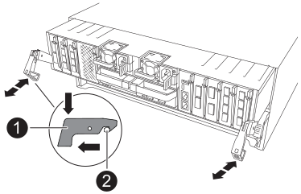

= 移动并更换硬件- ASA A70和ASA A90
:allow-uri-read: 
:icons: font
:imagesdir: ../media/

[role="lead"]
如果硬件故障需要更换ASA A70或ASA A90系统的机箱。更换过程包括卸下控制器和电源设备(PSU)、卸下驱动器、安装更换机箱以及重新安装机箱组件。

== 步骤1：卸下PSU和电缆

在卸下控制器之前、您需要卸下所有四个电源设备(PSU)、每个控制器两个。卸下这些控制器可减轻每个控制器的整体重量。

. 卸下四个PSU：
+
.. 如果您尚未接地，请正确接地。
.. 从控制器模块PSU上拔下电源线。
+
如果您的系统使用直流电源、请断开电源块与PSU的连接。

.. 向上旋转PSU手柄以将PSU拉出控制器、按下PSU锁定卡舌、然后将PSU从控制器模块中拉出。
+

CAUTION: PSU较短。Always use two hands to support it when removing it from the controller module so that it does not suddenly swing free from the controller module and injure you.

+
image::../media/drw_a70-90_psu_remove_replace_ieops-1368.svg[更换PSU]

+
[cols="1,4"]
|===

 a| 
image:../media/icon_round_1.png["标注编号1"]
 a| 
Terrac兵马俑PSU锁定卡舌

|===
.. 对其余PSU重复上述步骤。

. 卸下电缆：
+
.. 从控制器模块中拔下系统缆线以及任何SFP和QSFP模块(如果需要)、但将其留在缆线管理设备中以使其井然有序。
+

NOTE: 此过程开始时、应已标记电缆。

.. 从控制器模块中卸下缆线管理设备、并将其放在一旁。

== 步骤2：卸下控制器模块和驱动器

从机箱中卸下控制器、然后从机箱中卸下驱动器。

. 检查每个控制器模块背面插槽4/5中的琥珀色NVRAM状态指示灯是否熄灭。查找NV图标。
+
image::../media/drw_a1K-70-90_nvram-led_ieops-1463.svg[NVRAM警示和状态LED位置图]

+
[cols="1,4"]
|===

 a| 
image:../media/icon_round_1.png["标注编号1"]
 a| 
NVRAM 状态 LED

 a| 
image:../media/icon_round_2.png["标注编号2"]
 a| 
NVRAM警示LED

|===
+
** 如果NVRAM LED熄灭、请转至下一步。
** 如果NVRAM LED闪烁、请等待闪烁停止。如果闪烁持续时间超过5分钟、请联系寻求帮助。 http://mysupport.netapp.com/["NetApp 支持站点"^]

. 卸下控制器模块：
+
.. 按下控制器上的两个锁定闩锁、然后同时向下旋转两个闩锁。
+
此控制器模块会从机箱中略微移出。

+

+
[cols="1,4"]
|===

 a| 
image:../media/icon_round_1.png["标注编号1"]
 a| 
锁定闩锁

 a| 
image:../media/icon_round_2.png["标注编号2"]
 a| 
锁定销

|===
.. 通过锁定闩锁将控制器模块滑出机箱、然后将其放在平稳的表面上。
+
将控制器模块滑出机箱时，请确保您支持控制器模块的底部。

.. 对第二个控制器模块重复上述步骤。

. 删除驱动器：
+
.. 从系统正面轻轻卸下挡板。
.. 按下LED下方驱动器托架顶部的释放按钮。
.. 将凸轮把手拉至完全打开位置，以使驱动器从中板中取出，然后将驱动器轻轻滑出机箱。
+
驱动器应与机箱分离，以便滑出机箱。

+

NOTE: Drives are fragile.卸下驱动器时、请始终用双手支撑驱动器重量、以防止损坏驱动器。

.. 记录每个驱动器所在的驱动器托架、并将驱动器放在无静电的手推车或桌子旁。
.. 对机箱中的其余驱动器重复此步骤。

== 步骤3：更换受损机箱

卸下受损机箱并安装更换机箱。

. 卸下受损机箱：
+
.. 从机箱安装点卸下螺钉。
.. 使用两个人或一台升降机、将受损机箱从系统机柜或设备机架中的机架导轨上滑出、然后将其放在一旁。

. 安装更换机箱：
+
.. 使用两个人或一台升降机将更换用的机箱引导至系统机柜或设备机架中的机架导轨、从而将其安装到设备机架或系统机柜中。
.. 将机箱完全滑入设备机架或系统机柜中。
.. 使用从受损机箱中卸下的螺钉将机箱前部固定到设备机架或系统机柜。

== 步骤4：安装机箱组件

安装替代机箱后、您需要安装控制器模块、对其重新进行配置、然后重新安装驱动器和PSU。

. 从底部控制器模块开始、将控制器模块安装在更换机箱中：
+
.. 将控制器模块的一端与机箱中的开口对齐、然后将控制器轻轻推入机箱中。
.. 将锁定闩锁向上旋转到锁定位置。
.. 如果尚未重新安装缆线管理设备并对控制器重新布线、请执行此操作。
+
如果已卸下介质转换器(QSFP或SFP)、请记得重新安装它们。

+
确保参考电缆标签连接电缆。

. 将驱动器重新安装到机箱正面相应的驱动器托架中。
. 安装所有四个PSU：
+
.. 用双手支撑PSU的边缘并将其与控制器模块的开口对齐。
.. 将PSU轻轻推入控制器模块、直到锁定卡舌卡入到位。
+
电源只能与内部连接器正确接合并单向锁定到位。

+

NOTE: 为了避免损坏内部连接器、请勿在将PSU滑入系统时用力过大。

. 将PSU电源线重新连接到所有四个PSU。
+
.. 使用电源线固定器将电源线固定到PSU。
+
如果您有直流电源、请在控制器模块完全固定在机箱中后将电源块重新连接到电源、并使用指旋螺钉将电源线固定到PSU。

+
安装PSU并恢复供电后、控制器模块将立即启动。

.下一步是什么？
在更换受损ASA A70或ASA A90机箱并将组件重新安装到其中后，您需要link:chassis-replace-complete-system-restore-rma.html["完成机箱更换"]。
