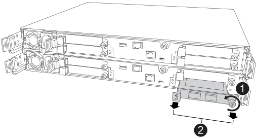

= 热插拔 I/O 模块 - ASA A20、ASA A30 和 ASA A50
:allow-uri-read: 
:icons: font
:imagesdir: ../media/

[role="lead"]
如果模块出现故障并且存储系统满足所有 ONTAP 版本要求，则可以热插拔 ASA A20、ASA A30 或 ASA A50 存储系统中的以太网 I/O 模块。

要热插拔 I/O 模块，请确保存储系统符合 ONTAP 版本要求，准备好存储系统和 I/O 模块，热插拔出现故障的模块，使更换模块联机，将存储系统恢复到正常操作，并将出现故障的模块返回 NetApp。

.关于此任务
* 热插拔 I/O 模块意味着在更换出现故障的 I/O 模块之前，您不必执行手动接管。
* 在热插拔 I/O 模块时，将命令应用于正确的控制器和 I/O 插槽：
+
** _受损控制器_是您要热插拔 I/O 模块的控制器。
** _健康控制器_是受损控制器的 HA 伙伴。

* 您可以打开存储系统位置（蓝色）指示灯，以帮助实际定位受影响的存储系统。使用 SSH 登录 BMC 并输入 `system location-led _on_`命令。
+
存储系统具有三个定位LED：操作员显示面板上一个、每个控制器上一个。Location LEDs remain illuminated for 30 minutes.

+
您可以输入命令将其关闭 `system location-led _off_`。如果您不确定LED是亮起还是熄灭、可以输入命令来检查其状态 `system location-led show`。

== 步骤 1：确保存储系统满足程序要求

要使用此过程，您的存储系统必须运行 ONTAP 9.17.1 或更高版本，并且您的存储系统必须满足运行的 ONTAP 版本的所有要求。

NOTE: 如果您的存储系统未运行 ONTAP 9.17.1 或更高版本，或者不满足您的存储系统运行的 ONTAP 版本的所有要求，则无法使用此操作步骤，必须使用 link:io-module-replace.html["更换 I/O 模块程序"]。

[role="tabbed-block"]
====
.ONTAP 9.17.1 或 9.18.1RC
--
* 您正在使用等效的 I/O 模块热插拔插槽 4 中的故障群集和 HA I/O 模块。无法更改 I/O 模块类型。
* 具有故障集群和 HA I/O 模块的控制器（受损控制器）必须已经接管了正常的合作伙伴控制器。如果 I/O 模块出现故障，则应自动进行接管。
+
对于双节点群集，存储系统无法识别哪个控制器具有出现故障的 I/O 模块，因此任一控制器都可能启动接管。仅当具有故障 I/O 模块的控制器（受损控制器）已接管健康控制器时，才支持热插拔。热插拔 I/O 模块是恢复而不会中断的唯一方法。

+
您可以通过输入以下命令来验证受损控制器是否成功接管了健康控制器 `storage failover show`命令。

+
如果您不确定哪个控制器的 I/O 模块出现故障，请联系 https://mysupport.netapp.com/site/global/dashboard["NetApp 支持"] 。

* 您的存储系统配置必须仅有一个位于插槽 4 中的集群和 HA I/O 模块，而不是两个集群和 HA I/O 模块。
* 您的存储系统必须是双节点（无交换机或有交换机）集群配置。
* 存储系统中的所有其他组件都必须正常运行；如果未正常运行、请先联系、 https://mysupport.netapp.com/site/global/dashboard["NetApp 支持"]然后再继续此过程。

--
.ONTAP 9.18.1GA 或更高版本
--
* 您正在热插拔任何插槽中的以太网 I/O 模块，该插槽具有用于集群、HA 和客户端的任意端口组合，并具有等效的 I/O 模块。无法更改 I/O 模块类型。
+
具有用于存储或 MetroCluster 的端口的以太网 I/O 模块不可热插拔。

* 您的存储系统（无交换机或交换机集群配置）可以具有存储系统支持的任意数量的节点。
* 集群中的所有节点都必须运行相同的 ONTAP 版本（ONTAP 9.18.1GA 或更高版本）或运行相同 ONTAP 版本的不同补丁级别。
+
如果集群中的节点运行不同的 ONTAP 版本，则视为混合版本集群，不支持热插拔 I/O 模块。

* 存储系统中的控制器可以处于以下状态之一：
+
** 两个控制器都可以启动并运行 I/O（提供数据）。
** 如果接管是由故障的 I/O 模块引起的，并且控制器在其他方面正常工作，则任一控制器都可能处于接管状态。
+
在某些情况下，由于 I/O 模块故障，ONTAP 可以自动接管任一控制器。例如，如果出现故障的 I/O 模块包含所有群集端口（该控制器上的所有群集链接都将关闭），ONTAP 会自动执行接管。

* 存储系统中的所有其他组件都必须正常运行；如果未正常运行、请先联系、 https://mysupport.netapp.com/site/global/dashboard["NetApp 支持"]然后再继续此过程。

--
====

== 步骤 2：准备存储系统和 I/O 模块插槽

准备好存储系统和 I/O 模块插槽，以便可以安全地卸下出现故障的 I/O 模块：

.步骤
. 正确接地。
. 从出现故障的 I/O 模块中拔下电缆。
+
请务必给电缆贴上标签，以便稍后在本过程中将它们重新连接到相同的端口。

+
[NOTE]
====
I/O 模块应出现故障（端口应处于链路关闭状态）；但是，如果链路仍处于打开状态，并且它们包含最后一个正常运行的集群端口，则拔下电缆会触发自动接管。

拔下电缆后等待五分钟，以确保完成任何接管或 LIF 故障切换，然后继续此过程。

====
. 如果启用了AutoSupport 、则通过调用AutoSupport 消息禁止自动创建案例：
+
`system node autosupport invoke -node * -type all -message MAINT=<number of hours down>h`

+
例如，以下AutoSupport消息会抑制自动案例创建两小时：

+
`node2::> system node autosupport invoke -node * -type all -message MAINT=2h`

. 根据存储系统运行的 ONTAP 版本以及控制器的状态，禁用自动回馈：
+
[cols="1,2,3"]
|===
| ONTAP 版本 | 条件 | 那么 ... 

 a| 
9.17.1 或 9.18.1RC
 a| 
如果受损控制器自动接管了健康控制器
 a| 
禁用自动交还：

.. 从受损控制器的控制台输入以下命令
+
`storage failover modify -node local -auto-giveback false`

.. 进入 `y`当您看到提示“您是否要禁用自动回馈？”时

 a| 
9.18.1GA 或更高版本
 a| 
如果任一控制器自动接管其合作伙伴
 a| 
禁用自动交还：

.. 从接管其合作伙伴的控制器的控制台输入以下命令：
+
`storage failover modify -node local -auto-giveback false`

.. 进入 `y`当您看到提示“您是否要禁用自动回馈？”时

 a| 
9.18.1GA 或更高版本
 a| 
两个控制器都已启动并运行 I/O（提供数据）
 a| 
转至下一步。

|===
. 将发生故障的 I/O 模块从服务中移除并关闭电源，以准备拆卸：
+
.. 输入以下命令：
+
`system controller slot module remove -node _impaired_node_name_ -slot _slot_number_`

.. 进入 `y`当您看到提示“您想继续吗？”
+
例如，以下命令准备将节点 2（受损控制器）上的插槽 4 中的故障模块移除，并显示一条可以安全移除的消息：

+
[listing]
----
node2::> system controller slot module remove -node node2 -slot 4

Warning: IO_2X_100GBE_NVDA_NIC module in slot 4 of node node2 will be powered off for removal.

Do you want to continue? {y|n}: y

The module has been successfully removed from service and powered off. It can now be safely removed.
----

. 验证发生故障的 I/O 模块已关闭电源：
+
`system controller slot module show`

+
输出结果应显示 `_powered-off_`在故障模块及其插槽编号的 `_status_`列中。

== 步骤 3：热插拔发生故障的 I/O 模块

将发生故障的 I/O 模块与等效的 I/O 模块热插拔：

.步骤
. 如果您尚未接地，请正确接地。
. 从损坏的控制器上卸下发生故障的 I/O 模块：
+

+
[cols="1,4"]
|===

 a| 
image::../media/icon_round_1.png[标注编号1]
 a| 
逆时针旋转I/O模块指旋螺钉以拧松。

 a| 
image::../media/icon_round_2.png[标注编号2]
 a| 
使用左侧的端口标签卡舌和右侧的翼形螺钉将 I/O 模块从控制器中拉出。

|===
. 安装更换 I/O 模块：
+
.. 将 I/O 模块与插槽边缘对齐。
.. 轻轻地将 I/O 模块完全推入插槽，确保 I/O 模块正确插入连接器。
+
您可以使用左侧的卡舌和右侧的翼形螺钉来推入 I/O 模块。

.. 顺时针旋转翼形螺钉以拧紧。

. 连接更换的 I/O 模块。

== 步骤 4：使更换 I/O 模块联机

将更换的 I/O 模块联机，验证 I/O 模块端口已成功初始化，验证插槽已通电，然后验证 I/O 模块是否联机并被识别。

.关于此任务
更换 I/O 模块并将端口恢复到正常状态后，LIF 将恢复到更换的 I/O 模块。

.步骤
. 使更换 I/O 模块联机：
+
.. 输入以下命令：
+
`system controller slot module insert -node _impaired_node_name_ -slot _slot_number_`

.. 进入 `y`当您看到提示“您想继续吗？”
+
输出应确认 I/O 模块已成功联机（开机、初始化并投入使用）。

+
例如，以下命令使节点 2（受损控制器）上的插槽 4 联机，并显示该过程成功的消息：

+
[listing]
----
node2::> system controller slot module insert -node node2 -slot 4

Warning: IO_2X_100GBE_NVDA_NIC module in slot 4 of node node2 will be powered on and initialized.

Do you want to continue? {y|n}: `y`

The module has been successfully powered on, initialized and placed into service.
----

. 验证 I/O 模块上的每个端口是否已成功初始化：
+
.. 从受损控制器的控制台输入以下命令：
+
`event log show -event \*hotplug.init*`

+

NOTE: 任何所需的固件更新和端口初始化可能需要几分钟时间。

+
输出应显示一个或多个 hotplug.init.success EMS 事件，指示 I/O 模块上的每个端口已成功启动。

+
例如，以下输出显示 I/O 端口 e4b 和 e4a 的初始化成功：

+
[listing]
----
node2::> event log show -event *hotplug.init*

Time                Node             Severity      Event

------------------- ---------------- ------------- ---------------------------

7/11/2025 16:04:06  node2      NOTICE        hotplug.init.success: Initialization of ports "e4b" in slot 4 succeeded

7/11/2025 16:04:06  node2      NOTICE        hotplug.init.success: Initialization of ports "e4a" in slot 4 succeeded

2 entries were displayed.
----
.. 如果端口初始化失败，请查看 EMS 日志以了解要采取的后续步骤。

. 验证 I/O 模块插槽已通电并准备就绪：
+
`system controller slot module show`

+
输出应显示插槽状态为  `_powered-on_`，因此 I/O 模块可以运行。

. 确认 I/O 模块已联机并可识别。
+
从受损控制器的控制台输入命令：

+
`system controller config show -node local -slot _slot_number_`

+
如果 I/O 模块已成功联机并被识别，则输出将显示 I/O 模块信息，包括插槽的端口信息。

+
例如，对于插槽 4 中的 I/O 模块，您应该看到类似于以下内容的输出：

+
[listing]
----
node2::> system controller config show -node local -slot 4

Node: node2
Sub- Device/
Slot slot Information
---- ---- -----------------------------
   4    - Dual 40G/100G Ethernet Controller CX6-DX
                  e4a MAC Address: d0:39:ea:59:69:74 (auto-100g_cr4-fd-up)
                          QSFP Vendor:        CISCO-BIZLINK
                          QSFP Part Number:   L45593-D218-D10
                          QSFP Serial Number: LCC2807GJFM-B
                  e4b MAC Address: d0:39:ea:59:69:75 (auto-100g_cr4-fd-up)
                          QSFP Vendor:        CISCO-BIZLINK
                          QSFP Part Number:   L45593-D218-D10
                          QSFP Serial Number: LCC2809G26F-A
                  Device Type:        CX6-DX PSID(NAP0000000027)
                  Firmware Version:   22.44.1700
                  Part Number:        111-05341
                  Hardware Revision:  20
                  Serial Number:      032403001370
----

== 步骤 5：恢复存储系统正常运行

通过向已接管的控制器提供存储空间（根据需要）、恢复自动回馈（根据需要）、验证 LIF 位于其主端口上以及重新启用 AutoSupport 自动案例创建，将存储系统恢复到正常运行状态。

.步骤
. 根据您的存储系统正在运行的 ONTAP 版本以及控制器的状态，在被接管的控制器上交还存储并恢复自动交还：
+
[cols="1,2,3"]
|===
| ONTAP 版本 | 条件 | 那么 ... 

 a| 
9.17.1 或 9.18.1RC
 a| 
如果受损控制器自动接管了健康控制器
 a| 
.. 通过归还存储空间，使运行正常的控制器恢复正常运行：
+
`storage failover giveback -ofnode _healthy_node_name_`

.. 从受损控制器的控制台恢复自动回馈：
+
`storage failover modify -node local -auto-giveback _true_`

 a| 
9.18.1GA 或更高版本
 a| 
如果任一控制器自动接管其合作伙伴
 a| 
.. 通过交还其存储空间，将已接管的控制器恢复正常运行：
+
`storage failover giveback -ofnode _controller that was taken over_name_`

.. 从被接管的控制器的控制台恢复自动回馈：
+
`storage failover modify -node local -auto-giveback _true_`

 a| 
9.18.1GA 或更高版本
 a| 
两个控制器都已启动并运行 I/O（提供数据）
 a| 
转至下一步。

|===
. 验证逻辑接口是否正在向其主服务器和端口报告： `network interface show -is-home false`
+
如果任何LUN列为false、请将其还原到其主端口： `network interface revert -vserver * -lif *`

. 如果启用了AutoSupport、则还原自动创建案例：
+
`system node autosupport invoke -node * -type all -message MAINT=end`

== 第 6 步：将故障部件退回 NetApp

按照套件随附的 RMA 说明将故障部件退回 NetApp 。 https://mysupport.netapp.com/site/info/rma["部件退回和更换"]有关详细信息、请参见页面。
