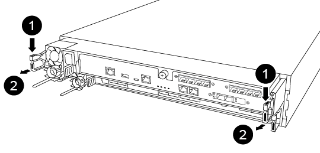
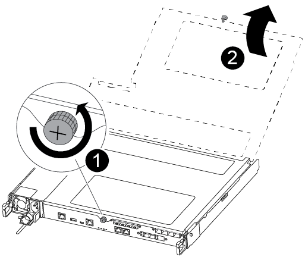
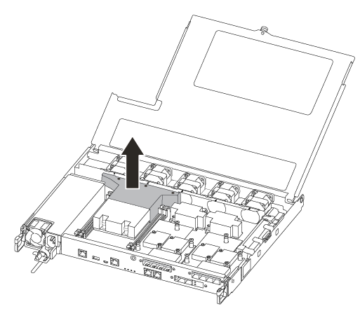
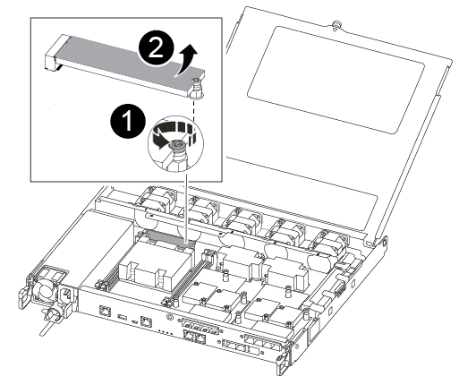
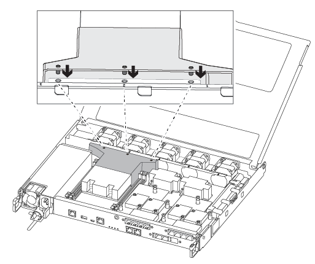
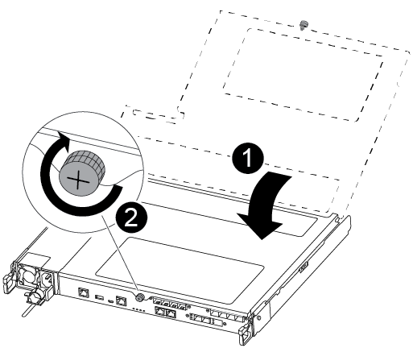

= 更换启动介质以进行自动启动恢复 - ASA A250
:allow-uri-read: 
:icons: font
:imagesdir: ../media/

[role="lead"]
ASA A250 系统中的引导介质存储了基本的固件和配置数据。更换过程包括卸下并打开控制器模块，卸下受损的引导介质，在控制器模块中安装更换引导介质，然后重新安装控制器模块。

只有 ONTAP 9.18.1 及更高版本才支持自动启动介质恢复过程。如果您的存储系统运行的是早期版本的 ONTAP，请使用 link:bootmedia-replace-workflow.html["手动启动恢复程序"]。

启动介质位于风管下方的控制器模块内，通过从系统中移除控制器模块即可访问。

== 第 1 步：卸下控制器模块

. 如果您尚未接地，请正确接地。
. 从源拔下控制器模块电源。
. 释放电源线固定器，然后从电源中拔下缆线。
. 从控制器模块拔下I/O电缆。
. 将前掌插入控制器模块两侧的锁定装置中，用拇指按下控制杆，然后将控制器轻轻拉出机箱几英寸。
+

NOTE: 如果在卸下控制器模块时遇到困难，请将食指从内部穿过指孔（通过跨越臂）。

+

+
[cols="1,4"]
|===

 a| 
image:../media/icon_round_1.png["标注编号1"]
 a| 
控制杆

 a| 
image:../media/icon_round_2.png["标注编号2"]
 a| 
锁定机制

|===
. 用双手抓住控制器模块两侧，将其轻轻拉出机箱，并将其放在平稳的表面上。
. 逆时针转动控制器模块正面的翼形螺钉，然后打开控制器模块盖板。
+

+
[cols="1,4"]
|===

 a| 
image:../media/icon_round_1.png["标注编号1"]
 a| 
翼形螺钉

 a| 
image:../media/icon_round_2.png["标注编号2"]
 a| 
控制器模块盖板。

|===
. 取下通风管盖。
+

== Step 2: Replace the boot media

您可以使用以下视频或表格步骤更换启动介质：

.动画-更换启动介质
video::7c2cad51-dd95-4b07-a903-ac5b015c1a6d[panopto]
. 从控制器模块中找到并更换受损的启动介质：
+

NOTE: 要卸下用于固定启动介质的螺钉，您需要使用 1 号磁性十字螺丝刀。Due to the space constraints within the controller module, you should also have a magnet to transfer the screw on to so that you do not lose it.

+

+
[cols="1,3"]
|===

 a| 
image:../media/icon_round_1.png["标注编号1"]
 a| 
卸下将启动介质固定到控制器模块主板的螺钉。

 a| 
image:../media/icon_round_2.png["标注编号2"]
 a| 
将启动介质从控制器模块中提出。

|===
+
.. 使用 1 号磁性螺丝刀，从受损启动介质上卸下螺钉，并将其安全放在磁铁上。
.. 将受损启动介质直接从插槽中轻轻提起并放在一旁。
.. 从防静电运输袋中取出更换启动介质，并将其在控制器模块上对齐到位。
.. 使用 1 号磁性螺丝刀插入并拧紧启动介质上的螺钉。
+
请勿过度拧紧螺钉，否则可能会损坏启动介质。

.. 安装风道。
+

.. 合上控制器模块盖并拧紧翼形螺钉。
+

+
[cols="1,3"]
|===

 a| 
image:../media/icon_round_1.png["标注编号1"]
 a| 
控制器模块盖板

 a| 
image:../media/icon_round_2.png["标注编号2"]
 a| 
翼形螺钉

|===

. 安装控制器模块：
+
.. 将控制器模块的末端与机箱中的开口对齐，然后将控制器模块轻轻推入系统的一半。
.. 将控制器模块完全推入机箱：
.. 将食指从锁定装置内侧的指孔中穿过。
.. 用拇指向下按压闩锁装置顶部的橙色卡舌，然后将控制器模块轻轻推至停止位置上方。
.. 从锁定机制顶部释放拇指，然后继续推动，直到锁定机制卡入到位。
+
控制器模块应完全插入，并与机箱边缘平齐。

. 重新连接控制器模块I/O电缆。
. 将电源线插入电源、重新安装电源线锁环、然后将电源连接到电源。
+
控制器模块开始启动并在 LOADER 提示符处停止。

.下一步行动
物理更换受损启动介质后，link:bootmedia-recovery-image-boot-bmr.html["从配对节点还原ONTAP映像"]。
