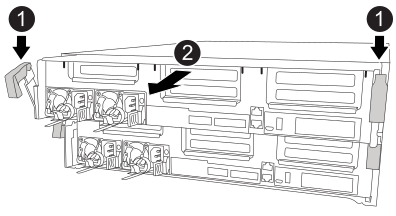
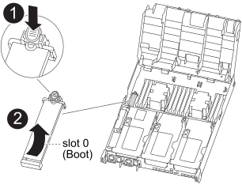

= 更换启动介质以实现自动启动恢复 - ASA A400
:allow-uri-read: 
:icons: font
:imagesdir: ../media/

[role="lead"]
ASA A400 系统中的启动介质存储了重要的固件和配置数据。更换过程包括移除并打开控制器模块、移除受损的启动介质、在控制器模块中安装替换启动介质，然后重新安装控制器模块。

自动启动介质恢复过程仅在ONTAP 9.17.1 及更高版本中受支持。如果您的存储系统运行的是早期版本的ONTAP，请使用link:bootmedia-replace-workflow.html["手动启动恢复程序"] 。

启动介质位于风管下方的控制器模块内，通过从系统中移除控制器模块即可访问。

.步骤
. 如果您尚未接地，请正确接地。
. 释放电源线固定器，然后从电源中拔下缆线。
. 松开将缆线绑在缆线管理设备上的钩环带，然后从控制器模块上拔下系统缆线和 SFP （如果需要），并跟踪缆线的连接位置。
+
将缆线留在缆线管理设备中，以便在重新安装缆线管理设备时，缆线排列有序。

. 将缆线管理设备从控制器模块中取出并放在一旁。
. 向下按两个锁定闩锁，然后同时向下旋转两个闩锁。
+
此控制器模块会从机箱中略微移出。

+

+
[cols="10,90"]
|===

 a| 
image:../media/icon_round_1.png["标注编号1"]
 a| 
锁定闩锁

 a| 
image:../media/icon_round_2.png["标注编号2"]
 a| 
控制器从机箱中略微移出

|===
. 将控制器模块滑出机箱。
+
将控制器模块滑出机箱时，请确保您支持控制器模块的底部。

. 将控制器模块放在平稳的表面上。
. 打开通风管：
+
image::../media/drw_c400_open_air_duct_IEOPS-1215.svg[打开空气管道]

+
[cols="10,90"]
|===

 a| 
image:../media/icon_round_1.png["标注编号1"]
 a| 
锁定卡舌

 a| 
image:../media/icon_round_2.png["标注编号2"]
 a| 
将通风管滑向控制器背面

 a| 
image::../media/icon_round_3.png[标注编号3]
 a| 
向上旋转通风管

|===
+
.. 将通风管两侧的锁定片朝控制器模块中间按压。
.. 将通风管滑向控制器模块的背面，然后将其向上旋转到完全打开的位置。

. 从控制器模块中找到并取出启动介质：
+

+
[cols="10,90"]
|===

 a| 
image:../media/icon_round_1.png["标注编号1"]
 a| 
按蓝色按钮

 a| 
image:../media/icon_round_2.png["标注编号2"]
 a| 
向上旋转启动介质并从插槽中取出

|===
+
.. 按启动介质末端的蓝色按钮，直到启动介质上的边缘清除蓝色按钮。
.. 将启动介质向上旋转，然后将启动介质从插槽中轻轻拉出。

. 将替代启动介质的边缘与启动介质插槽对齐，然后将其轻轻推入插槽。
. 检查启动介质，确保其完全固定在插槽中。
+
如有必要，请取出启动介质并将其重新插入插槽。

. 将启动介质锁定到位：
+
.. 将启动介质向下旋转到主板。
.. 将一根手指放在启动介质的末端，然后按下启动介质的一端，以接合蓝色锁定按钮。
.. 向下推启动介质时，提起蓝色锁定按钮以将启动介质锁定到位。

. 关闭通风管。

.下一步行动
物理更换受损启动介质后，link:bootmedia-recovery-image-boot-bmr.html["从配对节点还原ONTAP映像"]。
