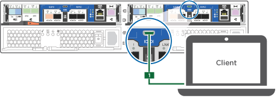

= 详细步骤— AFF C190
:allow-uri-read: 
:icons: font
:imagesdir: ../media/

[role="lead"]
本节详细介绍了安装 AFF C190 系统的分步说明。

== 第 1 步：准备安装

要安装 AFF C190 系统，您需要创建一个帐户并注册该系统。此外，您还需要为系统清点适当数量和类型的缆线，并收集特定的网络信息。

您需要有权访问 link:https://hwu.netapp.com["NetApp Hardware Universe"^] （ HWU ），了解有关站点要求以及已配置系统上的追加信息的信息。您可能还希望有权访问 link:http://mysupport.netapp.com/documentation/productlibrary/index.html?productID=62286["适用于您的 ONTAP 版本的发行说明"^] 有关此系统的详细信息，请参见。

您需要在站点上提供以下内容：

* 存储系统的机架空间
* 2 号十字螺丝刀
* 使用其他网络缆线通过 Web 浏览器将系统连接到网络交换机和笔记本电脑或控制台
* 具有 RJ-45 连接并可访问 Web 浏览器的笔记本电脑或控制台

.步骤
. 打开所有框内容的包装。
. 记录控制器的系统序列号。
+
image::../media/drw_ssn_label.png[DRW SSN 标签]

. 设置您的帐户：
+
.. 登录到现有帐户或创建帐户。
.. 注册（link:https://mysupport.netapp.com/eservice/registerSNoAction.do?moduleName=RegisterMyProduct["NetApp 产品注册"^]）您的系统。

. 下载并安装 link:https://mysupport.netapp.com/site/tools/tool-eula/activeiq-configadvisor["NetApp 下载： Config Advisor"^] 在您的笔记本电脑上。
. 清点并记下收到的缆线数量和类型。
+
The following table identifies the types of cables you might receive.如果您收到的缆线未在表中列出，请参见 link:https://hwu.netapp.com["NetApp Hardware Universe"^] 以找到缆线并确定其用途。

+
[cols="1,2,1,2"]
|===
| 缆线类型 ... | 部件号和长度 | 连接器类型 | 针对 ... 

 a| 
10 GbE 缆线（取决于订单）
 a| 
X6566B-05-R6 （ 112-00297 ）， 0.5 米

X6566B-2-R6 （ 112-00299 ）， 2 米
 a| 
image:../media/oie_cable_sfp_gbe_copper.png[""]
 a| 
集群互连网络

 a| 
X6566B-2-R6 （ 112-00299 ）， 2 米

X6566B-3-R6 （ 112-00300 ）， 3 米

X6566B-5-R6 （ 112-00301 ）， 5 米
 a| 
数据

 a| 
光纤网络缆线（取决于订单）
 a| 
X6553-R6 （ 112-00188 ）， 2 米

X6536-R6 （ 112-00090 ）， 5 米

X6554-R6 （ 112-00189 ）， 15 米
 a| 
image:../media/oie_sfp_optical.png[""]

image::../media/oie_cable_fiber_lc_connector.png[OIE 缆线光纤 LC 连接器]
 a| 
SFP + FC 主机网络

 a| 
6 类， RJ-45 （取决于订单）
 a| 
X6555-R6 （ 112-00291 ）， 3 米

X6562-R6 （ 112-00196 ）， 5 米
 a| 
image:../media/oie_cable_rj45.png[""]
 a| 
以太网主机和管理网络

 a| 
微型 USB 控制台缆线
 a| 
不适用
 a| 
image:../media/oie_cable_micro_usb.png[""]
 a| 
在非 Windows 或 Mac 笔记本电脑 / 控制台上设置软件期间连接控制台

 a| 
电源线
 a| 
不适用
 a| 
image:../media/oie_cable_power.png[""]
 a| 
启动系统

|===
. 下载并完成 link:https://library.netapp.com/ecm/ecm_download_file/ECMLP2839002["集群配置工作表"^]。

== 第 2 步：安装硬件

您需要根据需要将系统安装在四柱机架或 NetApp 系统机柜中。

.步骤
. 根据需要安装导轨套件。
. 按照导轨套件附带的说明安装并固定系统。
+

NOTE: 您需要了解与系统重量相关的安全问题。

+
image::../media/drw_oie_fas2700_weight_caution.png[DRW OIE fas2700 重量注意事项]

. 连接缆线管理设备（如图所示）。
+
image::../media/drw_cable_management_arm_install.png[DRW 缆线管理臂安装]

. 将挡板放在系统正面。

== 第 3 步：使用缆线将控制器连接到网络

您可以使用双节点无交换机集群方法或集群互连网络将控制器连接到网络。

=== 选项 1 ：为双节点无交换机集群布线，统一配置

控制器模块上的 UTA2 端口和管理端口连接到交换机。两个控制器模块上的集群互连端口均已布线。

有关将系统连接到交换机的信息，请与网络管理员联系。

请务必检查插图箭头以确定正确的缆线连接器拉片方向。

image::../media/oie_cable_pull_tab_down.png[OIE 缆线下拉卡舌]

NOTE: 插入连接器时，您应感觉到连接器卡入到位；如果您不认为连接器卡嗒声，请将其卸下，然后将其翻转并重试。

NOTE: 如果要连接到光纤交换机，请先将 SFP 插入控制器端口，然后再使用缆线连接到该端口。

.步骤
. 按照图或分步说明完成控制器与交换机之间的布线：
+
image::../media/drw_c190_tnsc_unified_network_cabling_animated_gif.png[DRW C190 tnsc 统一网络布线动画 gif]

+
[cols="10,90"]
|===
| 步骤 | 在每个控制器上执行 

 a| 
image:../media/oie_legend_icon_1_lg.png[""]
 a| 
使用集群互连缆线将集群互连端口彼此相连：

** e0a 到 e0a
** e0b 到 e0bimage:../media/drw_c190_u_tnsc_clust_cbling.png[""]

 a| 
image:../media/oie_legend_icon_2_o.png[""]
 a| 
使用以下电缆类型之一将 e0c/0c 和 e0d/0d * 或 * e0e/0e 和 e0f/0f 数据端口连接到主机网络：

image:../media/drw_c190_u_fc_10gbe_cbling.png[""]

 a| 
image:../media/oie_legend_icon_3_lp.png[""]
 a| 
使用 RJ45 缆线将 e0M 端口连接到管理网络交换机：

image:../media/drw_c190_u_mgmt_cbling.png[""]

 a| 
image:../media/oie_legend_icon_attn_symbol.png[""]
 a| 
此时请勿插入电源线。

|===
. To complete setting up your system, see link:install-detailed-guide.html#step-4-complete-system-setup-and-configuration["第 4 步：完成系统设置和配置"]。

=== 选项 2 ：缆线交换集群，统一配置

控制器模块上的 UTA2 端口和管理端口连接到交换机。集群互连端口通过缆线连接到集群互连交换机。

有关将系统连接到交换机的信息，请与网络管理员联系。

请务必检查插图箭头以确定正确的缆线连接器拉片方向。

image::../media/oie_cable_pull_tab_down.png[OIE 缆线下拉卡舌]

NOTE: 插入连接器时，您应感觉到连接器卡入到位；如果您不认为连接器卡嗒声，请将其卸下，然后将其翻转并重试。

NOTE: 如果要连接到光纤交换机，请先将 SFP 插入控制器端口，然后再使用缆线连接到该端口。

.步骤
. 按照图或分步说明完成控制器和交换机之间的布线：
+
image::../media/drw_c190_switched_unified_network_cabling_animated_gif.png[DRW C190 交换式统一网络布线动画 gif]

+
[cols="10,90"]
|===
| 步骤 | 对每个控制器模块执行 

 a| 
image:../media/oie_legend_icon_1_lg.png[""]
 a| 
使用集群互连缆线将 e0a 和 e0b 连接到集群互连交换机：

image:../media/drw_c190_u_switched_clust_cbling.png[""]

 a| 
image:../media/oie_legend_icon_2_o.png[""]
 a| 
使用以下电缆类型之一将 e0c/0c 和 e0d/0d * 或 * e0e/0e 和 e0f/0f 数据端口连接到主机网络：

image:../media/drw_c190_u_fc_10gbe_cbling.png[""]

 a| 
image:../media/oie_legend_icon_3_lp.png[""]
 a| 
使用 RJ45 缆线将 e0M 端口连接到管理网络交换机：

image:../media/drw_c190_u_mgmt_cbling.png[""]

 a| 
image:../media/oie_legend_icon_attn_symbol.png[""]
 a| 
此时请勿插入电源线。

|===
. To complete setting up your system, see link:install-detailed-guide.html#step-4-complete-system-setup-and-configuration["第 4 步：完成系统设置和配置"]。

=== 选项 3 ：为双节点无交换机集群布线，以太网配置

控制器模块上的 RJ45 端口和管理端口连接到交换机。两个控制器模块上的集群互连端口均已布线。

有关将系统连接到交换机的信息，请与网络管理员联系。

请务必检查插图箭头以确定正确的缆线连接器拉片方向。

image::../media/oie_cable_pull_tab_down.png[OIE 缆线下拉卡舌]

NOTE: 插入连接器时，您应感觉到连接器卡入到位；如果您不认为连接器卡嗒声，请将其卸下，然后将其翻转并重试。

.步骤
. 按照图或分步说明完成控制器与交换机之间的布线：
+
image::../media/drw_c190_tnsc_ethernet_network_cabling_animated_gif.png[DRW C190 tnsc 以太网网络布线动画 gif]

+
[cols="10,90"]
|===
| 步骤 | 在每个控制器上执行 

 a| 
image:../media/oie_legend_icon_1_lg.png[""]
 a| 
使用集群互连缆线将集群互连端口彼此相连 image:../media/oie_cable_sfp_gbe_copper.png[""]：

** e0a 到 e0a
** e0b 到 e0bimage:../media/drw_c190_e_tnsc_clust_cbling.png[""]

 a| 
image:../media/oie_legend_icon_2_o.png[""]
 a| 
使用 Cat 6 RJ45 缆线将 e0c 通过 e0f 端口连接到主机网络：

image:../media/drw_c190_e_rj45_cbling.png[""]

 a| 
image:../media/oie_legend_icon_3_lp.png[""]
 a| 
使用 RJ45 缆线将 e0M 端口连接到管理网络交换机 image:../media/oie_cable_rj45.png[""]。

image:../media/drw_c190_e_mgmt_cbling.png[""]

 a| 
image:../media/oie_legend_icon_attn_symbol.png[""]
 a| 
此时请勿插入电源线。

|===
. To complete setting up your system, see link:install-detailed-guide.html#step-4-complete-system-setup-and-configuration["第 4 步：完成系统设置和配置"]。

=== 选项 4 ：为有交换机集群布线，以太网配置

控制器模块上的 RJ45 端口和管理端口连接到交换机。集群互连端口通过缆线连接到集群互连交换机。

有关将系统连接到交换机的信息，请与网络管理员联系。

请务必检查插图箭头以确定正确的缆线连接器拉片方向。

image::../media/oie_cable_pull_tab_down.png[OIE 缆线下拉卡舌]

NOTE: 插入连接器时，您应感觉到连接器卡入到位；如果您不认为连接器卡嗒声，请将其卸下，然后将其翻转并重试。

.步骤
. 按照图或分步说明完成控制器和交换机之间的布线：
+
image::../media/drw_c190_switched_ethernet_network_cabling_animated.png[DRW C190 交换式以太网网络布线动画]

+
[cols="10,90"]
|===
| 步骤 | 对每个控制器模块执行 

 a| 
image:../media/oie_legend_icon_1_lg.png[""]
 a| 
使用集群互连缆线将 e0a 和 e0b 连接到集群互连交换机：

image:../media/drw_c190_e_switched_clust_cbling.png[""]

 a| 
image:../media/oie_legend_icon_2_o.png[""]
 a| 
使用 Cat 6 RJ45 缆线将 e0c 通过 e0f 端口连接到主机网络：

image:../media/drw_c190_e_rj45_cbling.png[""]

 a| 
image:../media/oie_legend_icon_3_lp.png[""]
 a| 
使用 RJ45 缆线将 e0M 端口连接到管理网络交换机：

image:../media/drw_c190_e_mgmt_cbling.png[""]

 a| 
image:../media/oie_legend_icon_attn_symbol.png[""]
 a| 
此时请勿插入电源线。

|===
. To complete setting up your system, see link:install-detailed-guide.html#step-4-complete-system-setup-and-configuration["第 4 步：完成系统设置和配置"]。

== 第 4 步：完成系统设置和配置

使用仅连接到交换机和笔记本电脑的集群发现完成系统设置和配置，或者直接连接到系统中的控制器，然后连接到管理交换机。

=== 选项 1 ：如果启用了网络发现，则完成系统设置和配置

如果您在笔记本电脑上启用了网络发现，则可以使用自动集群发现完成系统设置和配置。

.步骤
. 将电源线插入控制器电源，然后将其连接到不同电路上的电源。
. 打开两个节点的电源开关。
+
image::../media/drw_turn_on_power_switches_to_psus.png[DRW 打开 PSU 的电源开关]

+

NOTE: 初始启动可能需要长达八分钟的时间。

. 确保您的笔记本电脑已启用网络发现。
+
有关详细信息，请参见笔记本电脑的联机帮助。

. 使用动画将笔记本电脑连接到管理交换机：
+
.将笔记本电脑连接到管理交换机
video::d61f983e-f911-4b76-8b3a-ab1b0066909b[panopto]
. 选择列出的 ONTAP 图标以发现：
+
image::../media/drw_autodiscovery_controler_select.png[DRW 自动发现控制器选择]

+
.. 打开文件资源管理器。
.. 单击左窗格中的 * 网络 * 。
.. 右键单击并选择 * 刷新 * 。
.. 双击 ONTAP 图标并接受屏幕上显示的任何证书。
+

NOTE: XXXXX 是目标节点的系统序列号。

+
此时将打开 System Manager 。

. 使用 System Manager 引导式设置使用中收集的数据配置系统 link:https://library.netapp.com/ecm/ecm_download_file/ECMLP2862613["《 ONTAP 配置指南》"^]。
. 运行 Config Advisor 以验证系统的运行状况。
. After you have completed the initial configuration, go to the link:https://www.netapp.com/data-management/oncommand-system-documentation/["ONTAP 和 AMP ； ONTAP System Manager 文档资源"^] page for information about configuring additional features in ONTAP.
+

NOTE: 统一配置系统的默认端口配置为 CNA 模式；如果连接到 FC 主机网络，则必须修改 FC 模式的端口。

=== 选项 2 ：如果未启用网络发现，则完成系统设置和配置

如果您的笔记本电脑未启用网络发现，则必须使用此任务完成配置和设置。

. 为笔记本电脑或控制台布线并进行配置：
+
.. 使用 N-8-1 将笔记本电脑或控制台上的控制台端口设置为 115200 波特。
+

NOTE: 有关如何配置控制台端口的信息，请参见笔记本电脑或控制台的联机帮助。

.. 将控制台缆线连接到笔记本电脑或控制台，并使用系统随附的控制台缆线连接控制器上的控制台端口。
+

.. 将笔记本电脑或控制台连接到管理子网上的交换机。
+
image::../media/drw_client_to_mgmt_subnet_fas2700_affa220.png[从 DRW 客户端到管理子网 fas2700 affa220]

.. 使用管理子网上的一个 TCP/IP 地址为笔记本电脑或控制台分配 TCP/IP 地址。

. 将电源线插入控制器电源，然后将其连接到不同电路上的电源。
. 打开两个节点的电源开关。
+
image::../media/drw_turn_on_power_switches_to_psus.png[DRW 打开 PSU 的电源开关]

+

NOTE: 初始启动可能需要长达八分钟的时间。

. 将初始节点管理 IP 地址分配给其中一个节点。
+
[cols="1,2"]
|===
| 如果管理网络具有 DHCP... | 那么 ... 

 a| 
已配置
 a| 
记录分配给新控制器的 IP 地址。

 a| 
未配置
 a| 
.. 使用 PuTTY ，终端服务器或环境中的等效项打开控制台会话。
+

NOTE: 如果您不知道如何配置 PuTTY ，请查看笔记本电脑或控制台的联机帮助。

.. 在脚本提示时输入管理 IP 地址。

|===
. 使用笔记本电脑或控制台上的 System Manager 配置集群：
+
.. 将浏览器指向节点管理 IP 地址。
+

NOTE: 此地址的格式为 +https://x.x.x.x+ 。

.. Configure the system using the data you collected in the link:https://library.netapp.com/ecm/ecm_download_file/ECMLP2862613["《 ONTAP 配置指南》"^]。

. 运行 Config Advisor 以验证系统的运行状况。
. After you have completed the initial configuration, go to the link:https://www.netapp.com/data-management/oncommand-system-documentation/["ONTAP 和 AMP ； ONTAP System Manager 文档资源"^] page for information about configuring additional features in ONTAP.
+

NOTE: 统一配置系统的默认端口配置为 CNA 模式；如果连接到 FC 主机网络，则必须修改 FC 模式的端口。

